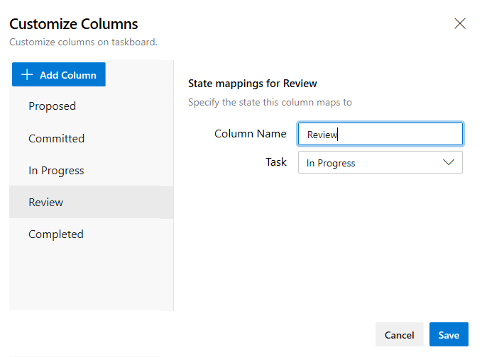
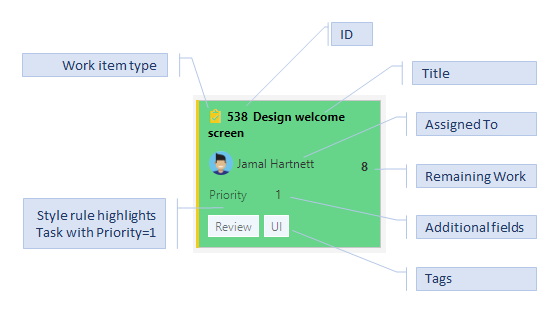
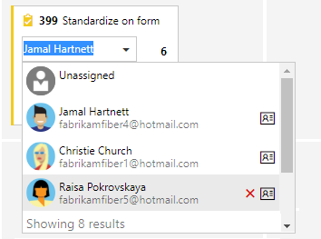
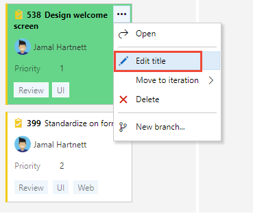
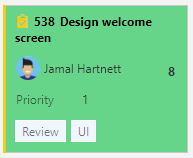
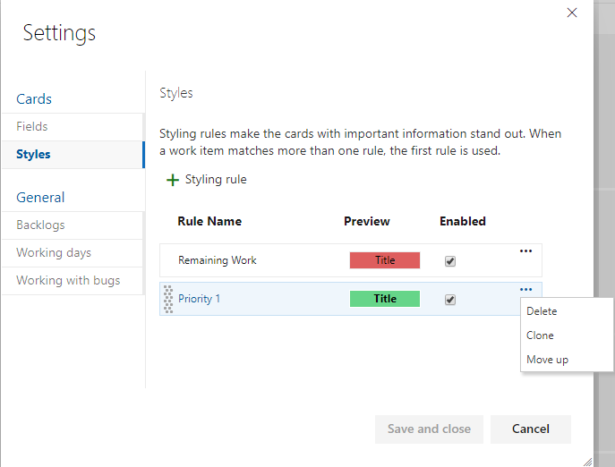

# Customize cards on a sprint taskboard in Azure Boards 

[!INCLUDE [temp](../includes/version-vsts-tfs-2015-on.md)]  

::: moniker range=">= azure-devops-2020"

Sprint Taskboards are similar to Kanban boards because they show work items as cards instead of as lists. They're different in the ways summarized in [Backlogs, Boards, and Plans](../backlogs/backlogs-boards-plans.md#kanban-taskboards). Similar to the Kanban boards, you can customize cards and add columns.  

::: moniker-end

::: moniker range=">= tfs-2015 <= azure-devops-2019"

Sprint Taskboards are similar to Kanban boards in that they show work items as cards instead of as lists. They're different in the ways summarized in [Backlogs, Boards, and Plans](../backlogs/backlogs-boards-plans.md#kanban-taskboards). Similar to the Kanban boards, you can customize cards. To change column names or add columns, you need to customize the workflow.   

::: moniker-end

> [!NOTE] 
> This article addresses customization of a sprint Taskboard. For information on customizing a Kanban board, see [Manage and configure team tools](../../organizations/settings/manage-teams.md#configure-team-backlogs). 

## Prerequisites

* You must have a sprint Taskboard you want to configure. When you add a team, you add a Taskboard for every sprint that you select for your team. To learn more, see [About teams and Agile tools](../../organizations/settings/about-teams-and-settings.md).
* To add or rename columns, or customize cards, you must be added to the team administrator role for the team's settings you want to modify, or be a member of the **Project Administrators** security group. To get added, see [Add a team administrator](../../organizations/settings/add-team-administrator.md) or [Set permissions at the project- or collection-level](../../organizations/security/set-project-collection-level-permissions.md).

## Taskboard customization options  

To add or remove columns, choose **Column Options**. You customize all other options through the **Settings** dialog for the Taskboard.  

[!INCLUDE [temp](../../includes/version-selector-minimize.md)] 

:::row:::
   :::column span="1":::
      **Option** 
   :::column-end:::
   :::column span="3":::
      **Use to...**
   :::column-end:::
:::row-end:::
---
:::row:::
   :::column span="1":::
      **[Show bugs](#show-bugs)** 
   :::column-end:::
   :::column span="3":::
      Manage bugs on Taskboard similar to tasks.  
   :::column-end:::
:::row-end:::
::: moniker range=">= azure-devops-2020"
:::row:::
   :::column span="1":::
      **[Customize columns](#add-columns)** 
   :::column-end:::
   :::column span="3":::
      Add or remove columns shown on Taskboard. 
   :::column-end:::
:::row-end:::
::: moniker-end
::: moniker range=">= azure-devops-2020"
:::row:::
   :::column span="1":::
      **[Fields](#choose-fields)** 
   :::column-end:::
   :::column span="3":::
      Add or remove fields from cards.  
      Includes adding the **Parent** field to cards.
   :::column-end:::
:::row-end:::
::: moniker-end
::: moniker range="< azure-devops-2020"
:::row:::
   :::column span="1":::
      **[Fields](#choose-fields)** 
   :::column-end:::
   :::column span="3":::
      Add or remove fields from cards. 
   :::column-end:::
:::row-end:::
::: moniker-end
:::row:::
   :::column span="1":::
      **[Styles](#style-rule)**
   :::column-end:::
   :::column span="3":::
      Add styling rules to change card color and title style based on field criteria. 
   :::column-end:::
:::row-end:::
---

> [!NOTE]   
> Each team can customize their Taskboard columns and cards. Taskboard settings are not inherited from other teams that they may share portions of area paths. 

## Understand the Taskboard customization sequence 

Before you configure your Taskboard, you'll want to make sure the following tasks are as complete as possible. Otherwise, you'll find yourself revisiting your configuration.  

**Process Administrator**: 
1. Add custom work item types that you want to appear on your Taskboard. For details, see [Add and manage work item types](../../organizations/settings/work/customize-process-work-item-type.md).
2. Customize your iteration backlog to ensure all work item types you want to have will appear on the Taskboards. For details see [Customize backlogs & boards](../../organizations/settings/work/customize-process-backlogs-boards.md). 
3. Customize each work item type to have any custom fields you want to show. For details, see [Customize a workflow](../../organizations/settings/work/add-custom-field.md).

::: moniker range=">= azure-devops-2019"

> [!NOTE]  
> You can customize a work item type which is different then customizing the card displayed on the Taskboard. You customize a WIT by adding fields, changing the workflow, adding custom rules and more. You can also add custom work item types and custom backlog levels. For details, see [Customize an inheritance process](../../organizations/settings/work/inheritance-process-model.md). 

::: moniker-end

::: moniker range=">= tfs-2015 < azure-devops-2019"

> [!NOTE]  
> You can customize a work item type which is different then customizing the card displayed on the Taskboard. You customize a WIT by adding fields, changing the workflow, adding custom rules and more. You can also add custom work item types and custom backlog levels. For details, see [Customize the On-premises XML process model](../../reference/on-premises-xml-process-model.md). 

::: moniker-end

**Team Administrator**:
1. Meet with your team and determine how the team wants to manage bugs, similar to requirements or tasks.  
2. [Add any tags](../queries/add-tags-to-work-items.md) to work items that you want to use to support styling rules. 
 

## Show bugs on your taskboard 

If you want bugs to appear on your taskboard, change your team settings for [show bugs on the backlogs and boards](../../organizations/settings/show-bugs-on-backlog.md).

::: moniker range=">= azure-devops-2020"

## Add columns

You can add columns or rename columns that appear in your Taskboard. You'll see different column titles and choices based on the [process](../work-items/guidance/choose-process.md) used to create your project and whether your team has chosen to [treat bugs like requirements or like tasks](../../organizations/settings/show-bugs-on-backlog.md). 

> [!NOTE] 
> Columns you add to a Taskboard aren't supported with corresponding fields such as the Kanban board columns you add which is supported with Board Column field. 

The changes made apply to all sprint taskboards for the selected team. 

1. From your web browser, open your team's sprint Taskboard as described in [Update and monitor your Taskboard](task-board.md). Remember, only [team or project administrators](../../organizations/settings/add-team-administrator.md) can customize the taskboard.

1. Choose **Column Options**. 

	> [!div class="mx-imgBorder"]
	> 

1. In the Customize Columns dialog, choose the column you want to rename, or choose **Add Column**.

	In this example, we add a column named Review and set the **Task** to *In Progress*. 

	> [!div class="mx-imgBorder"]
	> 

	Similar to the Kanban board, each column must map to a category state. There are four category states: *Proposed*, *Committed*, *In Progress*, and *Completed*. At least one column must map to *Proposed* and one column must map to *Completed*. To learn more about each state, see [Workflow states and state categories](../work-items/workflow-and-state-categories.md).

4. To change the column order, hover over the column and choose the :::image type="icon" source="../media/icons/grabber.png" border="false"::: grabber icon and drag it up or down within the list of columns.   

	> [!div class="mx-imgBorder"]
	> 

5. To delete a column, first make sure that the column doesn't contain any work items. If it does, move the items to another column. Then, hover over the column and choose the :::image type="icon" source="../media/icons/trash-can.png" border="false"::: delete icon.

	> [!div class="mx-imgBorder"]
	> 

::: moniker-end

## Add fields to cards on a sprint taskboard 

Scrum teams use the Taskboard to burn down work and report on progress during daily stand ups. Each sprint Taskboard shows cards that correspond to both requirements and tasks.

### Provide information-rich cards

Information rich cards not only provide at-a-glance information of interest to you and your team. They also provide a way for you to update a field without opening the work item. And, with style rules, you can highlight those work items with select colors based on the criteria you set.  

Each card corresponds to a work item that you use to share information, track status, and assign work. 

[!INCLUDE [temp](../includes/setup-backlogs-boards.md)]

In this example, the bug work item type (WIT) shows all the core fields. It also shows three other fields and tags. To make severity 1 bugs stand out, a styling rule has been added to cause the card to display as yellow.  

In the card shown below, the following customizations have been set for the task work item type (WIT):
- Show all core fields: ID, Assigned To, Remaining Work, Tags
- Show three additional fields: Priority  
- Apply styling rule to display tasks with Priority=1 as green

You can either increase or simplify the information that displays on your cards. It all depends on what's of interest to your team. Does your team like to refer to work items by their ID? Do they want to see estimates? Do they want to highlight work items according to set criteria? Or, will just the bare bones of title and assignment suffice? 

Your best bet is to show fields on cards based on what your team frequently refers to. Or, you can show fields based on updates when using the Taskboards. Also, add fields with information that you can use to filter the board. If you're new to working with these tools, see [Sprint planning](../../boards/sprints/assign-work-sprint.md). 

### Add or remove fields from cards on the Taskboard

You change the way cards appear on the Taskboard in the same way you change the appearance of cards on Kanban boards. Only here, you start from the Taskboard.

::: moniker range=">= azure-devops-2019"

1. [Open the taskboard](task-board.md) for the sprint you want to customize. Remember, only [team or project administrators](../../organizations/settings/add-team-administrator.md) can customize the taskboard.

1. Choose the  :::image type="icon" source="../../media/icons/blue-gear.png" border="false":::  gear icon to open the Settings dialog. 

   > [!div class="mx-imgBorder"]  
   >   

2. Choose **Fields** and then a work item type to see all the settings you can modify. 

3. Place a check mark in the check box for those fields you want to have appear on the board. 

	> [!div class="mx-imgBorder"]  
	>   

	Repeat this step for each work item type you want to change. Don't be surprised if the options change when you choose a different work item type. For example, **Show Remaining Work** only applies to tasks and perhaps bugs, but not to user stories or product backlog items.  

4. To add a field, choose the :::image type="icon" source="../media/icons/green_plus_icon.png" border="false"::: plus icon and enter the name of a field  you want to add. 
 
5. To remove a field, choose the :::image type="icon" source="../../media/icons/delete-icon.png" border="false"::: delete icon next to the field.

6. When done with your changes, choose **Save**.

::: moniker-end  

::: moniker range=">= tfs-2017 <= tfs-2018"

1. [Open the taskboard](task-board.md) for the sprint you want to customize. Remember, only [team or project administrators](../../organizations/settings/add-team-administrator.md) can customize the taskboard.  

1. Choose the :::image type="icon" source="../../media/icons/team-settings-gear-icon.png" border="false"::: gear icon to open the Settings dialog.  

       

2. Choose **Fields** and then a work item type to see all the settings you can modify. 

3. Place a check mark in the check box for those fields you want to have appear on the board. 

	> [!div class="mx-imgBorder"]  
	>   

	Repeat this step for each work item type you want to change. Don't be surprised if the options change when you choose a different work item type. For example, **Show Remaining Work** only applies to tasks and perhaps bugs, but not to user stories or product backlog items.   

4. To add a field, choose the :::image type="icon" source="../media/icons/green_plus_icon.png" border="false"::: plus icon and enter the name of a field  you want to add.  

5. To remove a field, choose the :::image type="icon" source="../../media/icons/delete-icon.png" border="false"::: delete icon next to the field.  

6. When done with your changes, choose **Save**.

::: moniker-end  

::: moniker range="tfs-2015" 

1. [Open the taskboard](task-board.md) for the sprint you want to customize. Remember, only [team or project administrators](../../organizations/settings/add-team-administrator.md) can customize the taskboard.  

1. Choose the :::image type="icon" source="../../media/icons/team-settings-gear-icon.png" border="false"::: gear icon to open the Settings dialog.  

       

2. Choose **Fields** and then a work item type to see all the settings you can modify. 

3. Place a check mark in the check box for those fields you want to have appear on the board. 
      
	**TFS 2015.1 options:**       
	     
	**TFS 2015 options:**        
	       

	Repeat this step for each work item type you want to change. Don't be surprised if the options change when you choose a different work item type. For example, **Show Remaining Work** only applies to tasks and perhaps bugs, but not to user stories or product backlog items.   

4. To add a field, choose the :::image type="icon" source="../media/icons/add_icon.png" border="false"::: plus icon and enter the name of a field  you want to add.  

5. To remove a field, choose the :::image type="icon" source="../../media/icons/delete-icon.png" border="false"::: delete icon next to the field.  

6. When done with your changes, choose **Save**.

::: moniker-end  

### Update fields from cards

Using the board views provides you with quick and easy ways to update work items as work progresses. Making daily or frequent updates helps everyone on your team stay in sync with what's been done and what needs doing next. 

To update status of a work item, you simply drag-and-drop cards to a different column. To change the order or stack ranking of a work item, you drag a card up or down within a column. 

Moving the card from In Progress to the Done column on the Task board, for example, updates the corresponding State field. In this case, the State field updates from Doing to Done. 

Another handy feature is to update a field without having to open the work item. You can update most fields shown on the card. Here we reassign a task. 

This quick update feature is useful when you need to update many work items at once. For example, you can add estimates or update Remaining Work. 

To change the title, choose the  :::image type="icon" source="../../media/icons/actions-icon.png" border="false"::: actions icon, and then choose **Edit title**. 

> [!div class="mx-imgBorder"]
> 

To add tags, double-click the work item to open it. And, just a reminder, you can't change the IDs for a work item, not from the card and not from within the form. 

  

## Define style rules, highlight cards  
 

With styling rules, you can cause cards to change color when their corresponding work items meet criteria that you set. Here, we highlight Priority 1 tasks by having the cards display as green. 

::: moniker range="tfs-2015"

This feature requires TFS 2015.1 or later versions.

::: moniker-end

### Example styling rules 

What rules should you apply to highlight work items? Here are a few examples and their associated criteria. 

> [!div class="mx-tdCol2BreakAll"]
> | Work items | Criteria |
> |------------|------------|
> | High priority items | `Priority = 1` |
> | High effort items | `Remaining Work>=12`  |
> | Stale items unchanged in the last 5 days | `Changed Date @Today-5` |
> | Title contains a key word | `Title Contains Yes` |
> | Severity 1 bugs | `Severity = 1 - Critical   AND   Work Item Type = Bug` |
> | High value business items | `Business Value 50` |
> | Items assigned to specific feature area  | `Area Path Under Fabrikam Fiber\Phone` |
> | Contains specific tag   | `Tags Contain RTM` |
> | Blocked tasks (Scrum process only) | `Blocked = Yes` |

### Add or remove a style rule  

You can apply style rules to change the color of Taskboard cards based on specified field criteria.  

::: moniker range=">= azure-devops-2019"

1. [Open the Taskboard](task-board.md) that you want to customize.  

2. Choose the  :::image type="icon" source="../../media/icons/blue-gear.png" border="false":::  gear icon to open the **Settings** dialog. 

3. Choose **Styles** to specify a style rule. Choose the :::image type="icon" source="../../media/icons/green_plus_icon.png" border="false"::: plus icon to add a style. Select the color to apply to the card and define the criteria for the style rule. 

	In this example, we show the **Styles** dialog for the taskboard. 

	> [!div class="mx-imgBorder"]  
	> 

	Follow these rules when creating and ordering your style rules:
   - The criteria you specify works in a similar fashion as when [constructing a query](../queries/using-queries.md). 
   - All clauses are considered AND clauses, grouping clauses isn't supported.  
   - Card rules apply to all work items that meet the rule criteria  
   - Rule color applies to work items based on the order in which rules are listed. If you add more than one style rule, make sure that you move them in the order of most importance. Drag them into the order you want them applied.  
   - You can quickly enable and disable a style rule.     

     Here we add a Stale tasks rule that highlights tasks that haven't changed in the last five days.

        

4. To copy or delete a style rule, choose the  :::image type="icon" source="../../media/icons/actions-icon.png" border="false"::: actions icon and select **Clone** or **Delete**, respectively.

	> [!div class="mx-imgBorder"]
	> 

5. When done with your changes, choose **Save**.

::: moniker-end  

::: moniker range="tfs-2015"  

Requires TFS 2015.1 or later version.  

::: moniker-end  

::: moniker range=">= tfs-2015 <= tfs-2018"

1. [Open the Taskboard](task-board.md) that you want to customize. If you're not a team admin, [get added as one](../../organizations/settings/add-team-administrator.md). Only team and project admins can customize boards.

2. Choose the :::image type="icon" source="../../media/icons/team-settings-gear-icon.png" border="false"::: gear icon to open the **Settings** dialog. 

3. Choose **Styles** to specify a style rule. Choose the :::image type="icon" source="../../media/icons/green_plus_icon.png" border="false"::: plus icon to add a style. Select the color to apply to the card and define the criteria for the style rule. 

	In this example, we show the **Styles** dialog for the taskboard. 

	> [!div class="mx-imgBorder"]  
	> 

	Follow these rules when creating and ordering your style rules:
   - The criteria you specify works in a similar fashion as when [constructing a query](../queries/using-queries.md) 
   - All clauses are considered AND clauses, grouping clauses isn't supported  
   - Card rules apply to all work items that meet the rule criteria  
   - Rule color applies to work items based on the order in which rules are listed. If you add more than one style rule, make sure that you move them in the order of most importance. Drag them into the order you want them applied.  
   - You can quickly enable and disable a style rule     

     Here we add a Stale tasks rule that highlights tasks that haven't changed in the last five days.

        

4. To copy or delete a style rule, choose the  :::image type="icon" source="../../media/icons/actions-icon.png" border="false"::: actions icon and select **Clone** or **Delete**, respectively.

5. When done with your changes, choose **Save**.

::: moniker-end

::: moniker range=">= azure-devops-2020"

## Changes cause automatic taskboard updates 

Your Taskboard automatically refreshes when changes occur. There isn't any live updates control, it simply happens in the background.  As other team members move or reorder cards on the taskboard, the Taskboard automatically updates with these changes. You don't need to press F5 to see the latest changes.

::: moniker-end

## Related articles

- [Manage and configure team tools](../../organizations/settings/manage-teams.md)
- [Setup your backlogs and boards](../backlogs/set-up-your-backlog.md)
- [Show bugs on backlogs and boards](../../organizations/settings/show-bugs-on-backlog.md)   
- [Set working days](../../organizations/settings/set-working-days.md)
