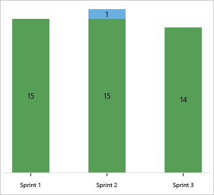
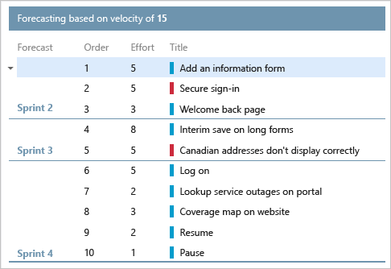

# Scrum and sprint planning tools
 
[!INCLUDE [temp](../_shared/version-vsts-tfs-all-versions.md)] 

Once you've [defined and selected the sprints for your team](../../organizations/settings/set-team-defaults.md), you can start using the following tools to plan your sprint.  

## Track team capacity

At the start of each sprint, you'll want to plan the work that your team can commit to. The three Agile tools that support this work include the sprint backlog, capacity planning, and capacity bars. The sprint backlog contains a filtered subset of backlog items whose iteration path corresponds to the current sprint. 

<table valign="top" > 
<tr valign="top" > 
<td width="35%">

<b>Team capacity planning tool</b>

By setting team capacity, the team knows exactly the total number of work hours or days the team has for each sprint. With this tool, you set individual team member capacity as well as days off. And, conveniently, you can set holidays or shared days off taken by the entire team. 

Setting capacity for each team member working during a sprint causes the capacity bar for that individual to appear. 

You [set recurring days off](../sprints/set-capacity.md#team_settings), such as weekends, through team settings.

</td>
<td>
 
</td>
</tr>
<tr valign="top" > 
<td>

<b>Individual and team capacity bars</b>

With capacity bars, you can quickly see who is over, at, or under capacity. Capacity bars update with each of these activities: 

<ul>
<li>

Tasks are assigned with non-zero remaining work

</li>
<li>

Change in remaining work

</li>
<li>

Date change within the sprint cycle. Individual and team capacity always reflects their capacity from the current day till the end of the sprint.  

</li>
</ul>

Here's how to interpret the capacity colors:

</td>
<td width="455px">

</td>
</tr>
</table>

##  Update tasks, monitor burndown 
During a sprint, your team can use the taskboard and sprint burndown chart to track their progress. Your sprint burndown chart provides you with an at-a-glance visual to determine if your team is on track to meet their sprint plan.  
 
<table valign="top">
<tr valign="top" > 
<td width="35%">

<b>Taskboard</b>

Your [Taskboard](task-board.md) provides an interactive progress board for work required to complete the sprint backlog. During your sprint you'll want to update the status of tasks and the remaining work for each task. 

Updating tasks daily or several times a week yields a smoother burndown chart. 

</td>
<td width="520px">

</td>
</tr>
<tr valign="top" > 
<td>

<b>Sprint burndown chart</b>

You use the [sprint burndown chart](sprint-burndown.md) to mitigate risk and check for scope creep throughout your sprint cycle. The burndown chart reflects the progress made by your team in completing all the work they estimated during their sprint planning meeting. 

The ideal trend line always indicates a smooth and steady burndown. The blue area, however, represents what's actually going on. It shows the buildup of work as team members add tasks and the reduction of work as team members complete those tasks.

</td>
<td>

</td>
</tr>
</table>

##  Velocity and forecast 

While you use sprint planning and tracking tools for each sprint, you use the velocity and forecast tools to estimate work that can be completed in future sprints. 

Velocity provides a useful metric for gaining insight into how much work your team can complete during a sprint cycle. And, the forecast tool provides a means for determining how much work your team can complete within a sprint based on a specified team velocity. 

After your team has worked several sprints, they can use the [velocity chart](../../report/dashboards/velocity-chart-data-store.md) and [forecast](forecast.md) tool to estimate work that can be accomplished in future sprints.  

<table valign="top" > 
<tr valign="top" > 
<td>

<b>**Velocity chart**</b>

Each team is associated with one and only one velocity chart. The green bar within the chart indicates the total estimated effort (story points or size) of backlog items (user stories or requirements) completed within the sprint. (Blue corresponds to the estimated effort of items not yet completed.)  

Velocity will vary depending on team capacity, sprint over sprint. However, over time, the velocity should indicate a reliable average that can be used to forecast the full backlog. 

By minimizing the variability of backlog item size&mdash;effort or story points&mdash;you gain more reliable velocity metrics.

</td>
<td width="500px">

</td>
</tr>
<tr valign="top" > 
<td>

**Forecast tool**

You can use the forecast tool to get an idea of how many and which items you can complete within a sprint. 

*By plugging in a velocity, you can see which items are within scope for the set of sprints the team has selected. As shown here, a velocity of 15 indicates that it will take three sprints to complete the work shown. *

</td>
<td>

</td>
</tr>
</table>  

## Related articles 
If you work with several teams, and each team wants their own backlog view, you can [create additional teams](../../organizations/settings/add-teams.md). Each team then gets access to their own set of Agile tools. Each Agile tool filters work items to only include those assigned values under the team's default area path and iteration path, which you configure via the [Set team defaults](../../organizations/settings/set-team-defaults.md) .  

- [About Sprints, Scrum and project management](scrum-overview.md)
- [What is Scrum?](/azure/devops/learn/agile/what-is-scrum)
- [Add teams](../../organizations/settings/add-teams.md)  
- [Define iterations for a project](../../organizations/settings/set-iteration-paths-sprints.md) 
- [Manage teams and configure team tools](../../organizations/settings/manage-teams.md)  

<!--- ADD WIDGET INFO AS WELL --> 