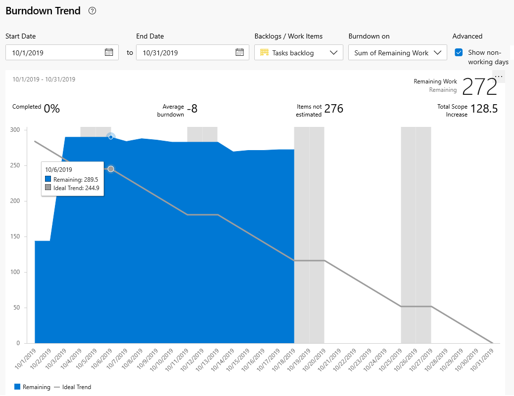
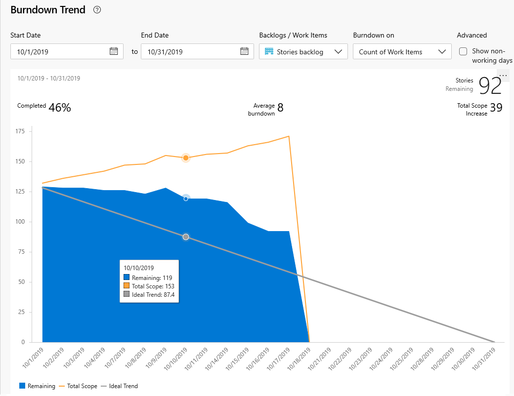
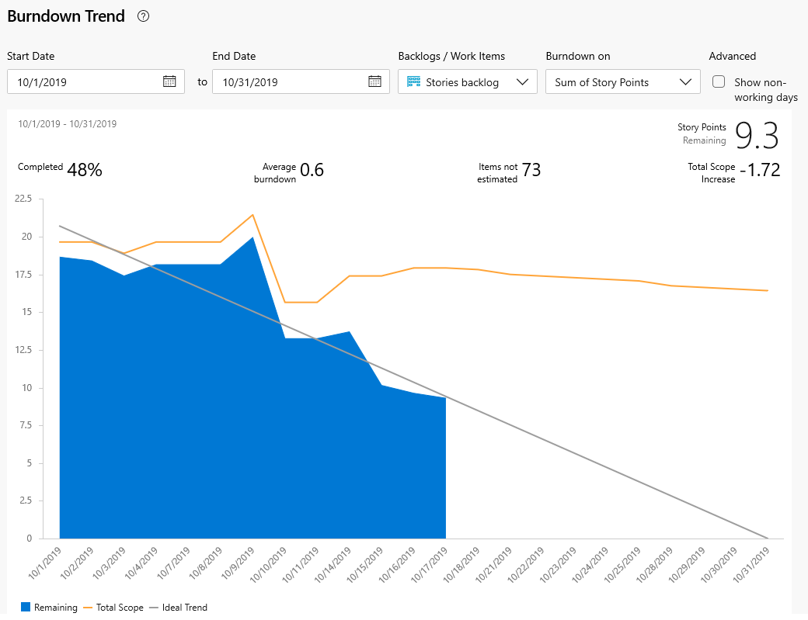
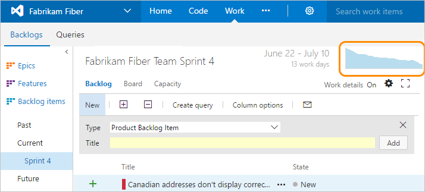
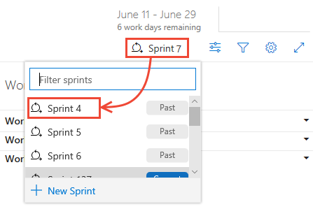
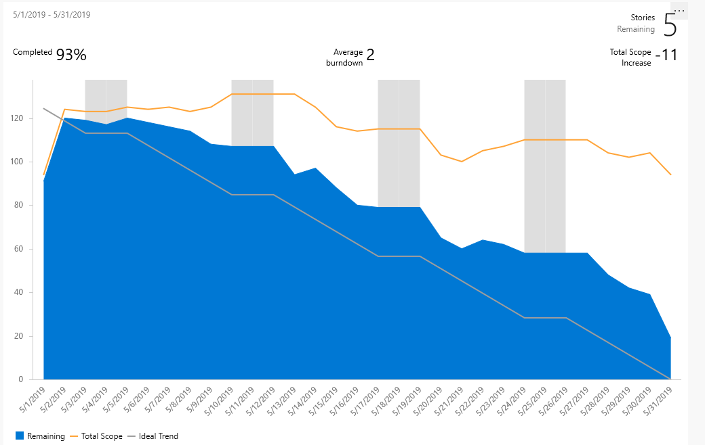
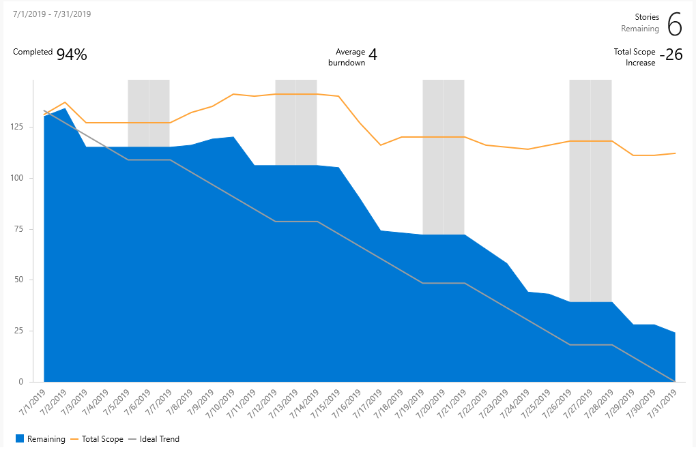
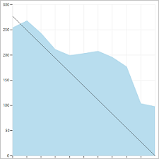

# Monitor sprint burndown 

[!INCLUDE [temp](../_shared/version-vsts-tfs-all-versions.md)] 

::: moniker range="azure-devops"

Throughout your sprint, you can monitor the sprint burndown report to determine if your team is on track to complete its [sprint plan](assign-work-sprint.md). The Analytics in-context sprint burndown report supports tracking a burndown based on a count of work items or a sum of Story Points/Size/Effort, Remaining Work, or other numeric field. 

You can add this report to a dashboard, or track progress using the [Analytics-based burndown or burnup widgets](../../report/dashboards/configure-burndown-burnup-widgets.md) which provide additional configuration options. 

::: moniker-end

::: moniker range="azure-devops-2019"

Throughout your sprint, you can monitor the sprint burndown report to determine if your team is on track to complete its [sprint plan](assign-work-sprint.md). The in-context sprint burndown report supports tracking a burndown of Remaining Work. If you don't track Tasks or Remaining Work, then you can use the [Analytics-based burndown and burnup widgets](../../report/dashboards/configure-burndown-burnup-widgets.md) which provide more configuration options. 

::: moniker-end

::: moniker range="< azure-devops-2019"

Throughout your sprint, you can monitor the sprint burndown chart to determine if your team is on track to complete its [sprint plan](assign-work-sprint.md). The in-context sprint burndown report supports tracking a burndown of Remaining Work. 

::: moniker-end

::: moniker range="azure-devops-2019"
> [!NOTE]  
> You can't add an in-context report to a dashboard. However, you can add the [Analytics-based burndown or burnup widgets](../../report/dashboards/configure-burndown-burnup-widgets.md) to a dashboard. 

::: moniker-end

::: moniker range=">= tfs-2015 <= tfs-2018"
> [!NOTE]  
> You can't add an in-context report to a dashboard. However, you can add the [Sprint burndown widget](../../report/dashboards/widget-catalog.md#sprint-burndown) to a dashboard. 

::: moniker-end

Use this article to learn:

> [!div class="checklist"]      
> * How to view current and past sprint burndowns 
> * Required and recommended activities to support sprint burndown    

For usage guidance, see [Burndown guidance](../../report/dashboards/burndown-guidance.md).

## Overview of the in-context sprint burndown report

::: moniker range="azure-devops"

The in-context sprint burndown report is based on either a count of tasks or Remaining Work estimates, or other numeric field that you define and update throughout the sprint cycle. For details, see [Sprint planning](assign-work-sprint.md) and [taskboard](task-board.md). To open the sprint burndown chart, jump to the section [Open sprint burndown chart](#open-chart).   

A healthy sprint burndown chart will look something like the image shown below. Typically, there will be a stair-case burndown as individual team members may only update their work items once a week or every few days. 
The **Total Scope** line indicates the number of work items added after the sprint starts. The <strong>Ideal Trend</strong> line is calculated based on the number of work items, days in the sprint, and number of working days. 

The blue area indicates the number of work items active or in progress each day of the sprint. As shown in this example, 3 work items are still active at the end of the sprint.  

> [!div class="mx-imgBorder"]  
>  

> [!NOTE]  
> The Scope increase line reflects the number of new user stories added to the sprint. If the team's default iteration is the <strong>@CurrentIteration</strong>, then new user stories are added to the current iteration. The scope decreases as the Iteration Path is modified to another sprint, or work items are completed.  

::: moniker-end
 

::: moniker range="< azure-devops"

The in-context sprint burndown report is based on the tasks and Remaining Work estimates you define and update throughout the sprint cycle. For details, see [Sprint planning](assign-work-sprint.md) and [taskboard](task-board.md). To open the sprint burndown chart, jump to the section [Open sprint burndown chart](#open-chart).   

<table>
<tr valign="top">
<td width="35%">

A healthy sprint burndown chart will look something like this. The <em>Ideal Trend</em> line connects the two points: 

-   <strong>(1)</strong> Team&#39;s total capacity at the start of the sprint -   <strong>(2)</strong> 0 Remaining Work at the end of the sprint. 

The slope represents the rate at which the team needs to burn down work to finish the sprint on time. 

The actual graph, the blue area, represents the total amount of planned sprint work and how it changes throughout the course of the sprint. The blue area corresponds to the sum of all Remaining Work set for all sprint tasks, and possibly bugs, that have the current sprint as their iteration path.  

</td>
<td>

</td>
</tr>
</table>

::: moniker-end

## Open the Sprint backlog for your team 

::: moniker range="azure-devops"

1. From your web browser, open your team's sprint backlog. (1) Check that you have selected the right project, (2) choose **Boards>Sprints**, (3) select the correct team from the team selector menu, and lastly (4), choose **Backlog**. 

    > [!div class="mx-imgBorder"]  
    > 

    To choose another team, open the selector and select a different team or choose the  **Browse all sprints** option. Or, you can enter a keyword in the search box to filter the list of team backlogs for the project.

    > [!div class="mx-imgBorder"]  
    >  

2. To choose a different sprint than the one shown, open the sprint selector and choose the sprint you want. 

    > [!div class="mx-imgBorder"]  
    > 

    The system lists only those sprints that have been selected for the current team focus. If you don't see the sprints you want listed, then choose **New Sprint** from the menu, and then choose **Select existing iteration**. For details, see [Define iteration paths (aka sprints)](../../organizations/settings/set-iteration-paths-sprints.md). 

::: moniker-end

::: moniker range="azure-devops-2019"

1. From your web browser, open your team's sprint backlog. (1) Check that you have selected the right project, (2) choose **Boards>Sprints**, (3) select the correct team from the team selector menu, and lastly (4), choose **Backlog**. 

    

    To choose another team, open the selector and select a different team or choose the  **Browse all sprints** option. Or, you can enter a keyword in the search box to filter the list of team backlogs for the project.

    > [!div class="mx-imgBorder"]  
    >  

2. To choose a different sprint than the one shown, open the sprint selector and choose the sprint you want. 

    > [!div class="mx-imgBorder"]  
    > 

    The system lists only those sprints that have been selected for the current team focus. If you don't see the sprints you want listed, then choose **New Sprint** from the menu, and then choose **Select existing iteration**. For details, see [Define iteration paths (aka sprints)](../../organizations/settings/set-iteration-paths-sprints.md). 

::: moniker-end

::: moniker range=">= tfs-2013 <= tfs-2018"

1. From your web browser, open your team's sprint backlog. (1) Select the team from the project/team selector, choose (2) **Work**, (3) **Backlogs**, and then (4) the product backlog, which is **Backlog items** (for Scrum), **Stories** (for Agile), or **Requirements** (for CMMI). 

    > [!div class="mx-imgBorder"]
    >  

    To choose another team, open the project/team selector and select a different team or choose the **Browse** option. 

    > [!div class="mx-imgBorder"]  
    >  

    The set of sprints selected for your team appears in the left pane. If you don't see any sprints listed, you can add sprints or select existing sprints for your team's use. To learn how, see [Define sprints](define-sprints.md). 

1. Choose the sprint whose burndown chart you want to view. 

    > [!div class="mx-imgBorder"]  
    > 

    The system lists only those sprints that have been selected for the current team focus. If you don't see the sprints you want listed, then see [Define iteration paths (aka sprints)](../../organizations/settings/set-iteration-paths-sprints.md). 

::: moniker-end

## View the sprint burndown in-context report   

::: moniker range="azure-devops"

1. To open the Sprint burndown report, choose **Analytics**. 

	> [!div class="mx-imgBorder"]  
	> 

1. Use the interactive controls to choose from the following options:  

	a. The **Start Date** and **End Date** of the sprint. These will default to the team's current iteration sprint dates.   

	b. The **Backlogs/Work Items** to burn down on, either the product backlog&mdash;Stories, Issues, Product Backlog Items, or Requirements&mdash;or Tasks backlog to use. Your selection impacts the options available for the **Burndown on** menu.  

	c. The **Burndown on** field to use to calculate burndown, either a Count of Work Items or a sum of another fields, such as Story Points, Effort, or Size, or other field.  

	d. Check or uncheck **Show non-working days**. Non-working days appear as gray bars in the background when enabled. Default non-working days are set for a team and for a team's sprint through the capacity page. See [Set working days](../organizations/settings/set-working-days.md) and [Set sprint capacity](set-capacity.md).  

	Choose **Reset** to reset the controls to the default options. By default, the dates are set to the selected sprint. Changes to the start and end dates don't change any sprint date definitions. 

1. If you don't track Remaining Work in tasks, you can view burndown based on a count of work items/tasks. Hover over any point on the chart to show a summary of the data for a specific day.

#### [Sum of Remaining Work](#tab/remaining-work)

When you choose to view the **Tasks backlog** and **Sum of Remaining Work**, the blue area shows the sum of Remaining Work per day for those tasks which are still active or in progress. As the Remaining Work is updated, the chart indicates the rate of burndown. The **Scope** trend line indicates the addition of Remaining Work after the start of the sprint. The **Ideal** trend line indicates the ideal burndown rate for the sprint. **Capacity** lines are only shown when the team has configured capacity.  

> [!div class="mx-imgBorder"]  
> 

#### [Count of Work Items](#tab/work-items)

When you choose to view the **Count of Work Items**, the blue area shows the count of work items&mdash;could be stories/backlog items/requirements or tasks depending on the backlog selected&mdash;which are still active or in progress. The **Scope** trend line indicates when new work items are added after the start of the sprint. The **Ideal** trend line indicates the ideal burndown rate for the sprint. 

> [!div class="mx-imgBorder"]  
> 

#### [Sum of Story Points](#tab/story-points)

When you choose to view the **Stories backlog** and **Sum of Story Points**, the blue area shows the sum of Story Points for all User Stories which are still active or in progress. The **Scope** trend line indicates when Story Points are added after the start of the sprint. The **Ideal** trend line indicates the ideal burndown rate for the sprint.   

> [!div class="mx-imgBorder"]  
> 

* * *

> [!NOTE]  
> The options for the sum fields depend on the numeric fields defined for task and requirement category work item types. The most common fields used to show the burndown trend are: 
> - Count of work items  
> - Sum of [Story Points, Effort, or Size](../queries/query-numeric.md#fields) 
> - Sum of [Remaining Work](../queries/query-numeric.md#fields). 

The selections you make are only set for you, and persist across sessions until you change them. 

::: moniker-end

::: moniker range="<= azure-devops-2019"

Choose the chart to display it in a larger view. 

::: moniker-end

::: moniker range="azure-devops-2019"
> [!div class="mx-imgBorder"]  
> 

::: moniker-end

::: moniker range=">= tfs-2017 <= tfs-2018"
> [!div class="mx-imgBorder"]  
> 
::: moniker-end

::: moniker range="<= tfs-2015"
> [!div class="mx-imgBorder"]  
> 
::: moniker-end

::: moniker range="<= azure-devops-2019"

> [!div class="mx-imgBorder"]  
> 

::: moniker-end

::: moniker range="azure-devops"

## Add the report to a dashboard

1. To add the report to a dashboard, choose the  actions icon and select **Copy to Dashboard**.

	> [!div class="mx-imgBorder"]  
	>  

1. Select the dashboard and choose **OK**.  

::: moniker-end

## Team activities to track tasks and Remaining Work  

In order to access the sprint burndown chart and use it to monitor your sprint progress, your team must perform the following actions.  

### Required activities: 

*   [Schedule sprints for your team](define-sprints.md).  
*   [Define and estimate tasks](add-tasks.md#define-tasks) for each product backlog item you're working on in the sprint. If you work from your team's backlog and taskboard, the items you create will automatically be assigned to the current sprint (Iteration) and to your team's default Area Path.  
*   [Update Remaining Work for each sprint task](task-board.md#update-tasks) as work progresses.  

### Recommended activities:

*   Define tasks that take a day or less to complete to lessen the impact of poor estimates.  
*   Don't divide tasks into subtasks. If you divide a task into subtasks, specify hours only for the subtasks. These hours are rolled up as summary values for the parent task.   
*   Update Remaining Work daily or several times within a week to support monitoring and achieve a smoother burndown chart.  
*   At the end of the sprint, update the task status of completed tasks and determine how to handle incomplete tasks.  

### Empty sprint burndown chart 

If your sprint burndown chart appears empty, check the following:
- Have you assigned tasks to the sprint associated with the chart?
- Have you assigned remaining work to the tasks assigned to the sprint? 
- Are the parent work items of the tasks assigned to the same sprint? If not, the tasks may appear in another sprint associated with the parent item. 

## Current and past sprint burndown charts

As you complete each sprint, the system maintains a history of your activity. 

::: moniker range=">= azure-devops-2019"

To view a past sprint and its burndown chart, select the sprint from the Sprint selector.

> [!div class="mx-imgBorder"]  
>  

::: moniker-end

::: moniker range=">= tfs-2017 <= tfs-2018"

To view a past sprint and its burndown chart, choose the sprint listed under the **Past** section of the sidebar.  

> [!div class="mx-imgBorder"]  
>  

::: moniker-end

::: moniker range=">= tfs-2013 <= tfs-2015"

To view a past sprint and its burndown chart, choose the sprint listed under the **Past** section of the sidebar.  
  

::: moniker-end

You can review sprint burndown in-context reports to show the team patterns in execution. The burndown charts maintain a record of the team's ability to plan and estimate.  

::: moniker range="azure-devops"

#### [May](#tab/may)

> [!div class="mx-imgBorder"]  
> 

#### [June](#tab/june)

> [!div class="mx-imgBorder"]  
>  

#### [July](#tab/july)

> [!div class="mx-imgBorder"]  
> 

::: moniker-end

::: moniker range="< azure-devops"

| Sprint 1   |  Sprint 2  | Sprint 3 |  
|------------|------------|----------|  
| | | |  

::: moniker-end

Teams may find it useful to review these reports periodically during their sprint retrospectives. It may spark useful discussions and lead to setting one or more sprint goals, such as: 
*   How does our projected velocity match up to our actual velocity? 
*   How can we more accurately determine how much we will be able to accomplish in a sprint? 
*   How can we complete work at a more regular pace throughout the sprint?

## Try this next

In addition to the sprint burndown chart, teams can review the velocity at which they work sprint over sprint. The velocity chart tracks how many backlog items your team works on in a sprint.  

You can use your team [velocity](../../report/dashboards/team-velocity.md) as input into the [forecast](forecast.md) tool to help plan your sprints.   

## Related articles

You can learn more about defining, planning, and executing your sprints from these articles: 

- [Schedule sprints](define-sprints.md)  
- [Sprint planning](assign-work-sprint.md)  
- [Add tasks to backlog items](add-tasks.md)
- [Update and monitor your Taskboard](task-board.md)  
- [Scrum and best practices](best-practices-scrum.md)

And, from these industry resources:  
*   [Understanding the Scrum Burndown Chart](http://www.methodsandtools.com/archive/scrumburndown.php)  
*   [Task sizing in Agile software development](http://www.solutionsiq.com/task-sizing-in-agile-software-development/)  

::: moniker range="<= azure-devops-2019"

For on-premises deployments, you can [specify the format that appears&mdash;**h** for hours or **d** for days&mdash;for the remaining work field](../../reference/xml/process-configuration-xml-element.md#fields).  

::: moniker-end

<!---
TBD - Other types of burndown charts, Release burndown 
-->

