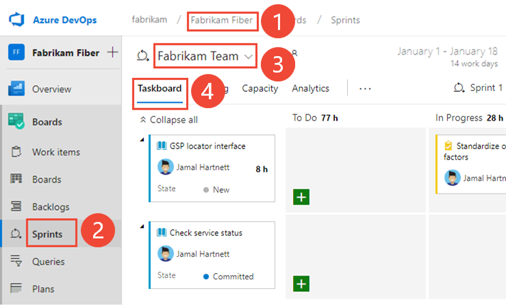
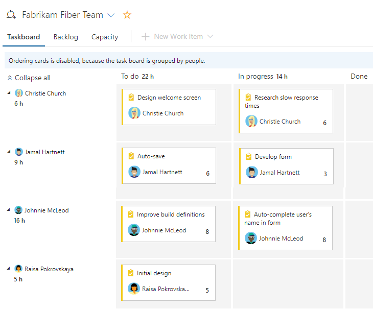
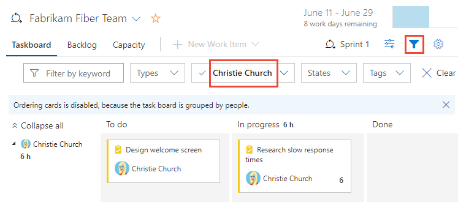
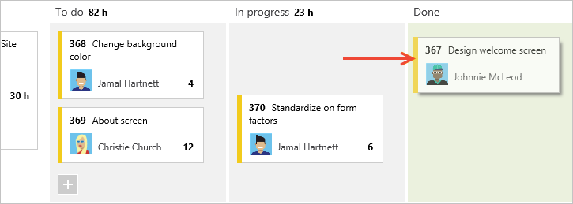
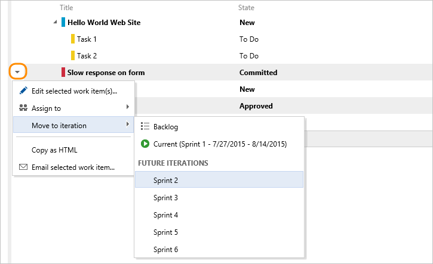

# 6. Update and monitor your Taskboard

[!INCLUDE [version-lt-eq-azure-devops](../../includes/version-lt-eq-azure-devops.md)]

Adding tasks to backlog items is essential for tracking the work required to implement them. Tasks also help estimate the effort assigned to individual team members and the team as a whole. The capacity tool indicates how much work your team can commit to. To effectively compare capacity with planned work, define and estimate tasks for each backlog item.

### Define comprehensive tasks

- **Capture all work:** Add as many tasks as needed to fully capture the work required to complete each backlog item.
- **Differentiate work types:** Represent various activities such as design, coding, testing, content creation, or sign-offs with separate tasks.
- **Assign responsibility:** 
  - **Individual tasks:** Team members typically add their own tasks and set estimates for their workload.
  - **Initial tasks:** A development lead can define the initial tasks for a story or requirement.

### Estimate effort

- **Set estimates:** Assign effort estimates to each task to help gauge the total work required.
- **Align with capacity:** Use the capacity tool to ensure that the estimated work aligns with your team’s available capacity.

By effectively adding and managing tasks, your team gains a clear understanding of the relative importance and required effort for each item, ensuring better workload distribution and project planning.

## Prerequisites

- **Project access**: Be a [project member](../../organizations/security/add-users-team-project.md)
* Permissions: 
  * Be a member of the **Contributors** or **Project Administrators** security group. To get added, [Add users to a project or team](../../organizations/security/add-users-team-project.md).  
  * To view or modify work items, have your **View work items in this node** and **Edit work items in this node** permissions set to **Allow**. By default, the **Contributors** group has this permission set. For more information, see [Set permissions and access for work tracking](../../organizations/security/set-permissions-access-work-tracking.md). 
* **Access levels**: To add work items and exercise all board features, have at least **Basic** access.
* **Sprint backlog**: If you haven't yet, [add tasks to your sprint backlog](add-tasks.md).

::: moniker range=">= azure-devops-2022"

> [!NOTE]  
> Users assigned **Stakeholder** access can't update fields displayed on cards or use the **Planning** pane to change the sprint assignment.  

::: moniker-end

::: moniker range="< azure-devops-2022"

> [!NOTE]  
> Users with **Stakeholder** access can't add tasks, update fields displayed on cards, drag-and-drop tasks to update status, or use the **Planning** pane to change the sprint assignment.   

::: moniker-end

## Open the sprint Taskboard for your team

::: moniker range=">= azure-devops-2020"

1. From your project, open the sprint backlog for your team.

2. Select **Boards** > **Sprints**.
3. Select the correct **Team** from the team selector menu.
4. Choose **Taskboard**.

	> [!div class="mx-imgBorder"]
	> 

	To choose another team, open the selector and select a different team or choose the **View sprints directory** or **Browse all sprints** option. Or, you can enter a keyword in the search box to filter the list of team backlogs for the project.

	> [!div class="mx-imgBorder"]
	> 

5. To choose a different sprint than the one shown, open the sprint selector and choose the sprint you want.

	> [!div class="mx-imgBorder"]
	> 

	The system lists only those sprints that selected for the current team focus. If you don't see the sprints you want listed, then choose **New Sprint** from the menu, and then choose **Select existing iteration**. For more information, see [Define iteration (sprint) paths](../../organizations/settings/set-iteration-paths-sprints.md).

::: moniker-end

::: moniker range="azure-devops-2019"

1. From your project, open the sprint backlog for your team. (1) Check that you selected the right project, (2) choose **Boards>Sprints**, (3) select the correct team from the team selector menu, and lastly (4), choose (4) **Taskboard**.

	> [!div class="mx-imgBorder"]
	> 

	To choose another team, open the selector and select a different team or choose the :::image type="icon" source="../../media/icons/home-icon.png" border="false"::: **Browse all sprints** option. Or, you can enter a keyword in the search box to filter the list of team backlogs for the project.

	> [!div class="mx-imgBorder"]
	> 

2. To choose a different sprint than the one shown, open the sprint selector and choose the sprint you want.

	> [!div class="mx-imgBorder"]
	> 

	The system lists only those sprints selected for the current team focus. If you don't see the sprints you want listed, then choose **New Sprint** from the menu, and then choose **Select existing iteration**. For more information, see [Define iteration (sprint) paths](../../organizations/settings/set-iteration-paths-sprints.md).

::: moniker-end

## Customize the Taskboard

Each team can customize their **Taskboard** in the following ways: 

::: moniker range=">= azure-devops-2020"

- [Add or rename columns](customize-taskboard.md#add-columns).
- [Customize cards](customize-taskboard.md#choose-fields) to show another fields or change card color based on specified field criteria.
- [Show bugs on the Taskboard](../../organizations/settings/show-bugs-on-backlog.md). Your team can choose to manage bugs similar to product backlog items, as shown in this article, or manage them similar to tasks. When you track bugs similar to tasks, they show up on your sprint backlogs and **Taskboards** at the same level as tasks.

::: moniker-end

::: moniker range="=azure-devops-2019"

- [Customize cards](../../boards/boards/customize-cards.md) that appear on the **Taskboard** to show other fields.
- [Show bugs on the Taskboard](../../organizations/settings/show-bugs-on-backlog.md). Your team can choose to manage bugs similar to product backlog items, as shown in this article, or manage them similar to tasks. When you track bugs similar to tasks, they show up on your sprint backlogs and **Taskboards** at the same level as tasks.

Unlike the board for a product backlog, you can't add another columns to the **Taskboard** via a team configuration setting. Instead, you need to modify the workflow definitions for the task work item type used by the project. Workflow customizations update the columns for the **Taskboard** for all teams within the project.

::: moniker-end

::: moniker range=">= azure-devops-2020"

An administrator can customize the **Taskboard** for all teams in the following ways:  
- [Add a custom workflow state to the task WIT for a process](../../organizations/settings/work/customize-process-workflow.md)
- [Add a custom work item type to the Taskboard for a process](../../organizations/settings/work/customize-process-backlogs-boards.md)

::: moniker-end

::: moniker range="azure-devops-2019"

An administrator can customize the **Taskboard** for all teams in the following ways based on the process model selected for the project:

**Inherited process model:**
- [Add a custom workflow state to the task WIT for a process](../../organizations/settings/work/customize-process-workflow.md)
- [Add a custom work item type to the Taskboard for a process](../../organizations/settings/work/customize-process-backlogs-boards.md)

**On-prem XML process model:** 
- [Add a custom workflow state to the task WIT for a process](../../organizations/settings/work/customize-process-workflow.md)
- [Add a custom work item type to the Taskboard for a process](../../organizations/settings/work/customize-process-backlogs-boards.md)

::: moniker-end

## Taskboard controls

| Control               | Function                                    |
|-----------------------|---------------------------------------------|
| Backlog               | [Switch to sprint backlog view](assign-work-sprint.md)                         |
| Board                 | Switch to Taskboard view                   |
| Capacity              | [Switch to Capacity planning](assign-work-sprint.md)   |
| Group by Stories/People   | Switch grouping of cards based on backlog items or team members                        |
| Person                    | Filter tasks to show items assigned to All or a selected team member            |
|     | [Open board settings](../../boards/boards/customize-cards.md)    |
| /     | Enter or exit full screen mode         |

See also [Backlog keyboard shortcuts](../../project/navigation/keyboard-shortcuts.md).

## Review progress in daily scrum meetings

During your daily Scrum, you can filter your **Taskboard** to help focus on items of interest.
*	Group by Backlog items or Group by stories to monitor progress of your product backlog items, stories, requirements, or bugs.
*	Group by People when you want to monitor progress of individual team members.

::: moniker range=">= azure-devops-2020"
> [!NOTE]
> Your Taskboard automatically refreshes when changes occur. There isn't any live updates control, it simply happens in the background.  As other team members move or reorder cards on the taskboard, the Taskboard automatically updates with these changes. You don't need to press F5 to see the latest changes.
::: moniker-end

Use the Person filter when you want to focus on work assigned to individual team members.

> [!TIP]
> If you're seeing tasks that don't belong to your team, check that you've [selected the correct team](../../project/navigation/go-to-project-repo.md?toc=/azure/devops/boards/sprints/toc.json).

## Show progress on items

With this view, you can quickly see which items are nearing completion and which have yet to be started.

1. To show cards based on their backlog-to-task groupings, choose :::image type="icon" source="../../media/icons/view-options-icon.png" border="false"::: **View options** and select **Stories** (for Agile), **Issues** (for Basic), **Backlog items** (for Scrum), and **Requirements** (for CMMI).

	> [!div class="mx-imgBorder"]
	> 

2. You can **Collapse All** or **Expand All** rows, and selectively expand  and collapse  a row to focus on a particular item and its tasks.

   > [!div class="mx-imgBorder"]
   > 

## Show a team member's progress

With this view, you can focus on the work completed and the work remaining for each individual team member. You can quickly see who might need help with completing their sprint tasks. This view shows items and tasks assigned to the selected team member.

To filter on the tasks for a specific team member, choose the :::image type="icon" source="../../media/icons/filter-icon.png" border="false"::: filter icon, and then select their name from the **Assigned to** filter box.

> [!div class="mx-imgBorder"]
> 

## Group tasks by team members

With this view, you can quickly see all the tasks associated with each team member. Backlog items don't appear in this view, only the tasks associated with each individual.

1. Choose the :::image type="icon" source="../../media/icons/view-options-icon.png" border="false"::: view options icon and select **People**.

	Only those team members with tasks assigned to them are listed. All their tasks are shown as cards under their column state.

	> [!div class="mx-imgBorder"]
	> 

2. To filter on the tasks for a specific team member, choose **Filter** :::image type="icon" source="../../media/icons/filter-icon.png" border="false":::, and then select their name from the **Assigned to** filter box. For more information, see [Interactively filter backlogs, boards, queries, and plans](../backlogs/filter-backlogs-boards-plans.md).

	> [!div class="mx-imgBorder"]
	> 

## Update tasks during the sprint cycle

The **Taskboard** makes quick work of updating both task status and remaining work.

### Update a task's status

Drag tasks to a downstream column to reflect if they are in progress or completed.

When you move a task to the **Done** or **Completed** column, the system automatically updates the **Remaining Work** field to 0 in all processes, except CMMI. If you discover more work is remaining, change the State back to **In progress** or **To do**, and enter a value for the **Remaining Work**.

### Update Remaining Work 

Update **Remaining Work**, preferably before the daily Scrum meeting, which helps the team stay informed of the progress being made. It also ensures a smoother burndown chart.

Each team member can review the tasks they worked on and estimate the work remaining. If they discover that it's taking longer than expected to complete, they should increase the **Remaining Work** for the task. **Remaining Work** should always reflect exactly how much work the team member estimates is remaining to complete the task.

> [!div class="mx-imgBorder"]
> 

## Close out a sprint and update your Taskboard

At the end of the sprint, complete these final tasks:
* Zero out *Remaining Work* of all completed tasks  
* Update the status of all completed backlog items  
* Drag incomplete backlog items and tasks to the next sprint or back to the product backlog.

Drag an incomplete item to the product backlog or to a future sprint updates the Iteration Path of all unfinished child tasks to correspond to the product-backlog iteration path or future sprint. 

See also [End of sprint activities](end-sprint-activities.md).

## Reduce the number of items on the Taskboard

If you exceed the number of items allowed on your Taskboard, you receive a message indicating that you need to reduce the number of items. The maximum number of items includes work item types included in the Requirement and Task categories.

You can reduce the number of items on the Taskboard by moving them to the backlog or another sprint. When you move a parent PBI or user story, all active child tasks (State not equal to Done or Closed) automatically move with the parent item.

- From the Taskboard, drag the PBI or user story from the first column onto the backlog or future sprint. All child tasks automatically move with the parent item.
- From the sprint backlog, multi-select the items to move and then select the context menu for an item. Then, select the iteration to move them to.

::: moniker range="< azure-devops"
Or, if your project uses an On-premises XML process, you can [increase the maximum number of allowed items](../../reference/customize-work.md#limits).
::: moniker-end

## Next step

> [!div class="nextstepaction"]
> [End of sprint activities](end-sprint-activities.md) 

## Related articles

- Assign backlog items to a sprint using [Assign backlog items to a sprint](assign-work-sprint.md)
- Interactively filter backlogs, boards, queries, and plans with [Interactively filter backlogs, boards, queries, and plans](../backlogs/filter-backlogs-boards-plans.md)
- Implement [Scrum best practices](best-practices-scrum.md)
- Plan sprints using [Sprint planning](assign-work-sprint.md)
- Schedule sprints with [Schedule sprints](define-sprints.md)
- Monitor [Sprint burndown](../../report/dashboards/configure-sprint-burndown.md)
- Customize your sprint Taskboard using [Customize a sprint Taskboard](customize-taskboard.md)
- Manage capacity with [Capacity planning](../sprints/set-capacity.md)
