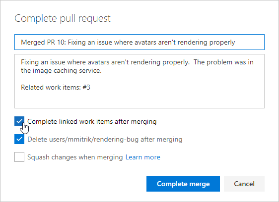

# Autocomplete work items with pull requests 

[!INCLUDE [version-lt-eq-azure-devops](../../includes/version-lt-eq-azure-devops.md)]

::: moniker range=">= azure-devops-2020"
When you link a work item to a pull request (PR), you can automatically complete those work items when you complete the PR. Or, you can specify the workflow state to transition the work item to upon merging the PR. 
::: moniker-end 

::: moniker range="< azure-devops-2020"
When you link a work item to a pull request (PR), you can automatically complete those work items when you complete the PR.  
::: moniker-end 

For more information, see [Create, view, and manage pull requests](../../repos/git/pull-requests.md).

## Autocomplete work items  

As shown in the following image, check the box to **Complete linked work items after merging**. The system defaults to your selection for future PRs. 

::: moniker range=">= azure-devops-2020"
:::image type="content" source="media/automate-state-transition/complete-pull-request-dialog.png" alt-text="Complete pull request dialog, Complete linked work items after merging":::
::: moniker-end 
::: moniker range="< azure-devops-2020"

::: moniker-end 

In the following circumstances, the system doesn't automatically update the work item state to **Done**, **Closed**, or **Completed** categories for the work item type (WIT): 
- The work item, whose WIT is managed with the Inheritance process model, is already in the **Resolved** state. In this instance, the system doesn't update the State. For example, if a bug derived from the Agile process is in a **Resolved** state, the system doesn't transition it to **Closed**.   
- The work item is already in the **Completed** state. No further transition is required. 
- The WIT includes workflow field rules that prevent the work item from advancing to the next state. For instance, a rule might require that another field be defined when closing the work item. 
- For on-premises deployments and Azure Boards Hosted process model, you must modify the workflow to specify actions (**ACTION** element) to take place when transitioning the workflow. For more information, see [Change the workflow for a WIT, Specify Actions](../../reference/xml/change-workflow-wit.md#Actions).

For more information, see [Customize your work tracking experience](../../reference/customize-work.md). 

::: moniker range=">= azure-devops-2020"

## Specify the workflow state of linked work items 

To transition a work item to a specific workflow state, you can enter the information in the pull request description. Prefix the **#ID** with a valid workflow state for the mentioned work item. 
::: moniker-end 

::: moniker range="azure-devops-2020"
> [!NOTE]   
> This feature requires Azure DevOps Server 2020.1 update or later version.
::: moniker-end 

::: moniker range=">= azure-devops-2020"

The following example shows user stories that have transitioned - one to the **Resolved** state and the other to the **Review** state. Also, two tasks are marked as **Done**. 

:::image type="content" source="media/automate-state-transition/pull-request-set-workflow-state-to-transition-to.png" alt-text="Screenshot of pull request, set workflow state to transition #ID work items.":::

::: moniker-end 

## Related articles

- [Create, view, and manage pull requests](../../repos/git/pull-requests.md)  
- [Customize the workflow (Inheritance process)](../../organizations/settings/work/customize-process-workflow.md)  
- [Customize your work tracking experience](../../reference/customize-work.md)
- [How workflow states and state categories are used in Backlogs and Boards](workflow-and-state-categories.md)
 
