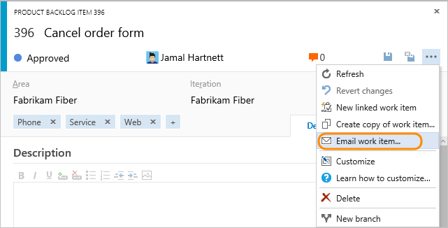
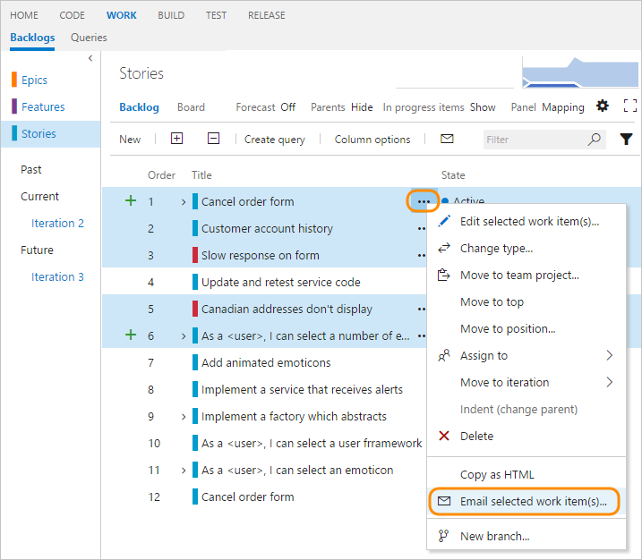
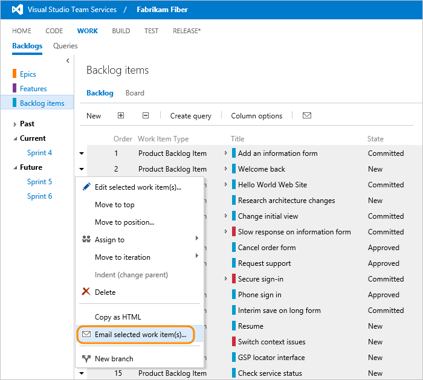
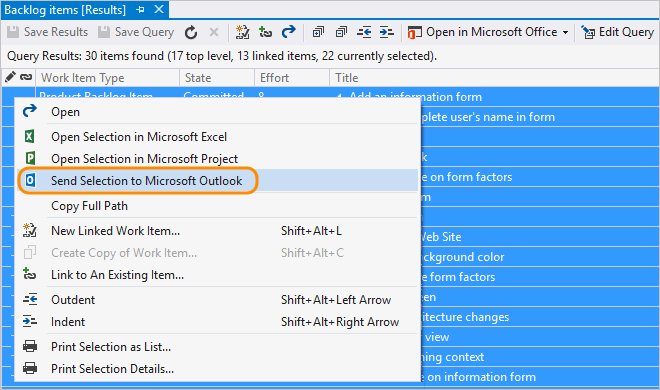
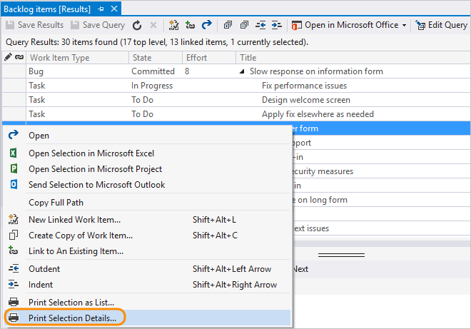

# Email or print user stories, bugs, and other work items 

**Azure DevOps Services | Azure DevOps Server 2020 | Azure DevOps Server 2019 | TFS 2018 - TFS 2013 | Visual Studio 2019 - Visual Studio 2015 | Team Explorer Everywhere** 

Using work items to track your work provides a host of benefits, including the ability to easily share information. You can capture most information within the work item Description or other rich-text formatted field. If you need to maintain the information in a different format, you can easily link to or attach a file.  

Some of the most common ways information is shared within a team or across teams is by emailing lists or links to work items. Some features are only available from the web portal, an Azure DevOps client such as Visual Studio or the Eclipse plug-in, Team Explorer Everywhere (TEE).  Here's a list of the most common ways in which teams share information and plans using work item tracking. 
 
---
:::row:::
   :::column span="2":::
      **Task/feature**
   :::column-end:::
   :::column span="":::
      **Web portal**
   :::column-end:::
   :::column span="":::
      **Visual Studio 2015-2017**
   :::column-end:::
   :::column span="":::
      **TEE (Eclipse)**
   :::column-end:::
:::row-end:::
---
:::row:::
   :::column span="2":::
      [Email summary list with links to work item(s)](#email-summary-lists)
   :::column-end:::
   :::column span="":::
      ✔️
   :::column-end:::
   :::column span="":::
      ✔️
   :::column-end:::
   :::column span="":::
      ✔️
   :::column-end:::
:::row-end:::
:::row:::
   :::column span="2":::
      [Print work item(s)](#print-items)
   :::column-end:::
   :::column span="":::
        
   :::column-end:::
   :::column span="":::
      ✔️
   :::column-end:::
   :::column span="":::
        
   :::column-end:::
:::row-end:::
:::row:::
   :::column span="2":::
      [Email link to a work item query](#copy-url)
   :::column-end:::
   :::column span="":::
      ✔️
   :::column-end:::
   :::column span="":::
      ✔️
   :::column-end:::
   :::column span="":::
        
   :::column-end:::
:::row-end:::
:::row:::
   :::column span="2":::
      [Email query results list](#email-summary-lists)
   :::column-end:::
   :::column span="":::
      ✔️
   :::column-end:::
   :::column span="":::
      ✔️
   :::column-end:::
   :::column span="":::
        
   :::column-end:::
:::row-end:::
::: moniker range=">= azure-devops-2019"
:::row:::
   :::column span="2":::
      [Export query result list as CSV](#export)
   :::column-end:::
   :::column span="":::
      ✔️
   :::column-end:::
   :::column span="":::
        
   :::column-end:::
   :::column span="":::
        
   :::column-end:::
:::row-end:::
::: moniker-end 
---

**Visual Studio 2019/Team Explorer** 

The tasks/features listed in the table aren't available when you're connected to a GitHub or third-party Git repository. Also, they aren't available from Visual Studio 2019 under the following conditions:   

* If you're set to use the default Landing page experience as described in [Set the Work Items experience in Visual Studio 2019](set-work-item-experience-vs.md).  
* If you're set to use the new Git Tool as described in [Git experience in Visual Studio](/visualstudio/ide/git-with-visual-studio).  
 
 

::: moniker range="< azure-devops"
> [!NOTE]   
> For the email feature to work, your administrator for Azure DevOps Server must [configure an SMTP server](/azure/devops/server/admin/setup-customize-alerts).  

::: moniker-end 

If you have stakeholders who don't contribute code but want to contribute to the discussion and review progress, make sure you provide them [stakeholder access](../../organizations/security/access-levels.md) so that they can view work items and dashboards.  

## Email a single item  

You can quickly email a summary of one or more work items. Summaries include the values assigned to these fields: work item ID, title, work item type, assigned to, state, and tags.  

> [!IMPORTANT]     
> If you use the built-in email feature, you can only send the email to individual address for a project member that is recognized by the system. Adding a team group or security group to the to line isn't supported. If you add an email account that the system doesn't recognize, you receive a message that one or more recipients of your email don't have permissions to read the mailed work items.  

<a id="team-services-email" />  

#### [Web portal](#tab/browser/)

::: moniker range=">= tfs-2018"  

**From the web portal**, open the work item, choose the :::image type="icon" source="../media/icons/actions-icon.png" border="false"::: actions icon, and select the **Email work item** option. The first 200 items in the list will appear in a formatted table. 

> [!div class="mx-imgBorder"]  
>    
::: moniker-end  

::: moniker range="tfs-2017"  

**From the web portal**, open the work item, choose the  :::image type="icon" source="../media/icons/actions-icon.png" border="false"::: actions icon, and select the **Email work item** option. The first 200 items in the list will appear in a formatted table. 

    

::: moniker-end  

::: moniker range="<= tfs-2015"  

<a id="tfs-portal-email" />

**From the web portal**, open the work item and choose the :::image type="icon" source="../media/icons/mail_icon.png" border="false"::: mail icon. The first 200 items in the list will appear in a formatted table.   

  

::: moniker-end  

::: moniker range="<= azure-devops-2019"  

> [!NOTE]  
> If you connect to an on-premises Azure DevOps Server, your server administrator must have [configured an SMTP server](/azure/devops/server/admin/setup-customize-alerts) for the email feature to work.   

::: moniker-end  

#### [Visual Studio](#tab/visual-studio/)

<a id="team-explorer-email" />

> [!IMPORTANT]  
> To email a summary of work items in Visual Studio 2019, you need to [Set the Work Items experience](../work-items/set-work-item-experience-vs.md) to the legacy option.

From Visual Studio or Team Explorer, choose . This option requires that you configure Office Outlook on your client computer.

  

#### [Team Explorer Everywhere](#tab/tee/)

<a id="tee-email" />

**From Eclipse**, open the work item and choose the  mail icon.  

  

* * *

## Email summary lists with links to items  

Another way to share items is by emailing summary lists, such as a sprint summary plan or active bugs list. You can share items from a backlog or query results list.  

Depending on the option and client you choose, summary lists may or may not include a hyperlink to the work item ID.  

#### [Web portal](#tab/browser/)

::: moniker range=">= tfs-2017"  

<a id="team-services-email-list" /> 
 

**To email items from the web portal**: Open a backlog or query and highlight the items from the list. Open the context menu for one of the selected items and select to email them.   
::: moniker-end  
::: moniker range=">= tfs-2018"

> [!div class="mx-imgBorder"]  
>    
::: moniker-end  

::: moniker range="tfs-2017"
 
::: moniker-end  

::: moniker range=">= tfs-2018"
If you want to mail a list of all items in the backlog or query, choose the  :::image type="icon" source="../media/icons/actions-icon.png" border="false"::: actions icon, and select the **Email** option. 

> [!div class="mx-imgBorder"]  
>   

::: moniker-end  

::: moniker range="tfs-2017"
If you want to mail a list of all items in the backlog or query, simply choose the :::image type="icon" source="../media/icons/mail_icon.png" border="false"::: mail icon. 

  

::: moniker-end  

::: moniker range="<= tfs-2015"

**To email items from the web portal for TFS 2015**: Open a backlog or query and highlight the items from the list. Open the context menu for one of the selected items and select to email them.

  

If you want to mail a list of all items in the backlog or query, choose the  mail icon. 

![Screenshot of backlog, email icon, TFS 2015 and earlier versions.]](../queries/media/share-plans-email-summary-list-web-portal.png)  

::: moniker-end  

#### [Visual Studio](#tab/visual-studio/)

<a id="team-explorer-email-list" />

> [!IMPORTANT]  
> To email a query results list in Visual Studio 2019, you need to [Set the Work Items experience](../work-items/set-work-item-experience-vs.md) to the legacy option.

**To email items from Visual Studio**: Open a query, highlight the items from the list, choose the context menu, and select **Send selection to Microsoft Outlook** from the menu. This option requires that you configure Office Outlook on your client computer.  

   

#### [Team Explorer Everywhere](#tab/tee/)

<a id="tee-email-list" />

**From Eclipse**: Open a query, highlight the items from the list, and then choose the Copy selected items to the clipboard from the context menu. Paste the clipboard contents to your email application.    

  

* * *

## Copy formatted list of work items  

With this option, you can copy an HTML formatted table of selected items. You can then email this list using your choice of email client.  

1.  From the web portal, open a backlog or a list of query results.  

2.  Select the work items you want to copy.   

      

    The formatted table contains a link to each work item included in your selected results list.  

3.  Paste the contents of the clipboard into your email client or other application. To open a linked work item, requires users to have read access to the project or area node for those work items.   

## Print items  

To print the details of a work item, open a query in Visual Studio that contains the work item(s) you want to print, and select or highlight those items that you want to print. Then, choose the print option from the context menu.   

> [!IMPORTANT]  
> To print work items in Visual Studio 2019, you need to [Set the Work Items experience](../work-items/set-work-item-experience-vs.md) to the legacy option.

   

## Print work items as cards

Some teams want to work with physical cards when planning or updating their physical Kanban or Scrum task boards. There's no native support for printing work items as cards. However, you may find a solution from the [Azure DevOps Marketplace](https://marketplace.visualstudio.com/search?term=card&target=AzureDevOps&category=Azure%20Boards&sortBy=Relevance).   

## Copy the URL to a single work item  

> [!NOTE]   
> All URLs you copy, regardless of the client you use to copy them, opens the work item in the web portal. 

#### [Web portal](#tab/browser/)

::: moniker range=">= tfs-2017"  

<a id="team-services-copy-url" />

**From the web portal**, copy the URL from the web browser address or hover over the title and then select the  copy-to-clipboard icon.

  

::: moniker-end  

::: moniker range="<= tfs-2015" 

<a id="tfs-portal-copy-url" />

**From the web portal for an on-premises Azure DevOps**, open the work item and then from the context menu for the browser, choose the copy link option. 

 

::: moniker-end  

#### [Visual Studio](#tab/visual-studio/)

<a id="team-explorer-copy-url" />

> [!IMPORTANT]  
> To copy the URL of a work item in Visual Studio 2019, you need to [Set the Work Items experience](../work-items/set-work-item-experience-vs.md) to the legacy option.

**From Visual Studio**, right-click the work item tab to copy the URL. The URL opens the work item in the web portal. 

   

#### [Team Explorer Everywhere](#tab/tee/)

<a id="tee-copy-url" />

**From Eclipse**, open a query that contains the work item, and then open the context menu to Copy the URL for the selected work item. 

   

* * *

<a id="export" /> 

::: moniker range=">= azure-devops-2019"

## Export list as CSV 

From any query, you can export a list of work items as a comma-delimited list. Open the query, choose the :::image type="icon" source="../../media/icons/actions-icon.png" border="false"::: actions icon, and choose <strong>Export to CSV</strong>. To learn more, see [Bulk import or update work items using CSV files](../queries/import-work-items-from-csv.md).

::: moniker-end

::: moniker range="azure-devops-2019"

> [!NOTE]   
> Requires Azure DevOps Server 2019 Update 1 or later version. 

::: moniker-end

::: moniker range=">= azure-devops-2019"

> [!div class="mx-imgBorder"]  
>    

::: moniker-end  

::: moniker range=">= tfs-2017"  

## Marketplace extensions  

You may find other ways to share information by exporting work items to other applications such as Microsoft Word. To learn more, review the [Marketplace extensions that support Microsoft Word](https://marketplace.visualstudio.com/search?term=word&target=AzureDevOps&category=Azure%20Boards&sortBy=Relevance). 

::: moniker-end

## Related articles  

::: moniker range="azure-devops"

- [Use templates to add and update work items](../backlogs/work-item-template.md) 
- [Share information in work items and social tools](../queries/share-plans.md) 
- [Define the hyperlink for a work item](work-item-url-hyperlink.md)  

::: moniker-end

::: moniker range="< azure-devops"

- [Use templates to add and update work items](../backlogs/work-item-template.md) 
- [Share information in work items and social tools](../queries/share-plans.md) 
- [Define the hyperlink for a work item](work-item-url-hyperlink.md)  
- [Configure an SMTP server](/azure/devops/server/admin/setup-customize-alerts)

::: moniker-end
