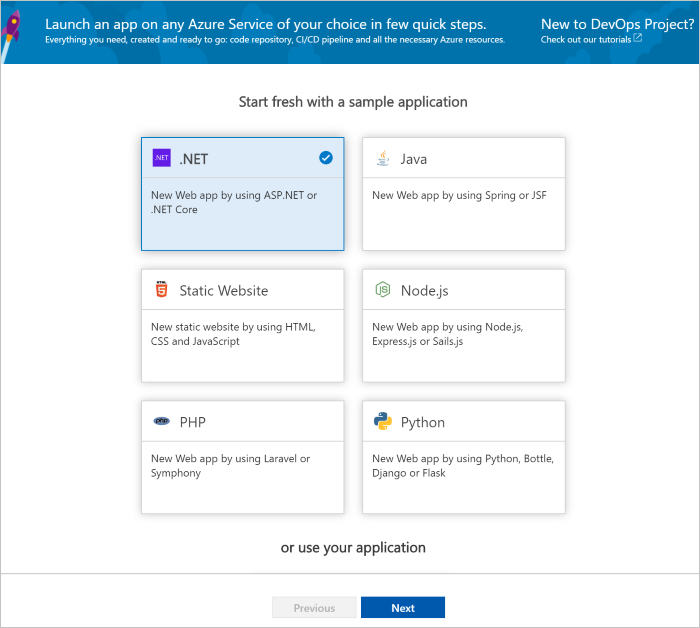
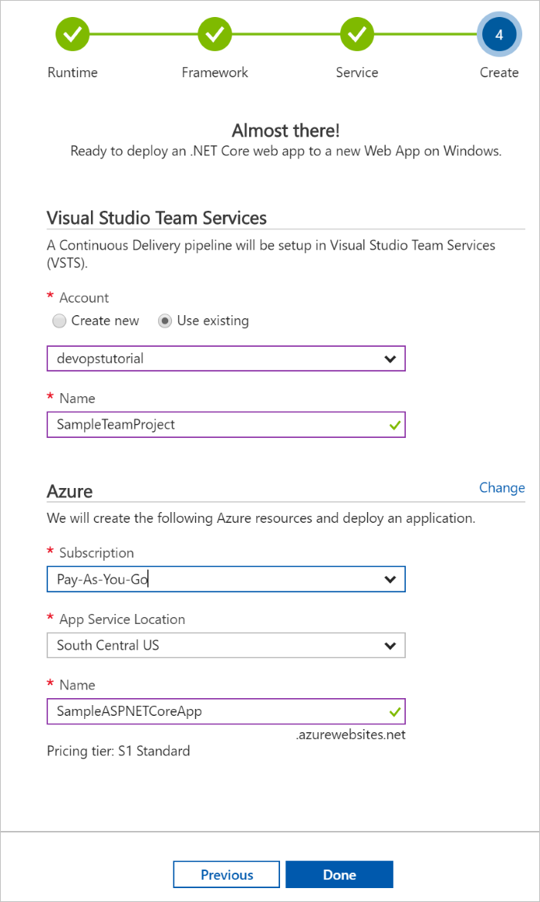

# Create a CI/CD pipeline for .NET with the Azure DevOps Project

Configure continuous integration (CI) and continuous delivery (CD) for your .NET core or ASP.NET application with The **Azure DevOps Project**.  The Azure DevOps project simplifies the initial configuration of a VSTS build and release pipeline.

If you don't have an Azure subscription, you can get one free through [Visual Studio Dev Essentials](https://www.visualstudio.com/dev-essentials/).

## Sign in to the Azure portal

The Azure DevOps Project creates a CI/CD pipeline in VSTS.  You can create a **new VSTS** account or use an **existing account**.  The Azure DevOps Project also creates **Azure resources** in the **Azure subscription** of your choice.

1. Sign into the [Microsoft Azure portal](https://portal.azure.com).

1. Choose the **+ New** icon in the left navigation bar, then search for **DevOps project**.  Choose **Create**.

   	

## Select a sample application and Azure service

1. Select the **.NET** sample application.  The .NET samples include a choice of either the open source ASP.NET framework or the cross-platform .NET Core framework.

   	

1. Select the **.NET Core** application framework.  This sample is an ASP.NET Core MVC application. When you're done, choose **Next**.

1. **Web App on Windows** is the default deployment target.  Optionally, you can choose Web App on Linux or Web App for Containers.  The application framework, which you chose on the previous steps, dictates the type of Azure service deployment target available here.  Select the **target service** of your choice.  When you're done, choose **Next**.

## Configure VSTS and an Azure subscription 

1. Create a **new** free VSTS account or choose an **existing** account.  Choose a **name** for your VSTS project.  Select your **Azure subscription**, **location**, and choose a **name** for your application.  When you're done, choose **Done**.

   	

1. In a few minutes, the **project dashboard** loads in the Azure portal.  A sample application is set up in a repository in your VSTS account, a build executes, and your application deploys to Azure.  This dashboard provides visibility into your **code repository**, **VSTS CI/CD pipeline**, and your **application in Azure**.  On the right side of the dashboard, select **Browse** to view your running application.

   	 
	
The Azure DevOps project automatically configures a CI build and release trigger.  You're now ready to collaborate with a team on an ASP.NET Core app with a CI/CD process that automatically deploys your latest work to your web site.

## Clean up resources

When no longer needed, you can delete the Azure App service created in this quickstart.

## Next steps

When you configured your CI/CD process in this quickstart, a build and release definition were automatically created in your VSTS project. You can modify these build and release definitions to meet the needs of your team. To learn more see this tutorial:

> [!div class="nextstepaction"]
> [Customize CD process](../../../actions/define-multistage-release-process.md)