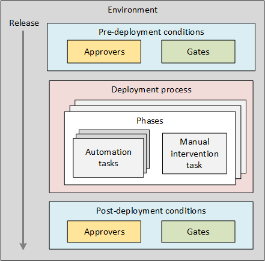

# Release approvals and gates

**| VSTS |**

A release definition specifies the end-to-end release process for an app to be deployed across a range of environments.
Deployments to each environment are fully automated by using 
[phases](../../../process/phases.md) and [tasks](../../../process/tasks.md). 

**Approvals** and **gates** give you additional control over the start and completion of the deployment process.
Each environment in a release definition can be configured with pre-deployment and post-deployment conditions
that can include waiting for users to manually approve or reject deployments, and checking with other automated
systems until specific conditions are verified. 

In addition, you can configure a **Manual Intervention** task to pause the
deployment process and prompt users to carry out manual tasks, then resume or reject the deployment.

The following diagram shows how these features are combined in a release environment.

By using approvals, gates, and manual intervention, you can take full control of your releases
to meet a wide range of deployment requirements. Typical scenarios where approvals, gates, and manual intervention
are useful include the following.

| Scenario | Feature(s) to use |
| --- | --- |
| Some users must manually validate the change request and approve the deployment to an environment | [Pre-deployment approvals](release-approvals.md) |
| Some users must manually sign off the app after deployment before the release is promotoed to other environments | [Post-deployment approvals](release-approvals.md) |
| You want to ensure there are no active issues in the work item or problem management system before deploying a build to an environment  | [Pre-deployment gates](release-gates.md) |
| You want to ensure there are no incidents from the monitoring or incident management system for the app after it's been deployed, before promoting the release | [Post-deployment gates](release-gates.md) |
| After deployment you want to wait for a specified time before prompting some users for a manual sign-off  | [Post-deployment gates](release-gates.md) and [post-deployment approvals](release-approvals.md) |
| During the deployment process a user must manually follow specific instructions and then resume the deployment | [Manual Intervention](../../../../tasks/utility/manual-intervention.md) | 
| During the deployment process you want to wait for monitoring or information portals to detect any active incidents, before continuing with other deployment phases  | Planned | 

You can, of course, combine all three techniques within a release definition to fully achieve your own process and deployment requirements.

## Related topics

* [Release approvals](release-approvals.md)
* [Release gates](release-gates.md)
* [Manual intervention task](../../../../tasks/utility/manual-intervention.md)
* [Environments](../environments.md)
* [Triggers](../triggers.md)

## See also

* [Work with release definitions](../../../../actions/work-with-release-definitions.md)
* [View and manage releases](../../../../actions/view-manage-releases.md)
* [Monitor releases and debug deployment issues](../../../../actions/debug-deployment-issues.md)
* [Configure your release pipelines for safe deployments](https://blogs.msdn.microsoft.com/visualstudioalm/2017/04/24/configuring-your-release-pipelines-for-safe-deployments/)

[!INCLUDE [rm-help-support-shared](../../../../_shared/rm-help-support-shared.md)]
