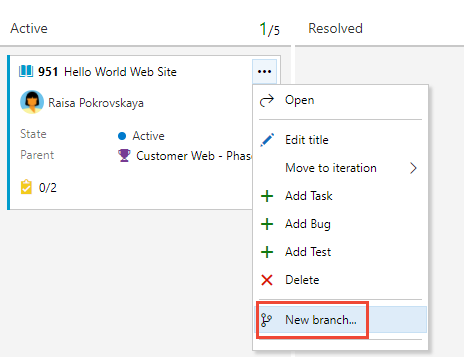
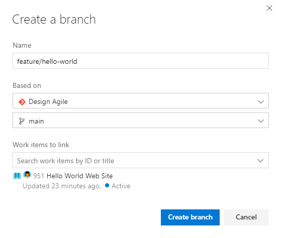
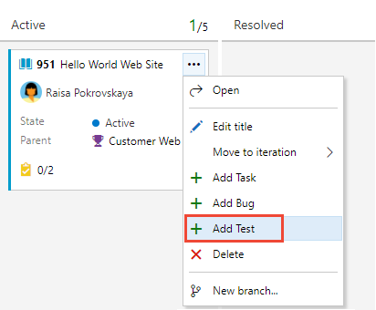
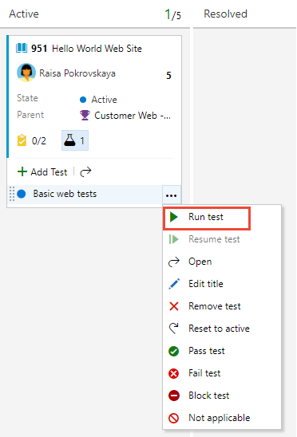
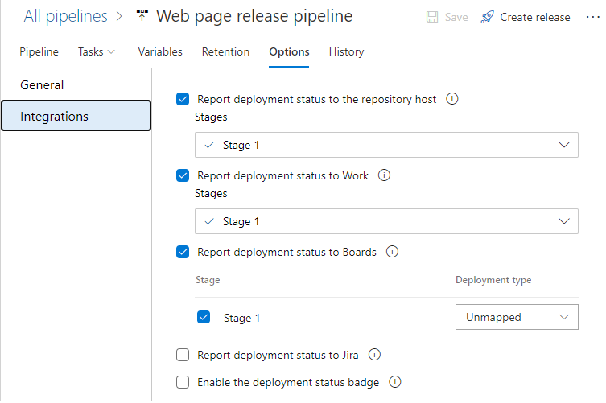
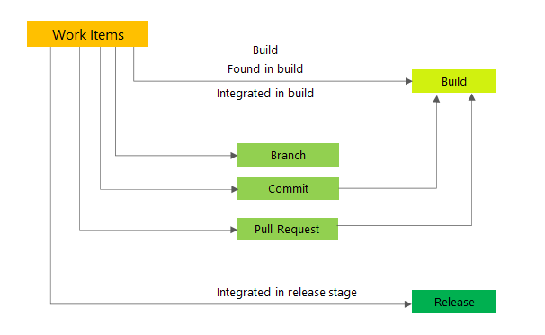

# End-to-end traceability 

[!INCLUDE [temp](../includes/version-vsts-only.md)]

Main points: 
- Requirements traceability 
	- Linking requirements through deployment 
- Tests, manual and automated, adding manual tests to pipelines to be run automatically 
- Reports and analytics 
	- Monitor coverage 
	- Test summaries 
  

Become familiar with the essential concepts to manage projects using Agile tools. Gain an overview of Azure DevOps tools and features to manage requirements. This article maps Agile requirements management tasks by project managers to the tools Azure DevOps supports. More detailed information is provided under [Related articles](#related-articles).   

When we demo traceability to customers, the main demo we show is 
- Create a work item
- Create a branch from the work item
- Make a change in the branch, create a pull request
- Validate the pull request using a build
- Merge the pull request, build the master branch
- Deploy it to production and in all of this show how every artifact is linked to the other. For instance, the production deployment shows the work items and commits, the work item shows which build it was part of, etc.   

(In this article - source control is Git in Azure DevOps - this supports end-to-end traceability) 

> [!NOTE]
> *Your journey to end-to-end traceability is all about tracking where work originates right through to delivery (and back through the customer feedback loop). To be able to do this you first have to start by understanding where you're at.*  
> *Traceability in software engineering is the ability to trace work items across the development lifecycle. It's used to keep track of what's going on in the development lifecycle — and show what's happened. Achieving regulatory compliance is a common purpose for traceability in software engineering.*  - tasktop 

While commiting the code changes you should associate the work item
After commiting the CI Build will trigger. Post that in that work item, there will be link reference to the Build
And when this build is deployed to any of the release environments, it will be displayed under. You can check this new feature introduced in Azure DevOps here
But if you want all this information in a table, in one single view. You have to use Azure DevOps REST APIs to build a customer report to get all the data in one place.

## Drive development from requirements  

Create a branch from a work item  

> [!div class="mx-imgBorder"]  
>    

> [!div class="mx-imgBorder"]  
>    
Work item automatically linked to the branch you created. 

Part of traceability is linkage (make image Git-specific) 
Work items linked to code artifacts and build and release pipelines
As you develop your software, you can capture which code changes and builds support the completion of a work item. In this way, your team can understand what work was done or how a bug was fixed through the audit trail of changes to the code base.

The link types used to construct these links—as illustrated in the following image—are: Branch, Build, Changeset, Commit, Found in build, Integrated in build, Pull Request, Versioned Item, and Integrated in release environment.
> [!div class="mx-imgBorder"]  
>    

## Run tests from requirements 
Requirements traceability is the ability to relate and document two or more phases of a development process, which can then be traced both forward or backward from its origin. Requirements traceability help teams to get insights into indicators such as quality of requirements or readiness to ship the requirement. A fundamental aspect of requirements traceability is association of the requirements to test cases, bugs and code changes.

Add, run, and update inline tests
you can quickly define inline tests, or a set of manual tests, for a backlog item from your Kanban board. Not only can you add tests, you can run them and update their status. 

> [!NOTE]
> *Test traceability is the ability to link a test to a set of requirements and confidently verify that the application works as expected.*

> [!div class="mx-imgBorder"]  
>    

> [!div class="mx-imgBorder"]  
>   

Test integration with the Kanban board makes it easy for teams to get started with manual testing and then take advantage of the full testing capabilities in Test Manager later, when required. When test cases are created from the Kanban board and updated afterwards in Test Manager, or vice-versa, when users create requirement-based suites with Test Manager and update them in Test Manager, the Kanban board shows the correct status. 

<a id="related-articles" />

## Link requirements to deployments
- Deploy it to production and in all of this show how every artifact is linked to the other. For instance, the production deployment shows the work items and commits, the work item shows which build it was part of, etc.   
The release deployments control shows release information for those work items that have been associated to a Git commit which is part of a build being released. 

> [!div class="mx-imgBorder"]  
>  

> [!div class="mx-imgBorder"]  
>  

The work item deployment control displays the status of releases within those work items that are associated with commits in the build and those release pipelines you've configured to report deployment information to Azure Boards. 

The following example shows multiple environments that the release is targeting which the selected work item is associated with. 

> [!div class="mx-imgBorder"]  
> 

When you open the work item, you can see the stages the release is being deployed, in real time.

> [!div class="mx-imgBorder"]  
> 

## Manual and automated testing

Teams that are moving from manual testing to continuous (automated) testing, and have a subset of tests already automated, can execute them as part of the pipeline or on demand (see test report). Referred to as Planned testing, automated tests can be associated to the test cases in a test plan and executed from Azure Test Plans. Once associated, these tests contribute towards the quality metrics of the corresponding requirements.

## Requirements Traceability Matrix

Requirements traceability is the ability to relate and document two or more phases of a development process, which can then be traced both forward or backward from its origin. Requirements traceability help teams to get insights into indicators such as quality of requirements or readiness to ship the requirement. A fundamental aspect of requirements traceability is association of the requirements to test cases, bugs and code changes.

> [!NOTE]
> *The Requirements Traceability Matrix (RTM) is a document that links requirements throughout the validation process. The purpose of the Requirements Traceability Matrix is to ensure that all requirements defined for a system are tested in the test protocols.* 

## Requirements traceability reports 

Requirements traceability reports 

> [!div class="mx-imgBorder"]  
>  

## Bug traceability

View the bug with the test result, directly in context, within the Tests tab. The Work Items tab also lists any linked requirements for the test result.

> [!div class="mx-imgBorder"]  
>  

### Source traceability 

Based on the build or release pipeline, you can choose the timeline or pipeline view to see what code changes were committed. You can analyze the code changes to identify the potential root cause of the test failure.

> [!div class="mx-imgBorder"]  
> 

## Test analytics

### Test analytics for builds

To help teams find and fix tests that fail frequently or intermittently, use the top failing tests report. The build summary includes the Analytics page that hosts this report. The top-level view provides a summary of the test pass rate and results for the selected build pipeline, for the specified period. The default range is 14 days.

> [!div class="mx-imgBorder"]  
> 

### Test analytics for releases

Open a build or release summary to view the top failing tests report. This report provides a granular view of the top failing tests in the pipeline, along with the failure details.

For tests executing as part of release, access test analytics from the Analytics link at the top right corner. As with build, the summary provides an aggregated view of the test pass rate and results for the specified period.

> [!div class="mx-imgBorder"]  
> 

### Track the quality of requirements 

To track the quality of work items that belong to the Requirements category. This includes work items such as User Stories (Agile), Product Backlog Items (Scrum) and Requirements (CMMI).

> [!div class="mx-imgBorder"]  
> 

### Test failures

> [!div class="mx-imgBorder"]  
> 

## Related articles 

To learn more about any of the concepts introduced in this article, refer to the following articles. 

### Linking requirements  

- [Drive Git development from a work item](/azure/devops/boards/backlogs/connect-work-items-to-git-dev-ops)
- [Link work items to deployments](/azure/devops/boards/work-items/work-item-deployments-control) 
- [Link user stories, issues, bugs, and other work items](/azure/devops/boards/backlogs/add-link)
- [Linking, traceability, and managing dependencies](/azure/devops/boards/queries/link-work-items-support-traceability)

### Reports and Analytics

- [Requirements traceability](/azure/devops/pipelines/test/requirements-traceability)
- [Requirements tracking sample report](/azure/devops/report/powerbi/sample-stories-overview) 
- [Requirements tracking rollup sample report](/azure/devops/report/powerbi/sample-stories-overview-rollup)
- [Review test results](/azure/devops/pipelines/test/review-continuous-test-results-after-build)
- [Test Analytics](/azure/devops/pipelines/test/test-analytics)
- [Review code coverage results](/azure/devops/pipelines/test/review-code-coverage-results)
- [Code coverage for pull requests](/azure/devops/pipelines/test/codecoverage-for-pullrequests)
