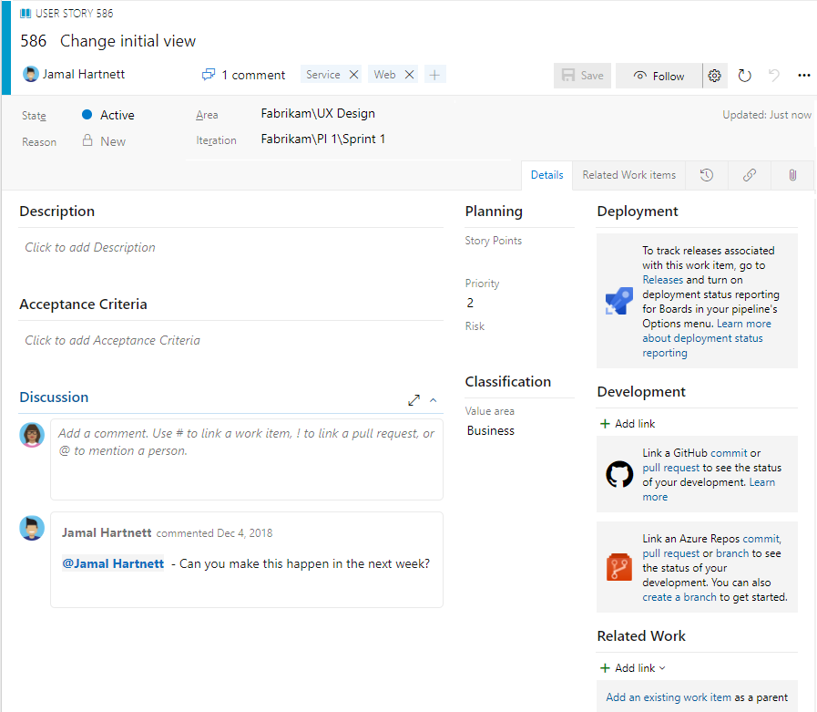
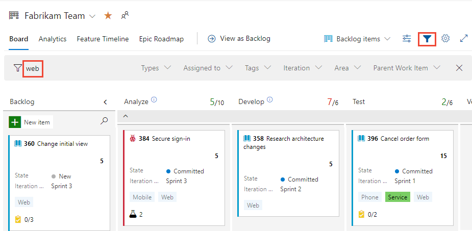
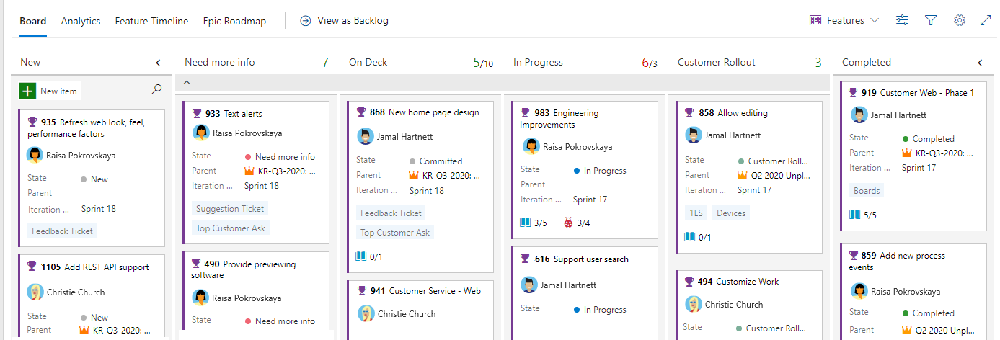

# Manage requirements 

[!INCLUDE [temp](../includes/version-vsts-only.md)]

This article provides an overview of the tools and features Azure DevOps provides to manage requirements. It maps the standard Agile requirements management tasks by project managers to the tools Azure DevOps supports.  It introduces the essential concepts to become familiar with, and then links to the how-to topics to learn more. 

> [!NOTE]
> *Requirements management is the process of documenting, analyzing, tracing, prioritizing and agreeing on requirements and then controlling change and communicating to relevant stakeholders. It is a continuous process throughout a project. A requirement is a capability to which a project outcome (product or service) should conform.*

Agile requirements management encompasses the following scenarios.   

> [!div class="checklist"]  
> - Define and track status of requirements
> - Analyze requirements
> - Assign requirements to timeboxes
> - Manage dependencies 
> - Perform milestone planning 
> - Monitor and report on progress  

Agile requirements management is also conducted within an Agile culture which requires support for the following principles and methods:  

> [!div class="checklist"]  
> - Alignment within the organization
> - Autonomous teams 
> - Kanban 
> - Scrum   

## Capture requirements  

You capture requirements using work items, where each work item is based on a work item type. You have a choice of work item types to use based on the process you select, or you can add a custom work item type. 

### Work item fields and form

You can use work items to track anything you need to track. Each work item represents an object stored in the work item data store. Each work item is based on a work item type and is assigned an identifier which is unique within an Azure DevOps organization. 

Each work item supports tracking data contained in work item fields. Also, it captures changes as updates are made within the **History** field and comments made in the **Discussion** section. The following image shows a sample work item form for the User Story work item type.

> [!div class="mx-imgBorder"]  
>  

In a nutshell, you use work items to support these tasks: 
- You update the work item form to add information, update status, reassign to another project member, and to link work items, attach files, and add comments  
- You can assign a work item to one and only one project member 
- You assign work items to a timebox or sprint via the iteration path
- You can use work item templates to quickly fill in work item fields
- You can easily discuss work item specifics within the work item form, capturing a discussion thread which you can query on later
- You can use ad hoc search or queries to find or list work items.  

Other features that support end-to-end traceability are the **Development** and **Deployment** sections. These sections support the following tasks and insights:

- Create a new branch or pull request from a work item
- Complete the pull request
- Perform a squash merge
- Create a branch for several work items
- Link a work item to existing development and build objects 
- View the release stages associated with the work item within the work item form in real time 
- View the status of releases within those work items that are associated with commits in the build and release pipelines  
 
### Work item types 

The work item types used to capture requirements and code defects are illustrated in the following images based on the four system processes&mdash;Agile, Basic, Scrum, or Capability Maturity Model Integration (CMMI). Each team can determine how they want to track bugs.

[!INCLUDE [temp](../boards/includes/work-item-types.md)]

[!INCLUDE [temp](../boards/includes/note-requirements-terms.md)] 
### Customize work item types  

You can customize default work item types or add a custom work item type. Supported customizations include the following: 
- Add custom fields 
- Add custom controls to gain enhanced functionality  
- Modify workflow states and add custom rules to support business workflow processes 
- Customize backlogs and boards to support additional work item types 
- Add custom portfolio backlogs, up to five in total 
 

### Add work items to product backlog or board 

You can quickly add requirements to a product backlog or board by simply specifying a Title. Additional details can be added later. 

> [!div class="mx-imgBorder"]  
>    

### Import and update requirements using Excel 

Alternatively, you can import and update requirements you've defined through a .csv file or Excel spreadsheet. These tools support import of a hierarchy of 

> [!div class="mx-imgBorder"]  
>    

### Functional and non-functional requirements 

Any item of work that you or a development team wants to track can be captured using work items. You can use the same type of work item to capture both functional and non-functional requirements. Non-functional requirements specify criteria associated with system operations rather than specific product or service functionality. 

You can differentiate your requirements using tags, the Business Value field, or a custom field. 
 
### Maintain requirement specifications 

Requirements often require detailed specifications to provide details that aren't readily captured within the work item. You can use Azure DevOps to maintain and version control your requirements under an Azure Repos repository. Or, you can use a project wiki to provide a central source and repository for specif 

You can then link your specifications or attach them to your requirements. 
 
 
## Analyze, prioritize, and refine requirements

Once you have a working backlog, you'll want to get it in priority order. You'll want to review and refine your requirements and make sure the acceptance criteria is well defined. These tasks are supported through the following Azure Board tools: 

- **Product backlog**: Supports drag-and-drop of work items to get them in priority order. Supports bulk-edit of work items to change assignments or update fields. 
- **Query Results, Triage mode**: Supports review of a list of work items and their forms so that you can quickly update work items and add details. 
 
Here the features backlog shows the sequence of features to ship. 

:::image type="content" source="../boards/media/best-practices/feature-backlog-priority-order.png" alt-text="Screenshot of Features backlog, ordered by feature parent.":::

## Group and organize requirements

The product backlog starts out as a flat list. However, oftentimes you want to group requirements that support specific features or business objectives. Azure Boards supports this by providing portfolio work item types, portfolio backlogs and boards, and a Mapping pane to quickly link requirements to a portfolio work item. 

Adhoc tags added to work items are another way you can group requirements. 

### Epics, features, and portfolio backlogs

You group requirements under Features, and Features under Epics, using parent-child hierarchical links. This type of grouping is recommended for organizations with several teams that want to view rollups associated with multiple teams and to take advantage of all portfolio planning tools.

Hierarchical grouping supports the following scenarios. 
- Manage a portfolio of features that are supported by different development and management teams
- Support rollup of estimates, work item counts, and more on product backlogs 
 

### Use tags to group work items   
 
With work item tags, team members can assign ad-hoc tags to work items. You can use these tags to filter backlogs and boards as well as query on work items.  For example, the following image illustrates a Kanban board filtered on the *web* keyword which displays cards with the *Web* tag. 

> [!div class="mx-imgBorder"]  
> 

## Implement Kanban or Scrum Agile methods
Two of the major Agile methods are Kanban and Scrum. Azure Boards supports both methods. Or, teams can adapt them to use a combination of methods such as Scrumban. 

### Implement Kanban  

Each product and portfolio backlog is associated with a corresponding Kanban board. Both backlogs and boards are associated with a team, and display work items based on the area and iteration paths selected by the team.

Each board supports many Kanban practices such as defining columns and swimlanes, setting Work-in-Progress (WIP) limits, defining the Definition of Done, and more. As work completes in one stage, you update the status of an item by dragging it to a downstream stage. 

 

Each team's board supports a number of additional configuration options.

### Implement Scrum  

Sprint backlogs and Taskboards provide a filtered view of work items a team has assigned to a specific iteration path, or sprint. From your requirements backlog, you can drag-and-drop work items onto an iteration path, and then view that work in a separate **Sprint Backlog**. 

> [!div class="mx-imgBorder"]  
>     

Azure Board tools that support Scrum practices include: 

- Assign requirements to a sprint  
- Add tasks to requirements   
- Set sprint capacity for team members
- Adjust work to fit sprint capacity 
- Share your sprint plan 
- Filter, update tasks, and update task status 
- Monitor sprint burndown 

## Manage dependencies

In Microsoft Project, you manage tasks that depend on the completion of other tasks by linking them. To manage dependencies in Azure Boards, you can link work items using the Predecessor/Successor link type. Once you've linked work items, you can view link relationships using the [Work Item Visualization](https://marketplace.visualstudio.com/items?itemName=ms-devlabs.WorkItemVisualization) Marketplace extension. The following image illustrates link relationships among several work items. 

[!INCLUDE [temp](../includes/lightbox-image.md)] 

> [!div class="mx-imgBorder"]  
> 

### Minimum Viable Product versus Critical Path Management  

Azure Boards doesn't provide a native view of the critical path. In part, as Agile methodologies favor a Minimum Viable Product (MVP) over Critical Path Management (CPM). By using MVP, you identify the shortest path and dependencies by prioritizing epics, features, stories and tasks. For additional context, see [The Critical Path on Agile Projects](https://www.mountaingoatsoftware.com/blog/the-critical-path-on-agile-projects) and [Running a lean startup on Azure DevOps](https://medium.com/@giladkhen/running-a-lean-startup-on-azure-devops-5934ced2cc42). 

## Perform milestone planning

To gain insight into what features can ship when, use the **Forecast** tool. This tool requires that you provide estimates to the Story Points, Effort, or Size field for each requirement. If you want to forecast on a simple count of work items, then simply assign the value of **1** to requirement estimates.

Size estimate
Forecast

If you want to integrate your requirements planning with Microsoft Project tools, you may do so via a Marketplace extension.  

## Assign requirements to timeboxes 

Sprints - iteration paths 
Planning mode 
Forecast 
Capacity (Scrum)  

## Monitor and report on progress 
 
To review progress and deliverables, Azure Boards provides the following tools. 
 
- Kanban board 
- Features backlog with rollup columns
- Delivery plans

### Features Kanban board 
 
Your Features board is another place to review progress and ensure the continuous flow of deliverables. The following image illustrates a customized Features board. In progress columns have been added such as *Need more info*, *Spec Complete*, *In Progress*, and *Customer Rollout*. These provide a more natural set of states as Features get proposed, researched, designed, developed, and then deployed to production. 

[!INCLUDE [temp](../includes/lightbox-image.md)] 

> [!div class="mx-imgBorder"]  
> 

### Rollup columns

One quick and visual way to monitor progress is from the Features backlog. By adding the rollup progress bar column, you can see what percentage of work items are completed for each feature, as shown in the following image.  

> [!div class="mx-imgBorder"]  
>   
 
### Delivery plans and multiple team deliverables  

To review features delivered across several teams, configure a delivery plan. Delivery plans provide an interactive board to review a calendar schedule of stories or features several teams plan to deliver.  

> [!div class="mx-imgBorder"]  
>  
 

## Get notified of additions and changes 

Azure DevOps provides a robust alert system, allowing project members to set alerts for themselves, a team, or a project.   

As changes occur to work items, code reviews, source control files, and builds, you can receive email notifications. For example, you can set an alert to be notified whenever a bug that you opened is resolved or a work item is assigned to you. You can set personal alerts, as described in this article, or team or project alerts.

## Required Azure DevOps configuration 

- Teams, defined and configures
- Area Paths
- Iteration Paths 
- Customize Kanban boards 

## Related articles

### Key concepts 

- [About work items](../boards/work-items/about-work-items.md) 
- [About Area and Iteration Paths (sprints)](../organizations/settings/about-areas-iterations.md) 
- [About teams and Agile tools](../organizations/settings/about-teams-and-settings.md) 
- [Customize an inheritance process](../../organizations/settings/work/inheritance-process-model.md)

### Best practices
 
- [Best practices for "light-weight" Agile project management](../boards/best-practices-agile-project-management.md)
- [Configure and customize Azure Boards](../boards/configure-customize.md)

### Get started guides and tutorials 

- [Bulk add or modify work items with Excel](../boards/backlogs/office/bulk-add-modify-work-items-excel.md)

### How to guides 

<!---

Tools/Features

- Work items, Product and Portfolio Backlogs
- Change Notification
- Kanban boards 
- Stack rank, Priority, Severity 
- Link work items, Link types, Attachments, tags 
- Area Paths, Iteration Paths, Forecast, Planning tool 
- Discussion within work item 
- Wiki 
- Customization – Add fields, Customize workflow 
- Rollup  

## Extensions 
- Delivery Plans
 

---
:::row:::
   :::column span="":::
      **Key concepts**
   :::column-end:::
   :::column span="":::
      **Get started and tutorial guides**
   :::column-end:::
   :::column span="":::
      **How-to articles**
   :::column-end:::
:::row-end:::
---
:::row:::
   :::column span="":::
      - [About work items](../boards/work-items/about-work-items.md) 
      - [About Area and Iteration Paths (sprints)](../organizations/settings/about-areas-iterations.md) 
      - [About teams and Agile tools](../organizations/settings/about-teams-and-settings.md) 
   :::column-end:::
   :::column span="":::
      **Get started and tutorial guides**
   :::column-end:::
   :::column span="":::
      **How-to articles**
   :::column-end:::
:::row-end:::

-->
