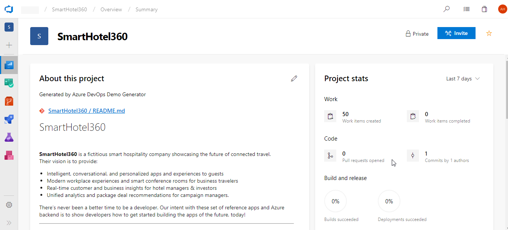

# Get started creating and populating demo VSTS projects with the VSTS Demo Generator

1. Browse to the [VSTS Demo Generator site](https://vstsdemogenerator.azurewebsites.net/) by click the link, or copy `https://vstsdemogenerator.azurewebsites.net/` into your browser's URL field.

2. Click **Sign In** and provide your Visual Studio Team Services (VSTS) account login/password. If you don't hav ea VSTS account, Click on **Get Started for Free** to create one and then log in with your new credentials.

    

3. After you sign in, select **Accept** to grant the Demo Generator permissions to access your VSTS account.

    

4. Select the account you will use to host the project created by the Demo Generator. (You may have multiple accounts of which you are a member, and which are associated with your login, so choose carefully.) Provide a name for your project (such as "MyProjectDemo" ) that you and other contributors can use to identify it as a demo project. Lastly, select the demo project template you want to provision by clicking **...** (Browse) button.

    

    > [!NOTE] The default template is **SmartHotel360**, which contains complete ASP.NET 2 web mobile and desktop business apps for a hotel, and can be deployed using Docker containers. Other templates include **MyHeathClinic**, which defines a team project for an ASP.NET Core app that deploys to Azure App Service; **PartsUnlimited**, which defines an ASP.NET app with customized CI/CD definitions; and **MyShuttle**, which defines a Java app and Azure APp service deployment.
    >
    > All four templates provide fictional VSTS users and pre-populated Agile planning andtracking work items and data, along with source code in VSTS Git as well as Build and Release definitions.

5. Some templates may require additional extensions to be installed to your VSTS account. The demo generation process checks to see if these extensions are already installed. If the extension is already installed, a green check will. If the extension is **not** installed, select check boxes provided to install the extension(s) to your account and click on Create Project button.

> If you want to manually install the extensions,  click on the provided link for a specific extension, which takes you to the extension's page on Visual Studio Team Services Marketplace. From there, you can install the extension.

6. Your project may take a couple minutes for the Demo Generator to provision. When it completes, you will be provided with a link to the demo project.

    

7. Select the link to go to the new demo project and confirm itwas successfully provisioned.

    

> [!NOTE] You must provide your own information such as URLs, logins, password, and others for the configuration of demo endpoints that use Azure resources. 