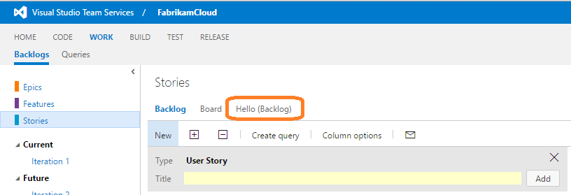
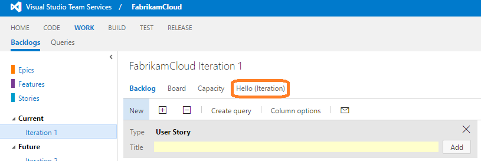

# Add tabs on backlog pages

[!INCLUDE [extension-docs-new-sdk](../../includes/extension-docs-new-sdk.md)]

If you have a web page that can be hosted in an iframe, it can also be hosted in Azure DevOps Services. This webpage would be a tab on the backlog pages.
In this example, we'll add a Hello World tab on the Product Backlog and the Iteration Backlog.





## Create your web page

[!INCLUDE [Web_page](../includes/procedures/create-web-page.md)]

## Update your extension manifest
Update your [extension manifest](../develop/manifest.md) file with the following code:

```json
...

	"contributions": [
		{
	        "id": "Fabrikam.HelloWorld.Backlog.Tabs",
	        "type": "ms.vss-web.tab",
	        "description": "Adds a 'Hello' tab to the Product and Iteration backlog tabs.",
	        "targets": [
	            "ms.vss-work-web.product-backlog-tabs",
				"ms.vss-work-web.iteration-backlog-tabs"
	        ],
	        "properties": {
	            "name": "Hello",
	            "uri": "hello-world.html",
				"registeredObjectId": "backlogTabObject"
	        }
	    }
	],
	"scopes": [
		"vso.work"
	],
	"files": [
		{
			"path": "hello-world.html", "addressable": true
		},
		{
			"path": "scripts", "addressable": true
		},
		{
			"path": "sdk/scripts", "addressable": true
		},
		{
			"path": "images/logo.png", "addressable": true
		}
	]
...
```

### Contributions
The **contributions** stanza contains information about your tasks.


For each contribution in your extension, the manifest defines
	
* the type of contribution (tab in this case),
* the contribution target (the product or iteration backlog tabs in this case),
* and the properties that are specific to each type of contribution. For a tab, we have

| Property           | Description                                                                                                                         
|--------------------|----------------------------------------------------------------------------------------|                                
| name               | Name of the hub					                                                      |                   
| uri                | Path (relative to the extension's base URI) of the page to surface as the tab       |                   
| registeredObjectId | ID of the object registered for the tab. Include code like the example below in the html file indicated in the "uri" property of the contribution shown above. | 

### Scopes
It includes the [scopes](./manifest.md#scopes) that your extension requires.
In this case, we need `vso.work` to access work items.

### Files
Include all of the files your extension accesses. <br>
For your files, set `addressable` to `true` unless you include other files that don't need to be URL-addressable.
	
## Example registeredObjectId
```javascript
VSS.register("backlogTabObject", {
    pageTitle: function(state) {
        return "Hello Tab";
    },
	updateContext: function(tabContext) {							 
	},
    isInvisible: function(state) {
        return false;
    },
    isDisabled: function(state) {
        return false;
    }
});
```

Learn about all of the places where you can add a hub in the [contributions reference](https://docs.microsoft.com/previous-versions/azure/devops/docs/extend/reference/targets/overview).

## Next Steps:

Now that you've written your extension, the next steps are to Package, Publish, and Install it. You can also check out the 
documentation for Testing and Debugging your extension. 

<div name="row" style="padding-top:15px">
    <div style="vertical-align:top;display:inline-block;float:left;width:50%">
        <div class="index-button" align="right" style="padding-right:10px">
        <a href="../publish/overview.md"><button style="background-color:#4CAF50;border:none;color:white;padding:15px;font-size:16px;margin:4px;cursor:pointer;border-radius:8px;">Package, Publish, and Install</button></a>
        </div>
    </div>
    <div style="vertical-align:top;display:inline-block;float:left;width:50%">
        <div class="index-button" align="left" style="padding-left:10px">
        <a href="https://docs.microsoft.com/previous-versions/azure/devops/docs/extend/test/debug-in-browser"><button style="background-color:#4CAF50;border:none;color:white;padding:15px;font-size:16px;margin:4px;cursor:pointer;border-radius:8px;">Testing and Debugging</button></a>
        </div>
    </div>
</div>
