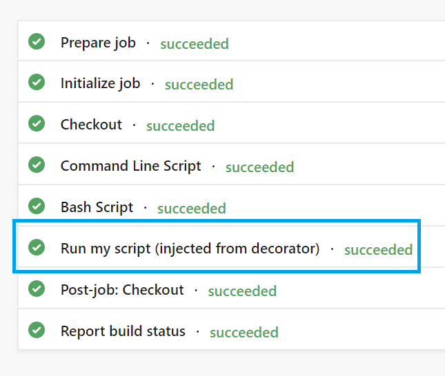
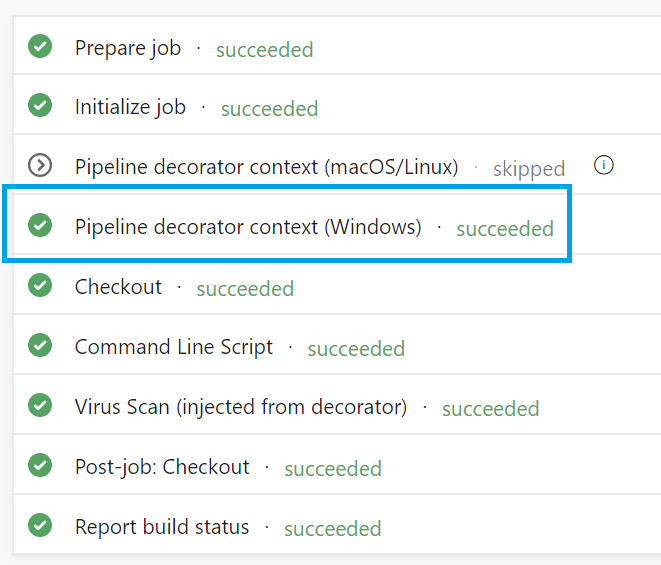

# Author a pipeline decorator

[!INCLUDE [version-gt-eq-2022](../../includes/version-gt-eq-2022.md)]

Pipeline decorators let you add steps to the beginning and end of every job.
The process of authoring a pipeline decorator is different than adding steps to a single definition because it applies to all pipelines in an organization.

Suppose your organization requires running a virus scanner on all build outputs that could be released.
Pipeline authors don't need to remember to add that step. We create a decorator that automatically injects the step. Our pipeline decorator injects a custom task that does virus scanning at the end of every pipeline job.

[!INCLUDE [extension-docs-new-sdk](../../includes/extension-docs-new-sdk.md)]

## 1. Add contributions to an extension

The following example assumes you're familiar with the [contribution models](contributions-overview.md).

1. [Create an extension](add-build-task.md#extensionmanifest). 
   Once your extension gets created, you have a `vss-extension.json` file.
2. Add contributions to the `vss-extension.json` file for our new pipeline decorator.

#### vss-extension.json
```json
{
    "manifestVersion": 1,
    "contributions": [
        {
            "id": "my-required-task",
            "type": "ms.azure-pipelines.pipeline-decorator",
            "targets": [
                "ms.azure-pipelines-agent-job.post-job-tasks"
            ],
            "properties": {
                "template": "my-decorator.yml"
            }
        }
    ],
    "files": [
        {
            "path": "my-decorator.yml",
            "addressable": true,
            "contentType": "text/plain"
        }
    ]
}
```

### Contribution options

Let's take a look at the properties and what they're used for:

| Property | Description |
| ------------- |:-------------|
| `id` | Contribution identifier. Must be unique among contributions in this extension. |
| `type` | Specifies that this contribution is a pipeline decorator. Must be the string `ms.azure-pipelines.pipeline-decorator`. |
| `targets` | Decorators can run before your job/specified task, after, or both. See the following table for available options. |
| `properties.template` | (Required) The template is a YAML file included in your extension, which defines the steps for your pipeline decorator. It's a relative path from the root of your extension folder. |
| `properties.targettask` | The target task ID used for `ms.azure-pipelines-agent-job.pre-task-tasks` or `ms.azure-pipelines-agent-job.post-task-tasks` targets. Must be GUID string like `89b8ac58-8cb7-4479-a362-1baaacc6c7ad` |


### Targets

| Target | Description |
| ------ |:----------- |
| `ms.azure-pipelines-agent-job.pre-job-tasks` | Run before other tasks in a classic build or YAML pipeline. Due to differences in how source code checkout happens, this target runs after checkout in a YAML pipeline but before checkout in a classic build pipeline. |
| `ms.azure-pipelines-agent-job.post-checkout-tasks` | Run after the last `checkout` task in a classic build or YAML pipeline. |
| `ms.azure-pipelines-agent-job.post-job-tasks` | Run after other tasks in a classic build or YAML pipeline. |
| `ms.azure-pipelines-agent-job.pre-task-tasks` | Run before specified task in a classic build or YAML pipeline. |
| `ms.azure-pipelines-agent-job.post-task-tasks` | Run after specified task in a classic build or YAML pipeline. |
| `ms.azure-release-pipelines-agent-job.pre-task-tasks` | Run before specified task in a classic RM pipeline. |
| `ms.azure-release-pipelines-agent-job.post-task-tasks` | Run after specified task in a classic RM pipeline. |
| `ms.azure-release-pipelines-agent-job.pre-job-tasks` | Run before other tasks in a classic RM pipeline. |
| `ms.azure-release-pipelines-agent-job.post-job-tasks` | Run after other tasks in a classic RM pipeline. |

> [!NOTE] 
> [Deployment jobs](../../pipelines/process/deployment-jobs.md) in a YAML pipeline only support `ms.azure-pipelines-agent-job.pre-job-tasks` and `ms.azure-pipelines-agent-job.post-job-tasks` targets.
> [Jobs](../../pipelines/process/phases.md) support all YAML pipeline targets.

In this example, we use `ms.azure-pipelines-agent-job.post-job-tasks` because we want to run at the end of all build jobs.

This extension contributes a pipeline decorator.
Next, we create a template YAML file to define the decorator's behavior.

## 2. Create a decorator YAML file

In the extension's properties, we chose the name "my-decorator.yml".
Create that file in the root of your contribution. It holds the set of steps to run after each job.
We start with a basic example and work up to the full task.

#### my-decorator.yml (initial version)

```yaml
steps:
- task: CmdLine@2
  displayName: 'Run my script (injected from decorator)'
  inputs:
    script: dir
```

> [!NOTE] 
> Pipeline decorator tasks with service connection usage are not supported for classic release pipelines.

## 3. Install the decorator

To add a pipeline decorator to your organization, you must [install an extension](../../marketplace/install-extension.md).
**Only private extensions can contribute pipeline decorators.**
The extension must be authored and shared with your organization before it can be used.

Once the extension has been shared with your organization, [search for the extension](https://marketplace.visualstudio.com/search?term=tag%3APipeline%20decorator&target=AzureDevOps&category=All%20categories&visibilityQuery=all&sortBy=Relevance) and install it.

Save the file, then [build and install the extension](../get-started/node.md).
Create and run a basic pipeline.
The decorator automatically injects our `dir` script at the end of every job.
A pipeline run looks similar to the following example.



> [!NOTE] 
> The decorator runs on every job in every pipeline in the organization.
> In later steps, we add logic to control when and how the decorator runs.

## 4. Inject conditions

In our example, we only need to run the virus scanner if the build outputs might be released to the public. Let's say that only builds from the default branch (typically `main`) are ever released.
We should limit the decorator to jobs running against the default branch.

The updated file looks like this:

#### my-decorator.yml (revised version)
------
```yaml
steps:
- ${{ if eq(resources.repositories['self'].ref, resources.repositories['self'].defaultBranch) }}:
  - script: dir
    displayName: 'Run my script (injected from decorator)'
```

You can start to see the power of this extensibility point.
Use the context of the current job to conditionally inject steps at runtime.
Use [YAML expressions](../../pipelines/process/expressions.md) to make decisions about what steps to inject and when.
See [pipeline decorator expression context](pipeline-decorator-context.md) for a full list of available data.

There's another condition we need to consider: what if the user already included the virus scanning step?
We shouldn't waste time running it again.
In this simple example, we'll pretend that any `script` task found in the job is running the virus scanner.
(In a real implementation, you'd have a custom task to check for that instead.)

The script task's ID is `d9bafed4-0b18-4f58-968d-86655b4d2ce9`.
If we see another script task, we shouldn't inject ours.

#### my-decorator.yml (final version)
------
```yaml
steps:
- ${{ if and(eq(resources.repositories['self'].ref, resources.repositories['self'].defaultBranch), not(containsValue(job.steps.*.task.id, 'd9bafed4-0b18-4f58-968d-86655b4d2ce9'))) }}:
  - script: dir
    displayName: 'Run my script (injected from decorator)'
```

## 5. Specify a target task

You can specify target [task ID](add-build-task.md#taskjson), and inject tasks before or after this target task.
To specify target task, you can modify vss-extension.json manifest file like the following example.

#### vss-extension.json
```json
{
    "contributions": [
        {
            "id": "my-required-task",
            "type": "ms.azure-pipelines.pipeline-decorator",
            "targets": [
                "ms.azure-pipelines-agent-job.pre-task-tasks",
                "ms.azure-pipelines-agent-job.post-task-tasks"
            ],
            "properties": {
                "template": "my-decorator.yml",
                "targettask": "target-task-id"
            }
        }
    ],
    ...
}
```

When you set up the 'targettask' property, you can specify ID of a target task.
Tasks will be injected before/after all instances of specified target task. 


### Specify target task's inputs injection
You can specify a list of inputs of the target task that you want to inject as inputs to the injected task.

This feature is designed to work with [custom pipeline tasks](add-build-task.md#step-1-create-a-custom-task). It isn't intended to provide access to target pipeline task inputs via pipeline variables.

To get access to the target pipeline task inputs (inputs with the `target_` prefix), the injected pipeline task should use methods from the [azure-pipelines-tasks-task-lib](https://github.com/Microsoft/azure-pipelines-task-lib), and not the pipeline variables, for example `const inputString = tl.getInput('target_targetInput')`). 

To do so, you can create your own custom pipeline [task](add-build-task.md#task-implementation) and use the target inputs there. If you need the functionality of one of the out-of-box tasks, like `CmdLine@2`, you can create a copy of the [CmdLine@2 task](https://github.com/microsoft/azure-pipelines-tasks/tree/master/Tasks/CmdLineV2) and publish it with your decorator extension.

> [!NOTE]
> This functionality is only available for tasks that are injected before or after the target task.

To specify this list of inputs, you can modify vss-extension.json manifest file like the following example.

#### vss-extension.json (injected task inputs version)
```json
{
    "contributions": [
        {
            "id": "my-required-task",
            "type": "ms.azure-pipelines.pipeline-decorator",
            "targets": [
                "ms.azure-pipelines-agent-job.pre-task-tasks",
                "ms.azure-pipelines-agent-job.post-task-tasks"
            ],
            "properties": {
                "template": "my-decorator.yml",
                "targettask": "target-task-id",
                "targettaskinputs": ["target-task-input", "target-task-second-input"]
            }
        }
    ],
    ...
}
```

By setting up of 'targettaskinputs' property, you can specify the list of inputs that are expected to inject.
These inputs will be injected into the task with the prefix "`target_`" and will be available in the injected task like `target_target-task-input`.

> [!NOTE]
> Target task inputs that get secret values with variables or get them from other tasks won't be injected.


<!--## Limitations

#### Scoping

You can't scope the contribution to apply to certain pipelines within your organization. When you install the extension it applies to all jobs across your organization.

#### Endpoints

For now, you can't specify endpoints like SonarQube with pipeline decorators.

#### Source control

Pipeline decorators currently work with Azure Dev Ops Git and GitHub. They do not work for other source control providers.
-->
## Debug

You might need to debug when you create your decorator. You also might want to see what data you have available in the context.

You can set the `system.debugContext` variable to `true` when you queue a pipeline.
Then, look at the pipeline summary page.

You see something similar to the following image.



Select the task to see the logs, which show runtime values and that the context is available.

## Related articles

- [About YAML expression syntax](../../pipelines/process/expressions.md#functions)
- [Pipeline decorator expression context](pipeline-decorator-context.md)
- [Develop a web extension](../get-started/node.md)
- [Authentication guide](../../integrate/get-started/authentication/authentication-guidance.md)
