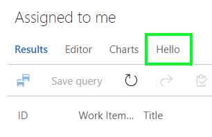

# VSTS extensibility points

Extensions extend and enhance the Visual Studio Team Services (VSTS) user experience by contributing new capabilities. This guide highlights the most common extensibility points that your extension can target.

>[!NOTE]
>To learn more about the VSTS extensibility model, see [contribution model](../../develop/contributions-overview.md) for an overview.

## Other useful references

The [Contributions Guide extension](https://marketplace.visualstudio.com/items/ms-samples.samples-contributions-guide) is a sample extension that you can install into your account to see the extensibility points that are available. It is recommended to install this extension into a personal or test account. The [source for this extension](https://github.com/Microsoft/vso-extension-samples/tree/master/contributions-guide) is also available.
</div>

<a name="hubs"></a>
## Hubs and hub groups

Hubs and hub groups are the primary navigation elements in VSTS. Files, Releases Backlog, and Queries are examples of hubs. A hub belongs to a hub group. The Files hub, for example, belongs to the project-level Code hub group. Hub groups can exist at the account (also known as a collection) level or the project level, but most extensions will contribute to the project level.

Extensions can contribute both hubs and hub groups. A common extensibility scenario is to contribute a hub to an existing hub group. For example:


### Targetable hub groups
<a name="targets"></a>

Here are the most common, Microsoft-provided hub groups that hubs can be contributed to:  

Name                | ID                                         | Level                           | Preview
--------------------|--------------------------------------------|---------------------------------|-----------------------------          
Code                | `ms.vss-code-web.code-hub-group`           | Project/team                    | 
Work                | `ms.vss-work-web.work-hub-group`           | Project/team                    | 
Build and Release   | `ms.vss-build-web.build-release-hub-group` | Project/team                    | 
Test                | `ms.vss-test-web.test-hub-group`           | Project/team                    | 
Project settings  | `ms.vss-web.project-admin-hub-group`       | Project                |  
Account settings  | `ms.vss-web.collection-admin-hub-group`    | Account (or collection)      |  


### Example

This example shows how to contribute a hub to the Code hub group:

```json
{
    ...
    "contributions": [
        {
            "id": "my-custom-hub",
            "type": "ms.vss-web.hub",
            "targets": [
                "ms.vss-code-web.code-hub-group"
            ],
            "properties": {
                "name": "Code Hub",
                "order": 30,
                "uri": "/views/code/custom.html"
            }
        }
    ]
}
```
* `ms.vss-web.hub` is the type of this contribution. This type is defined in the `vss-web` extension published under the `ms` publisher. This type declares optional/required properties required by contributions of this type (name, order, etc).
* `ms.vss-code-web.code-hub-group` is the full ID of the hub group contribution this hub is targetting. This contribution is declared in the `vss-code-web` extension published under the `ms` publisher
* `my-custom-hub` is the short ID of this contribution; `{publisherId}.{extensionId}.my-custom-hub` is the full ID

<a name="menus"></a>
## Menus and toolbars

See [how to add an action](../../develop/add-action.md) for details on contributing an action to a menu or toolbar.

<a name="menus_admin"></a>
### Settings

Name                              | Target ID                                           | Preview 
----------------------------------|-----------------------------------------------------|-------------------
Account (collection) overview toolbar       | `ms.vss-admin-web.collection-overview-toolbar-menu` | 
Collection overview projects grid | `ms.vss-admin-web.projects-grid-menu`               | 
Project overview toolbar          | `ms.vss-admin-web.project-overview-toolbar-menu`    | 
Project overview teams grid       | `ms.vss-admin-web.teams-grid-menu`                  | 

<a name="menus_build"></a>
### Build

Name                      | Target ID                                   | Preview 
--------------------------|---------------------------------------------|-------------------
Completed build menu      | `ms.vss-build-web.completed-build-menu`     | 
Build definitions menu    | `ms.vss-build-web.build-definition-menu`    | 

<a name="menu_release"></a>
### Release

Name                                     | Target ID                                                              | Preview 
-----------------------------------------|-------------------------------------------------------------------------|-------------------
Release definition explorer context menu | `ms.vss-releaseManagement-web.release-definition-explorer-context-menu` | 
Release definition explorer toolbar menu | `ms.vss-releaseManagement-web.release-definition-explorer-toolbar-menu` | 
Release summary toolbar menu             | `ms.vss-releaseManagement-web.release-editor-tool-bar-menu`             | 
Release summary tab                      | `ms.vss-releaseManagement-web.release-details-view`                     | 
Release summary section                  | `ms.vss-releaseManagement-web.release-details-summary-tab`              | 

<a name="menus_code"></a>
### Code

Name                                | Target ID                                        | Preview 
------------------------------------|--------------------------------------------------|-------------------
Source item (grid) menu             | `ms.vss-code-web.source-grid-item-menu`          | 
Source item (tree) menu             | `ms.vss-code-web.source-tree-item-menu`          | 
Source item (grid and tree) menu    | `ms.vss-code-web.source-item-menu`               |
Change list item menu               | `ms.vss-code-web.change-list-item-menu`          |
Change list summary item menu       | `ms.vss-code-web.change-list-summary-item-menu`  |
Git branches tree menu              | `ms.vss-code-web.git-branches-tree-menu`         | 
Git branches summary menu           | `ms.vss-code-web.git-branches-summary-grid-menu` |     
Git branches diff summary menu      | `ms.vss-code-web.git-branches-summary-grid-diff-menu` |
Git pull request actions menu       | `ms.vss-code-web.pull-request-action-menu` | 
Git pull request tabs (pivots)      | `ms.vss-code-web.pr-tabs` | 

<a name="menus_test"></a>
### Test

Name                       | Target ID                                   | Preview 
---------------------------|---------------------------------------------|-------------------
Test run toolbar           | `ms.vss-test-web.test-run-toolbar-menu`     | 
Test run grid menu         | `ms.vss-test-web.test-run-grid-menu`        | 
Test plan suites toolbar   | `ms.vss-test-web.test-plans-suites-toolbar` |
Test plan suites tree menu | `ms.vss-test-web.test-plans-suites-context` |
Test plan hub pivot tab    | `ms.vss-test-web.test-plan-pivot-tabs`      | 

<a name="menus_work"></a>
### Work

Name                            | Target ID                                         | Preview 
--------------------------------|---------------------------------------------------|-------------------
Work item query menu            | `ms.vss-work-web.work-item-query-menu`            | 
Work item query results toolbar menu | `ms.vss-work-web.work-item-query-results-toolbar-menu` | 
Work item query results menu item | `ms.vss-work-web.query-result-work-item-menu`   | 
Work item query results tab     | `ms.vss-work-web.query-tabs`                      | 
Work item form context menu               | `ms.vss-work-web.work-item-toolbar-menu`          | 
Backlog item menu               | `ms.vss-work-web.backlog-item-menu`               | 
Sprint board pivot filter menu  | `ms.vss-work-web.sprint-board-pivot-filter-menu`  | 
Board pivot filter menu         | `ms.vss-work-web.backlog-board-pivot-filter-menu` | 
Card menu                       | `ms.vss-work-web.backlog-board-card-item-menu`    | 
Product backlog tab             | `ms.vss-work-web.product-backlog-tabs`            | 
Iteration backlog tab           | `ms.vss-work-web.iteration-backlog-tabs`          | 
Portfolio backlog pane          | `ms.vss-work-web.portfolio-backlog-toolpane`      | 
Product backlog pane            | `ms.vss-work-web.requirement-backlog-toolpane`    | 
Iteration backlog pane          | `ms.vss-work-web.iteration-backlog-toolpane`      | 

<a name="dashboard"></a>
## Dashboards

An extension can contribute a new type of widget that can be added by users to a [dashboard](../../../report/dashboards/overview.md). Learn how to [contribute a dashboard widget](../../develop/add-dashboard-widget.md).

<a name="witform"></a>
## Work item form

The work item form can be enhanced by extensions with new sections, tabs, actions, and custom field renderers. Learn how to 
 [extend the work item form](../../develop/add-workitem-extension.md).

<a name="buildtasks"></a>
## Build and release tasks

Tasks are responsible for performing work in a build or release. Learn how to [contribute a build or release task](../../develop/add-build-task.md).

<a name="serviceHooks"></a>
## Service hooks

A "consumer" is the service that events are sent to in Service Hooks. An extension can contribute consumer services that can be configured by a user (or programmatically) to send events to that service See [contribute a service hooks consumer](../../develop/add-service-hook.md).
