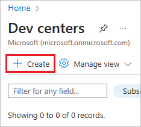
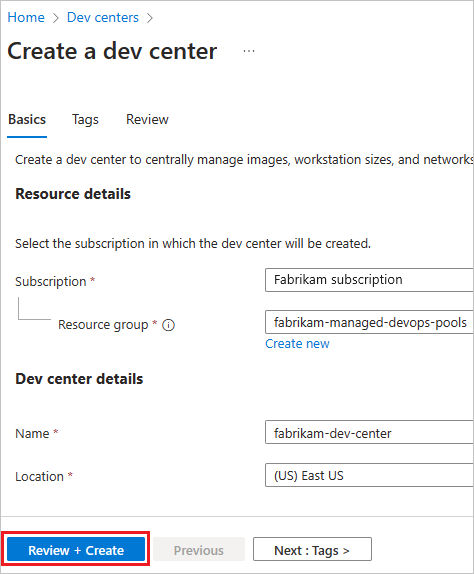
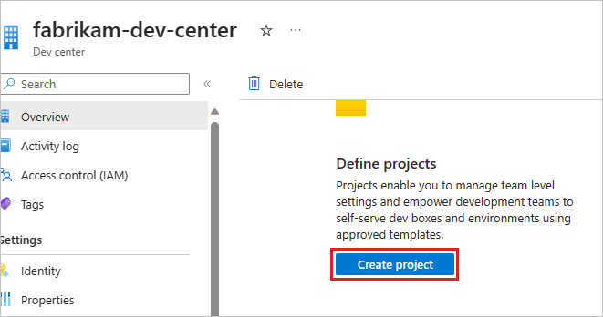
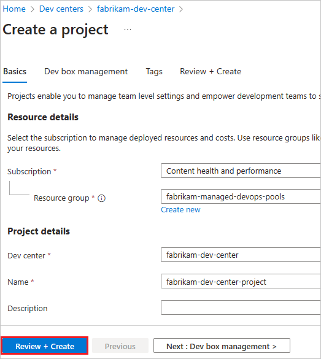

# Prerequisites

Before getting started with Managed DevOps Pools, you must perform the following steps.

1. [Connect your Azure DevOps organization to Microsoft Entra ID and verify membership](#connect-your-azure-devops-organization-to-microsoft-entra-id-and-verify-membership)
1. [Register the Managed DevOps Pools resource provider in your Azure Subscription](#register-the-managed-devops-pools-resource-provider-in-your-azure-subscription)
1. [Verify Azure DevOps permissions](#verify-azure-devops-permissions)
1. [Review Managed DevOps Pools quotas](#review-managed-devops-pools-quotas)

These steps need to performed only once per Azure DevOps organization and Azure subscription.

Managed DevOps Pools requires a Dev Center and Dev Center project. You can create these as part of the Managed DevOps Pool creation process, but if you want to create them ahead of time, follow the steps in [Create a Dev Center and Dev Center project](#create-a-dev-center-and-dev-center-project).

After completing the prerequisites, you can get started creating your first [Managed DevOps Pool](./quickstart-azure-portal.md).

## Connect your Azure DevOps organization to Microsoft Entra ID and verify membership

To create a Managed DevOps Pool in your Azure DevOps organization, your Azure DevOps organization must be connected to Microsoft Entra ID, and your user account must be a member of the the following Microsoft Entra ID tenants:

* The tenant of the Azure subscription that contains your Managed DevOps Pool
* The tenant of the Microsoft Entra ID that is connected to your Azure DevOps organization
  * These can both be the same tenant, but they are not required to be.

1. [View your current directory in the Azure portal](/azure/azure-portal/set-preferences#directories--subscriptions)
1. [View the directory for your Azure DevOps organization](../organizations/accounts/connect-organization-to-azure-ad.md#connect-your-organization-to-microsoft-entra-id). You can go directly to this page in the Azure DevOps portal here: `https://dev.azure.com/<your-organization>/_settings/organizationAad`.
1. If your Azure DevOps organization isn't connected to Microsoft Entra ID, follow the steps in [Connect your organization to Microsoft Entra ID](../organizations/accounts/connect-organization-to-azure-ad.md#connect-your-organization-to-microsoft-entra-id) and connect to the desired directory, such as the same directory as your Azure subscription.
2. If your Azure DevOps organization and Managed DevOps Pools Azure subscription are in different tenants, verify that you are a member of both tenants.

## Register the Managed DevOps Pools resource provider in your Azure Subscription

Before you use a resource provider, you must make sure your Azure subscription is registered for the resource provider. Registration configures your subscription to work with the resource provider. The following steps show how to register the **Microsoft.DevOpsInfrastructure** provider in your subscription. For more information about Azure resource providers, see [Azure resource providers and types](/azure/azure-resource-manager/management/resource-providers-and-types).

#### [Azure portal](#tab/azure-portal/)

### Azure portal

1. Sign in to the [Azure portal](https://portal.azure.com/).
1. On the Azure portal menu, search for **Subscriptions**. Select it from the available options.
1. Select the Azure subscription you plan to use for Managed DevOps Pools.
1. On the left menu, under **Settings**, select **Resource providers**.
1. Search for **Microsoft.DevOpsInfrastructure**, select the check box from the list, and choose **Register**.

   :::image type="content" source="./media/prerequisites/register-resource-provider.png" alt-text="Screenshot of registering the Managed DevOps Pools Azure Resource provider.":::

1. To see the Azure regions that support Managed DevOps Pools in your subscription after it is registered, select **Microsoft.DevOpsInfrastructure** from the list, and choose **Locations**.

   :::image type="content" source="media/prerequisites/view-provider-regions-small.png" lightbox="media/prerequisites/view-provider-regions.png" alt-text="Screenshot of Azure regions that support Managed DevOps Pools.":::

#### [Azure CLI](#tab/azure-cli/)

### Azure CLI

If you prefer using Azure CLI to register the Azure Resource Provider, please execute the following command in [Azure CLI](/cli/azure/)

```bash
az provider register --namespace 'Microsoft.DevOpsInfrastructure'
```

#### [PowerShell](#tab/powershell/)

### PowerShell

If you prefer using PowerShell to register the Azure Resource Provider, please execute the following command from the [Az.Resources module](/powershell/module/az.resources/register-azresourceprovider)

```PowerShell
Register-AzResourceProvider -ProviderNamespace 'Microsoft.DevOpsInfrastructure'`
```

* * *

## Verify Azure DevOps permissions

When you create a Managed DevOps Pool, your identity is used to create a corresponding agent pool in your Azure DevOps organization. To successfully create a Managed DevOps Pool you must have one of the following Azure DevOps permissions in your organization. These permissions are listed in order from least privileged to most privileged.

* **Organization-level Agent pools administrator** - Administrators of agent pools at the organization level can [create new agent pools as well as perform all operations on them](../organizations/security/about-security-roles.md#agent-pool-security-roles-organization-or-collection-level). For instructions on adding users to this group, see [Configure organization security for agent pools - Set organization security for all agent pools](../pipelines/policies/agent-pool-permissions.md#set-organization-security-for-all-agent-pools).
* **Project Collection Administrator** - The Project Collection Administrators group is the main administrative security group defined for an organization and can perform all operations in an Azure DevOps organization, including creating new pools. For information about this group and how to see its members, see [Look up a project collection administrator](../organizations/security/look-up-project-collection-administrators.md).

## Review Managed DevOps Pools quotas

Managed DevOps Pools uses [Azure Quotas](/azure/quotas/quotas-overview) to manage the usage of the virtual machine resources that run your agents. Managed DevOps Pools quotas are based on CPU cores per Azure VM SKU family. By default, regions that support Managed DevOps Pools have five cores of quota granted for the following [SKU families](/azure/virtual-machines/sizes/overview).

* `standardBSFamily`
* `standardDADSv5Family`
* `standardDASv5Family`
* `standardDDSv5Family`
* `standardDLDSv5Family`
* `standardDPLDSv5Family`
* `standardDPLSv5Family`
* `standardDPSv5Family`
* `standardDSv2Family`
* `standardDSv5Family`
* `standardDv2Family`
* `standardEASv4Family`
* `standardEDSv5Family`
* `standardESv5Family`
* `standardFSv2Family`
* `standardLSv3Family`

The default agent size for new Managed DevOps Pools resources is **Standard D2ads v5**, which is part of the **standardDADSv5Family**. **Standard D2ads v5** uses two cores, so you can create a pool with up to two agents, for a total of four cores, without requesting additional quota. To create more, you must [request a quota adjustment](#request-a-quota-adjustment).

### View your quotas

1. To view the quotas for SKU families in your region, sign in to the [Azure portal](https://portal.azure.com/), enter **quotas** in the search box, and choose **Quotas** from the list.

   :::image type="content" source="./media/quotas/quotas-search.png" alt-text="Screenshot of Azure portal search for quotas.":::

1. Choose **Managed DevOps Pools**.

   :::image type="content" source="./media/quotas/quotas-overview.png" alt-text="Screenshot of quotas overview.":::

1. Choose your subscription and the region where you want to create the pool. In the following example, the **Standard DADSv5 Family vCPUs** quota is 8 of 8, which means the quota of eight cores are available and all eight are being used. If you want to use more than eight cores for this SKU, or you want to use a different SKU that doesn't have any quota, you can request a quota adjustment.

   :::image type="content" source="./media/quotas/quotas-list.png" alt-text="Screenshot of quotas list.":::

### Request a quota adjustment

1. To request an increase in quota, choose **Request adjustment** for the desired SKU in your region.

   :::image type="content" source="./media/quotas/request-adjustment-menu.png" alt-text="Screenshot of request adjustment menu item.":::

2. Specify the desired number of cores for the selected SKU, and choose **Submit**. In the following example, 20 cores are requested for **Standard DSv2 Family vCPUs**.

   :::image type="content" source="./media/quotas/new-quota-request.png" alt-text="Screenshot of selecting an increased number of cores.":::

3. The quota request takes a few moments to process. The following example shows a successful adjustment.

   :::image type="content" source="./media/quotas/quota-request-granted.png" alt-text="Screenshot of granted quota request.":::

   If the quota adjustment can't be auto-approved, you'll be directed to submit a support request, as described in the following section.

#### Create a quota support request

If your subscription doesn't have the capacity to configure your pool with desired Azure VM SKU and maximum agents count, pool creation fails with an error similar to the following message. `Cores needed to complete this request is 8, which exceeds the current limit of 0 for SKU family standardDDSv4Family in region eastus. Please choose a different region if possible, or request additional quota at https://portal.azure.com/#view/Microsoft_Azure_Support/NewSupportRequestV3Blade/issueType/quota/subscriptionId/subscription_id_placeholder/topicId/3eadc5d3-b59a-3658-d8c6-9c729ba35b97`.

1. Go to the link to start a **New support request** to request a quota increase. Choose **Next**.

   :::image type="content" source="./media/quotas/new-support-request.png" alt-text="Screenshot of new quota support request":::

1. Choose **Enter details**.

   :::image type="content" source="./media/quotas/support-request-enter-details-link.png" alt-text="Screenshot of new quota support request.":::

1. Enter the **Region**, **Sku Family**, **New limit**, and choose **Save and continue**. In th following example, 100 cores are requested for **Standard DDSv4 Family vCPUs**.

   :::image type="content" source="./media/quotas/new-support-request-quota-details.png" alt-text="Screenshot of quota details.":::

1. Fill the following details in this form:

   * **Severity**: Choose one of the available severity levels based on the business impact.

   * **Preferred contact method**: You can either choose to be contacted over **Email** or by **Phone**.

1. Select **Next: Review+Create**. Validate the information provided and select **Create** to create a support request.

Within 24 hours, the Managed DevOps Pools support team will evaluate your request and get back to you.

## Create a Dev Center and Dev Center project

Managed DevOps Pools provides you with an option to create a Dev Center and Dev Center project when you create your pool. If you want to create them ahead of time, perform the following steps.

* [Create a Dev Center](#create-a-dev-center)
* [Create a Dev Center Project](#create-a-dev-center-project)

### Create a Dev Center

1. Sign in to the [Azure portal](https://portal.azure.com/).
1. On the Azure portal menu, search for **Dev centers**, select it from the available options, and choose **Create**.

   

1. Choose the desired **Subscription**, **Resource group**, **Name**, and **Location**, and choose **Review + Create**.

   

1. On the confirmation window, choose **Create** to create the Dev center.
1. Wait until the new Dev center is created, and proceed to the next section and create a Dev Center Project.

### Create a Dev Center Project

1. Go to the Dev Center created in the previous section, and choose **Create project**.

   

1. Choose the desired **Subscription**, **Resource group**, **Dev center**, **Name**, and choose **Review + Create**.

   

1. On the confirmation window, choose **Create** to create the Dev center project.

## Next steps

* [Create your first Managed DevOps Pool](./quickstart-azure-portal.md)
