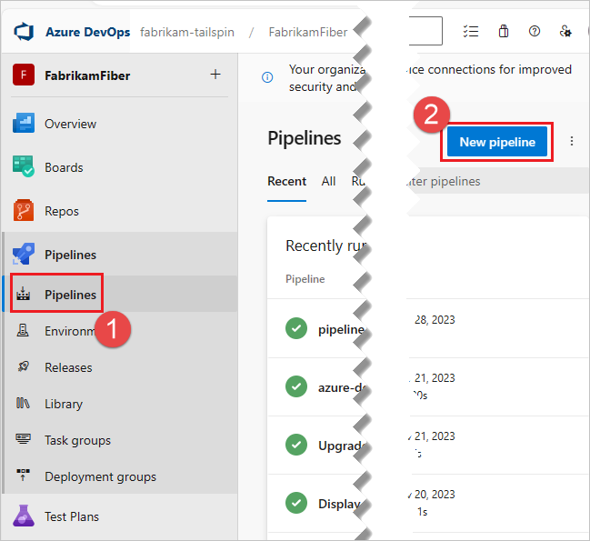
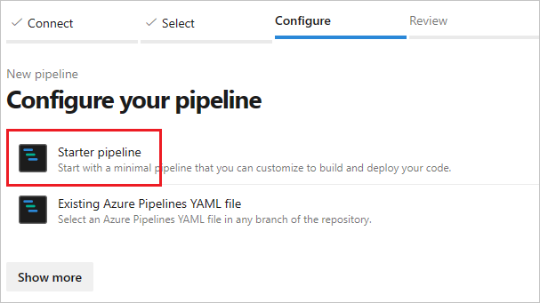

# Quickstart: Create a Managed DevOps Pool using an ARM template

This article shows you how to create a Managed DevOps Pool using an ARM template, and run a pipeline in the new pool.

## Prerequisites

Before completing the steps in this article, you must have configured your Azure subscription and Azure DevOps organization for use with Managed DevOps Pools, as described in the [Prerequisites](./prerequisites.md) article. These steps need to be completed only once per Azure subscription and Azure DevOps organization.

## Sign in to the Azure CLI

Open a command prompt (on Windows, use Windows Command Prompt or PowerShell) and run the following commands.

1. Sign in the to Azure CLI.
 
   ```azurecli
   az login
   ```
2. If you have more than one Azure subscription, set your default Azure subscription.

   ```azurecli
   az account set --subscription "My subscription name"
   ```

   To get a list of your subscriptions, you can run the following command.

   ```azurecli
   az account list -o table
   ```

   If you have multiple tenants, or want to see more information about working with Azure subscription using Azure CLI, see [How to manage Azure subscriptions with the Azure CLI](/cli/azure/manage-azure-subscriptions-azure-cli). 

## Create a resource group, Dev Center, and Dev Center Project

1. Follow the [Create a dev center](/azure/deployment-environments/how-to-create-configure-dev-center#create-a-dev-center) steps in [Create and configure a dev center for Azure Deployment Environments by using the Azure CLI](/azure/deployment-environments/how-to-create-configure-dev-center).

   You only need to follow the steps in the [Create a dev center](/azure/deployment-environments/how-to-create-configure-dev-center#create-a-dev-center) section. Make a note of the resource group name and Dev Center name.

1. Follow the [Create a project](/azure/deployment-environments/how-to-create-configure-projects#create-a-project) steps in [Create and configure a project by using the Azure CLI](/azure/deployment-environments/how-to-create-configure-projects).

   Make a note of the `id` of the created project (not the `devCenterId`).

## Review and save the template

1. Create a local file name **mdp-azure-deploy.json** with the following contents. This file is a parameterized ARM template that creates a `microsoft.devopsinfrastructure/pools` resource.

    ```json
    {
        "$schema": "https://schema.management.azure.com/schemas/2019-04-01/deploymentTemplate.json#",
        "contentVersion": "1.0.0.0",
        "parameters": {
            "poolName": {
                "type": "string"
            },
            "adoOrg": {
                "type": "string"
            },
            "devCenterResourceId": {
                "type": "string"
            },
            "imageName": {
                "type": "string"
            },
            "poolSize": {
                "type": "int"
            },
            "location": {
                "type": "string",
                "defaultValue": "eastus"
            }
        },
        "variables": {},
        "resources": [
            {
                "name": "[parameters('poolName')]",
                "type": "microsoft.devopsinfrastructure/pools",
                "apiVersion": "2024-04-04-preview",
                "location": "[parameters('location')]",
                "tags": {},
                "properties": {
                    "organizationProfile": {
                        "organizations": [
                            {
                                "url": "[parameters('adoOrg')]",
                                "parallelism": 1
                            }
                        ],
                        "permissionProfile": {
                            "kind": "CreatorOnly"
                        },
                        "kind": "AzureDevOps"
                    },
                    "devCenterProjectResourceId": "[parameters('devCenterResourceId')]",
                    "maximumConcurrency": "[parameters('poolSize')]",
                    "agentProfile": {
                        "kind": "Stateless"
                    },
                    "fabricProfile": {
                        "sku": {
                            "name": "Standard_D2ads_v5"
                        },
                        "images": [
                            {
                                "wellKnownImageName": "[parameters('imageName')]",
                                "buffer": "*"
                            }
                        ],
                        "kind": "Vmss"
                    }
                }
            }
        ]
    }
    ```

2. Create another local file named **mdp-azure-deploy-parameters.json** and save it in the same folder as the first file. Update the following properties to match the details of your environment.

    | Parameter | Value |
    |----------|-------|
    | `poolName` | Update `value` with the desired name of your pool. The name must consist of alphanumeric characters, `.`, `-`, or `_`, and be between 3 and 44 characters in length. The name must be globally unique in Azure. |
    | `adoOrg` | Update `value` and replace `your-organization` with the name of your Azure DevOps organization. |
    | `devCenterResourceId` | Update `value` with the `id` from the previous [Create a resource group, Dev Center, and Dev Center Project](#create-a-resource-group-dev-center-and-dev-center-project) step. |
    | `imageName` | This example is configured to use an [Azure Pipelines image](./configure-images.md#azure-pipelines-images), and uses the Windows Server 2022 image. If you want to change it, choose from the [Azure Pipelines image predefined aliases](./configure-images.md#azure-pipelines-image-predefined-aliases). Managed DevOps Pools also supports Azure Compute Gallery images and selected marketplace images. For information on configuring a Managed DevOps Pools resource for these image types, see [Configure Managed DevOps Pools images](./configure-images.md). |
    | `poolSize` | Update `value` with the maximum number of agents you want to be able to run concurrent jobs. In this example the `poolSize` is `1`.|
    | `location` | The Azure region for the pool. In this example the region is `eastus`. |
    
    ```json
    {
        "$schema": "https://schema.management.azure.com/schemas/2015-01-01/deploymentParameters.json#",
        "contentVersion": "1.0.0.0",
        "parameters": {
            "poolName": {
                "value": "my-first-managed-pool"
            },
            "adoOrg": {
                "value": "https://dev.azure.com/your-organization"
            },
            "devCenterResourceId": {
                "value": "/subscriptions/subscription_id_placeholder/resourceGroups/fabrikam-managed-devops-pools/providers/Microsoft.DevCenter/projects/fabrikam-dev-center-project"
            },
            "imageName": {
                "value": "windows-2022"
            },
            "poolSize": {
                "value": 1
            },
            "location": {
                "value": "eastus"
            }
        }
    }
    ```

## Create the Managed DevOps Pool

Open a command prompt (on Windows, use Windows Command Prompt or PowerShell) and run the following commands. You can skip the first two commands if your Azure CLI session from the first procedure is still active.

1. Sign in the to Azure CLI.
 
   ```azurecli
   az login
   ```
2. If you have more than one Azure subscription, set your default Azure subscription.

   ```azurecli
   az account set --subscription "My subscription name"
   ```

   To get a list of your subscriptions, you can run the following command.

   ```azurecli
   az account list -o table
   ```

   If you have multiple tenants, or want to see more information about working with Azure subscription using Azure CLI, see [How to manage Azure subscriptions with the Azure CLI](/cli/azure/manage-azure-subscriptions-azure-cli). 
   
3. Go to the folder when you saved the two JSON files from the previous step. In this example, the files are saved to `C:\examples`.

   ```azurecli
   cd c:\examples
   ```

4. Create the Managed DevOps Pool. Replace `<resourceGroupName>` with the resource group created in the first step.

   ```azurecli
   az deployment group create --resource-group <resourceGroupName> --template-file mdp-azure-deploy.json --parameters mdp-azure-deploy-parameters.json
   ```

   If your subscription doesn't have the capacity to configure your pool with desired Azure VM SKU and maximum agents count, pool creation fails with an error similar to the following message. `Cores needed to complete this request is 8, which exceeds the current limit of 0 for SKU family standardDDSv4Family in region eastus. Please choose a different region if possible, or request additional quota at https://portal.azure.com/#view/Microsoft_Azure_Support/NewSupportRequestV3Blade/issueType/quota/subscriptionId/subscription_id_placeholder/topicId/3eadc5d3-b59a-3658-d8c6-9c729ba35b97`. To resolve the issue, see [Review Managed DevOps Pools quotas](./prerequisites.md#review-managed-devops-pools-quotas).
   
## View your created pool in the Azure portal

1. Sign in to the [Azure portal](https://portal.azure.com/).
1. Search for **Managed DevOps Pools** and select it from the available options.
1. Choose your new Managed DevOps Pool from the list.
1. Choose **JSON View** to see the JSON format of your Managed DevOps Pools resource.

   :::image type="content" source="./media/pool-settings/json-view-button.png" alt-text="Screenshot of JSON View button in pool overview.":::

## View the agent pool in Azure DevOps

1. Go to the Azure DevOps portal and sign in to your Azure DevOps organization (`https://dev.azure.com/{your-organization}`).

1. Go to **Azure DevOps** > **Organization settings**.

   :::image type="content" source="./media/prerequisites/organization-settings.png" alt-text="Screenshot of Organization settings button.":::

1. Go to **Pipelines** > **Agent pools**, and verify that your new pool is listed. If you just created the Managed DevOps Pool, it can take a few moments for the new pool to appear in the agents list.

   

## Run a pipeline in your new pool

In this step, we'll create a simple pipeline in the default repository of an Azure DevOps project and run it in your new Managed DevOps Pool.

1. Go to the Azure DevOps portal and sign in to your Azure DevOps organization (`https://dev.azure.com/{your-organization}`).
1. Go to the project where you want to run the pipeline, and choose Pipelines.

   

1. Choose **New pipeline** (or **Create Pipeline** if this is your first pipeline).

   

1. Choose **Azure Repos Git**.

   

1. Choose the repository that has the same name as your project. In this example, the project is named FabrikamFiber, so we choose the repository with the same name.

   

1. Choose Starter pipeline.

   

1. By default the starter template uses a Microsoft hosted Linux agent. Edit the pipeline template and change the `pool` section so that it refers to the pool you created in the previous steps.

   ```
   # Change these two lines as shown in the following example.
    pool:
     vmImage: ubuntu-latest
   ```

   In this example, the Managed DevOps Pools is named `fabrikam-managed-pool`, so replace `vmImage: ubuntu-latest` with `name: fabrikam-managed-pools`, and specify the name of your Managed DevOps Pool.

   ```
   # Replace fabrikam-managed-pools with the name
   # of your Managed DevOps Pool.
   pool:
     name: fabrikam-managed-pool
   ```

1. Choose **Save and run**, and choose **Save and run** a second time to confirm.

   

1. If this is the first pipeline run in this pool, you may be asked to grant permissions before the pipeline runs.

1. Watch the [pipeline run](../pipelines/create-first-pipeline.md#view-pipeline-run-details) in Azure DevOps, and you can switch over to the Azure portal and see the running agent in the [Agents](./view-agents.md) view.

## Clean up resources

When you have completed the quickstart, delete the created resources if you don't want to continue to use them.

To delete the Managed DevOps Pool, Dev Center, and Dev Center Project, you can delete them by [deleting the resource group](/azure/azure-resource-manager/management/delete-resource-group#delete-resource-group) that contains them.

## See also

* [Review the Managed DevOps Pools resource schema](https://github.com/Azure/azure-resource-manager-schemas/blob/main/schemas/2024-04-04-preview/Microsoft.DevOpsInfrastructure.json)
