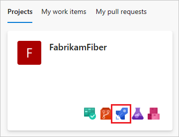
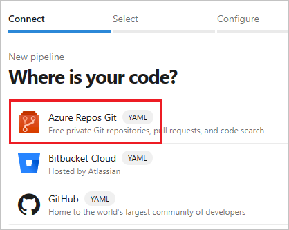
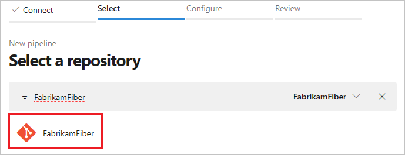

# Quickstart: Create a Managed DevOps Pool using Azure CLI

This article shows you how to create a Managed DevOps Pool using Azure CLI, and run a pipeline in it.

## Prerequisites

Before completing the steps in this article, you must have configured your Azure subscription and Azure DevOps organization for use with Managed DevOps Pools, as described in the [Prerequisites](./prerequisites.md) article. These steps need to be completed only once per Azure subscription and Azure DevOps organization.

## Install or run in Azure Cloud Shell

The easiest way to learn how to use the Azure CLI is by running a Bash environment in [Azure Cloud Shell](https://portal.azure.com/#cloudshell/) through your browser. To learn about Cloud Shell, see [Quickstart for Bash in Azure Cloud Shell](/azure/cloud-shell/quickstart).

When you're ready to install the Azure CLI, see the [installation instructions](/cli/azure/install-azure-cli)
for Windows, Linux, macOS, and Docker container.

Check your version by running `az --version`. Azure Cloud Shell always has the latest version of the Azure CLI preinstalled.

```azurecli-interactive
az version
```

## Define environment variables

```bash
export RANDOM_ID="$(openssl rand -hex 3)"
export RESOURCE_GROUP_NAME="myManagedDevOpsPoolGroup$RANDOM_ID"
export REGION=EastUS2
export POOL_NAME="mdpPool$RANDOM_ID"
export DEV_CENTER_NAME="mdpDevCenter$RANDOM_ID"
export DEV_CENTER_PROJECT_NAME="mdpDevCenterProject$RANDOM_ID"
```

Review your resource names.

```bash
echo $RESOURCE_GROUP_NAME
echo $POOL_NAME
echo $DEV_CENTER_NAME
echo $DEV_CENTER_PROJECT_NAME
```


## Sign in to the Azure CLI

Open a command prompt (on Windows, use Windows Command Prompt or PowerShell) and run the following commands. If you're using [Azure Cloud Shell](https://portal.azure.com/#cloudshell/) you don't need to run `az login` unless you want to use a different account.

1. Sign in the to Azure CLI.
 
   ```azurecli
   az login
   ```

2. If you have more than one Azure subscription, set your default Azure subscription.

   ```azurecli
   az account set --subscription "My subscription name"
   ```

   To get a list of your subscriptions, you can run the following command.

   ```azurecli
   az account list -o table
   ```

   If you have multiple tenants, or want to see more information about working with Azure subscription using Azure CLI, see [How to manage Azure subscriptions with the Azure CLI](/cli/azure/manage-azure-subscriptions-azure-cli). 

## Create a resource group

1. Run the following command to create a resource group

```azurecli
az group create --name $RESOURCE_GROUP_NAME --location $REGION
```


1. Configure a default location for your resources. In this example, `eastus` is used.

   ```azurecli
   az config set defaults.location=eastus
   ```

1. Create the resource group in which you want to create the Managed DevOps Pools and associated resources for this quickstart.

   ```azurecli
   az group create -n <resourceGroupName>
   ```

1. Configure the default resource group as the resource group you created:

   ```azurecli
   az config set defaults.group=<resourceGroupName>
   ```

## Create a Dev Center and Dev Center Project

1. Install the Azure CLI *devcenter* extension.

   ```azurecli
   az extension add --name devcenter --upgrade
   ```

1. Create a dev center.

   ```azurecli
   az devcenter admin devcenter create -n <devCenterName>
   ```

   After a few moments, the output indicates that the Dev center was created. Make a note of the `id` for the following step.

   ```json
    {
       "devCenterUri": "https://...",
       "id": "/subscriptions/aaaa0a0a-bb1b-cc2c-dd3d-eeeeee4e4e4e/resourceGroups/resourceGroupName/providers/Microsoft.DevCenter/devcenters/devCenterName",
       "location": "eastus",
       "name": "devCenterName",
       "provisioningState": "Succeeded",
       "resourceGroup": "resourceGroupName",
       "systemData": { ... },
       "type": "microsoft.devcenter/devcenters"
    }
   ```

1. Create a dev center project. Specify the desired `devCenterProjectName`, and for `devCenterID`, use the `id` from the previous step. You can also retrieve the ID by running the following command: `az devcenter admin devcenter show -n <devcenterName> --query id -o tsv`.

   ```azurecli
   az devcenter admin project create -n <devCenterProjectName> --description "My dev center project." --dev-center-id <devCenterID>
   ```

   After a few moments, the output indicates that the Dev center project was created. Make a note of the `id` for the created Dev center project for use when you create your Managed DevOps Pool (not the `devCenterId`).

    ```json
    {
      "description": "My dev center project.",
      "devCenterId": "...",
      "devCenterUri": "https://...",
      "id": "/subscriptions/aaaa0a0a-bb1b-cc2c-dd3d-eeeeee4e4e4e/resourceGroups/resourceGroupName/providers/Microsoft.DevCenter/projects/devCenterProjectName",
      "location": "eastus",
      "name": "devCenterProjectName",
      "provisioningState": "Succeeded",
      "resourceGroup": "resourceGroupName",
      "systemData": { ... },
      "type": "microsoft.devcenter/projects"
    }
    ```

## Create the Managed DevOps Pool

1. Install the `mdp` extension.

   ```azurecli
    az extension add --name mdp
   ```

1. Create the Managed DevOps Pool by running the following [az mdp pool create](/cli/azure/mdp/pool?view=azure-cli-latest#az-mdp-pool-create) command. \

4. Create the Managed DevOps Pool. Replace `<resourceGroupName>` with the resource group created in the first step.

   ```azurecli
   az deployment group create --resource-group <resourceGroupName> --template-file mdp-azure-deploy.json --parameters mdp-azure-deploy-parameters.json
   ```

   If your subscription doesn't have the capacity to configure your pool with desired Azure VM SKU and maximum agents count, pool creation fails with an error similar to the following message. `Cores needed to complete this request is 8, which exceeds the current limit of 0 for SKU family standardDDSv4Family in region eastus. Please choose a different region if possible, or request additional quota at https://portal.azure.com/#view/Microsoft_Azure_Support/NewSupportRequestV3Blade/issueType/quota/subscriptionId/subscription_id_placeholder/topicId/3eadc5d3-b59a-3658-d8c6-9c729ba35b97`. To resolve the issue, see [Review Managed DevOps Pools quotas](./prerequisites.md#review-managed-devops-pools-quotas).
   
## View your created pool in the Azure portal

1. Sign in to the [Azure portal](https://portal.azure.com/).
1. Search for **Managed DevOps Pools** and select it from the available options.
1. Choose your new Managed DevOps Pool from the list.
1. Choose **JSON View** to see the JSON format of your Managed DevOps Pools resource.

   :::image type="content" source="./media/pool-settings/json-view-button.png" alt-text="Screenshot of JSON View button in pool overview.":::

## View the agent pool in Azure DevOps

1. Go to the Azure DevOps portal and sign in to your Azure DevOps organization (`https://dev.azure.com/{your-organization}`).

1. Go to **Azure DevOps** > **Organization settings**.

   :::image type="content" source="./media/prerequisites/organization-settings.png" alt-text="Screenshot of Organization settings button.":::

1. Go to **Pipelines** > **Agent pools**, and verify that your new pool is listed. If you just created the Managed DevOps Pool, it can take a few moments for the new pool to appear in the agents list.

   

## Run a pipeline in your new pool

In this step, we'll create a simple pipeline in the default repository of an Azure DevOps project and run it in your new Managed DevOps Pool.

1. Go to the Azure DevOps portal and sign in to your Azure DevOps organization (`https://dev.azure.com/{your-organization}`).
1. Go to the project where you want to run the pipeline, and choose Pipelines.

   

1. Choose **New pipeline** (or **Create Pipeline** if this is your first pipeline).

   

1. Choose **Azure Repos Git**.

   

1. Choose the repository that has the same name as your project. In this example, the project is named FabrikamFiber, so we choose the repository with the same name.

   

1. Choose Starter pipeline.

   

1. By default the starter template uses a Microsoft hosted Linux agent. Edit the pipeline template and change the `pool` section so that it refers to the pool you created in the previous steps.

   ```
   # Change these two lines as shown in the following example.
    pool:
     vmImage: ubuntu-latest
   ```

   In this example, the Managed DevOps Pools is named `fabrikam-managed-pool`, so replace `vmImage: ubuntu-latest` with `name: fabrikam-managed-pools`, and specify the name of your Managed DevOps Pool.

   ```
   # Replace fabrikam-managed-pools with the name
   # of your Managed DevOps Pool.
   pool:
     name: fabrikam-managed-pool
   ```

1. Choose **Save and run**, and choose **Save and run** a second time to confirm.

   

1. If this is the first pipeline run in this pool, you may be asked to grant permissions before the pipeline runs.

1. Watch the [pipeline run](../pipelines/create-first-pipeline.md#view-pipeline-run-details) in Azure DevOps, and you can switch over to the Azure portal and see the running agent in the [Agents](./view-agents.md) view.

## Clean up resources

When you have completed the quickstart, delete the created resources if you don't want to continue to use them.

To delete the Managed DevOps Pool, Dev Center, and Dev Center Project, you can delete them by [deleting the resource group](/azure/azure-resource-manager/management/delete-resource-group#delete-resource-group) that contains them.

## See also

* [Review the Managed DevOps Pools resource schema](https://github.com/Azure/azure-resource-manager-schemas/blob/main/schemas/2024-04-04-preview/Microsoft.DevOpsInfrastructure.json)
