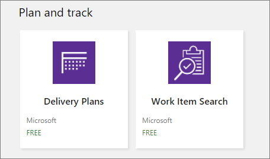
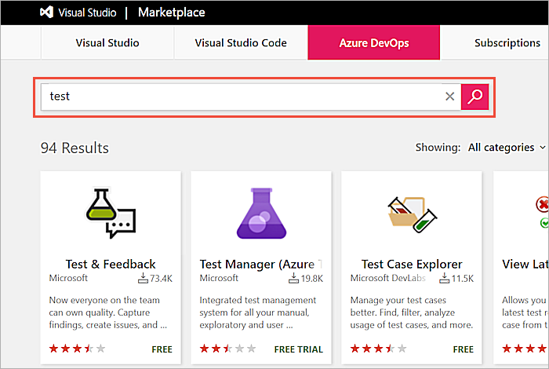
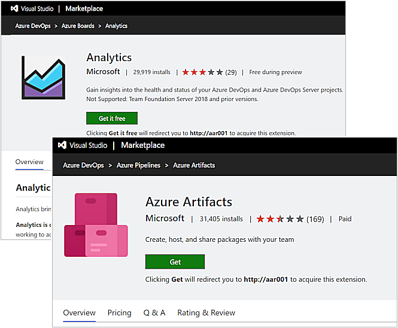

# Install extensions for on-premises servers

[!INCLUDE [version-lt-azure-devops](../includes/version-lt-azure-devops.md)]

To add new features and capabilities to your Azure DevOps Server, install extensions from the [Azure DevOps Marketplace](https://marketplace.visualstudio.com/azuredevops).

> [!TIP]
> For more information about building your own extensions, see [developing](../extend/overview.md) and [publishing](../extend/publish/overview.md) extensions.

## Prerequisites

- To install an extension, you must be a member of the **Project Collection Administrators** group or have **Edit collection-level information** permissions. Organization owners are automatically members of this group. For more information, see [Change project collection-level permissions](../organizations/security/change-organization-collection-level-permissions.md).  
- If you don't have permissions, you can [request extensions](request-extensions.md) instead.

> [!NOTE]
> To use an existing Azure subscription for billing,
> you must have at least Co-administrator permissions for that subscription. 
> If you don't have permissions, have an Azure Account Administrator 
> or Service Administrator go to the [Azure portal](https://azure.microsoft.com/) and 
> [add you as Co-administrator](/azure/billing-add-change-azure-subscription-administrator) 
> to the Azure subscription that you want to use for billing. 
> Co-administrator permissions are available only in the Azure portal.

Your project collection reuses your Azure subscription 
for future Marketplace purchases. 
[Where can I find more info about Azure billing?](faq-extensions.yml)

::: moniker range="tfs-2018"

<a name="connected-tfs"></a>

## Install extensions from the Marketplace

::: moniker-end

::: moniker range="tfs-2018"

1. From your Azure DevOps Server home page (```https://{server}:8080/tfs/```), 
   go to the project collection where you want to install the extension.

2. From your project collection, go to the Marketplace.

   

3. Find and select the extension that you want to install.

   

   Azure DevOps Server is connected to the Marketplace, so the Marketplace automatically filters and shows on-premises extensions only.

4. Select **Install**.

5. Confirm the project collection where you want to install this extension.

   

6. Finish installing your extension.

7. Assign the extension to users who need access. 
   Otherwise, you can go to your project collection to use your extension. 
   Tell your team about this extension, so they can start using its capabilities too. 

   

   [Need help?](faq-extensions.yml) 

<a name="disconnected-tfs"></a>

## Install extensions when disconnected

When disconnected from Azure DevOps Server, you can install free and preview extensions by downloading them, uploading them to your Azure DevOps Server, and then installing them in a project collection. You can't install extensions when you're disconnected from Azure DevOps Server.

### Who can upload extensions to a server?

[Team Foundation Administrators](/azure/devops/server/admin/add-administrator#add-a-user-to-the-server-administrators-group) 
with [**Edit instance-level information** permissions](../organizations/security/permissions.md#server) 
can upload extensions.

<a name="difference"></a>

### Download from the Marketplace

1. Sign in to the [Marketplace > Azure DevOps](https://marketplace.visualstudio.com/azuredevops).

2. Find the extension that you want to install.

       

      

3. Download and save your extension.

   

### Upload extension

1. Go to your home page (```https://{server}:8080/tfs/```). 

2. Browse for your downloaded extensions (```https://{server}:8080/tfs/_gallery```).

3. Manage your extensions.

   

4. Upload the extension that you downloaded.

   

   [Why can't I upload extensions?](faq-extensions.yml)

> [!TIP]
> The maximum size for upload is 25MB. If you can't work around this requirement, **Report a problem** in the [Developer Community](https://developercommunity.visualstudio.com/search?space=21).

### Install extension in your project collection

1. Select and install the extension that you uploaded. 

   

2. Choose the project collection where you want to install the extension.

   

3. Review the permissions that the extension gets when it's installed. Finish installing your extension.

   

   You can now go to your project collection to use your extension. Also, remember to tell your team about this extension, so they can start using its capabilities too. 

## Install pre-installed extensions (first-party) for disconnected TFS

>[!NOTE]
> This section is only for adding pre-installed extensions (first-party), if you're installing extensions that
> aren't pre-installed with TFS, head to the [Disconnected TFS section](#disconnected-tfs).

With first-party extensions that come pre-installed with TFS, there's an alternate method of installation that prevents compatibility issues.

In this case, you can manage extensions in disconnected TFS by completing the following steps:

1. Hover over the shopping bag and select **Manage extensions**

   

2. Once on the Extensions page, select **Browse local extensions**

   

3. Scroll down until you see the Plan and track category, which includes **Delivery Plans**. Select **Delivery Plans**.

   

4. You're redirected to a local extension page for Delivery Plans where you select **Install**. Installation works when you're both online and offline.

   

::: moniker-end

::: moniker range="> tfs-2018 < azure-devops"

<a name="connected-devops"></a>

## Install Azure DevOps Server extensions from the Marketplace

1. Open your Azure DevOps Server home page (`https://{server}:DefaultCollection`).

2. Open the extensions menu and choose **Browse Marketplace**.

   

3. Find the extension that you want to install. Use the search box to filter the list of extensions.

   

4. Select the extension and choose **Get** or **Get it free**.
   Or, for some third-party extensions, choose **Get Started** to show pricing information
   and extension-specific installation instructions.

   

   If you don't have permission to install the extension, you can request an administrator
   to install it for you. Your request is [stored in Azure DevOps Server](#review-ext)
   ready for attention from an administrator.

5. Select the project collection where you want to install this extension and choose **Install**.

   

6. After installation is complete, go to the project collection or return to the Marketplace to find other extensions. 

   

<a name="disconnected-devops"></a>

## Install Azure DevOps Server extensions from the local gallery

Several extensions are pre-installed in the local extensions gallery.
Users can install these extensions without requiring an external connection to Marketplace or the internet.

> [!TIP]
> Extensions that have previously been installed from Marketplace appear in the 
> local gallery automatically so that they can easily be installed into other project collections.

1. Open the extensions menu and choose **Manage Extensions**.

   

2. In the Extensions page, choose **Browse local extensions**

   

3. Choose the extension you want to install.

   

4. Select the project collection where you want to install this extension and choose **Install**.

   

5. After installation is complete, go to the project collection or return to the Marketplace to find other extensions. 

   

## Manage Azure DevOps Server extensions

Use the **Extensions** page to manage installed extensions.

### Disable or uninstall an extension

1. Open the extensions menu and choose **Manage Extensions**.

   

2. In the **Manage** tab, open the shortcut menu for the extension.

   

3. Choose **Disable** or **Uninstall**, as required.

<a name="review-ext"></a>

### Review and install requested extensions

1. Open the extensions menu and choose **Manage Extensions**.

   

2. Open the **Requested** tab, review requests, and approve or reject them, as appropriate.

3. Filter the list of requests by using the **Status** drop-down list at the right end of the tabs bar.

   

::: moniker-end

## Related articles

- [Uninstall or disable extensions](/azure/devops/marketplace/uninstall-disable-extensions)
- [Request extensions](request-extensions.md)
- [About permissions](../organizations/security/about-permissions.md)
