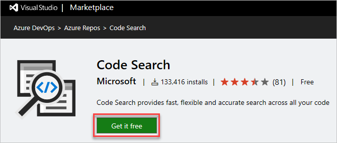
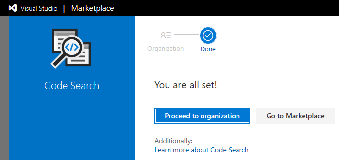
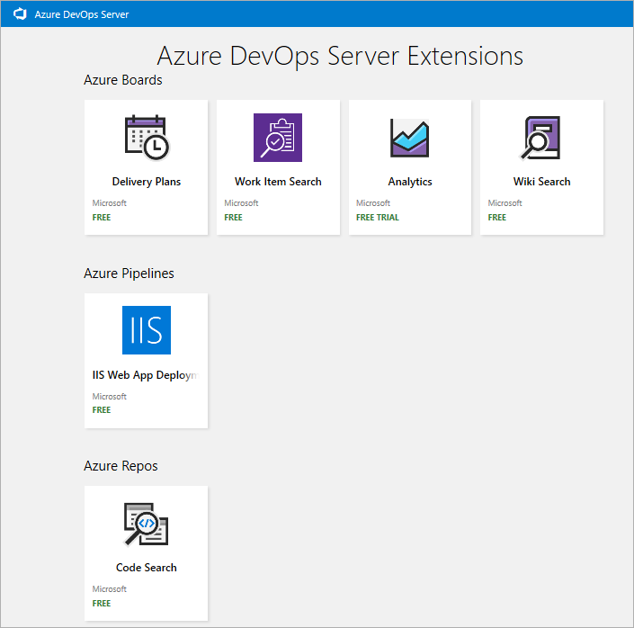

# Install extensions

[!INCLUDE [version-lt-eq-azure-devops](../includes/version-lt-eq-azure-devops.md)]

Install extensions for Azure DevOps to add new features and capabilities.

For more information about extensions, see the [developing](../extend/overview.md) and [publishing](../extend/publish/overview.md) overviews.

## Prerequisites
::: moniker range="azure-devops"
- Only Project Collection Administrators can install extensions. Organization owners are automatically members of this group. If you don't have permissions, you can [request extensions](./request-extensions.md) instead.
- Private extensions must be shared with your organization to be installed. Check out the [publishing documentation](../extend/publish/overview.md#upload) for information on how to share private extensions.
::: moniker-end

::: moniker range="< azure-devops"
- Only members of the Project Collection Administrators group or who have "Edit collection-level information" permissions can install extensions. Organization owners are automatically members of this group. If you don't have permissions, you can [request extensions](./request-extensions.md) instead.

> [!NOTE]
> To use an existing Azure subscription for billing, you must have at least co-administrator permissions for that subscription. If you don't have permissions, an Azure Account Administrator or Service Administrator can [add you as co-administrator](/azure/billing-add-change-azure-subscription-administrator) to the Azure subscription in the Azure portal.

Your project collection reuses your Azure subscription for future Marketplace purchases. 
[Where can I find more info about Azure billing?](faq-extensions.yml)
::: moniker-end
<a id="install-extension" /> 

## Install an extension

Install an extension to your organization by doing the following steps.

::: moniker range="azure-devops"
#### [Browser](#tab/browser)

1. Sign in to your organization (```https://dev.azure.com/{yourorganization}```).
2. Select the shopping bag icon, and then select **Browse Marketplace**.

   

3. Find the extension that you want to install and select **Get it free**.

    

4. Select your organization from the dropdown menu, and then select **Install** to install the extension.

    

   * [Why don't I see any organizations?](./faq-extensions.yml) 

   * [Why can't I install this extension?](./faq-extensions.yml) 

Your extension is now installed! You can now go to your organization to use your extension. Also, tell your team about this extension, so they can start using its capabilities.



#### [Azure DevOps CLI](#tab/azure-devops-cli/)

Install an extension with the [az devops extension install](/cli/azure/devops/extension#az-devops-extension-install) command. To get started, see [Get started with Azure DevOps CLI](../cli/index.md).

### Search for an extension

If necessary, first search for an extension with the `az devops extension search` command.

```azurecli
az devops extension search --search-query
```
#### Parameters

- **search-query**: Specify a term to search in the marketplace.

#### Example

The following command searches the marketplace for the term **Timetracker** and returns the *Publisher ID* and *Extension ID* in table format.  

```azurecli 
az devops extension search --search-query Timetracker --output table

Publisher Id    Extension Id    Name
--------------  --------------  -----------
7pace           Timetracker     Timetracker
7pacelabs       kitten          Kitten
```

### Install extension

```azurecli 
az devops extension install --extension-id
                            --publisher-id
                            [--org]
``` 

#### Parameters 

- **extension-id**: The name of the extension to install.
- **publisher-id**: The name of the extension publisher.
- **org**: Azure DevOps organization URL. You can configure the default organization using `az devops configure -d organization=ORG_URL`. Required if not configured as default or picked up using `git config`. Example: `--org https://dev.azure.com/MyOrganizationName/`.

#### Example 

The following command installs the **Timetracker** extension and shows the result in YAML format.  

```azurecli
az devops extension install --extension-id Timetracker --publisher-id 7pace --output yaml

baseUri: null
constraints: null
contributionTypes: null
contributions: null
demands: null
eventCallbacks: null
extensionId: Timetracker
extensionName: Timetracker
fallbackBaseUri: null
files: null
flags: null
installState:
  flags: none
  installationIssues: null
  lastUpdated: '2019-11-26T16:04:32.907000+00:00'
language: null
lastPublished: '2019-11-13T11:58:37.890000+00:00'
licensing: null
manifestVersion: null
publisherId: 7pace
publisherName: 7pace
registrationId: null
restrictedTo: null
scopes: null
serviceInstanceType: null
version: 5.0.1.34507
```

* * *
::: moniker-end

::: moniker range="> tfs-2018 < azure-devops"

1. Open your Azure DevOps Server home page (`https://{server}:DefaultCollection`).

2. Open the extensions menu and choose **Browse Marketplace**.

   

3. Find the extension that you want to install. Use the search box to filter the list of extensions.

   

4. Select the extension and choose **Get** or **Get it free**.
   Or, for some third-party extensions, choose **Get Started** to show pricing information
   and extension-specific installation instructions.

   

   If you don't have permission to install the extension, you can request an administrator
   to install it for you. Your request gets stored in Azure DevOps Server and is ready for attention from an administrator.

5. Select the project collection where you want to install this extension and choose **Install**.

   

6. After installation is complete, go to the project collection or return to the Marketplace to find other extensions. 

   

::: moniker-end

::: moniker range=" tfs-2018"

1. From your Azure DevOps Server home page (```https://{server}:8080/tfs/```), 
   go to the project collection where you want to install the extension.
2. Open the extensions menu and choose **Browse Marketplace**.
   :::image type="content" source="media/browse-marketplace2-new.png" alt-text="Screenshot showing highlighted Browse Marketplace button.":::
3. Find and select the extension that you want to install.
   :::image type="content" source="media/get-tfs-extensions/connected/marketplace-select-extension.png" alt-text="Screenshot showing selected extension example.":::
4. Select the extension, and then **Install**.
5. Confirm the project collection where you want to install this extension.
   :::image type="content" source="media/get-tfs-extensions/connected/select-team-project-collection.png" alt-text="Selection showing Project collection.":::
5. Finish installing your extension.
6. Assign the extension to users who need access. 
   Otherwise, you can go to your project collection to use your extension. 
   Tell your team about this extension, so they can start using its capabilities too. 
   :::image type="content" source="media/get-tfs-extensions/connected/assign-extension-to-users.png" alt-text="Screenshot showing installed extension confirmation.":::


### Install extensions when disconnected

When you're disconnected from Azure DevOps Server, you can install free and preview extensions. First, you [download the extension](#download-from-the-marketplace), then [upload it to Azure DevOps Server](#upload-extension-to-azure-devops), and then [install it in a project collection](#install-extension-in-your-project-collection).

#### Download from the Marketplace

1. Sign in to the [Marketplace > Azure DevOps](https://marketplace.visualstudio.com/azuredevops).
2. Find the extension that you want to install.
       

      
3. Download and save your extension.
   

#### Upload extension to Azure DevOps

1. Browse for your downloaded extensions (```https://{server}:8080/tfs/_gallery```).
2. Select **Manage extensions**.
   
3. Select **Upload new extension**.
   

   [Why can't I upload extensions?](faq-extensions.yml)

> [!TIP]
> The maximum size for upload is 25MB. If you can't work around this requirement, **Report a problem** in the [Developer Community](https://developercommunity.visualstudio.com/search?space=21).

#### Install extension in your project collection

1. Select and install the extension that you uploaded. 

   

2. Choose the project collection where you want to install the extension.

   

3. Review the permissions that the extension gets when it's installed. Finish installing your extension.

   

   You can now go to your project collection to use your extension. Tell your team about this extension, so they can start using its capabilities too. 

### Install pre-installed extensions (first-party) for disconnected TFS

>[!NOTE]
> This section is only for adding pre-installed extensions (first-party), if you're installing extensions that aren't pre-installed with TFS, see the section [Install extensions when disconnected](#install-extensions-when-disconnected).

For first-party extensions that come pre-installed with TFS, here's an alternate method of installation that prevents compatibility issues.

1. Hover over the shopping bag and select **Manage extensions**

   

2. Once on the Extensions page, select **Browse local extensions**

   

3. Scroll down until you see the "Plan and track" category, which includes **Delivery Plans**. Select **Delivery Plans**.

   

4. You're redirected to a local extension page for Delivery Plans where you select **Install**. Installation works when you're online and offline.

   

### Install extension from the local gallery

Several extensions are pre-installed in the local extensions gallery.
Users can install these extensions without requiring an external connection to Marketplace or the internet.

> [!TIP]
> Extensions that have previously been installed from Marketplace appear in the local gallery automatically so that they can easily be installed into other project collections.

1. Open the extensions menu and choose **Manage Extensions**.

   

2. In the Extensions page, choose **Browse local extensions**

   

3. Choose the extension you want to install.

   

4. Select the project collection where you want to install this extension and choose **Install**.

   

5. After installation is complete, go to the project collection or return to the Marketplace to find other extensions. 

   

::: moniker-end

## Next steps

  > [!div class="nextstepaction"]
  > [Manage extension permissions](grant-permissions.md)

## Related articles

- [Request extensions and approve extension requests](request-extensions.md)
- [Uninstall or disable extensions](uninstall-disable-extensions.md)
- [Extension FAQs](faq-extensions.yml)
