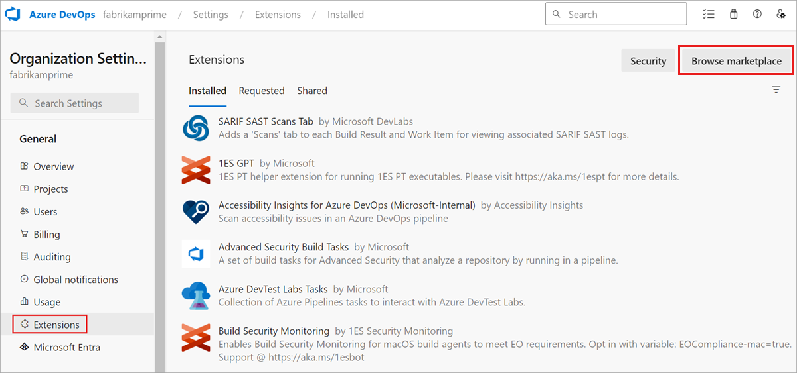

# Request and approve extensions

[!INCLUDE [version-lt-eq-azure-devops](../includes/version-lt-eq-azure-devops.md)]

If you don't have permissions to install extensions, you can request extensions instead. 
Project Collection Administrators receive an email when another project member requests an extension. Azure DevOps automatically installs the extension once it's approved.

## Prerequisites

- To request extensions, you must be a contributor for your organization.
- To approve extensions, you must be a member of the Project Collection Administrators group and have [**Edit collection-level information** permissions](../organizations/security/permissions.md#collection).

## Request an extension

::: moniker range=" azure-devops"

1. Sign in to your organization (```https://dev.azure.com/{yourorganization}```).

2. Select  **Organization settings**.

    

3. Select **Extensions**, and then **Browse marketplace**.

     

4. Select an extension to install.
5. If you don't have permission to install the extension, you can request it now.

Review your requests after the Marketplace sends the request to your Project Collection Administrator.

Your requests appear on the **Extensions** page, **Requested** tab.


::: moniker-end

::: moniker range="= azure-devops-2019 || azure-devops-2020"

1. Sign in to your organization (```https://dev.azure.com/{yourorganization}```).

2. Select  **Admin settings**.

    

3. Select **Extensions**, and then **Browse Marketplace**.

    

4. Select an extension to install.
5. If you don't have permission to install the extension, request it now.

Review your requests after the Marketplace sends the request to your Project Collection Administrator.

Your requests appear on the **Extensions** page, **Requested** tab.


::: moniker-end


To approve extensions, you must have [**edit collection-level information** permissions](../organizations/security/permissions.md#collection).

## Approve an extension request

::: moniker range=">= azure-devops-2019"

1. Go to your Azure DevOps project, ```https://dev.azure.com/{organization}/{project}```.

1. Select the shopping bag icon, and then **Manage extensions**.

   

2. Review and approve your requested extensions.

   > [!div class="mx-imgBorder"] 
   > 

   After you approve extension requests, the extensions are automatically installed.

3. [Assign those extensions](./install-extension.md) to users who need access.

::: moniker-end


Tell your team about installed extensions, so they can start using their capabilities.

## Related articles

- [FAQs](faq-extensions.yml)
- [Set up billing](../organizations/billing/set-up-billing-for-your-organization-vs.md#set-up-billing)
- [Azure DevOps pricing](https://azure.microsoft.com/pricing/details/devops/azure-devops-services/)
- [Assign access levels by group membership](../organizations/accounts/assign-access-levels-by-group-membership.md)
