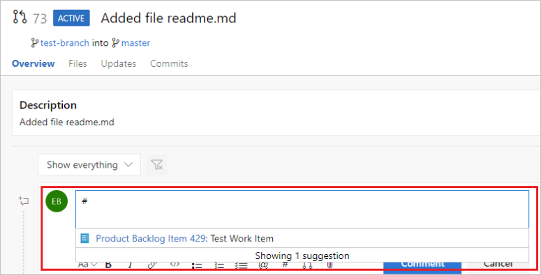
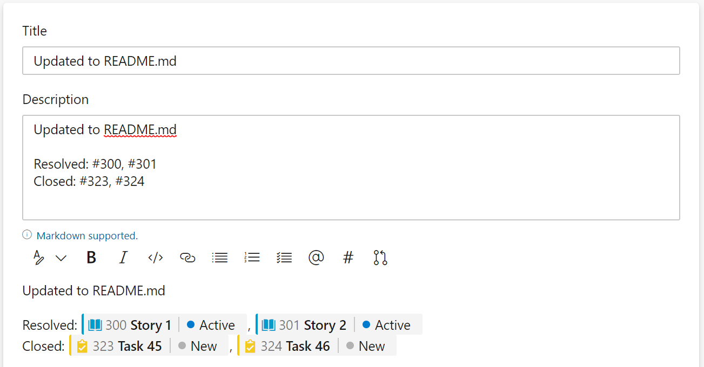

# Use #ID to link to work items  

[!INCLUDE [temp](../includes/version-ts-tfs-2015-2016.md)]

The **#ID** control quickly links objects to work items. With this control, you can specify or select a work item ID and it's automatically linked to the object. 

Use the **#ID** control within the following areas:

::: moniker range=">= azure-devops-2020"
- A work item discussion or any rich-text field
- A pull request discussion
- Commit comments
- Changeset or shelveset comments
- Wiki page. 
::: moniker-end

::: moniker range="azure-devops-2019"
- A work item discussion 
- A pull request discussion
- Commit comments
- Changeset or shelveset comments
- Wiki page. 
::: moniker-end

::: moniker range=">= tfs-2015 < tfs-2018"
- A work item discussion 
- A pull request discussion
- Commit comments
- Changeset or shelveset comments. 
::: moniker-end

<a id="mention-wit-id">  </a>

::: moniker range="tfs-2015"
> [!NOTE]  
> The **#ID** special control feature is available from TFS 2015 Update 1 and later versions.

::: moniker-end


## Link a pull request to a work item

Enter **#** to trigger the **#ID** work item picker in your pull request comment. See a list of 50 work items you've recently modified or are assigned to you.

Narrow the list of suggested work items by entering keywords that match the work item type, ID, or title.

  

To further filter the list, continue to enter keywords until you've found a match. You can enter up to five keywords.

## Link to work items in pull requests, comments, and commits

You can also use the **#ID** control in pull request discussions, commit comments, changeset comments, and shelveset comments.

::: moniker range="tfs-2015"
> [!NOTE]  
> Requires TFS 2015 Update 2 or a later version.
::: moniker-end

::: moniker range="azure-devops"

## Set work item state in pull request

When you create a PR, in the description, you can set the state value of the linked work items. You must follow the specific syntax.

``` {state value}: #ID ```
When you merge the PR, the system reads through the description and updates the work item state accordingly. In the follow example we set work items #300 and #301 to Resolved, #323 and #324 to Closed.


 
### How it works
The systems looks at three different criteria when attempting to set the state of #mentioned work items. State, State Category, and keyword. In that order.

  - **If** the value matches a state, **then** set it to that state. 
  - **Else If** the value matches a state category, **then** set the work item to first state in that category (see note below)
  - **Else If** the value matches a keyword, **then** set the work item to matching keyword state (see grid below)
  - **Else**, ignore it and do nothing

Keyword logic is to help with intent matching. For example, you might put in “Resolves” but you really meant “Resolved”. 

| Keyword   |      Action      | 
|:----------|:-------------|
| Proposed, Proposes, Propose | Set to the first state in the Proposed category  | 
| InProgress | Set to the first state in the In Progress category |
| Completed, Completes, Complete | Set to the first state in the Completed category |
| Resolved, Resolves, Resolve| Set to the first state in the Resolved category |
| Fixes, Fixed, Fix | Close work item (except Bug, that gets set to Resolved) |

> [!NOTE]  
> Category matching is not supported on projects using a Hosted XML process. It is only available for projects using an inherited process.

::: moniker-end


::: moniker range=">= tfs-2018"

## Link to work items from a Wiki page

Use the **#ID** control to link to a work item from within a Wiki page.

For more information about the built-in wiki, see [Add & edit wiki pages](../project/wiki/add-edit-wiki.md).

::: moniker-end


## Related articles

- [Link work items](../boards/backlogs/add-link.md)
- [Save work with commits](../repos/git/commits.md)
- [Pull requests](../repos/git/pullrequest.md)
- [Check in your work to the team code base](../repos/tfvc/check-your-work-team-codebase.md)

