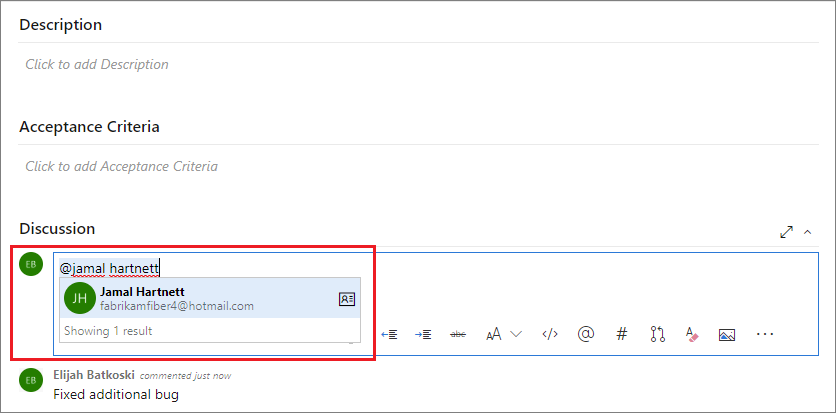
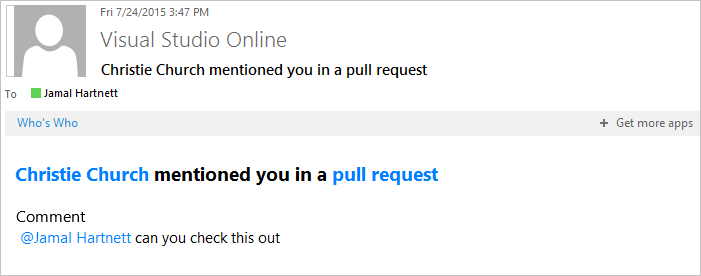

# Use &#64;mentions in work items and pull requests

[!INCLUDE [temp](../_shared/version-ts-tfs-2015-2016.md)]

The **@mention** control allows you to quickly pull someone into a work item or pull request.

::: moniker range="tfs-2015"
> [!NOTE]  
> The **@mention** control is available from TFS 2015 Update 2 and later versions.
::: moniker-end

::: moniker range=">= tfs-2015 <= azdevserver-2019"

For team members to receive notifications, [you must configure an SMTP server](/tfs/server/admin/setup-customize-alerts).

::: moniker-end

When you're leaving a code comment in a pull request, you can enter **@** to trigger the **@mention** identity picker. From the identity selector, you see a list of those people that you've recently mentioned. Choose one of those names or enter the name of the person you are looking for to perform a directory search.  

To filter the list, enter the user name or alias until you've found a match.

  

::: moniker range=">= tfs-2018"
You can also use group mentions. Enter the name of a team or a security group, choose the search icon and then select from the options listed.
::: moniker-end

To **@mention** a user you've never selected previously, just continue to enter the entire name to perform your search against the full directory.  

Names of those that you mention appear in blue text. Choose the**@mention link name** to open the user's contact card, which can provide you additional context for why they were pulled into the conversation.  

  

Upon completion of your selection and text entry, your **@mention** user receives an email alerting them about the mention.  

Use the **@mention** control in pull request discussions, commit comments, changeset comments, and shelveset comments. You can also use the **@mention** control in any text field on the work item form.

## Related articles

- [Work item form controls](../boards/work-items/work-item-form-controls.md)  
- [Pull requests](../repos/git/pullrequest.md)
