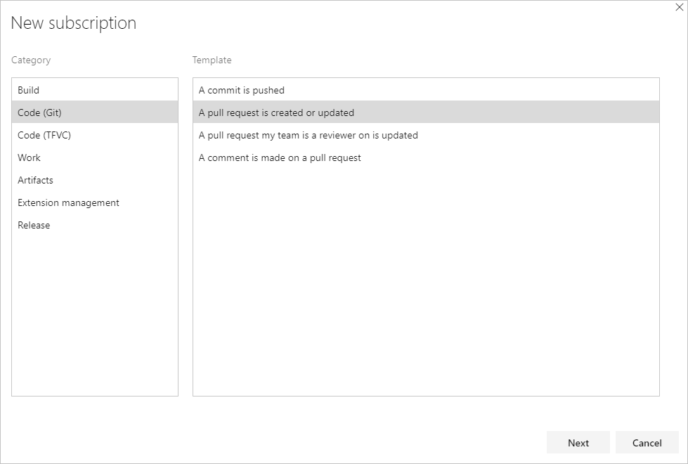
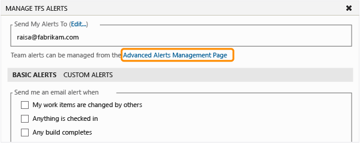
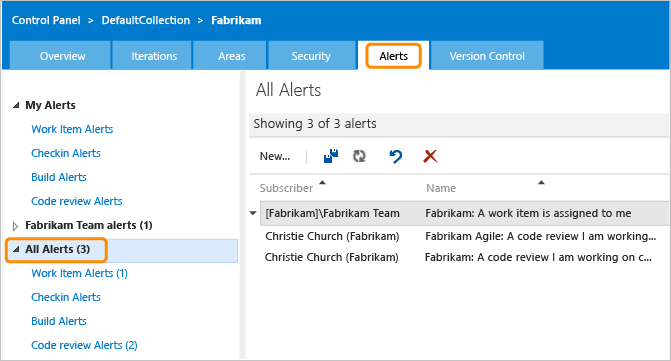
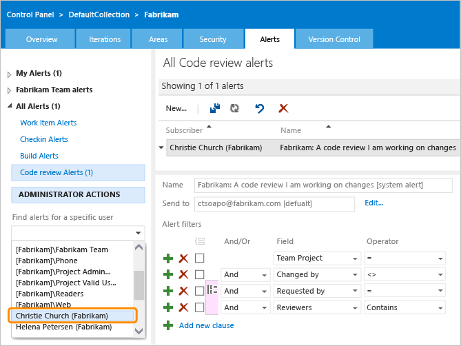

# Manage notifications for a team or group

[!INCLUDE [version-vsts-tfs-2017-on](../includes/version-tfs-2017-through-vsts.md)]

As changes occur to work items, code reviews, pull requests, source control files, and builds, your team or group can be notified via email. For example, when a high priority work item is assigned to your team's area path, an email can be sent to the team.


::: moniker range="tfs-2017"

[!INCLUDE [note-earlier-tfs-version](includes/note-earlier-tfs-version.md)]

::: moniker-end

::: moniker range=">= tfs-2017"

## Create a custom email subscription

A subscription lets you control what your team should be notified about and how the team receives those notifications.

[!INCLUDE [note-smtp-server](includes/note-smtp-server.md)]

1. Open the Notifications page under team settings: `https://dev.azure.com/{organization}/{project}/_admin/_notifications?view=contents`

    ::: moniker-end
    ::: moniker range=">= azure-devops-2019"  

     

    ::: moniker-end

::: moniker range=">= tfs-2017 <= tfs-2018" 

> [!div class="mx-imgBorder"] 
> 

::: moniker-end

2. Select **New subscription**. If you're not a team administrator, [get added as one](../organizations/settings/add-team-administrator.md). You need to be a team, project, or project collection administrator to create team alerts.

    ::: moniker range=">= azure-devops-2019"

     

	::: moniker-end

    ::: moniker range=">= tfs-2017 <= tfs-2018"

   

	::: moniker-end

3. Select the type of activity you want your team to be notified of.

   ::: moniker range="azure-devops"

   

   ::: moniker-end

   ::: moniker range="<= azure-devops-2019"

    

   ::: moniker-end
   ::: moniker range=">= tfs-2017"

4. Provide a description to help you identify the subscription later.

    

5. Choose which team members should receive a notification:

    

   You can choose one of the following delivery options:
   * **Team members by role**: only certain team members associated with the event are notified. For example, for work item changes, you might only want the current assignee of the work item to receive a notification.
   * **Team preference**: use the team's default delivery preference. Learn how to [manage delivery settings below.](#manage)
   * **Custom email address**: send an email to a specified email address.
   * **All team members**: send an individual email to each member of the team.

   For certain activities and when **Team members by role** is selected, you can choose to have the user that initiated the activity receive a notification. This is controlled by the **Skip initiator** checkbox. By default, this box is checked meaning the user that initiates the change is not notified about it.

6. Choose whether you want to receive notifications about activity in all projects or only a specific project.

    

7. Optionally configure additional filter criteria.

    

8. Select **Finish** to save the new subscription.

   ::: moniker-end

<a name="manage" />

::: moniker range=">= tfs-2017"

## Manage team delivery settings

Choose the default method for your team to receive notifications by updating the **team delivery settings**.

::: moniker-end

[!INCLUDE [note-smtp-server](includes/note-smtp-server.md)]

::: moniker range=">= tfs-2017"

1. Open the Notifications page under team settings: `https://dev.azure.com/{organization}/{project}/_admin/_notifications?view=contents`

   

2. Choose **Delivery settings**:

   

3. Choose which option best fits your team's needs:  

    

Your team delivery settings are updated for notifications.

## Manage group delivery settings

Manage your group notifications by updating the group's **Delivery settings**.

1. Sign in to your organization (```https://dev.azure.com/{yourorganization}```).
2. Select  **Organization settings**.
  

3. Select **Global notifications** > **Subscribers**, enter and find your group, and then select **Delivery settings**.

    

4. Choose which option best fits your group's needs, and then select **Save**.  

    

Your group delivery settings are updated for notifications.

::: moniker-end


<a id="team-alerts"></a>


::: moniker range="<= tfs-2015"

## Set alerts for your team

1. If you're not a team administrator, [get added as one](../organizations/settings/add-team-administrator.md). You need to be a team, project, or project collection administrator to create team alerts. 

2. Open team alerts from Manage TFS Alerts.

   

3. Expand the team and open Select New Alert Template. 

	

4. Choose an alert type. 

	

5. Notice how the subscriber is set to the team context. Alerts are sent to each team member based on their preferred email address, which they set through their profile.
	
	

   > [!TIP]
   > For the team context, the alert query interprets the <strong>@Me</strong>  variable as anyone who is a member of the team.

You can set filters for as many as 20 different alert types, specify the email addresses for yourself and other team members, and select the delivery format. Also, you can set team alerts to keep all team members notified of important changes. 

## Administer alerts for a project

To administer alerts for a project, you must be a member of the Project Collection Administrator or Team Foundation Administrator groups. To get added, see [Add an administrator](../organizations/security/set-project-collection-level-permissions.md). If you're not a member of these groups, you won't see the options available for administering alerts.

As an administrator, you can view, create, edit, and delete alerts for team members and teams. 

### View alerts set for a project 

* From the web admin page for a project, open the Alerts tab and expand All alerts. 

	

### Find alerts set for a team member or team

* Choose the name of the team member from the drop down list, or type the name in the search box. 

	

	

### Create, edit, or delete an alert

1. To create an alert for a team member, first find the alerts defined for that subscriber as described in the previous step. Then, create an alert in the same way that a team member creates alerts. 

	

	To create an alert for a team, first find the alerts assigned to that team, and then create an alert in the same way. The team should appear in the Subscriber field. 

2. To edit or delete an alert, open it from the short cut menu.

	

::: moniker-end

## Related articles

* [Manage personal notification settings](manage-your-personal-notifications.md)