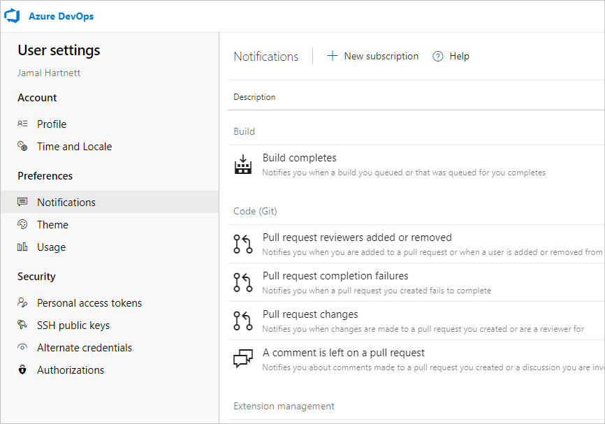
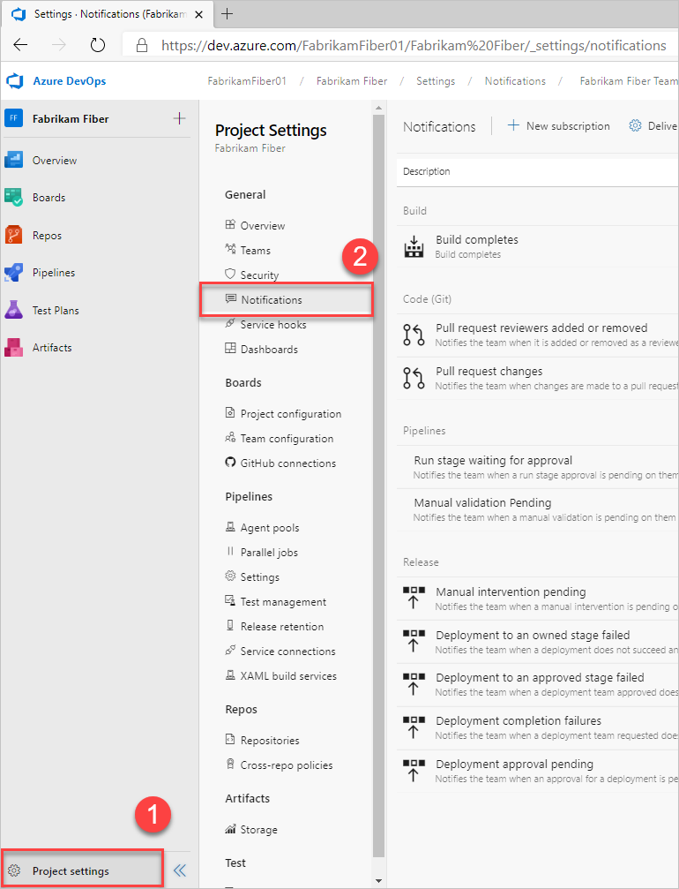
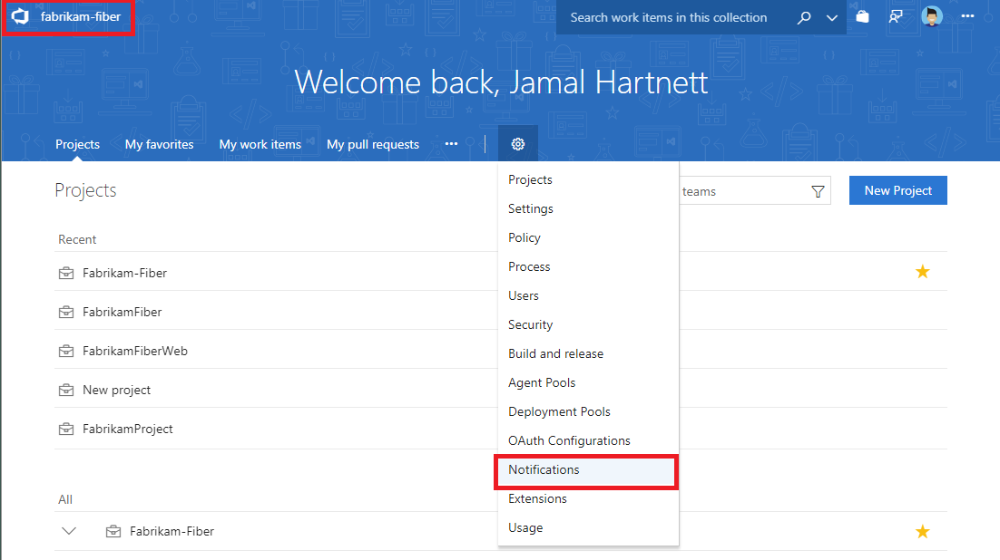

# Access notification settings

[!INCLUDE [version-vsts-tfs-2017-on](../includes/version-tfs-2017-through-vsts.md)]

Learn about navigating the notifications user interface.

> [!NOTE]  
> This article applies to Azure DevOps, TFS 2017 Update 1 and later versions. For information on TFS 2017 and earlier versions, see [Manage personal notifications](manage-your-personal-notifications.md) and select the TFS 2015 content version. 

## Notifications settings

You can set notifications at the following four levels:

* Personal
* Team
* Project
* Organization or collection (organization for the cloud and project collection for on-premises)

[!INCLUDE [note-smtp-server](includes/note-smtp-server.md)]


## Prerequisites

* Each user can manage their personal notifications
* To manage team notifications, you must be added as a [team administrator](../organizations/settings/add-team-administrator.md) or be a member of a [Project Administrator Group or Project Collection Administrators group](../organizations/security/set-project-collection-level-permissions.md)
* To manage project-level notifications, you must be a member of the  [Project Administrator Group or Project Collection Administrators group](../organizations/security/set-project-collection-level-permissions.md)
* To manage organization notifications, you must be a member of the [Project Collection Administrators group](../organizations/security/set-project-collection-level-permissions.md). 

For additional permission settings regarding notifications, see [Permissions and groups, Notifications or alerts](../organizations/security/permissions.md#notifications-or-alerts).


<a id="open-person-level" />

## Open your personal notifications 

Enter the following URL to reach your personal notifications page, replacing {organization} with your organization's name. 

::: moniker range="azure-devops"

```URL
https://dev.azure.com/{organization}/usersSettings/notifications
```

  



::: moniker-end

::: moniker range=">= azure-devops-2019 < azure-devops"

```URL
https://dev.azure.com/{organization}/_notifications
```

> [!div class="mx-imgBorder"] 
>  

> [!div class="mx-imgBorder"] 
>

::: moniker-end

::: moniker range="<= tfs-2018"

```URL
https://dev.azure.com/{organization}/_notifications
```

> [!div class="mx-imgBorder"] 
>

::: moniker-end


## Open team or project level notifications

Enter the following URL to reach a team or project-level notifications page, replacing {organization} and {project} with your organization's and project's name. 

::: moniker range=">= tfs-2018" 

```URL
https://dev.azure.com/{organization}/{project}/_settings/notifications
```

> [!div class="mx-imgBorder"]  
>   

::: moniker-end

::: moniker range="< tfs-2018"  

```URL
https://dev.azure.com/{organization}/{project}/_admin/_notifications
```

> [!div class="mx-imgBorder"] 
> 

> [!div class="mx-imgBorder"] 
> 

   ::: moniker-end

<a id="open-org-level" />

## Open Global notifications

::: moniker range="azure-devops" 


1. Enter the following URL to reach the organization-level notifications page, replacing *OrganizationName* with your organization's name. 

	```URL
	https://dev.azure.com/OrganizationName/_settings/notifications
	```

	Or, choose the :::image type="icon" source="../media/icons/project-icon.png" border="false"::: project icon and then choose **Organization settings**. 

	:::image type="content" source="../media/settings/open-org-settings-s172.png" alt-text="Open Organization settings":::

1. Choose **Global Notifications**.  

	:::image type="content" source="media/nav-ui/org-notifications-s172.png" alt-text="Open Global Notifications":::

::: moniker-end

::: moniker range=">= azure-devops-2019 < azure-devops" 

## Open collection-level notifications

Enter the following URL to reach the organization-level notifications page, replacing *ServerName* and *CollectionName* with your instance name. 

1. Enter the following URL to reach the organization-level notifications page, replacing *OrganizationName* with your organization's name. 

	```URL
	http://ServerName/CollectionName/_settings/notifications?view=defaultSubscriptions
	```

	Or, choose the :::image type="icon" source="../media/icons/project-icon.png" border="false"::: project icon and then choose **Collection settings**. 

	:::image type="content" source="../media/settings/open-collection-settings-2020.png" alt-text="Open Collection settings":::

1. Choose **Global Notifications**.  

	:::image type="content" source="media/nav-ui/collection-notifications-2020.png" alt-text="Open Global Notifications":::

::: moniker-end


::: moniker range="<= tfs-2018" 

```URL
https://dev.azure.com/{organization}/_admin/_notifications
```

> [!div class="mx-imgBorder"] 
>  

> [!div class="mx-imgBorder"] 
>  

::: moniker-end

## Related articles

- [Manage personal notification settings](manage-your-personal-notifications.md)
- [Follow a specific work item](../boards/work-items/follow-work-items.md)  
- [Manage notifications for a team](manage-team-notifications.md)  
- [Change your preferred email address](change-email-address.md)