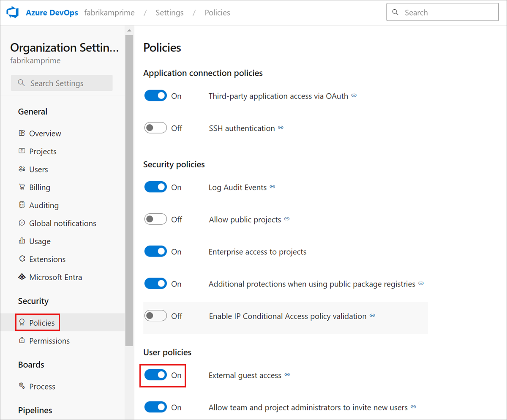
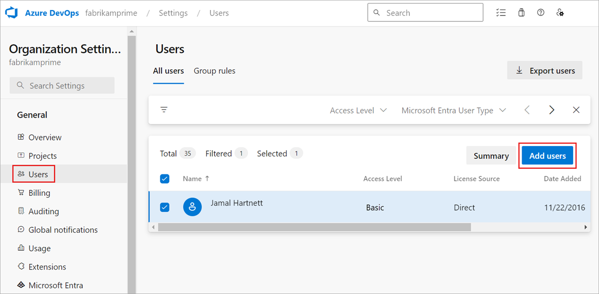

# Add external users to your organization

[!INCLUDE [version-vsts-only](../../includes/version-vsts-only.md)]

Learn how to invite external users to your organization. If you access Azure DevOps via Azure Active Directory (Azure AD), you must add the identities of those users to your Azure AD. Doing so also grants the users additional privileges. For more information, see [additional organization-level resources](../projects/resources-granted-to-project-members.md).

## Prerequisites


* You must be a member of the Project Collection Administrators or Project Administrators group for the organization that you want to invite external users to.

* The Azure AD tenant, to which you want to invite external users, must allow adding new users, per your Azure AD guest policies. For more information, see [how to become eligible to invite external users on your Azure AD tenant](/azure/active-directory/active-directory-b2b-delegate-invitations).

* The user policy, **External guest access**, must be **On** for the organization that you want to invite external users to. See the following image example.
* Team and Project Administrators can only invite external users if the user policy, **Allow team and project administrators to invite new users**, is **On**. For more information, see [Restrict invitations from Project and Team Administrators](../security/restrict-invitations.md).



> [!TIP]
> We recommend using a different email or user principal name (UPN) for your personal and business accounts, rather than using the same, even though it's allowed. This eliminates the challenge of disambiguating between your business and personal accounts when the email/UPN is the same.

## Invite external user

1. Sign in to your organization (```https://dev.azure.com/{yourorganization}```).

2. Select  **Organization settings**.

   

3. Select **Users**, and then select **Add users**.
   
   

4. Complete the form based on the following guidance, and then select **Add**.

    - **Users**: Enter the email address for the user. You can add several email addresses by separating them with a semicolon (;). For Microsoft accounts (MSAs), the email addresses display in red.
    - **Access level**: You can add up to five users with *Basic* access. You're included as one of the five users. Otherwise, you can add an unlimited number of users with *Stakeholder* access. In public projects, both Stakeholder and Basic access levels grant full access to **Code**, **Work**, and **Build and Release**. But, Stakeholders only get partial access to **Test** and **Dashboards**. For more information, see [Default roles & access for public projects](../public/default-roles-access-public.md).
    - **Add to projects**: Select each public project that you want to add the user to.  
    - **Azure DevOps Groups**: Leave this entry at Project Contributors, the default security group for people who contribute to your project. To learn more, see [Default permissions and access assignments](../security/permissions-access.md).
    - **Send email invites**: Check this box to invite your new users via their email addresses.

    :::image type="content" source="../public/media/invite-users/add-new-users-dialog.png" alt-text="Add new users dialog":::

5. Advise the external user to locate the email that they received from AzureDevOps@microsoft.com with the subject, **You have been invited to an Azure DevOps project** and select **Join now**. This final step adds the user to your organization. The invitation looks similar to the following image.

    :::image type="content" source="media/add-external-user/external-user-email-invitation.png" alt-text="External user's invitation email":::

>[!Note]
>If you need to resend the invitation email, go to **Users**, select the user, and then select **Resend invite**.

The external user is added to the organization to which they were invited and has immediate access.

A guest user can add other guest users to the organization after being granted the Guest Inviter role in Azure AD.

## Related articles

* [What is Azure AD B2B collaboration?](/azure/active-directory/active-directory-b2b-what-is-azure-ad-b2b)
* [Migrate to group-based resource management](./assign-access-levels-by-group-membership.md)
* [Assign access levels to users by group membership](assign-access-levels-by-group-membership.md)
* [Restrict invitations to new users](../security/restrict-invitations.md)
