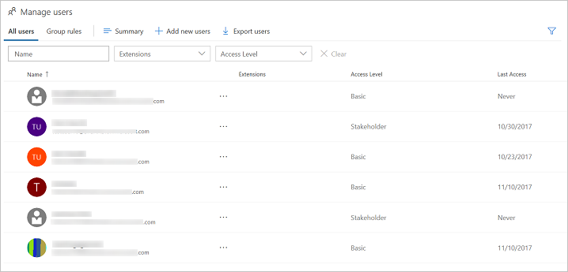
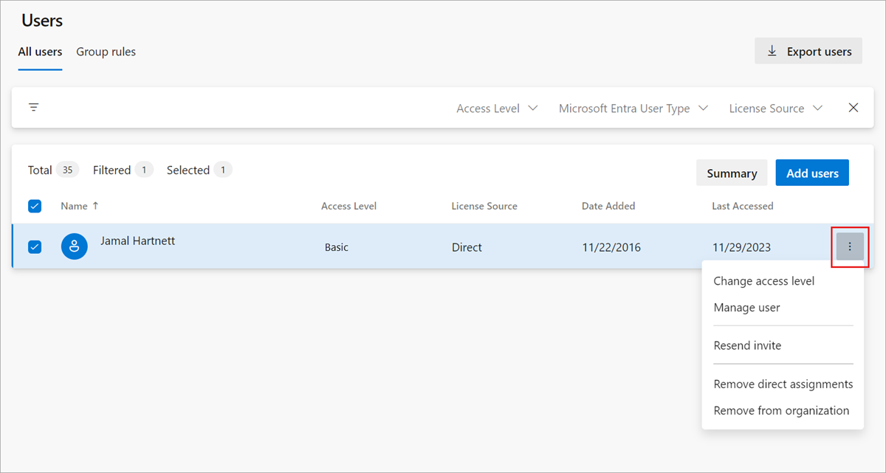

# Add users and manage access in Azure DevOps

[!INCLUDE [version-vsts-only](../../includes/version-vsts-only.md)]

This article describes how to add and manage user access through Direct assignment for Azure DevOps Services. For an overview of adding users and related concepts, see [About organization management in Azure DevOps](organization-management.md).

The following types of users can join your organization for free:

* Five users who get [Basic features](https://azure.microsoft.com/services/devops/compare-features/), such as version control, tools for Agile, Java, build, release, and more
* Unlimited users who get [Stakeholder features](https://azure.microsoft.com/services/devops/compare-features/), such as working with your backlog, work items, and queries
* Unlimited [Visual Studio subscribers](https://azure.microsoft.com/services/devops/compare-features/) who also get Basic features. Additional features, such as [Azure Test Plans](https://azure.microsoft.com/services/devops/test-plans/), can be assigned to users by access level, Basic + Test Plans.

[Need more users with Basic features?](../billing/buy-basic-access-add-users.md)

## Prerequisites

You must have Project Collection Administrator or organization Owner permissions in Azure DevOps. For more information, see [Set permissions at the project level or project collection level](../security/set-project-collection-level-permissions.md?toc=/azure/devops/organizations/accounts/toc.json&bc=/azure/devops/organizations/accounts/breadcrumb/toc.json).

## Add users to your organization

Administrators can now add users to an organization, grant access to appropriate tooling extensions and service access level,
and add users to groups all in one view. You can add up to 50 users at once. You can add more than 50 users by repeatedly
using this Users view. When you add users, each user receives a notification email with a
link to the organization page.

 > [!NOTE]
 > If you have an Azure Active Directory (Azure AD)-backed organization, and you need to add users who are external to Azure AD, first [add external users](add-external-user.md). On the **Tell us about this user page**, under **Type of user**, be sure to choose **User with an existing Microsoft account**. After you complete those steps, use the following steps to add the Azure AD
 > user to Azure DevOps.


#### [Browser](#tab/browser)

To give other users access to your organization, add their email addresses.

1. Sign in to your organization (```https://dev.azure.com/{yourorganization}```).

2. Select  **Organization settings**.

    

3. Select **Users**, and then select **Add users**.
   
   

4. Enter information into the form.

   > [!div class="mx-imgBorder"]  
   >

   - **Users:** Enter the email addresses (Microsoft accounts) or GitHub usernames for the users. You can add several email addresses by separating them with a semicolon (;). An email address appears in red when it's accepted. For more information about GitHub authentication, see [FAQs](../security/faq-github-authentication.md).
   - **Access level:** Leave the access level as **Basic** for users who will contribute to the code base. To learn more, see [About access levels](/azure/devops/organizations/security/access-levels).  
   - **Add to projects:** Select the project you want to add them to.  
   - **Azure DevOps Groups:** Leave as **Project Contributors**, the default security group for users who will contribute to your project. To learn more, see [Default permissions and access assignments](/azure/devops/organizations/security/permissions-access).  

	> [!NOTE]  
	> Add email addresses for [personal Microsoft accounts](https://account.microsoft.com/account) and IDs for GitHub accounts unless you plan to use [Azure Active Directory (Azure AD)](https://azure.microsoft.com/documentation/articles/active-directory-whatis/) to authenticate users and control organization access. If a user doesn't have a Microsoft or GitHub account, ask the user to [sign up](https://signup.live.com/) for a Microsoft account or a GitHub account.  
5. Select **Add** to complete your invitation.


<!---
Go to Users:


Choose **Add new users** below "Manage users".



Then fill in the "Add new users" dialog:


Next steps: [Manage users in table view](manage-users-table-view.md)
-->

#### [Azure DevOps CLI](#tab/azure-devops-cli/)

[Add a user](#add-user) | [List users](../security/export-users-audit-log.md#list-users) | [Remove a user](delete-organization-users.md#remove-user) | [Update a user](manage-users-table-view.md#update-user) | [Show users](manage-users-table-view.md#show-users)


<a id="add-user" /> 

### Add a user 

You can add users to an organization by using the [az devops user add](/cli/azure/ext/azure-devops/devops/user#ext-azure-devops-az-devops-user-add) command. To get started, see [Azure DevOps CLI](../../cli/index.md).

```CLI
az devops user add –-email-id 
		   --license-type {advanced, earlyAdopter, express, professional, stakeholder}
		   [--send-email-invite {false, true}]
           [--org]
```

#### Parameters

- **email-id**: Required. Enter the Microsoft account's email address for the user organization.
- **license-type**: Required. Enter stakeholder, express, professional, or advanced based on the mapping provided in the following table. For Users who contribute to the code base require express or higher level of license-type. To learn more, see [About access levels](../../organizations/security/access-levels.md).
- **send-email-invite**: Optional. Specify whether to send email invite for new user or not.
- **org**: Azure DevOps organization URL. You can configure the default organization using `az devops configure -d organization=ORG_URL`. Required if not configured as default or picked up using `git config`. Example: `--org https://dev.azure.com/MyOrganizationName/`.

The following table provides a mapping of the access level selected through the user interface and the `AccountLicenseType` parameter.

| Access level (user interface)| AccountLicenseType | 
| --------------------------|---------------------|
| Stakeholder | stakeholder | 
| Basic              | express  |  
| Basic + Test Plans | advanced | 

 > [!NOTE]   
 > The `earlyAdopter` AccountLicenseType is an internal value used solely by Microsoft.  


#### Example

The following command adds the user with the email address contoso@contoso.com to your organization. It grants stakeholder level access to the user and shows the result in table format.

```CLI
az devops user add --email-id contoso@contoso.com --license-type stakeholder --output table

ID                                    Display Name          Email                 License Type    Access Level    Status

------------------------------------  --------------------  --------------------  --------------  --------------  --------
35b1952b-ca8c-45b5-a60c-d6b0086aa584  contoso@contoso.com   contoso@contoso.com   stakeholder     Stakeholder     pending 
```

You can also add the user to a Azure DevOps Group- Project Contributors, the default security group for people who contribute to your project. To learn more, see [Default permissions and access assignments](https://docs.microsoft.com/azure/devops/organizations/security/permissions-access?view=azure-devops).

```CLI
az devops security group membership --group-id vssgp.Uy0xLTktMTU1MTM3NDI0NS0xMTM1NzQ1NzUzLTExNDI0NTQwOTQtMjQ4MjkwODAwNS0xNDU4NjAwODE1LTEtMTY5NTI2NTAyNi00MjM0Mzc1NS0yMTY5ODM4OTczLTI0NDk3NzU5NDE --member-id contoso@contoso.com
```

You can see all security groups in a project using the [az devops security group list](/cli/azure/ext/azure-devops/devops/security/group#ext-azure-devops-az-devops-security-group-list) command.

## Related articles

* [Connect to a project](../../organizations/projects/connect-to-projects.md)
* [Change individual permissions, grant select access to specific functions](../../organizations/security/change-individual-permissions.md)
* [Grant or restrict access to select features and functions](../../organizations/security/restrict-access.md)
* [Delete users from Azure DevOps](delete-organization-users.md)
* [Export a list of users and their access levels](../security/export-users-audit-log.md)


---
title: Manage users and access levels
titleSuffix: Azure DevOps Services
description: Add users and assign access levels on the Users page in Azure DevOps
ms.technology: devops-accounts
ms.assetid: 9f142821-1772-413f-a0e0-9b47b11a410f
ms.topic: conceptual
ms.author: chcomley
author: chcomley
ms.date: 12/18/2019
monikerRange: 'azure-devops'
---
# Manage users and their access in Azure DevOps

[!INCLUDE [version-vsts-only](../../includes/version-vsts-only.md)]

Learn how to add users to your organization and specify the level of features they can use, such as Basic or Stakeholder.

The following types of users can join your organization for free:

* Five users who get [Basic features](https://azure.microsoft.com/services/devops/compare-features/), such as version control and tools for Agile, Java, and build and release management.
* Unlimited users who get [Stakeholder features](https://visualstudio.microsoft.com/team-services/compare-features/), such as working with your backlog, work items, and queries.
* Unlimited [Visual Studio subscribers](https://visualstudio.microsoft.com/team-services/compare-features/) who also get Basic features.

Need [more users with Basic features or Visual Studio subscriptions](../billing/buy-basic-access-add-users.md)?

> [!NOTE]
> You can add people to projects instead of to your organization. Users are automatically assigned [Basic features](https://azure.microsoft.com/pricing/details/devops/azure-devops-services/) if your organization has seats available, or [Stakeholder features](https://azure.microsoft.com/pricing/details/devops/azure-devops-services/) if not. Learn [how to add members to projects](add-team-members.md).
>
> When people don't need access to your organization anymore, [delete them](delete-organization-users.md) from your organization.

To learn more, read [about access levels](../security/access-levels.md).

[!INCLUDE [prerequisites-add-users-org](../../includes/prerequisites-add-users-org.md)]

## Manage users
From your web browser you can view and edit certain user information. From the Azure DevOps CLI command, you can see details about a specific user and update their access level.

The Users view shows key information per user in a table. In this view, you can do the following tasks:

* See and modify assigned service extensions and access levels.
* Multi-select users and bulk edit their extensions and access.
* Filter by searching for partial user names, access level, or extension names.
* See the last access date for each user. This can help you choose users to remove access from or lower access to stay within your license limits.

> [!NOTE]   
> To enable the new user interface for the New user hub, see [Enable preview features](../../project/navigation/preview-features.md).

#### [Preview page](#tab/preview-page) 

1. Sign in to your organization (```https://dev.azure.com/{yourorganization}```).

2. Select  **Organization settings**.

   

3. Select **Users**.

   

4. Select a user or group of users. Then, select the **...** icon at the end of the **Name** column to open the context menu.

    In the context menu, select one of the following options:

   * **Change access level**
   * **Manage user**
   * **Resend invite**
   * **Remove direct assignments**
   * **Remove from organization** (deletes user)

     

5. **Save** your changes.

#### [Current page](#tab/current-page)

1. Sign in to your organization (```https://dev.azure.com/{yourorganization}```).

2. Select  **Organization settings**.

   

3. Select **Users**.

4. Select a user or group of users. Then, select the **...** icon at the end of the **Name** column to open the context menu.

    In the context menu, select one of the following options:

   * **Change access level**
   * **Manage user**
   * **Resend invite**
   * **Remove direct assignments**
   * **Remove from organization** (deletes user)

     

5. **Save** your changes.

#### [Azure DevOps CLI](#tab/azure-devops-cli)

[Add a user](add-organization-users.md#add-user) | [List users](../security/export-users-audit-log.md#list-users) | [Remove a user](delete-organization-users.md#remove-user) |[Update a user](#update-user) | [Show users](#show-users)

<a id="update-user" /> 

### Update a user

You can update a user's license type with the [az devops user update](/cli/azure/ext/azure-devops/devops/user#ext-azure-devops-az-devops-user-update) command. To get started, see [Get started with Azure DevOps CLI](../../cli/index.md). 

```CLI
az devops user update  --license-type {advanced, earlyAdopter, express, professional, stakeholder}
                      --user [--org]
```

#### Parameters

- **license-type**: License type for the user. Accepted values are advanced, earlyAdopter, express, professional, and stakeholder.
- **user**: The email address or ID of the user.  
- **org**: Azure DevOps organization URL. You can configure the default organization using `az devops configure -d organization=ORG_URL`. Required if not configured as default or picked up using `git config`. Example: `--org https://dev.azure.com/MyOrganizationName/`.


#### Example

The following command updates the license type for email address contoso@contoso.com from **Basic** to **Stakeholder** and shows the result in table format.

```CLI
az devops user update --license-type stakeholder --user contoso@contoso.com --output table

ID                                    Display Name         Email                License Type    Access Level    Status
------------------------------------  -------------------  -------------------  --------------  --------------  --------

35b1952b-ca8c-45b5-a60c-d6b0086aa584  contoso@contoso.com  contoso@contoso.com  stakeholder     Stakeholder     pending
```

<a id="show-users" /> 

### Show users

You can show details for users in your organization with the [az devops user show](/cli/azure/ext/azure-devops/devops/user#ext-azure-devops-az-devops-user-show) command. To get started, see [Azure DevOps CLI](../../cli/index.md).

```CLI
az devops user show --user [--org]
```

#### Parameters

- **user**: The email address or ID of the user.
- **org**: Azure DevOps organization URL. You can configure the default organization using `az devops configure -d organization=ORG_URL`. Required if not configured as default or picked up using `git config`. Example: `--org https://dev.azure.com/MyOrganizationName/`.
- 
#### Example

The following command returns user details for the email address contoso@contoso.com in table format.

```CLI
az devops user show --user contoso@contoso.com --output table

ID                                    Display Name         Email                License Type    Access Level    Status
------------------------------------  -------------------  -------------------  --------------  --------------  --------

35b1952b-ca8c-45b5-a60c-d6b0086aa584  contoso@contoso.com  contoso@contoso.com  stakeholder     Stakeholder     active
```

* * *

#### How is *access* different from *permissions*?

Access levels control which features are available to users. Permissions control a user's access to organization resources. To learn more, see [Default permissions and access](../../organizations/security/permissions-access.md).

## Related articles

* [Connect to a project](../../organizations/projects/connect-to-projects.md)
* [Change individual permissions or grant select access to specific functions](../../organizations/security/change-individual-permissions.md)
* [Grant or restrict access to select features and functions](../../organizations/security/restrict-access.md)
* [Delete users from Azure DevOps](delete-organization-users.md)
* [Export a list of users and their access levels](../security/export-users-audit-log.md)

