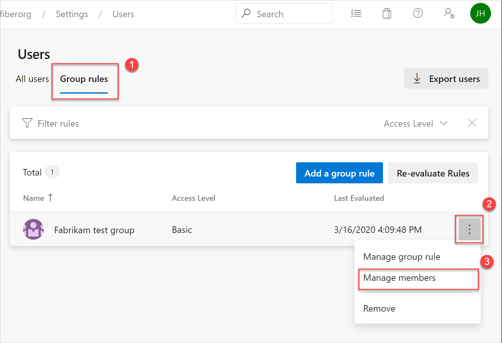

# Add a group rule to assign access levels

[!INCLUDE [version-eq-azure-devops](../../includes/version-eq-azure-devops.md)]

Azure DevOps offers group-based access levels for Microsoft Entra groups and Azure DevOps groups. In this article, learn how to add a group rule to assign an access level to that group. Azure DevOps resources get assigned to all members of a group.

Assign group rules to support both access levels and project memberships. Users get the highest access level when they're assigned to more than one rule or Microsoft Entra group, which specify different levels of access. For example, if John is assigned to two Microsoft Entra groups and two different Group rules that specify Stakeholder access and the other Basic access, then John's access level is Basic. 

When users leave the Microsoft Entra group, Azure DevOps automatically removes them.

[!INCLUDE [note-group-rules](../security/includes/note-group-rules.md)]

## Prerequisites

- To manage group rules, you must be a member of the **Project Collection Administrators** group. If you're not a member, [get added as one](../security/change-organization-collection-level-permissions.md).

## Add group rule

1. Sign in to your organization (```https://dev.azure.com/{yourorganization}```).

2. Select  **Organization settings**.

   

3. Select **Permissions**, and then verify that you're a member of the **Project Collection Administrators** group.

   

4. Select **Users**, and then select **Group rules**. This view shows you all of your created group rules. Select **Add a group rule**.

   

	**Group rules** appear only if you're a member of the **Project Collection Administrators** group.  

5. Complete the dialog box for the group for which you want to create a rule. Include an access level for the group and any optional project access for the group. Select **Add**.

   

   A notification displays, showing the status and outcome of the rule. If the assignment couldn't be completed, select **View status** to see the details.

   

> [!IMPORTANT]
> - Group rules only apply to users without direct assignments and to users added to the group going forward. [Remove direct assignments](#remove-direct-assignments) so the group rules apply to those users.
> - Users don't appear in **All users** until they attempt to sign in for the first time.
> - Visual Studio Subscribers are always directly assigned via the [Visual Studio Admin Portal](https://manage.visualstudio.com/) and take precedence in Azure DevOps over access levels assigned directly or via group rules. When viewing these users from the Users Hub, the License Source always shows as Direct. The only exception are Visual Studio Professional subscribers who are assigned Basic + Test Plans. Since Basic + Test Plans provides more access in Azure DevOps, it takes precedence over a Visual Studio Professional subscription.

## Manage group members

1. Select **Group rules** > :::image type="icon" source="../../media/ellipses-reduced-screen-size.png" border="false"::: > **Manage members**.
   

   Leave existing automation for managing access levels for users running as-is (for example, PowerShell). The goal is to reflect the same resources that the automation is applying to those users.

2. Add members, and then select **Add**.

   

   When you assign the same access level to a user, the user consumes only one access level. User assignments can be made both directly and through a group.

## Verify group rule

Verify that the resources are applied to each group and individual user. Select **All users**, highlight a user, and then select **Summary**.

:::image type="content" source="media/assign-access-levels/verify-user-summary.png" alt-text="Screenshot showing verification of user summary for group rule.":::

## Remove direct assignments

To manage a user's resources only by the groups that they're in, remove their direct assignments. Resources assigned to a user via individual assignment stay assigned to the user. This assignment stays whether the resources are assigned or taken away from the user's groups.

1. Sign in to your organization (```https://dev.azure.com/{yourorganization}```).

2. Select  **Organization settings**.

   

3. Select **Users**.

   :::image type="content" source="media/assign-access-levels/select-users-in-organization-settings.png" alt-text="Screenshot showing selected Users tab.":::

4. Select all users with resources for management only by groups.

   

5. To confirm that you want to remove the direct assignments, select **Remove**.

   

   Direct assignments get removed from the users.

   If a user isn't a member of any groups, then the user isn't affected.

## Related articles

* [Install Active Directory and Microsoft Entra users or groups to a built-in security group](../security/add-ad-aad-built-in-security-groups.md)
* [About accessing your organization with Microsoft Entra ID](access-with-azure-ad.md)
* [Manage Microsoft Entra groups](manage-azure-active-directory-groups.md)
