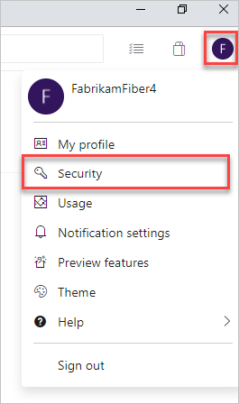
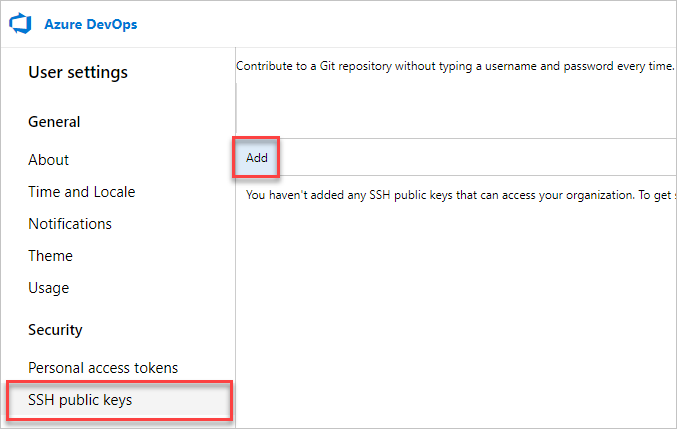
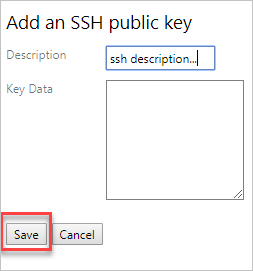

# Change your organization connection to a different Azure AD

[!INCLUDE [version-eq-azure-devops](../../includes/version-eq-azure-devops.md)]

If you need to switch your organization connection from one Azure Active Directory (Azure AD) to another, complete the following steps.

For more information about using Azure AD with Azure DevOps, see the [Conceptual overview](access-with-azure-ad.md).

## Prerequisites

Before you switch your organization directory, make sure the following statements are true:

- You're in the Project Collection Administrator group for the organization.
- You're a member or a guest in the source Azure AD and a member in the destination Azure AD. For more information, see how to [convert an Azure AD guest into a member](faq-azure-access.yml).
- You have 100 or fewer users in your organization. If your organization has more than 100 users, [contact Support](https://azure.microsoft.com/support/devops/) for help with changing your Azure AD.

Do the following task:

- Request that SSH keys be manually cleared by [Support](https://azure.microsoft.com/support/devops/). You can find the steps for how to recreate SSH keys [further in this article](#inform-users-of-the-completed-change).

> [!IMPORTANT]
> Users and groups that inherit membership and permissions from an Azure AD group, will no longer inherit those permissions after the transfer. Azure AD groups that were added to your Azure DevOps organization don't get transferred and will cease to exist in your organization when the Azure AD connection is changed. All permissions and membership relationships made with these Azure AD groups will also cease to exist after the transfer.
          

## Change the Azure AD connection

1. Sign in to your organization (```https://dev.azure.com/{yourorganization}```).

2. Select  **Organization settings**.

    

3. Select **Azure Active Directory**, and then **Switch directory**.

   

4. Select a directory from the dropdown menu, and then select **Connect**.

   
   If you can't find your directory, contact your Azure AD administrator and request that they add you as a member to the Azure AD.

5. Select **Sign out**.

   

    Your organization is now connected to your Azure AD.

6. Confirm that the process is complete. Sign out, and then open your browser in a private session and sign in to your organization with your Azure AD or work credentials.

7. If some members are disconnected, sign back in to Azure DevOps and map them to their Azure AD identities. Or, you can invite them as guests into the Azure AD. For more information, see the [FAQs](./faq-azure-access.yml#faq-connect).

   

   

## Inform users of the completed change

When you inform your users of the completed change, include the following tasks for each user in the organization to complete.

### Clear cache for Git Credential Manager

If you use Visual Studio or the Git command-line too, clear the cache for the [Git Credential Manager](https://github.com/Microsoft/Git-Credential-Manager-for-Windows/blob/master/Docs/Faq.md#q-why-is-gitexe-failing-to-authenticate-after-linkingunlinking-your-visual-studio-team-services-organization-from-azure-active-directory). Delete the *%LocalAppData%\GitCredentialManager\tenant.cache* file on each client machine.

### Regenerate new PATs

Complete the steps in [Use personal access tokens](use-personal-access-tokens-to-authenticate.md).

### Recreate SSH keys

Complete the following steps to recreate your SSH keys.

1. In Azure DevOps, open your **profile**, and then select **Security** from the resulting dropdown menu.

   

2. Select **SSH public keys**, and then select **Add**.

   

3. Enter a description and key data, and then select **Save**.

   

4. Copy your key and put it in a safe place, as it can't be viewed again.

### Rename your MSA

[Rename your Microsoft account](https://support.microsoft.com/help/11545/microsoft-account-rename-your-personal-account) to a different email that doesn't conflict with your Azure AD identity. Doing so ensures that you won't be prompted to choose between accounts.

### Adjust your VS subscription

If the UPN used inside your organization changed, adjust your Visual Studio subscription. You can reassign the subscription to your new UPN, or set that UPN as the alternate account inside the subscription. For more information, see [how to add an alternate account to your subscription](/visualstudio/subscriptions/vs-alternate-identity#add-an-alternate-account-to-your-subscription).

## Related articles

- [Rename a project](../projects/rename-project.md)
- [Rename an organization](rename-organization.md)
- [Get a list of organizations backed by Azure AD](get-list-of-organizations-connected-to-azure-active-directory.md)
- [Restrict organization creation with tenant policy](azure-ad-tenant-policy-restrict-org-creation.md)
- [Disconnect your organization from Azure AD](disconnect-organization-from-azure-ad.md)
