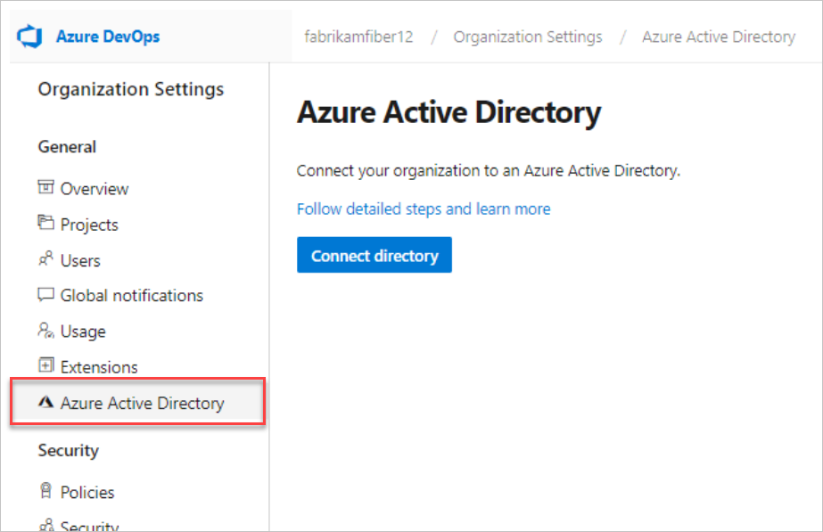

# Switch to another Azure AD

[!INCLUDE [version-vsts-only](../../_shared/version-vsts-only.md)]

If you need to switch your organization connection from one Azure Active Directory (Azure AD) to another, complete the following steps.

For more information about using Azure AD with Azure DevOps, see the [Conceptual overview](access-with-azure-ad.md).

## Prerequisites

Before you disconnect your organization from your directory, and then connect to a new directory, make sure the following is true:
- You're using a Microsoft account, not a school or work account
- You're the organization Owner
- You're in the Project Collection Administrator group (in Organization settings) for the organization 
- You're in the source Azure AD and destination Azure AD as a member. For more information, see how you can [convert an Azure AD guest into a member](faq-add-delete-users.md#q-how-can-i-convert-an-azure-ad-guest-into-a-member).

## Change the Azure AD connection

1. Sign in to your organization (```https://dev.azure.com/{yourorganization}```).

2. Open your profile menu, and then select :::image type="icon" source="../../_img/icons/actions-icon.png"::: next to Azure DevOps profile.

   :::image type="content" source="_img/connect-organization-to-aad/select-more-actions.png" alt-text="Select the three dots next to Azure DevOps profile":::

3. Select **Switch directory**.

   :::image type="content" source="_img/connect-organization-to-aad/select-switch-directory.png" alt-text="Switch your Azure Active Directory":::

4. Choose another directory, and then select **Switch**.

   :::image type="content" source="_img/connect-organization-to-aad/switch-to-another-directory.png" alt-text="Choose another directory and then select the Switch button":::

   

5. Sign out, and then sign back in to Azure DevOps.
6. Prepare your mapping list for inviting users to Azure AD.

    1. Sign in to your organization (```https://dev.azure.com/{yourorganization}```).
    2. Select  **Organization settings**.
        
        

    3. Select **Users**.
        
        

    4. Compare your Azure DevOps email list with your Azure AD email list. Create an Azure AD email address entry for every user who is in the Azure DevOps organization and NOT in the Azure AD. For any user that you don't create an Azure AD email address for, be prepared to invite these users as guests to the Azure AD in future steps.

7. [Connect to Azure AD](connect-organization-to-azure-ad.md), so users can regain access.

   

## Related articles

- [Disconnect your organization from Azure AD](disconnect-organization-from-azure-ad.md)
- [Connect your organization to Azure AD](connect-organization-to-azure-ad.md)
- [Manage Azure AD groups](manage-azure-active-directory-groups.md)


