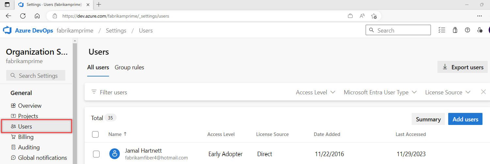
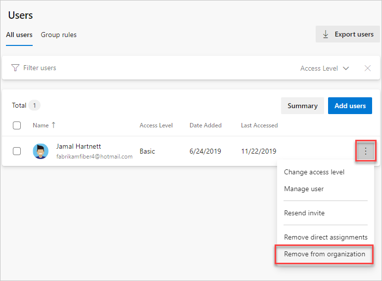
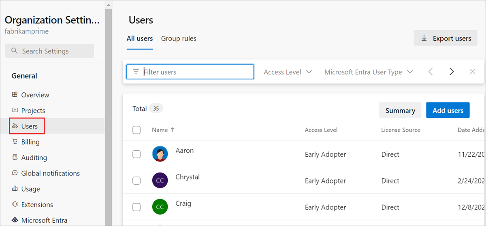

# Remove users from Azure DevOps  

[!INCLUDE [version-gt-eq-2019](../../includes/version-gt-eq-2019.md)]

If users no longer require access to a team, project, or organization, you can remove their access. 

> [!IMPORTANT]
> - [Removing a user from a team or project](#remove-users-from-a-team-or-project) doesn’t remove the user from the organization.
> - Work items that are assigned to the user aren't affected by removing user access.
> - Microsoft Entra ID-backed organizations: 
>    - After you remove a user from Microsoft Entra ID, you can't assign artifacts to that user anymore. Examples are work items and pull requests. However, we preserve the history of artifacts that were already assigned to the user.
>    - Removing a user from the organization doesn't remove their memberships to any Microsoft Entra groups. If the user is a member of an access-granting Microsoft Entra group, then the user still has access to Azure DevOps, even after you remove them from the organization. If you'd like to completely remove the user from the organization, make sure they aren't in any of your access-granting Microsoft Entra groups. For more information, see about managing access with [Microsoft Entra groups](manage-azure-active-directory-groups.md)
> - Managed service account (MSA)-backed organizations: After you remove a user from your MSA-backed organization, the user remains within the tenant and can be re-added at any time.

## Prerequisites  

- To remove users, you must be a member of the **Project Collection Administrators** group.  See [Change project collection-level permissions](../security/change-organization-collection-level-permissions.md).

## Remove users from your organization

#### [Browser](#tab/browser)

::: moniker range=">= azure-devops-2020"

1. Sign in to your organization: ```https://dev.azure.com/{yourorganization}```.

2. Select  **Organization settings**.

    

3. Select **Users**.

    

4. Select **...**  for the user to be removed. Select **Remove from organization**.

   

5. Choose **Remove** in the confirmation dialog.

   [Why don't users appear or disappear promptly after I add or delete them in the Users Services page?](faq-user-and-permissions-management.yml#users-delay)

6. If you deleted paid users who had Basic or higher features, also [reduce the users in Organization settings](../billing/buy-basic-access-add-users.md#reduce-charges-for-users-with-no-access). Then you're not charged in your next Azure billing cycle.

   To reduce or cancel users for the next month, make updates before the last day of the current month.
   Your bill won't show the changes until the next month because paid users are monthly purchases.

::: moniker-end

::: moniker range="azure-devops-2019"

1. Sign in to your organization: ```https://dev.azure.com/{yourorganization}```.

2. Select  **Organization settings**.

    

3. Select **Users**.

    

4. Open the context menu **...**  for the user to be removed. Select **Remove from organization**.

   

5. Choose **Remove** in the confirmation dialog.

6. To confirm that you've removed the users completely, make sure they aren't in any of your [security groups](../../organizations/security/add-users-team-project.md). 

   [Why don't users appear or disappear promptly after I add or delete them in the Users Services page?](faq-user-and-permissions-management.yml#users-delay)

7. If you deleted paid users who had Basic or higher features, also [reduce the users in Organization settings](../billing/buy-basic-access-add-users.md#reduce-charges-for-users-with-no-access). Then you're not charged in your next Azure billing cycle.

   To reduce or cancel users for the next month, make updates before the last day of the current month.
   Your bill won't show the changes until the next month because paid users are monthly purchases.

::: moniker-end

The **Users** page isn't available for on-premises server instances. However, you can use Azure DevOps CLI to manage users for Azure DevOps Server 2020.

#### [Azure DevOps CLI](#tab/azure-devops-cli/)

::: moniker range=" azure-devops"

> [!NOTE]
> The Azure DevOps CLI does not support adding and removing service principals.

[Add a user](add-organization-users.md#add-user) | [List users](../security/export-users-audit-log.md#list-users) | [Remove a user](#remove-user) | [Update a user](add-organization-users.md#update-user) | [Show users](add-organization-users.md#show-users)

<a id="remove-user" /> 

### Remove a user 

You can remove a user from an organization by using the [az devops user remove](/cli/azure/devops/user#az-devops-user-remove) command. To get started, see [Azure DevOps CLI](../../cli/index.md).

```azurecli
az devops user remove --user
                      [--org]
                      [--yes]
```

#### Parameters

- **user**: The email address or ID of the user. 
- **org**: Azure DevOps organization URL. You can configure the default organization using `az devops configure -d organization=ORG_URL`. Required if not configured as default or picked up using `git config`. Example: `--org https://dev.azure.com/MyOrganizationName/`.
- **yes**: Don't prompt for confirmation.

#### Example

The following command removes the user with the email address contoso@contoso.com from the contoso organization.  

```azurecli
az devops user remove --user contoso@contoso.com --org https://dev.azure.com/contoso/ --yes
```

::: moniker-end

[!INCLUDE [note-cli-not-supported](../../includes/note-cli-not-supported.md)]

* * * 

## Remove users from a team or project

To remove users from a project, remove them from the **Teams** groups they belong to or the **Contributors** group for the project. See [Add users to a project or specific team](../../organizations/security/add-users-team-project.md). You can remove a user from the **Members** page of a team group or security group.


## Related articles

- [Change project collection-level permissions](../security/change-organization-collection-level-permissions.md)  
- [Request an increase in permission levels](../../organizations/security/request-changes-permissions.md)
- [Grant or restrict access to select features and functions](../../organizations/security/restrict-access.md)
- [Troubleshoot adding and deleting organization users](faq-user-and-permissions-management.yml)
- [Export a list of users and their access levels](../security/export-users-audit-log.md)
