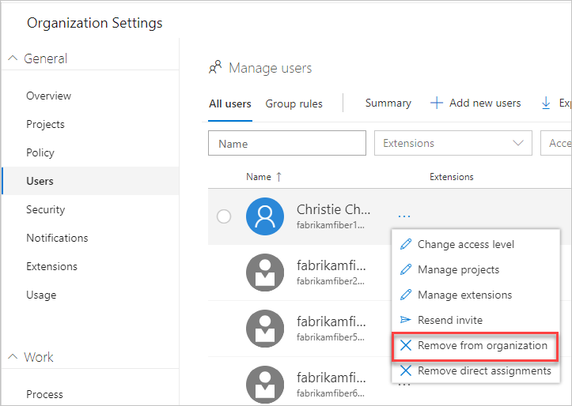
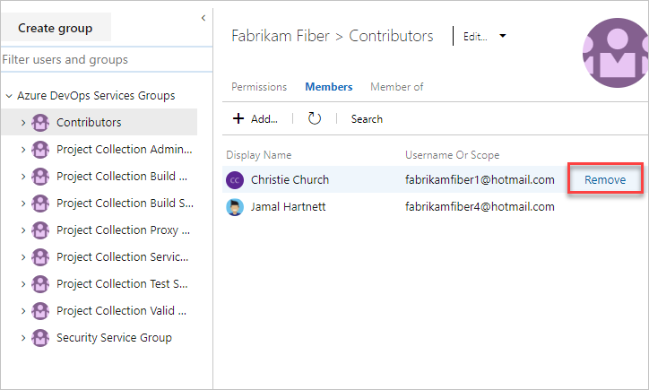

# Delete users from Azure DevOps  

[!INCLUDE [version-vsts-only](../../_shared/version-vsts-only.md)]

If users no longer require access to a project or your organization, you can remove their access to the project or your organization.  

## Prerequisites  

- You need [project collection administrator or organization owner permissions](../../organizations/security/set-project-collection-level-permissions.md?toc=/azure/devops/organizations/accounts/toc.json&bc=/azure/devops/organizations/accounts/breadcrumb/toc.json).

## Remove users from your organization

[!INCLUDE [temp](../../boards/_shared/new-agile-hubs-feature.md)]

# [New navigation](#tab/new-nav)

1. Sign in to your organization: ```https://dev.azure.com/{yourorganization}```.

   [Why am I asked to choose between my work or school account and my personal account?](faq-create-organization.md#ChooseOrgAcctMSAcct)

2. Select  **Organization settings**.

    

3. Select **Users**.

    

4. Open the context menu **...**  for the user to be removed. Select **Remove from organization**.

   

5. Choose **Remove** in the confirmation dialog.

   

6. To confirm that you've removed the users completely, make sure they aren't in any of your [security groups](../../organizations/security/add-users-team-project.md). 

   [Why don't users appear or disappear promptly in Azure DevOps after I add or delete them in the Users Services page?](faq-add-delete-users.md#users-delay)

7. If you deleted paid users who had Basic features, and you don't want to pay for those users, you must also [reduce the users in the Visual Studio Marketplace](../billing/buy-basic-access-add-users.md). Then you're not charged in your next Azure billing cycle.

   To reduce or cancel users for the next month, you must make updates before the last day of the current month.
   Your bill won't show the changes until the next month because paid users are monthly purchases.

# [Previous navigation](#tab/previous-nav)

1. Sign in to your organization: ```https://dev.azure.com/{yourorganization}```.

   [Why am I asked to choose between my work or school account and my personal account?](faq-add-delete-users.md#ChooseOrgAcctMSAcct)

2. Go to the **Users** page.

   

3. Open the context menu **...** for the user to remove. Select **Remove from organization**.

   

4. Choose **Remove** in the confirmation dialog.

5. To confirm that you've removed the users completely, make sure they're not in any of your [security groups](../../organizations/security/add-users-team-project.md). 

   [Why don't users appear or disappear promptly in Azure DevOps after I add or delete them in the Users Services page?](faq-add-delete-users.md#users-delay)

6. If you deleted paid users who had Basic features, and you don't want to pay for those users, you must also [reduce the users in the Visual Studio Marketplace](../billing/buy-basic-access-add-users.md). Then you're not charged in your next Azure billing cycle.

   To reduce or cancel users for the next month, you must make updates before the last day of the current month.
   Your bill won't show the changes until the next month because paid users are monthly purchases.

---

> [!NOTE]
> - Azure Active Directory (AD)-backed organizations. After you remove a user from Azure AD, you can't assign artifacts to that user anymore. Examples are work items and pull requests. However, we preserve the history of artifacts that were already assigned to the user.
> - Managed service account (MSA)-backed organizations. After you remove a user from your MSA-backed organization, the user remains within the tenant and can be re-added at any time.

## Remove users from a team or project

To remove users from a project, remove them from the **Teams** groups they belong to or the **Contributors** group for the project. See [Add users to a project or specific team](../../organizations/security/add-users-team-project.md). You can remove a user from the **Members** page of a team group or security group.

# [New navigation](#tab/new-nav)



# [Previous navigation](#tab/previous-nav)


---

## Related articles

- [Set permissions at the project level or project collection level](../../organizations/security/set-project-collection-level-permissions.md). 
- [Change individual permissions and grant select access to specific functions](../../organizations/security/change-individual-permissions.md)
- [Grant or restrict access to select features and functions](../../organizations/security/restrict-access.md)
- [Troubleshoot adding and deleting organization users in the Users page](faq-add-delete-users.md)
- [Troubleshoot adding members to projects in Azure DevOps ](faq-add-team-members.md)
