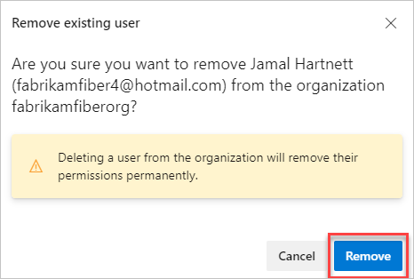
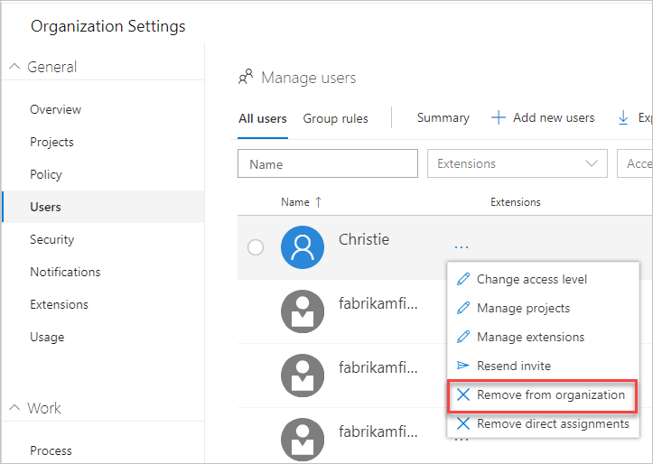
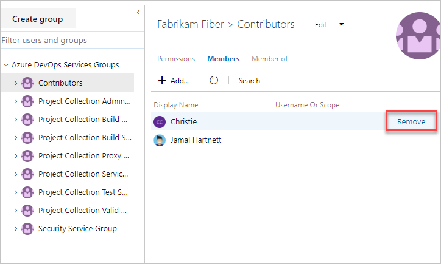

# Remove users from Azure DevOps  

[!INCLUDE [version-azure-devops-plus-azure-devops-server-2020](../../includes/version-azure-devops-plus-azure-devops-server-2020.md)]

If users no longer require access to a team, project, or your organization, you can remove their access.

## Prerequisites  

- You need [Project Collection Administrator or organization Owner permissions](../../organizations/security/set-project-collection-level-permissions.md?toc=/azure/devops/organizations/accounts/toc.json&bc=/azure/devops/organizations/accounts/breadcrumb/toc.json).

## Remove users from your organization

::: moniker range=">= azure-devops-2020"

> [!NOTE]   
> To enable the new user interface for the New user hub, see [Enable preview features](../../project/navigation/preview-features.md).

::: moniker-end

#### [Preview page](#tab/preview-page) 

::: moniker range=">= azure-devops-2020"

1. Sign in to your organization: ```https://dev.azure.com/{yourorganization}```.

2. Select  **Organization settings**.

    

3. Select **Users**.

    

4. Open the context menu **...**  for the user to be removed. Select **Remove from organization**.

   

5. Choose **Remove** in the confirmation dialog.

   

6. Note that removing a user from the organization will not remove their memberships to any security groups. If the user is a member of an access-granting security group, then the user will still have access to Azure DevOps, even after you remove them from the organization. If you'd like to completely remove the user from the organization, make sure they aren't in any of your [security groups](../../organizations/security/add-users-team-project.md). 

   [Why don't users appear or disappear promptly after I add or delete them in the Users Services page?](faq-user-and-permissions-management.md#users-delay)

7. If you deleted paid users who had Basic or higher features, also [reduce the users in Organization settings](../billing/buy-basic-access-add-users.md#reduce-charges-for-users-who-no-longer-need-access). Then you're not charged in your next Azure billing cycle.

   To reduce or cancel users for the next month, make updates before the last day of the current month.
   Your bill won't show the changes until the next month because paid users are monthly purchases.

> [!NOTE]
> - Azure Active Directory (Azure AD)-backed organizations: After you remove a user from Azure AD, you can't assign artifacts to that user anymore. Examples are work items and pull requests. However, we preserve the history of artifacts that were already assigned to the user.
> - Managed service account (MSA)-backed organizations: After you remove a user from your MSA-backed organization, the user remains within the tenant and can be re-added at any time.

::: moniker-end


Choose the **Current page** tab for information on deleting an organization user. 


#### [Current page](#tab/current-page)

::: moniker range="azure-devops-2019 || azure-devops"

1. Sign in to your organization: ```https://dev.azure.com/{yourorganization}```.

2. Select  **Organization settings**.

    

3. Select **Users**.

    

4. Open the context menu **...**  for the user to be removed. Select **Remove from organization**.

   

5. Choose **Remove** in the confirmation dialog.

   

6. To confirm that you've removed the users completely, make sure they aren't in any of your [security groups](../../organizations/security/add-users-team-project.md). 

   [Why don't users appear or disappear promptly after I add or delete them in the Users Services page?](faq-user-and-permissions-management.md#users-delay)

7. If you deleted paid users who had Basic or higher features, also [reduce the users in Organization settings](../billing/buy-basic-access-add-users.md#reduce-charges-for-users-who-no-longer-need-access). Then you're not charged in your next Azure billing cycle.

   To reduce or cancel users for the next month, make updates before the last day of the current month.
   Your bill won't show the changes until the next month because paid users are monthly purchases.

> [!NOTE]
> - Azure Active Directory (Azure AD)-backed organizations: After you remove a user from Azure AD, you can't assign artifacts to that user anymore. Examples are work items and pull requests. However, we preserve the history of artifacts that were already assigned to the user.
> - Managed service account (MSA)-backed organizations: After you remove a user from your MSA-backed organization, the user remains within the tenant and can be re-added at any time.

::: moniker-end

Choose the **Preview page** tab for instructions.

#### [Azure DevOps CLI](#tab/azure-devops-cli/)

::: moniker range=">= azure-devops-2020"

[Add a user](add-organization-users.md#add-user) | [List users](../security/export-users-audit-log.md#list-users) | [Remove a user](#remove-user) | [Update a user](add-organization-users.md#update-user) | [Show users](add-organization-users.md#show-users)

<a id="remove-user" /> 

### Remove a user 

You can remove a user from an organization by using the [az devops user remove](/cli/azure/ext/azure-devops/devops/user#ext-azure-devops-az-devops-user-remove) command. To get started, see [Azure DevOps CLI](../../cli/index.md).

```CLI
az devops user add --user
                      [--org]
                      [--yes]
```

#### Parameters

- **user**: The email address or ID of the user. 
- **org**: Azure DevOps organization URL. You can configure the default organization using `az devops configure -d organization=ORG_URL`. Required if not configured as default or picked up using `git config`. Example: `--org https://dev.azure.com/MyOrganizationName/`.
- **yes**: Don't prompt for confirmation.

#### Example

The following command removes the user with the email address contoso@contoso.com from the contoso organization.  

```CLI
az devops user remove --user contoso@contoso.com --org https://dev.azure.com/contoso/ --yes
```

::: moniker-end

[!INCLUDE [note-cli-not-supported](../../includes/note-cli-not-supported.md)]

* * * 

## Remove users from a team or project

To remove users from a project, remove them from the **Teams** groups they belong to or the **Contributors** group for the project. See [Add users to a project or specific team](../../organizations/security/add-users-team-project.md). You can remove a user from the **Members** page of a team group or security group.



## Related articles

- [Set permissions at the project level or project collection level](../../organizations/security/set-project-collection-level-permissions.md). 
- [Change individual permissions and grant select access to specific functions](../../organizations/security/change-individual-permissions.md)
- [Grant or restrict access to select features and functions](../../organizations/security/restrict-access.md)
- [Troubleshoot adding and deleting organization users](faq-user-and-permissions-management.md)
- [Export a list of users and their access levels](../security/export-users-audit-log.md)
