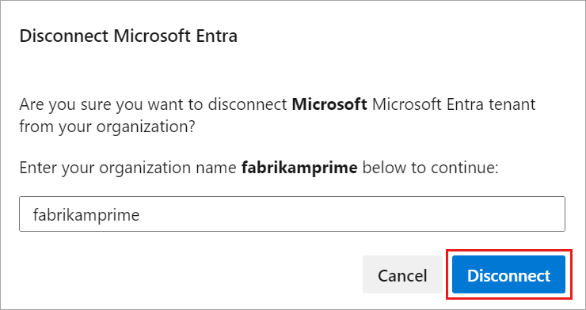

# Disconnect your organization from Microsoft Entra ID

[!INCLUDE [version-eq-azure-devops](../../includes/version-eq-azure-devops.md)]

<a name="DisconnectDirectory"></a>

To stop using your organization's Microsoft Entra ID and return to signing in with Microsoft accounts, disconnect your organization from the directory.

For more information about using Microsoft Entra ID with Azure DevOps, see the [conceptual overview](access-with-azure-ad.md).

## Prerequisites

* **Organization owner:** Change the organization owner to a Microsoft account and not to a school or work account. You can't sign in to your organization unless your work or school account has the same email address as your Microsoft account.
* **Permissions:** Add your Microsoft account to the Project Collection Administrator group in Organization settings.

For more information, see [Manage Azure administrators](/azure/active-directory/users-groups-roles/directory-assign-admin-roles).

**What happens to current users?**  Users can migrate everything except work history. They can reconnect Visual Studio subscriptions and have their access levels reassigned to their new identities.

> [!IMPORTANT]
> If you want to connect your organization to a different Microsoft Entra ID, first disconnect any connected organizations from the original directory before deleting it. Once the new directory is established, connect your organization to it so users can regain access. For more information, see [Connect your organization to Microsoft Entra ID](connect-organization-to-azure-ad.md) or [Change your organization connection to a different Microsoft Entra ID](change-azure-ad-connection.md).

## Disconnect organization from directory

1. Sign in to your organization (```https://dev.azure.com/{yourorganization}```).

2. Select  **Organization settings**.

    

3. Select **Microsoft Entra ID**, and then select **Disconnect directory**.

   

4. Enter the name of your organization, and then select **Disconnect**.

   

5. Select **Sign out**.

   

Your organization is disconnected from Microsoft Entra ID. Only users with Microsoft accounts can sign in.

For answers to frequently asked questions about connecting to, disconnecting from, or switching your Microsoft Entra ID, see [FAQs](./faq-azure-access.yml#faq-connect).

## Related articles

* [Connect your organization to Microsoft Entra ID](connect-organization-to-azure-ad.md)
* [About access with Microsoft Entra ID](access-with-azure-ad.md)
* [Get a list of organizations backed by Microsoft Entra ID](get-list-of-organizations-connected-to-azure-active-directory.md)
* [Restrict organization creation with tenant policy](azure-ad-tenant-policy-restrict-org-creation.md)
* [Frequently asked questions (FAQs) about connecting, disconnecting, or changing your Microsoft Entra ID](./faq-azure-access.yml)
