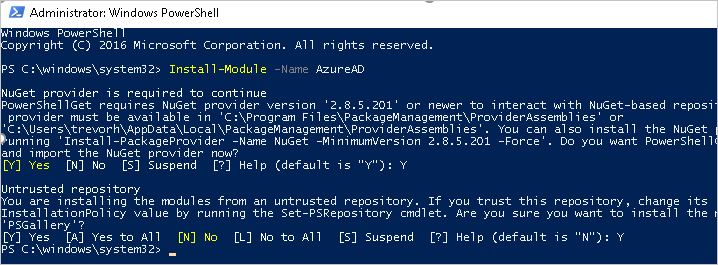
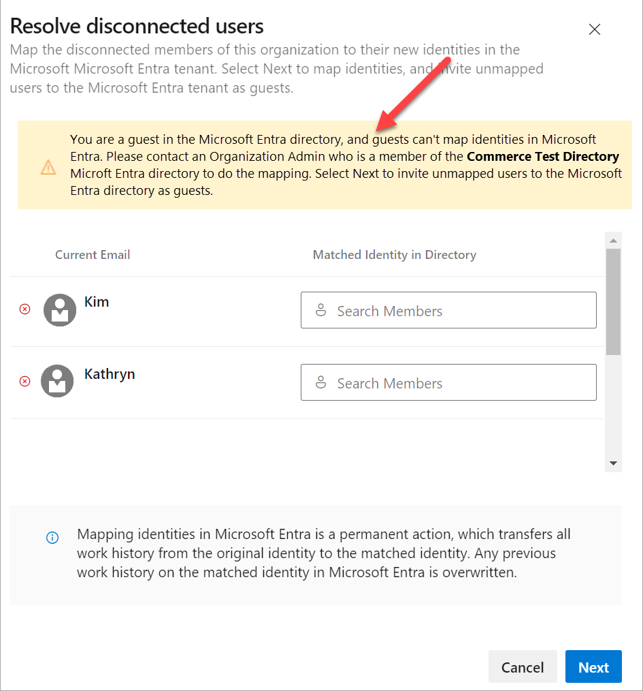
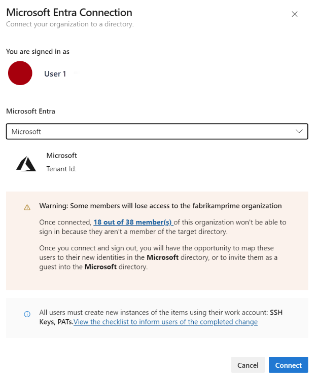
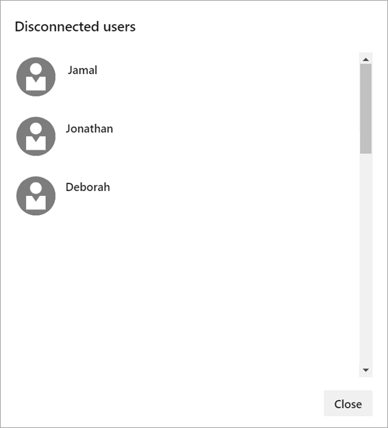

---
title: Troubleshoot access via Azure AD
ms.custom: seodec18, fasttrack-edit
description: Learn the answers to frequently asked questions (FAQs), like how to understand Azure AD groups, add users, connect to, disconnect from, or switch your directory.
ms.technology: devops-accounts
ms.assetid: d51de748-c53e-4468-ad9b-275d6bf1a4dd
ms.topic: conceptual
ms.author: chcomley
author: chcomley
ms.date: 04/20/2020
monikerRange: 'azure-devops'
---

# Access via Azure AD FAQs

[!INCLUDE [version-vsts-only](../../includes/version-vsts-only.md)]

[!INCLUDE [alt-creds-deprecation-notice](../../includes/alt-creds-deprecation-notice.md)]

Learn the answers to the following frequently asked questions (FAQs) about access to your Azure DevOps organization via Azure Active Directory (AD). FAQs are grouped by the following subjects:
- [General](#general)
- [Azure AD users and permissions](#azure-ad-users-and-permissions)
- [Azure AD groups](#azure-ad-groups)
- [Add users to directory](#add-users-to-directory)
- [Remove users or groups](#remove-users-or-groups)
- [Connect to, disconnect from, or switch connection with Azure AD](#faq-connect)

## General access with Azure AD

### Q:  Why don't I see my organization in the Azure portal?

A:  In both applications, you must have
[Azure Service Administrator or Co-administrator](/azure/billing-add-change-azure-subscription-administrator) 
permissions for the Azure subscription that's linked to your organization in Azure DevOps.
Also, in the [Azure portal](https://portal.azure.com), you must have Project Collection Administrator or organization Owner permissions.

### Q: I made changes to Azure Active Directory (Azure AD), but they didn't seem to take effect, why?

A: Changes made in Azure AD can take up to 1 hour to be visible in Azure DevOps.

### Q: Can I use Microsoft 365 and Azure AD with Azure DevOps?

A: Yes.

- Don't have an organization yet? [Create an organization in Azure DevOps](https://aka.ms/SignupAzureDevOps).
- Already have an organization? [Connect your organization to Azure AD](connect-organization-to-azure-ad.md).

[!INCLUDE [choose-msa-azuread-account](../../includes/qa-choose-msa-azuread-account.md)]

[!INCLUDE [choose-msa-azuread-account2](../../includes/qa-choose-msa-azuread-account2.md)]

### Q: My organization uses Microsoft accounts only. Can I switch to Azure AD?

A. Yes, but before you switch, make sure that Azure AD meets your needs for sharing the following items:
- work items
- code
- resources
- other assets with your team and partners

Learn more about 
controlling access with Microsoft accounts versus Azure AD, and [how to switch when you're ready](access-with-azure-ad.md).

[!INCLUDE [why-cant-sign-in-msa-azuread-account](../../includes/qa-why-cant-sign-in-msa-azuread-account.md)]

### Q: What happens if my Azure subscription is disabled?

A: If you're the organization Owner or 
[Azure subscription Account Administrator](/azure/billing/billing-add-change-azure-subscription-administrator), 
check your subscription status in the [Account Center](https://account.windowsazure.com/), 
then try to [fix your subscription](/azure/billing-subscription-become-disable). 
Your paid settings are restored. 
Or you can link your organization to another Azure subscription by 
[unlinking your organization from the disabled subscription](/azure/devops/billing/change-azure-subscription). 
While your subscription is disabled, your organization goes back to the free 
monthly limits until your subscription is fixed.

## Azure AD users and permissions

If you don't find an answer to your question here, see [User and permissions management FAQs](faq-user-and-permissions-management.md).

### Q: Why do I have to add users to a directory?

A: Your organization authenticates users and controls access through Azure Active Directory (Azure AD). All users must be directory members to get access.

As a directory administrator, you can [add users to the directory](https://msdn.microsoft.com/library/azure/hh967632.aspx). If you're not an administrator, work with your directory administrator to add users. Learn more about [controlling access to Azure DevOps Services by using a directory](access-with-azure-ad.md).

### Q: How do I find out whether my organization uses Azure AD to control access?

A: If you have at least Basic access, here's how to find out:

Go to your **Organization settings**, and then select the **Azure Active Directory** tab.
See the following examples of an organization that's not connected, and then an organization that is connected to Azure AD.

**Not connected**

**Connected**

If your organization is connected to your organization's directory, only users from your organization's directory can join your organization. For more information, see [Add or delete users using Azure Active Directory](https://docs.microsoft.com/azure/active-directory/fundamentals/add-users-azure-active-directory).

### Q: My organization controls access by using Azure Active Directory. Can I just delete users from the directory?

A: Yes, but deleting a user from the directory removes the user's access to all organizations and other assets associated with that directory. You must have Azure AD global administrator permissions to [delete a user from your Azure AD directory](https://docs.microsoft.com/azure/active-directory/fundamentals/add-users-azure-active-directory).

### Q: Why are "no identities found" when I try to add users from Azure AD to my Azure DevOps organization?

A: You're probably a *guest* in the Azure AD that backs your Azure DevOps organization, rather than a *member*. By default, Azure AD guests can't search the Azure AD in the manner required by Azure DevOps. Learn how to [convert an Azure AD guest into a member](#q-how-can-i-convert-an-azure-ad-guest-into-a-member).

### Q: How can I convert an Azure AD guest into a member?

A: Select from the following two options:

* Have the Azure AD administrator(s) remove you from the Azure AD and readd you, making you an Azure AD *member*, rather than a *guest*. For more information, see [Can Azure AD B2B users be added as members instead of guests](https://docs.microsoft.com/azure/active-directory/b2b/user-properties#can-azure-ad-b2b-users-be-added-as-members-instead-of-guests).
* [Change the UserType of the Azure AD guest using Azure AD PowerShell](#convert-azure-ad-usertype-from-guest-to-member-using-azure-ad-powershell). [We don't advise](https://nam06.safelinks.protection.outlook.com/?url=https%3A%2F%2Fdocs.microsoft.com%2Fen-us%2Fazure%2Factive-directory%2Fb2b%2Fuser-properties%23convert-usertype&data=02%7C01%7CChrystal.Comley%40microsoft.com%7Cf59a62633fb447b1aaaa08d6b3b86e00%7C72f988bf86f141af91ab2d7cd011db47%7C1%7C0%7C636894002034849797&sdata=flX3JmpUn8m5sqr%2Fxmc%2B9BPEGJEEUcUPcaXRwLub40s%3D&reserved=0) using this advanced process, but it allows the user to query Azure AD from the Azure DevOps organization.

#### Convert Azure AD UserType from guest to member using Azure AD PowerShell

> [!WARNING]
> This is an advanced process and [is not advised](https://nam06.safelinks.protection.outlook.com/?url=https%3A%2F%2Fdocs.microsoft.com%2Fen-us%2Fazure%2Factive-directory%2Fb2b%2Fuser-properties%23convert-usertype&data=02%7C01%7CChrystal.Comley%40microsoft.com%7Cf59a62633fb447b1aaaa08d6b3b86e00%7C72f988bf86f141af91ab2d7cd011db47%7C1%7C0%7C636894002034849797&sdata=flX3JmpUn8m5sqr%2Fxmc%2B9BPEGJEEUcUPcaXRwLub40s%3D&reserved=0), but it allows the user to query Azure AD from the Azure DevOps organization thereafter.

**Prerequisites**

The user making the UserType change must have the following items:

* A work/school account (WSA)/native user in Azure AD. You can't change the UserType with a Microsoft Account.
* Global administrator permissions

> [!IMPORTANT]
> We recommend that you create a brand new (native) Azure AD user who is a global admin in the Azure AD, and then complete the following steps with that user. This new user should eliminate the possibility of connecting to the wrong Azure AD. You can delete the new user when you're done.

**Process**

1. Sign in to the [Azure portal](https://portal.azure.com) as global administrator for your organization's directory.
2. Go to the tenant that backs your Azure DevOps organization.
3. Check the UserType. Confirm that the user is a guest.

   

4. Open an Administrative Windows PowerShell prompt.
5. Execute `Install-Module -Name AzureAD`. The [Azure Active Directory PowerShell for Graph](https://docs.microsoft.com/powershell/azure/active-directory/install-adv2?view=azureadps-2.0) downloads from the PowerShell Gallery. You may see prompts about installing NuGet and untrusted repository, as pictured below. If you run into issues, review the system requirements and information at the [Azure Active Directory PowerShell for Graph](https://docs.microsoft.com/powershell/azure/active-directory/install-adv2?view=azureadps-2.0) page.

   

6. Once the installation completes, execute `Connect-AzureAD`. You're prompted to sign in to the Azure AD. Be sure to use an ID that meets the criteria above.
7. Execute `Get-AzureADuser -SearchString "<display_name>"`, where <display_name> is part of the entire display name for the user, as seen inside the Azure portal). The command returns four columns for the user found - ObjectId, DisplayName, UserPrincipalName, UserType - and the UserType should say *guest*.
8. Execute `Set-AzureADUser -ObjectID <string> -UserType Member`, where <string> is the value of ObjectId returned by the previous command. The user is set to member status.
9. Execute `Get-AzureADuser -SearchString "<display_name>"` again to verify the UserType has changed. You can also verify in the Azure Active Directory section of the Azure portal.
While not the norm, we've seen it takes several hours or even days before this change is reflected inside Azure DevOps. If it doesn't fix your Azure DevOps issue immediately, give it some time and keep trying.

## Azure AD groups

### Q: Why can't I assign Azure DevOps permissions directly to an Azure AD group?

A: Because these groups are created and managed in Azure, you can't assign Azure DevOps permissions directly or secure version control paths to these groups. You'll get an error if you try to assign permissions directly.

You can add an Azure AD group to the Azure DevOps group that has the permissions you want. Or,
you can assign these permissions to the group instead. Azure AD group members inherit permissions from the group where you add them.

### Q: Can I manage Azure AD groups in Azure DevOps?

A: No, because these groups are created and managed in Azure. Azure DevOps doesn't store or sync member status for Azure AD groups. To manage Azure AD groups, use the [Azure portal](https://portal.azure.com), Microsoft Identity Manager (MIM),
or the group management tools that your organization supports.

### Q: How do I tell the difference between an Azure DevOps group and an Azure AD group?

A: The Azure DevOps UI indicates membership scope using brackets `[]`. For example, consider this permissions settings page:

| Scope name | Definition |
|:--|:--|
| `[fabrikam-fiber]` | Membership is defined in Organization Settings |
| `[Project Name]` | Membership is defined in Project Settings |
| `[TEAM FOUNDATION]` | Membership is defined _directly_ in Azure AD | 

> [!Note]
> If you add an Azure AD group to a custom security group _and_ use a similar name, you may see what appears to be duplicate groups. Examine the scope in `[]` to determine which is a DevOps Group and which is an Azure AD Group.

### Q: Why doesn't Users show all Azure AD group members?

A: These users have to sign in to your organization before they appear in Users.

### Q: How do I assign organization access to Azure AD group members?

A: When these group members sign in to your organization for the first time, Azure DevOps assigns an access level to them automatically. If they have
[Visual Studio subscriptions](faq-user-and-permissions-management.md#EligibleMSDNSubscriptions),
Azure DevOps assigns the respective access level to them. Otherwise, Azure DevOps assigns them the next "best available"
[access level](https://visualstudio.microsoft.com/pricing/visual-studio-online-feature-matrix-vs), in this order: Basic, Stakeholder.
 
If you don't have enough access levels for all Azure AD group members, those members who sign in get a Stakeholder access.

### Q: Why doesn't the Security tab show all members when I select an Azure AD group?

A: The Security tab shows Azure AD group members only after they sign in to your organization, and have an access level assigned to them.

To see all Azure AD group members, use the [Azure portal](https://portal.azure.com), MIM, or the group management tools that your organization supports.

### Q: Why doesn't the team members widget show all Azure AD group members?

A: The team members widget shows only users who previously signed in to your organization.

### Q: Why doesn't the team capacity pane show all Azure AD group members?

A: The team capacity pane shows only users who previously signed in to your organization.
To set capacity, manually add users to your team.

### Q: Why doesn't the team room show offline users?

A: The team room shows Azure AD group members, but only when they're online.

### Q: Why doesn't Azure DevOps reclaim access levels from users who aren't Azure AD group members anymore?

Azure DevOps doesn't automatically reclaim access levels from these users. To manually remove their access, go to **Users**.

### Q: Can I assign work items to Azure AD group members who haven't signed in?

A: You can assign work items to any Azure AD member who has permissions for your organization. This action also adds that member to your organization. When you add users this way, they automatically appear as Users, with the best available
access level. The user also appears in the security settings.

### Q: Can I use Azure AD groups to query work items by using the "In Group" clause?

A: No, querying on Azure AD groups isn't supported.

### Q: Can I use Azure AD groups to set up field rules in my work item templates?

A: No, but you might be interested in our [process customization plans](https://devblogs.microsoft.com/devops/visual-studio-online-process-customization-update/).

## Add users to directory

[Add organization users to your Azure Active Directory](https://docs.microsoft.com/azure/active-directory/fundamentals/add-users-azure-active-directory).

### Q: Why did I get an error stating that my organization has multiple active identities with the same UPN?

A: During the connect process, we map existing users to members of the Azure AD tenant, based on their UPN, which is often known as sign-in address. If we detect multiple users with the same UPN, we don't know how to map these users. This scenario occurs if a user changes their UPN to match one already existing in the organization.

### Q: Can I switch current users from Microsoft accounts to work accounts in Azure DevOps?

A: No. Although you can add new work accounts to your organization, they're treated as new users. If you want to access all your work, including its history, you must use the same sign-in addresses that you used before your organization was connected to your Azure AD.
Add your Microsoft account as a member to your Azure AD.

### Q: Why can't I add users from other directories to my Azure AD?

A: You must be a member or have read access in those directories. Otherwise, you can add them
[using B2B collaboration through your Azure AD administrator](https://azure.microsoft.com/documentation/articles/active-directory-b2b-collaboration-overview/). You can also add them by using their Microsoft accounts, or by creating new work accounts for them in your directory.

### Q: What if I get an error trying to map a user to an existing member of my organization?

A: You can map the user onto a different identity that isn't yet an active member of the organization or add the existing user to your Azure AD. If you still need to map to the existing Azure DevOps organization member, [contact support.](https://azure.microsoft.com/support/devops/)

### Q: How do I use my work or school account with my Visual Studio with MSDN subscription?

A: If you used a Microsoft account to activate a [Visual Studio with MSDN subscription](https://visualstudio.microsoft.com/vs/pricing/) containing Azure DevOps as a benefit, you can add a work or school account. The account must be managed by Azure AD. Learn [how to link work or school accounts to Visual Studio with MSDN subscriptions](../../billing/link-msdn-subscription-to-organizational-account-vs.md).

### Q: Can I control access to my organization for external users in the connected directory?

A: Yes, but only for external users who are [added as guests through Microsoft 365](https://support.office.com/article/Share-sites-or-documents-with-people-outside-your-organization-80E49744-E30F-44DB-8D51-16661B1D4232)
or [added using B2B collaboration by your Azure AD administrator](https://azure.microsoft.com/documentation/articles/active-directory-b2b-collaboration-overview/). These external users are managed outside the connected directory. To learn more, contact your Azure AD administrator. The following setting doesn't affect [users who are added directly to your organization's directory](https://azure.microsoft.com/documentation/articles/active-directory-create-users/).

Before you start, make sure you have at least Basic access, not Stakeholder.

Complete the [prerequisites for adding external users](add-external-user.md#prerequisites), turning External guest access to **On**.

## Remove users or groups

### Q: How do I remove an Azure AD group from Azure DevOps?

A: Go to your project collection or project. In the bar at the top, select the gear icon, and then select **Security**.

Find the Azure AD group, and delete it from your organization.

### Q: Why am I asked to remove a user from an Azure AD group when I delete that user from my organization?

A: Users can belong to your organization, both as individuals and as members of Azure AD groups in Azure DevOps groups. These users can still access your organization while they're members of these Azure AD groups.

To block all access for users, remove them from Azure AD groups in your organization, or remove these groups from your organization. We currently can't block access completely or make exceptions for such users.

### Q: If an Azure AD user is removed, will all their related PATs be revoked as well?

A: Users who are disabled or removed from your directory, can no longer access your organization by any mechanism, including via PATs or SSH.

## Connect to, disconnect from, or change Azure AD connection

- [Connect your organization to Azure AD](connect-organization-to-aad.md)
- [Disconnect your organization from your directory](disconnect-organization-from-aad.md)
- [Change the directory that's connected to Azure DevOps](change-azure-ad-connection.md)
- [Get a list of organizations backed by Azure AD](get-list-of-organizations-connected-to-azure-active-directory.md)
* [Restrict organization creation with tenant policy](azure-ad-tenant-policy-restrict-org-creation.md)

### Q: How can I manage multiple organizations that are backed by Azure AD?

A: You can download a complete list of organizations backed by an Azure Active Directory tenant. For more information, see [Get a list of organizations backed by Azure AD](get-list-of-organizations-connected-to-azure-active-directory.md).

### Q: Can I connect my organization to an Azure AD created from Microsoft 365?

A: Yes. If you can't find your Azure AD created from Microsoft 365, see
[Why don't I see the directory that I want to connect?](#why-not-my-directory).

### Q: Why don't I see the directory that I want to connect to? What should I do?

A: You might not see the directory for any of the following circumstances:

* You don't have [organization Owner permissions](../security/lookup-organization-owner-admin.md) to manage directory connections.

* Talk to your Azure AD organization administrator and ask them to make you a member of the organization. It's possible that you're not  part of the organization.

### Q: Why is my organization already connected to a directory? Can I change that directory?

A: Your organization was connected to a directory when the organization Owner created the organization, or sometime afterward. When you create an organization with a work or school account, your organization is automatically connected to the directory that manages that work or school account. Yes, you can [switch directories](#switch-directory). You might have to migrate some users.

### Q: Can I switch to a different directory?

A: Yes. For more information, see [Switch to another Azure AD](change-azure-ad-connection.md). 

### Q: My alternate credentials don't work anymore. What do I do?

A: Alternate credentials don't work after you connect your organization to a directory. 
[Set up your credentials](https://support.microsoft.com/kb/2991274) again for the organization that you connected.

### Q: Some users are disconnected, but they have matching identities in Azure AD. What should I do?
A: 
* In your Azure DevOps **Organization settings**, select **Azure Active Directory**, and then select **Resolve**. 

   

* Match the identities. Select **Next** when you're done.

   

### Q: I got an error message when I was resolving disconnections. What should I do?
A: 
* Try again.
* You might be a guest in Azure AD. Request that an organization administrator, who is a member of Azure AD,  do the mapping. Or, request that an admin of the Azure AD convert you to a member.

   

* If the error message includes a user in your domain, but you don't see them active in your directory, the user likely left your company. Go to the organization user settings to remove the user from your organization.

### Q: When I was trying to invite a new user to my Azure AD, I got a 403 exception. What do I do?

A: You may be a guest in Azure AD and don't have the right permission to invite users. Go to **External collaboration settings** in Azure AD and move the "Guests can invite" toggle to **Yes**. Refresh Azure AD and try again.

### Q: Will my users keep their existing Visual Studio subscriptions?

A: Visual Studio subscription administrators ordinarily assign subscriptions to users' corporate email addresses, so that users can receive welcome email and notifications. If the identity and subscription email addresses match, users can access the benefits of the subscription. As you transition from Microsoft to Azure AD identities, users' benefits still work with their new Azure AD identity. But, the email addresses must match. If the email addresses don't match, your subscription administrator must [reassign the subscription](../billing/csp/buy-vs-app-center.md). Otherwise, users must [add an alternate identity to their Visual Studio subscription](/visualstudio/subscriptions/vs-alternate-identity).

### Q: What if I'm required to sign in when I use the people picker?

A: Clear your browser cache and delete any cookies for the session. Close your browser, and then reopen.

### Q: What if my email account isn't found in Azure AD?
A: 
* In your Azure DevOps **Organization settings**, select **Azure Active Directory**, and then select **Resolve**. 

   

* Match the identities. Select **Next** when you're done.

   

### Q: What if my work items are indicating that the users aren't valid?

A: Clear your browser cache and delete any cookies for the session. Close your browser, and then reopen.

### Q: Once my organization is connected to Azure AD, will it update Azure Boards work items, pull requests, and other pieces where I'm referenced in the system with my new ID? 

A: Yes, all pieces in the system are updated with the new ID when a user's ID gets mapped from their personal email to their work email. 

### Q: What if I get a warning about members who will lose access to the organization?

A: You can still connect to Azure AD, but try to resolve the mapping issue after you've connected. If you still need help, [contact support](https://azure.microsoft.com/support/devops/).

Select the bolded text to see which users are affected.

### Q: What if I have over 200 users and want to connect to Azure AD?

A: With more than 200 users, you can still connect, however you may need to [contact Support](https://azure.microsoft.com/support/devops/) for help with disconnected users.

### Q: With more than 200 members in my Azure DevOps organization, how can I connect to an Azure AD?

A: Currently, you can still connect, but the mapping and invite features that help resolve disconnected users post-connection won't work beyond 200. [Contact Support](https://azure.microsoft.com/support/devops/).

### Q: Why is git.exe/Visual Studio failing to authenticate after linking/unlinking from Azure Active Directory?

A: The tenant cache must be cleared if you're using a GCM version before v1.15.0. Clearing the tenant cache is as easy as deleting the `%LocalAppData%\GitCredentialManager\tenant.cache` file on each machine returning a sign-in error. The GCM automatically recreates and populates the cache file, as needed, on subsequent sign-in attempts.

[!INCLUDE [get-team-services-support](../../includes/qa-get-vsts-support.md)]

## Related articles

- [Configure and customize organization FAQs](faq-configure-customize-organization.md)
- [User and permissions management FAQs](faq-user-and-permissions-management.md)
- [Set up Visual Studio FAQs](faq-set-up-vs.md)

