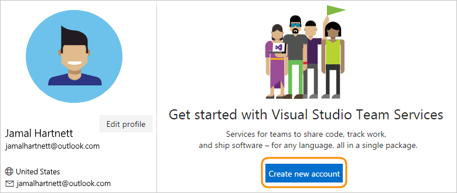

# Troubleshoot creating an organization in Azure DevOps

[!INCLUDE [version-vsts-only](../../_shared/version-vsts-only.md)]

#### Q: What users can join for free? What benefits do users get from joining Azure DevOps?

A: Azure DevOps is free for these users to join:

* Five users who get [Basic features](https://visualstudio.microsoft.com/team-services/compare-features/), like version control and tools for Agile, Java, and build and release management. 

* Unlimited users who get [Stakeholder features](https://visualstudio.microsoft.com/team-services/compare-features/), like working with your backlog, work items, and queries.

* Unlimited [Visual Studio subscribers](https://visualstudio.microsoft.com/team-services/compare-features/) who also get Basic features. In some cases, these users get additional features with specific extensions, like [Test Manager](https://marketplace.visualstudio.com/items?itemName=ms.vss-testmanager-web).

	[Learn what else you get with Azure DevOps](https://visualstudio.microsoft.com/team-services/pricing/).

[!INCLUDE [browser-problems](../../_shared/qa-browser-problems.md)]

#### Q:  Which Visual Studio subscriptions can I use with Azure DevOps?

A:	[Find Visual Studio subscriptions that include Azure DevOps](faq-add-delete-users.md#EligibleMSDNSubscriptions).

#### Q:	Why am I asked to provide profile details?

A:	If you're a new user, you can change your profile details. You need to do this only once.

1.	Confirm your profile details.

	

1.	Continue creating your organization.

	

[!INCLUDE [organization-location-process-template](../../_shared/qa-organization-location-process-template.md)]

#### Q:	Why are some features not available in my organization?

A: Some features require you to install an extension, which might be available for free or paid.

For example, [web-based test case management](https://marketplace.visualstudio.com/items?itemName=ms.vss-testmanager-web) requires you to install the Test Manager extension. You can [try paid extensions for free](../billing/try-additional-features-vs.md) if you haven't started the extension trials already. Otherwise, you can [pay for user access](../../marketplace/install-extension.md) to these features.

#### Q:	How many organizations can I create?

A: You can [create multiple organizations](#create-another-organization). But instead of creating another organization, you might consider [creating another project](#another-team-project). Your organization can have unlimited private projects by using Git or Microsoft Team Foundation Version Control.

There's no limit to the number of organizations that you can join.  

#### Q:	How do I create another organization?

A: Just sign in to your [Visual Studio profile](https://app.vsaex.visualstudio.com/profile/view).

[!INCLUDE [another-team-project](../../_shared/qa-another-team-project.md)]

[!INCLUDE [delete-team-project](../../_shared/qa-delete-team-project.md)]

[!INCLUDE [find-organization-name](../../_shared/qa-find-organization-name.md)]

[!INCLUDE [recover-password](../../_shared/qa-recover-password.md)]

[!INCLUDE [change-organization-name-owner](../../_shared/qa-change-organization-name-owner.md)]

[!INCLUDE [delete-organization](../../_shared/qa-delete-organization.md)]

#### Q:	What's the difference between using a Microsoft account and a work account or school account to sign up?

A: Your choice of account type affects how you control access and authenticate users for your organization.

When you sign up with a Microsoft account:

* You're solely responsible for managing access to your organization.
* All users must sign in with Microsoft accounts.

When you sign up with a work or school account:

* Your organization is automatically connected to your directory in Azure Active Directory.
* All users must be members in the connected directory to get access to your organization.
* The directory administrator has control over who can join the directory.
* You sign in with work or school accounts, or with Microsoft accounts if your company allows that.

To [add users to the directory](/azure/active-directory/active-directory-create-users), you must be a directory administrator. If you don't have access, work with your directory administrator to add users. Learn more about [work or school accounts for your organization](/azure/active-directory/sign-up-organization).

#### Q:	Can I change the directory after signup?

A: Yes, see [Disconnect your organization from Azure Active Directory](disconnect-organization-from-azure-ad.md) and  [Connect your organization to Azure AD](connect-organization-to-azure-ad.md).

[!INCLUDE [choose-msa-azuread-account](../../_shared/qa-choose-msa-azuread-account.md)]

* Choose **Work or school account** if you want to use your directory to authenticate users and control organization access. This option limits access to members in your organization's directory. In this case, all other users also must sign in with work or school accounts. 

* Choose **Personal account** if you want to use your Microsoft account with Azure DevOps. In this case, all other users also must sign in with Microsoft accounts.

[!INCLUDE [why-cant-sign-in-msa-azuread-account](../../_shared/qa-why-cant-sign-in-msa-azuread-account.md)]

[!INCLUDE [secure-protect-data](../../_shared/qa-secure-protect-data.md)]

[!INCLUDE [team-services-sla](../../_shared/qa-vsts-sla.md)]

[!INCLUDE [visual-studio-subscription-support](../../_shared/qa-visual-studio-subscription-support.md)]

[!INCLUDE [get-team-services-support](../../_shared/qa-get-vsts-support.md)]
