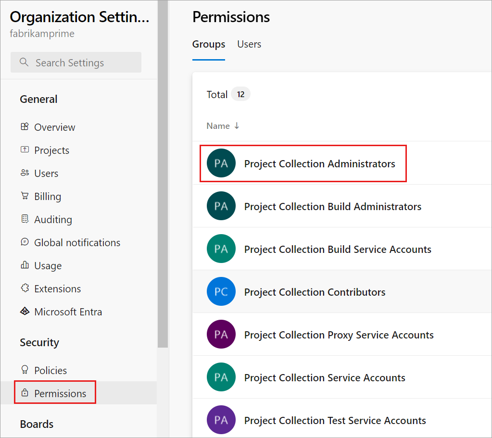
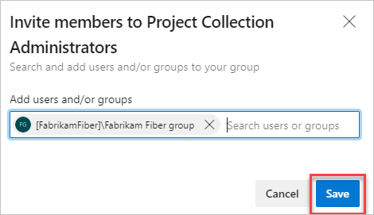

# Access with Azure Active Directory groups

[!INCLUDE [version-eq-azure-devops](../../includes/version-eq-azure-devops.md)]

Do you want an easier way to control who can access your team's critical resources and key business assets in Azure DevOps Services?
If you already use Microsoft services like Microsoft 365 or [Azure Active Directory (Azure AD)](https://azure.microsoft.com/services/active-directory/), you can use the same identities with your organization.
[Azure AD works with your organization](access-with-azure-ad.md) to control access and authenticate users.

When you organize directory members with [Azure AD groups](/azure/active-directory/fundamentals/active-directory-manage-groups), you can reuse those groups to manage permissions in bulk for your organization. Add those groups to the group that you want. For example, add them to built-in groups like Project Collection Administrators or Contributors, or manually created groups like your project management team. Azure AD group members inherit permissions from the Azure DevOps group, so you don't have to manage group members one at a time.

Not familiar with Azure AD, but want to check it out? Learn more about [Azure AD benefits](/azure/active-directory/fundamentals/active-directory-whatis)
and differences in how you [control organization access with Microsoft accounts or with Azure AD](access-with-azure-ad.md).

## Prerequisites

* Your organization must be connected to Azure Active Directory. [My organization uses Microsoft accounts only. Can I switch to Azure AD?](faq-azure-access.yml#ChangeMSA). Learn how to [connect your organization to Azure AD](connect-organization-to-azure-ad.md).
* You must be a member of the [Project Collection Administrators group](../security/look-up-project-collection-administrators.md). Organization owners are automatically members of this group. You must also have at least Basic access, not Stakeholder.
* To create and manage Azure AD groups, you need Azure AD administrator permissions or have the directory administrator delegate those permissions to you in the [Azure portal](https://portal.azure.com).
* Azure AD changes might take up to 1 hour to be visible in Azure DevOps, but you can immediately [reevaluate your permissions](../security/request-changes-permissions.md#refresh-or-re-evaluate-your-permissions).

## Add an Azure AD group to an Azure DevOps group

> [!NOTE]   
> To enable the preview feature, **Organization Permissions Settings Page v2**, see [Enable preview features](../../project/navigation/preview-features.md).

#### [Preview page](#tab/preview-page) 

1. Sign in to your organization (```https://dev.azure.com/{yourorganization}```).

    [Why am I asked to choose between my work or school account and my personal account?](faq-user-and-permissions-management.yml#ChooseOrgAcctMSAcct)

2.  Go to **Organization settings**.

    

3. Choose **Permissions**, and then select the group you want to add a member to.

   

4. Select **Members**, and then select **Add**.

    

    You [invite guests into Azure AD](https://devblogs.microsoft.com/devops/inviting-directory-guests-to-aad-backed-vsts-accounts/) and into your Azure AD-backed organizations, without waiting for them to accept. This invitation allows you to add those guests to your organization, grant access to projects, assign extensions, and more.

5. Add users or groups, and then **Save** your changes.

   

#### [Current page](#tab/current-page)

1. Sign in to your organization (```https://dev.azure.com/{yourorganization}```).

    [Why am I asked to choose between my work or school account and my personal account?](faq-user-and-permissions-management.yml#ChooseOrgAcctMSAcct)

2.  Go to **Organization settings**.

    

3. Choose **Security**, select the group you want to add a member to, select **Members**, and then select **Add**.

   
4. Add groups, and then **Save** your changes.

    

    You [invite guests into Azure AD](https://devblogs.microsoft.com/devops/inviting-directory-guests-to-aad-backed-vsts-accounts/) and into your Azure AD-backed organizations, without waiting for them to accept. This invitation allows you to add those guests to your organization, grant access to projects, assign extensions, and more.

5. Add more users or groups if needed, and then **Save** your changes.

* * *

## Related articles

- [Restrict organization creation with tenant policy](azure-ad-tenant-policy-restrict-org-creation.md)
- [Manage conditional access](change-application-access-policies.md)