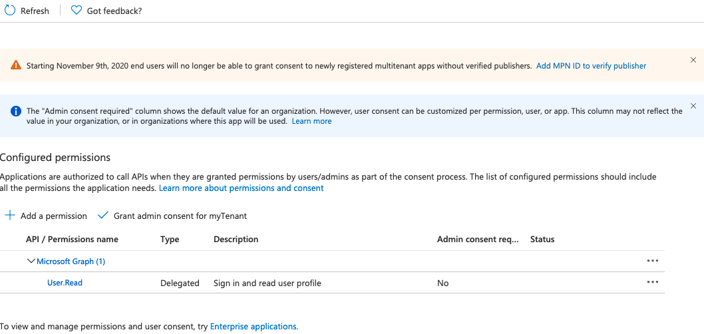
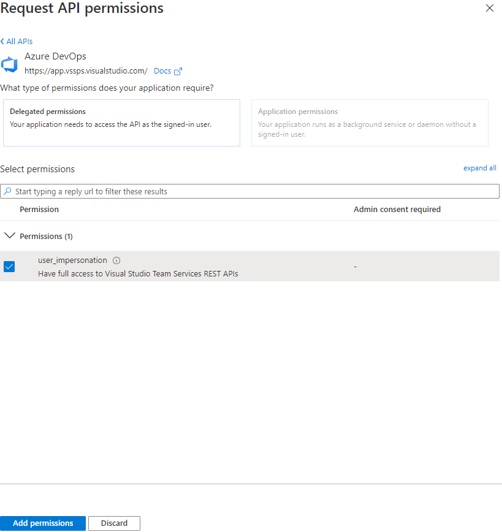
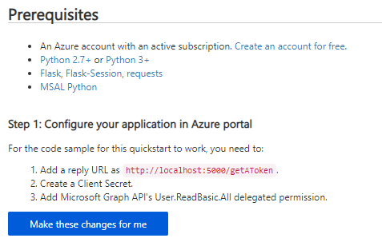
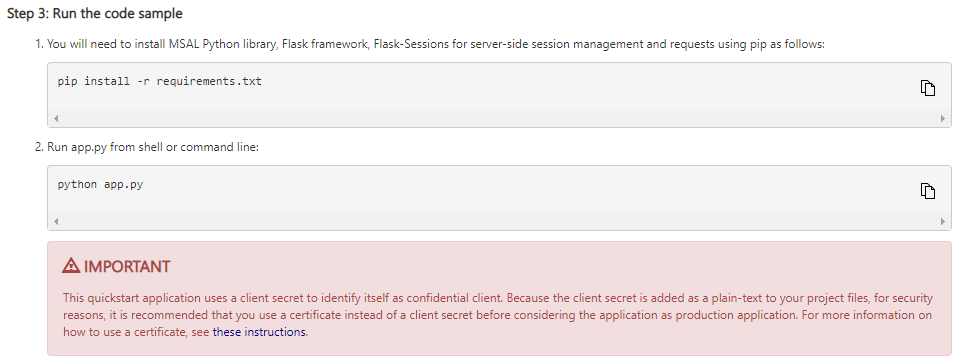

# Manage personal access tokens (PATs) using REST API

[!INCLUDE [version-eq-azure-devops](../../includes/version-eq-azure-devops.md)]

When you're dealing with a large set of personal access tokens (PATs) you own, it may become complex to manage the maintenance of these tokens using UI alone.

With the PAT Lifecycle Management API, you can easily manage the PATs associated with your organizations using automated processes. This rich set of APIs enables you to manage the PATs you own, allowing you to create new personal access tokens and renew or expire existing personal access tokens.

In this article, we'll show you how to configure an application that authenticates with an Azure Active Directory (Azure AD) token and makes calls with the PAT Lifecycle API. If you'd like to just see the full list of available endpoints, [view the API reference here](/rest/api/azure/devops/tokens).

## Prerequisites

To use the API, you must authenticate with an Azure AD token. Learn more on how to do this in the following [authentication section](#authenticate-with-azure-active-directory-azure-ad-tokens).

In order to do so, a few prerequisites must be met:

* You must [have an Azure AD tenant with an active Azure subscription.](/azure/active-directory/develop/quickstart-create-new-tenant)
* Depending on your tenant's security policies, your application may need to be granted permissions to access resources in the organization. At this moment, the only way to proceed with using this app in this tenant is to ask an admin to grant permission to the app before you can use it.

## Authenticate with Azure Active Directory (Azure AD) tokens

Unlike other Azure DevOps Services APIs, users must provide an [Azure AD access token](/azure/active-directory/develop/access-tokens) to use this API instead of a PAT token. Azure AD tokens are a safer authentication mechanism than using PATs. Given this API’s ability to create and revoke PATs, we want to ensure that such powerful functionality is given to allowed users only.

In order to acquire and refresh Azure AD access tokens, you must:

* [Have an Azure AD tenant with an active Azure subscription](/azure/active-directory/develop/quickstart-create-new-tenant)
* [Register an application in their Azure AD tenant](/azure/active-directory/develop/quickstart-register-app)
* [Add Azure DevOps permissions to the application](/azure/active-directory/develop/quickstart-configure-app-access-web-apis)

> [!IMPORTANT]
> "On-behalf-of application" solutions (such as the “client credential” flow) and any authentication flow that does not issue an Azure AD access token is not valid for use with this API.  If multi-factor authentication is enabled in your Azure AD tenant, you must definitely use the ["authorization code” flow](/azure/active-directory/develop/v2-oauth2-auth-code-flow).  

> [!CAUTION]
> Having an Azure AD tenant with an active Azure subscription is a prerequisite for using this API.

Once you have an application with a working authentication flow for handling Azure AD tokens, you can use these tokens to make calls to the PAT Lifecycle Management API.

In order to call the API directly, you need to provide an Azure AD access token as a `Bearer` token in `Authorization` header of your request.
To see the examples and a full list of the available requests, refer to the [PAT API reference](/rest/api/azure/devops/tokens)

In the following section, we show you how to create an app that authenticates a user with an Azure AD access token using the MSAL library and calls our PAT Lifecycle Management API.

The Microsoft Authentication Library (MSAL) includes multiple compliant authentication flows you can use within your app for acquiring and refreshing Azure AD tokens. A complete list of MSAL flows can be found under [Microsoft Authentication Library “authentication flows” documentation](/azure/active-directory/develop/msal-authentication-flows). A guide to choosing the right authentication method for your application can be found under [Choosing the right authentication method](../../integrate/get-started/authentication/authentication-guidance.md) for Azure DevOps.

Follow either one of the two examples to get started:

* [Clone our sample Python Flask app](#clone-our-python-flask-web-app) and configure it with your tenant and ADO organization
* [Generate a sample application in the Azure portal](#generate-a-quickstart-azure-portal-application) for your language of choice and configure it for the PAT Lifecycle Management API

## Clone our Python Flask web app

We've provided you with a [sample Python Flask web application for this API that you can download on GitHub](https://github.com/microsoft/azure-devops-auth-samples/tree/master/PersonalAccessTokenAPIAppSample) and can be configured to use with your Azure AD tenant and Azure DevOps organization. The sample application uses the MSAL authentication code flow to acquire an Azure AD access token.  

> [!IMPORTANT]
> We recommend getting started with the sample Python Flask web application on GitHub, but if you prefer to use a different language or application type, use the [Quickstart option](#generate-a-quickstart-azure-portal-application) to recreate an equivalent test application.

Once you've cloned the sample app, follow the instructions in the repo’s README. The README explains how to register an application in your Azure AD tenant, configure the sample to use your Azure AD tenant, and run your cloned app.

## Generate a Quickstart Azure portal application

Instead, you can generate a sample app with the generated MSAL code using the **Quickstart** option on the application's page in [Azure portal](https://portal.azure.com/). The Quickstart test application follows the authorization code flow, but does so with a Microsoft Graph API endpoint. Users will need to update the application's configuration to point to the endpoint for the PAT Lifecycle Management API.

To follow this approach, follow the **Quickstarts** instructions for the application type of your choice on the [Azure AD Develop docs homepage](/azure/active-directory/develop/). We will walk through an example where we've done this for a Python Flask Quickstart app.


#### Example: Get started with a Python Flask Quickstart application
1. Once you've registered your application in an Azure AD tenant that has an active Azure subscription, navigate to your registered application under **Azure Active Directory** -> **App Registrations** in the [Azure portal](https://portal.azure.com/).
   
   

2. Select your application and navigate to **API Permissions**.
   
   

3. Select **Add a permission** and select **Azure DevOps** -> check **user_impersonation** -> select **Add permissions**.
   
   

4. Select **Quickstart** from the left navigation panel.
   
5. Select your application type: for Python Flask, select **Web application**.

6. Select your application platform. For this tutorial, select "Python".
   
7. Make sure you've met the necessary prerequisites, then allow Azure portal to make the necessary changes to configure your application.  The **reply URL** will be the redirect URL that was set at application creation + “/getAToken”.
   
    

8. Download the Quickstart application and extract the files.

    

9.  Install the application requirements and run the application to ensure you have all necessary dependencies.  The application is initially configured to hit an endpoint in the Microsoft Graph API. Learn how to change this endpoint to the PAT Lifecycle Management API base endpoint by following the configuration instructions in the following section. 
    
    


### Configure a Quickstart application
Once the user has downloaded and installed the Quickstart application, it will be configured to use a test API endpoint from Microsoft Graph. We'll need to modify the generated configuration file to have it call the PAT Lifecycle Management API instead.


> [!TIP]
> We use collection and organization interchangeably in these docs. If a configuration variable needs a collection name, please replace it with your organization name.


To do so, we need to do a few things:
1. Update the **ENDPOINT** configuration variable to `https://vssps.dev.azure.com/{YOUR_COLLECTION_NAME_HERE}/_apis/Tokens/Pats?api-version=6.1-preview` for the PAT Lifecycle Management APIs
2. Update the **SCOPE** configuration variable to **"499b84ac-1321-427f-aa17-267ca6975798/.default"** to refer to the Azure DevOps resource and all of its scopes.

The following example will show you how we did this configuration for the Quickstart Python Flask application we generated through the Azure portal in the previous section.

Make sure you follow instructions to secure your client secret, which is initially inserted in plain-text into the application configuration file. As a best practice, remove the plain-text variable from the configuration file and use an environment variable or Azure KeyVault to secure their application's secret. 

Instead, you can choose to use a certificate instead of a client secret. Using certificates is the recommended option if the application will eventually be used in production. The instructions for using a certificate can be found in the final step of the Quickstart application setup.


> [!CAUTION] 
> Never leave a plain-text client secret in production application code.


#### Example: Configure a Python Flask Quickstart application for the PAT lifecycle management API
1. Once you've downloaded your Quickstart application, installed its dependencies, and tested that it runs in your environment, open the `app_config.py` file in your editor of choice.  The file should resemble the following code snippet; for clarity, comments referencing the default Microsoft Graph API configuration have been removed: 

    ```python
    import os

    CLIENT_ID = "YOUR_CLIENT_ID_HERE" 
    # Application (client) ID of app registration

    CLIENT_SECRET = "YOUR_CLIENT_SECRET_HERE" 
    # Placeholder - for use ONLY during testing.
    # In a production app, we recommend you use a more secure method of storing your secret,
    # like Azure Key Vault. Or, use an environment variable as described in Flask's documentation:
    # https://flask.palletsprojects.com/en/1.1.x/config/#configuring-from-environment-variables
    # CLIENT_SECRET = os.getenv("CLIENT_SECRET")
    # if not CLIENT_SECRET:
    #     raise ValueError("Need to define CLIENT_SECRET environment variable")

    AUTHORITY = "https://login.microsoftonline.com/YOUR_AAD_TENANT_ID_HERE"  # For multi-tenant app
    # AUTHORITY = "https://login.microsoftonline.com/Enter_the_Tenant_Name_Here"

    REDIRECT_PATH = "/getAToken"  
    # Used for forming an absolute URL to your redirect URI.
    # The absolute URL must match the redirect URI you set
    # in the app's registration in the Azure portal.

    ENDPOINT = 'https://graph.microsoft.com/v1.0/users'  

    SCOPE = ["User.ReadBasic.All"]

    SESSION_TYPE = "filesystem"  
    # Specifies the token cache should be stored in server-side session
    ```

2. Update the client ID or client secret to your application with your app registration’s client ID and client secret. When in production, make sure to secure the client secret by using an environment variable, Azure KeyVault, or by switching to a certificate.

    ```python
    CLIENT_ID = "YOUR_CLIENT_ID_HERE" 
    # Application (client) ID of app registration

    CLIENT_SECRET = "YOUR_CLIENT_SECRET_HERE" 
    # Placeholder - for use ONLY during testing.
    # In a production app, we recommend you use a more secure method of storing your secret.
    ```


3. Change the `ENDPOINT` variable to your Azure DevOps collection URL and API endpoint. For example, for a collection named "testCollection", the value would be:  

    ```python
    # Fill in the url to the user's ADO collection + the PAT lifecycle management API endpoint here

    ENDPOINT = 'https://vssps.dev.azure.com/{YOUR_COLLECTION_NAME_HERE}/_apis/Tokens/Pats?api-version=6.1-preview'
    ```

    For a collection named "testCollection", this endpoint would be:
    ```python
    ENDPOINT = 'https://vssps.dev.azure.com/testCollection/_apis/Tokens/Pats?api-version=6.1-preview'
    ```


4. Change the `SCOPE` variable to reference the Azure DevOps API resource; the character string is the resource ID for the Azure DevOps API, and the “.default” scope refers to all scopes for that resource ID. 

    ```python
    SCOPE = ["499b84ac-1321-427f-aa17-267ca6975798/.default"]
    ```

5. If your application is configured for a specific tenant (rather than the multi-tenant configuration), use the alternate value for the `AUTHORITY` variable, adding the specific tenant name in "Enter_the_Tenant_Name_Here".

    ```python
    # For single-tenant app:
    AUTHORITY = "https://login.microsoftonline.com/YOUR_AAD_TENANT_ID_HERE"

    # For multi-tenant app:
    AUTHORITY = "https://login.microsoftonline.com/Enter_the_Tenant_Name_Here"
    ```


6. Verify that the final `app_config.py` file matches the following, with your CLIENT_ID, tenant ID, and collection URL. For security reasons, ensure that the CLIENT_SECRET has been moved to an environment variable, Azure KeyVault, or swapped with a certificate for your registered application:

    ```python
    import os

    CLIENT_ID = "YOUR_CLIENT_ID_HERE" 
    # Application (client) ID of app registration

    # Note that the CLIENT_SECRET has been removed and moved to an environment variable or Azure KeyVault

    AUTHORITY = "https://login.microsoftonline.com/YOUR_AAD_TENANT_ID_HERE"  # For multi-tenant app
    # AUTHORITY = "https://login.microsoftonline.com/Enter_the_Tenant_Name_Here"

    REDIRECT_PATH = "/getAToken"  
    # Used for forming an absolute URL to your redirect URI.
    # The absolute URL must match the redirect URI you set in the app's registration in the Azure portal.

    ENDPOINT = 'https://vssps.dev.azure.com/testCollection/_apis/Tokens/Pats?api-version=6.1-preview' 
    # Used to configure user's collection URL and the desired API endpoint

    SCOPE = ["499b84ac-1321-427f-aa17-267ca6975798/.default"]
    # Means "All scopes for the Azure DevOps API resource"

    SESSION_TYPE = "filesystem"  
    # Specifies the token cache should be stored in server-side session
    ```

6. Rerun the application to test that you can GET all PAT tokens for the requesting user.  Once you've verified that you have, feel free to modify the contents of `'app.py'` and the `'ms-identity-python-webapp-master\templates'` directory to support sending requests to the rest of the PAT lifecycle management API endpoints.  For an example of a Python Flask Quickstart application that has been modified to support requests to all PAT lifecycle management API endpoints, [see this sample repo on GitHub](https://github.com/microsoft/azure-devops-auth-samples/tree/master/PersonalAccessTokenAPIAppSample).


## Automatically refresh an Azure AD access token
Once the application is configured correctly and the user has acquired an access token, the token can be used for up to an hour. The MSAL code provided in both examples above will automatically refresh the token once it expires. Refreshing the token prevents the user from needing to log in again and acquire a new authorization code. However, users may need to log in again after 90 days once their refresh token expires.


## Explore PAT Lifecycle Management API’s
In the above GitHub sample application and Quickstart applications, the application has been pre-configured to make requests with the Azure AD tokens you've acquired. 
To learn more about the endpoints, what parameters they accept, and what is returned in responses, see the [API Reference docs](/rest/api/azure/devops/tokens/pats).


##  FAQ

### Q: Why do I need to authenticate with an Azure AD token? Why is a PAT not enough?
**A:** With this PAT Lifecycle Management API, we've opened up the ability to create new PATs and revoke existing PATs. In the wrong hands, this API could be used by malicious actors to create multiple entry points into your organization’s ADO resources. By enforcing Azure AD authentication, we hope to have this powerful API be more secure against this unauthorized usage. 

### Q: Do I need to have an Azure AD tenant with an active Azure subscription to use this API?
**A:**  Unfortunately, this API is only available to users that are part of an Azure AD tenant with an active Azure subscription.

### Q: Can I get an example of this sample application for another language/framework/application type?
**A:** We love that you want to use the API in your language of choice! If you have a request for an example, head over to our [Dev Community](https://developercommunity.visualstudio.com/search?space=21) to see if someone else has an example to share. If you have a sample application that you’d like to share to the larger Azure DevOps audience, [let us know](mailto:ado-identity@github.com) and we can look into circulating it on these docs more widely!

### Q: What is the difference between this token API and the token admin API?
**A:** This [token API](/rest/api/azure/devops/tokens/pats) and the [token admin API](/rest/api/azure/devops/tokenadmin/), while similar, serve different use cases and audiences: 
* This token API is largely for users who want to manage the PATs that they own in an automated pipeline. This API allows. It gives you the ability to create new tokens and update existing ones.
* The token admin API is meant for organization admins. Admins can use this API to retrieve and revoke OAuth authorizations, including personal access tokens (PATs) and self-describing session tokens, of users in their organizations. 

### Q: How can I regenerate/rotate PATs through the API? I saw that option in the UI, but I don’t see a similar method in the API.
**A:** Great question! The “Regenerate” functionality available in the UI actually accomplishes a few actions, which are fully replicable through the API. 

To rotate your PAT, you need to:
1. Understand the metadata of the PAT using a **GET** call, 
2. Create a new PAT with the old PAT’s metadata using a **POST** call, 
3. Revoke the old PAT using a **DELETE** call

### Q: I see a "Need admin approval" pop-up when I try to proceed with using this app. How can I use this app without admin approval?
**A:** It seems that your tenant has set security policies which require your application to be granted permissions to access resources in the organization. At this moment, the only way to proceed with using this app in this tenant is to ask an admin to grant permission to the app before you can use it.


## Next steps
> [!div class="nextstepaction"]
> [Learn about the PAT lifecycle management API endpoints](/rest/api/azure/devops/tokens/pats)