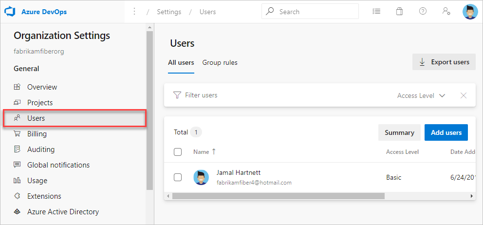
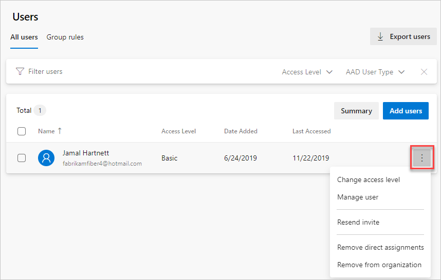

# Manage users and their access in Azure DevOps

[!INCLUDE [version-vsts-only](../../_shared/version-vsts-only.md)]

Learn how to add users to your organization and specify the level of features they can use, such as Basic or Stakeholder.

The following types of users can join your organization for free:

* Five users who get [Basic features](https://azure.microsoft.com/services/devops/compare-features/), such as version control and tools for Agile, Java, and build and release management.
* Unlimited users who get [Stakeholder features](https://visualstudio.microsoft.com/team-services/compare-features/), such as working with your backlog, work items, and queries.
* Unlimited [Visual Studio subscribers](https://visualstudio.microsoft.com/team-services/compare-features/) who also get Basic features.

Need [more users with Basic features or Visual Studio subscriptions](../billing/buy-basic-access-add-users.md)?

> [!NOTE]
> You can add people to projects instead of to your organization. Users are automatically assigned [Basic features](https://azure.microsoft.com/pricing/details/devops/azure-devops-services/) if your organization has seats available, or [Stakeholder features](https://azure.microsoft.com/pricing/details/devops/azure-devops-services/) if not. Learn [how to add members to projects](add-team-members.md).
>
> When people don't need access to your organization anymore, [delete them](delete-organization-users.md) from your organization.

To learn more, read [about access levels](../security/access-levels.md).

## Prerequisites

You must have [Project Collection Administrator or organization Owner permissions](../../organizations/security/set-project-collection-level-permissions.md?toc=/azure/devops/organizations/accounts/toc.json&bc=/azure/devops/organizations/accounts/breadcrumb/toc.json).

## Manage users
From your web browser you can view and edit certain user information. From the Azure DevOps CLI command, you can see details about a specific user and update their access level.

The Users view shows key information per user in a table. In this view, you can do the following tasks:

* See and modify assigned service extensions and access levels.
* Multi-select users and bulk edit their extensions and access.
* Filter by searching for partial user names, access level, or extension names.
* See the last access date for each user. This can help you choose users to remove access from or lower access to stay within your license limits.

> [!NOTE]   
> To enable the new user interface for the New user hub, see [Enable preview features](../../project/navigation/preview-features.md).

#### [Preview page](#tab/preview-page) 

1. Sign in to your organization (```https://dev.azure.com/{yourorganization}```).

2. Select  **Organization settings**.

   

3. Select **Users**.

   

4. Select a user or group of users. Then, select the **...** icon at the end of the **Name** column to open the context menu.

    In the context menu, select one of the following options:

   * **Change access level**
   * **Manage user**
   * **Resend invite**
   * **Remove direct assignments**
   * **Remove from organization** (deletes user)

     

5. **Save** your changes.

#### [Current page](#tab/current-page)

1. Sign in to your organization (```https://dev.azure.com/{yourorganization}```).

2. Select  **Organization settings**.

   

3. Select **Users**.

4. Select a user or group of users. Then, select the **...** icon at the end of the **Name** column to open the context menu.

    In the context menu, select one of the following options:

   * **Change access level**
   * **Manage user**
   * **Resend invite**
   * **Remove direct assignments**
   * **Remove from organization** (deletes user)

     

5. **Save** your changes.

#### [Azure DevOps CLI](#tab/azure-devops-cli)

[Add a user](add-organization-users.md#add-user) | [List users](../security/export-users-audit-log.md#list-users) | [Remove a user](delete-organization-users.md#remove-user) |[Update a user](#update-user) | [Show users](#show-users)

<a id="update-user" /> 

### Update a user

You can update a user's license type with the [az devops user update](/cli/azure/ext/azure-devops/devops/user#ext-azure-devops-az-devops-user-update) command. To get started, see [Get started with Azure DevOps CLI](../../cli/index.md). 

```CLI
az devops user update  --license-type {advanced, earlyAdopter, express, professional, stakeholder}
                      --user [--org]
```

#### Parameters

- **license-type**: License type for the user. Accepted values are advanced, earlyAdopter, express, professional, and stakeholder.
- **user**: The email address or ID of the user.  
- **org**: Azure DevOps organization URL. You can configure the default organization using `az devops configure -d organization=ORG_URL`. Required if not configured as default or picked up using `git config`. Example: `--org https://dev.azure.com/MyOrganizationName/`.


#### Example

The following command updates the license type for email address contoso@contoso.com from **Basic** to **Stakeholder** and shows the result in table format.

```CLI
az devops user update --license-type stakeholder --user contoso@contoso.com --output table

ID                                    Display Name         Email                License Type    Access Level    Status
------------------------------------  -------------------  -------------------  --------------  --------------  --------

35b1952b-ca8c-45b5-a60c-d6b0086aa584  contoso@contoso.com  contoso@contoso.com  stakeholder     Stakeholder     pending
```

<a id="show-users" /> 

### Show users

You can show details for users in your organization with the [az devops user show](/cli/azure/ext/azure-devops/devops/user#ext-azure-devops-az-devops-user-show) command. To get started, see [Azure DevOps CLI](../../cli/index.md).

```CLI
az devops user show --user [--org]
```

#### Parameters

- **user**: The email address or ID of the user.
- **org**: Azure DevOps organization URL. You can configure the default organization using `az devops configure -d organization=ORG_URL`. Required if not configured as default or picked up using `git config`. Example: `--org https://dev.azure.com/MyOrganizationName/`.
- 
#### Example

The following command returns user details for the email address contoso@contoso.com in table format.

```CLI
az devops user show --user contoso@contoso.com --output table

ID                                    Display Name         Email                License Type    Access Level    Status
------------------------------------  -------------------  -------------------  --------------  --------------  --------

35b1952b-ca8c-45b5-a60c-d6b0086aa584  contoso@contoso.com  contoso@contoso.com  stakeholder     Stakeholder     active
```

* * *

#### How is *access* different from *permissions*?

Access levels control which features are available to users. Permissions control a user's access to organization resources. To learn more, see [Default permissions and access](../../organizations/security/permissions-access.md).

## Related articles

* [Connect to a project](../../organizations/projects/connect-to-projects.md)
* [Change individual permissions or grant select access to specific functions](../../organizations/security/change-individual-permissions.md)
* [Grant or restrict access to select features and functions](../../organizations/security/restrict-access.md)
* [Delete users from Azure DevOps](delete-organization-users.md)
* [Export a list of users and their access levels](../security/export-users-audit-log.md)

