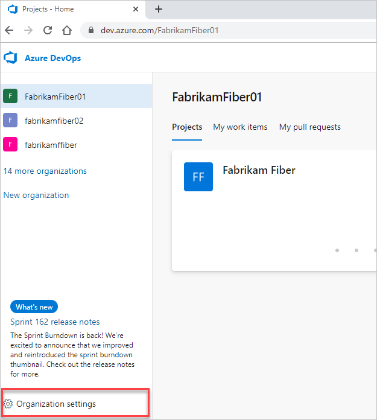

# Assign a new owner to your orphaned organization

[!INCLUDE [version-vsts-only](../../includes/version-vsts-only.md)]

An Azure DevOps orphaned organization occurs when the organization owner and all Project Collection Administrators are inactive in Azure Active Directory (Azure AD) or have left the company. This causes the organization to be without an administrator and no way of transferring administrator rights to another user. 

For organizations connected to Azure Active Directory (Azure AD), if your organization owner or all other Project Collection Administrators are inactive in Azure AD, you can transfer ownership to another user.

> [!NOTE]   
> If you simply want to change the organization owner and aren't under the banner of orphaned organization, then see [Change organization owner](change-organization-ownership.md). 

## Prerequisites

- You must have been granted the [Azure DevOps Administrator role](/azure/active-directory/users-groups-roles/directory-assign-admin-roles#azure-devops-administrator) in Azure AD.
- The Azure DevOps Administrator can only claim ownership of organizations where the current owner and all members of the Project Collection Administrators group are inactive in the backing Azure AD.
 

## Find your Azure DevOps Administrator

If you don't know who the Azure DevOps Administrator is for your organization, you can determine who it is by following these steps. 

1. To find your Azure DevOps Administrator, navigate to the [Azure portal](https://portal.azure.com/), as described in [View and assign administrator roles in Azure Active Directory](/azure/active-directory/users-groups-roles/directory-manage-roles-portal). To learn more about Azure AD roles, see [Administrator role permissions in Azure Active Directory](/azure/active-directory/users-groups-roles/directory-assign-admin-roles).  
2. The Azure DevOps Administrator can then follow the instructions below to claim ownership of the target Azure DevOps organization.  

## When your company doesn't have an Azure DevOps Administrator

When your Azure AD tenant hasn't assigned a Azure DevOps Administrator, complete the following steps:  
1. Find your Azure AD Global Administrator or Privileged Role Administrator. These administrators can be found in the [Azure portal](https://portal.azure.com/), as described in [View and assign administrator roles in Azure Active Directory](/azure/active-directory/users-groups-roles/directory-manage-roles-portal). To learn more about Azure AD roles, see [Administrator role permissions in Azure Active Directory](/azure/active-directory/users-groups-roles/directory-assign-admin-roles).  
2. Ask the Azure AD Global Administrator or Privileged Role Administrator to assign the Azure DevOps Administrator role to the appropriate user(s). 

	> [!NOTE]   
	> Any changes to role membership may take up to an hour to propagate to Azure DevOps.  

3. The Azure DevOps Administrator can then follow the instructions below to claim ownership of the target Azure DevOps organization.  
 
## Assign new Azure DevOps owner 

1. Sign into the target Azure DevOps organization using the account that has been granted the Azure DevOps Administrator role in AAD.  

1. Select **Organization settings**.

	> [!div class="mx-imgBorder"]  
	>   

1. Choose **Overview**, and then the **Change owner** link that appears in the yellow message bar. 

	> [!div class="mx-imgBorder"]  
	> 

1. Select a user from the dropdown menu, or search for a user by entering the user's name. Enter a short justification, which is required, and then choose **Change**.  

	> [!div class="mx-imgBorder"]  
	>  

	A notification of the ownership transfer with your provided justification is then sent to all Azure DevOps Administrators in your Azure Active Directory.  

## Related articles

- [Change organization owner](change-organization-ownership.md)
- [Administrator role permissions in Azure Active Directory](/azure/active-directory/users-groups-roles/directory-assign-admin-roles).
- [Need help?](faq-delete-restore-organization.md#get-support)
- [Delete your organization from Azure DevOps](delete-your-organization.md)
