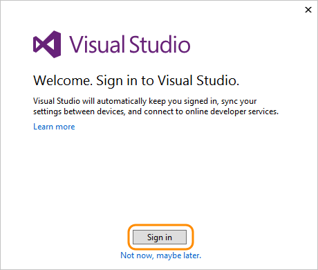
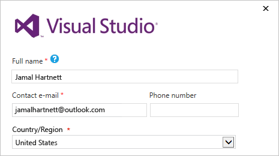
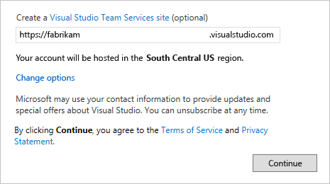

# Set up Visual Studio with Azure DevOps Services

[!INCLUDE [version-vsts-only](../../_shared/version-vsts-only.md)]

When you first open [Visual Studio 2015](https://visualstudio.microsoft.com/products/vs-2015-product-editions), 
you can sign in and connect to [Azure DevOps Services](https://visualstudio.microsoft.com/products/visual-studio-team-services-vs).

If you've already gone through Visual Studio sign-in, or you're using Visual Studio 2017, then [learn how](../../repos/git/gitquickstart.md) to connect to 
Azure DevOps Services from the Team Explorer window.

After you're connected, you can store or share code in free, unlimited, private, 
cloud-based Git repositories or Team Foundation Version Control. 
Organize and manage your work by using Agile tools for DevOps, 
continuous integration, and continuous delivery so your team can build often, 
test early, and ship faster.

> To set up Visual Studio without Azure DevOps Services, 
> learn how to [get started](https://msdn.microsoft.com/library/e2h7fzkw.aspx). 
> To host your own server, 
> learn how to [install and set up Team Foundation Server](/tfs/server/install/get-started).

Azure DevOps Services is free for 
[up to five users with access to Basic features](https://visualstudio.microsoft.com/products/visual-studio-team-services-feature-matrix-vs) 
and for unlimited [Visual Studio subscribers](https://visualstudio.microsoft.com/products/how-to-buy-vs) and 
[Stakeholders who can access limited features](https://visualstudio.microsoft.com/products/visual-studio-team-services-feature-matrix-vs).
Learn [what else you get with Azure DevOps Services](https://visualstudio.microsoft.com/pricing/visual-studio-team-services-pricing-vs). 
If you want, you can also use Azure DevOps Services with any IDE or code editor, like:

*	[Eclipse, Android Studio, or IntelliJ](/azure/devops/java)
*	Xcode (see [Git](../../repos/git/share-your-code-in-git-xcode.md) or [TFVC](../../repos/tfvc/share-your-code-in-tfvc-xcode.md))
*	[Visual Studio Code](https://code.visualstudio.com/docs/editor/versioncontrol)

##	How do I set up Visual Studio 2015 for Azure DevOps Services during sign in?

1.  [Download and install Visual Studio](https://go.microsoft.com/fwlink/?LinkId=309297&clcid=0x409&slcid=0x409), 
if you don't have the version you want already. 
[Which versions can I use with Azure DevOps Services?](faq-set-up-vs.md#vs-versions)

	If you have a Visual Studio subscription that 
	includes the Visual Studio IDE, get the version 
	that's available with your subscription.

2.  Start Visual Studio, 
and then sign in to create your profile. 

	This profile saves your settings and roams with you 
	when you sign in to Visual Studio on any computer. 
	[Why else should I sign in?](faq-set-up-vs.md#why-sign-in)
	If you're a Visual Studio subscriber, 
	use the sign-in address for your subscription. 

	

	[Can't sign in?](faq-set-up-vs.md#cannot-sign-in)

3.	Enter your sign-in address, 
and then enter your password.

4.	Add your Visual Studio profile details. You have to do this only once. 

	

5.	Give your Azure DevOps Services organization a name, 
and confirm its location. 

	

	[How can I create an Azure DevOps Services organization later](faq-set-up-vs.md#WhatIsVSO) or [change its location?](faq-set-up-vs.md#change-location)

6.	Create your first project to store your code, 
work items, backlog, builds, tests, and other assets. 
Name your project, select a process to organize your work, 
and choose the version control to manage your code.

	

	Not sure which to choose? Learn which 
	[process](../../boards/work-items/guidance/choose-process.md) 
	and version control ([Git](../../repos/git/overview.md) 
	or [Team Foundation Version Control](../../repos/tfvc/overview.md))
	work best for you.

7.	If you're a new Visual Studio user, you can change your settings here, 
or change them later in Visual Studio options.

	

	These changes are saved with your profile, 
	and your settings roam with you wherever you sign in. 

8.	To view your new Azure DevOps Services organization, 
	sign in to ```https://dev.azure.com/{yourorganization}```. 

    [Having browser problems with Azure DevOps Services?](faq-set-up-vs.md#browser-problems)

###	Next steps

> [!div class="nextstepaction"]
   > [Add users to your Azure DevOps Services organization](add-organization-users-from-user-hub.md)

### Related articles

*	Add code to [Git](../../repos/git/share-your-code-in-git-vs.md) 
or [Team Foundation Version Control](../../repos/tfvc/share-your-code-in-tfvc-vs.md).

*	[Create your backlog](../../boards/backlogs/create-your-backlog.md) to organize your work, 
	[manage your process](../../organizations/settings/work/manage-process.md), 
	or [customize your process](../../organizations/settings/work/customize-process.md).

