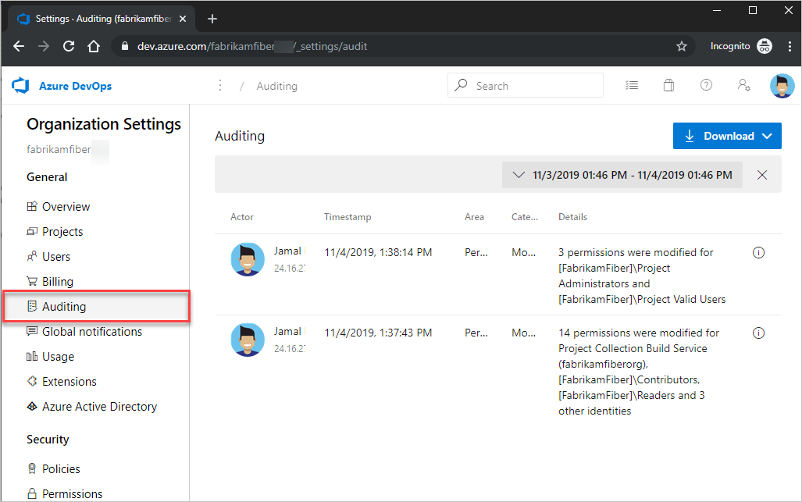
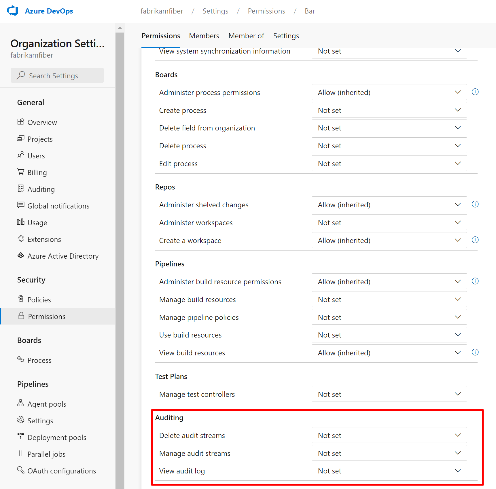

# Access, export, and filter audit logs

[!INCLUDE [version-vsts-only](../../includes/version-vsts-only.md)]

You can access, export, and filter audit logs. Audit logs contain many changes that occur throughout an Azure DevOps organization. Changes occur when a user or service identity within the organization edits the state of an artifact. 

Audit events can be the following occurrences:

- permissions changes
- deleted resources
- branch policy changes
- accessing the auditing feature
- and much more

> [!NOTE]
> Auditing is currently in a Public Preview for Azure DevOps Services. Auditing isn't available for on-premises deployments. For auditing to connect to an on-premises or cloud-based Splunk requires allowing IP ranges for inbound connection. For details, see [Allowed address lists and network connections, IP addresses and range restrictions](../security/allow-list-ip-url.md#range-restrictions).


Auditing is turned on by default for all Azure DevOps Services organizations. You can't turn auditing off, which ensures that you never miss an actionable event. Events get stored for 90 days and then they’re deleted. However, you can back up audit events to an external location to keep the data for longer than the 90-day period. 

## Prerequisites

By default, Project Collection Administrators are the only group that have full access to the auditing feature.

### Audit permissions

- Members of the **Project Collection Administrators** group have full access to all auditing features.
- Members of the **Project Collection Valid Users** group can view the Auditing page and export audit logs.

> [!NOTE]  
> If the **Limit user visibility for projects** preview feature is enabled for the organization, users added to the **Project-Scoped Users** group can't view **Auditing** and have limited visibility to **Organization Setting** pages.  To learn more, see [About projects and scaling your organization, Project-scoped Users group](../../organizations/projects/about-projects.md#project-scoped-user-group). 

## Access auditing

> [!NOTE]
> To enable the new user interface for the Organization Permissions Settings Page, see [Enable preview features](../../project/navigation/preview-features.md).

#### [Preview page](#tab/preview-page)

1. Sign in to your organization (```https://dev.azure.com/{yourorganization}```).
2. Select  **Organization settings**.

   

3. Select **Auditing**.

   
   If you don't see Auditing in Organization settings, then you don't have access to view audit events. Outside of the Project Collection Administrators group, you can give permissions to other users and groups, so they can view auditing.
4. Select **Permissions**, and then find the group or users to provide auditing access to.

     

5. Set **View audit log** to **allow**, and then select **Save changes**.
   

The user or group members have access to view your organization audit events.

#### [Current page](#tab/current-page)

1. Sign in to your organization (```https://dev.azure.com/{yourorganization}```).
2. Select  **Organization settings**.
   
   
   
3. Select **Auditing**.

   
   If you don't see Auditing in Organization settings, then you don't have access to view audit events. Outside of the Project Collection Administrators group, you can give permissions to other users and groups, so they can view auditing.
4. Select **Security**, and then find the group or users to provide auditing access to.
5. Set **View audit log** to **allow**, and then select **Save changes**.
   

The user or group members have access to view your organization audit events.

* * *

## Review audit log

The auditing page provides a simple view into the audit events recorded for your organization. You can only search by time range to find audit events that occurred within the last 90 days. 

See the following description of the information that's visible on the auditing page.

### Audit event information and details

|Information  |Details  |
|---------|---------|
|Actor     | Display name of the individual that triggered the audit event.      |
|IP    |  IP address of the individual that triggered the audit event.    |
|Timestamp     | Time that the triggered event happened. Time is localized to your time zone.        |
|Area     | Location in Azure DevOps where the event occurred.        |
|Category     | Description of the type of action that occurred. For example, modify, rename, create, delete, remove, execute, and access.   |
|Details    | Brief description of what happened during the event.        |

Each audit event records additional information to what's viewable on the auditing page. This information includes the authentication mechanism, a correlation ID to link similar events together, user agent, and additional information that’s dependent on the type of audit event. This information can only be viewed by downloading auditing events.

To scope down the viewable audit events, select the time filter on the top-right-hand side of the page. 


You can select any time range over the last 90 days and scope it down to the minute. Once you’ve selected a time range, select anywhere off the time range selector to start the search. By default, the top 200 results are returned for that time selection. If there are more results, then you can scroll down to load them onto the page. If you wish to further scope down the set of results returned, then you need to download the auditing data.

Some audit events can contain multiple actions that took place at once, known as bulk audit events. You can distinguish these events from others with :::image type="icon" source="../security/media/select-information-icon.png" border="false"::: **Information** on the far right of the event. 


Selecting the information icon displays additional information about what happened in this audit event.

## Export auditing events

To do a more detailed search of the auditing data, or store more than 90 days of data, you need to export existing audit events. The exported data can then be stored in another location or service. 

Select the **Download** button in the top-right-hand side of the auditing page to export auditing events. You can select to download as a CSV or JSON file. 

Selecting either option starts the download. Events get downloaded based on the time range you've selected in the filter. If you had one day selected, then you get that one day’s worth of data. Transversely, if you wanted all 90 days, select 90 days from the time range filter and then start the download. 

## Filter audit log

You can search audit events by time range in Azure DevOps. Other, more detailed types of searches require other tools after exporting your audit event data. 

We recommend you download the logs as CSV files for quick investigations. You can then use Microsoft Excel or other CSV parsers to quickly filter on the area and category columns. In longer term investigations, we recommend you place your exported audit events in a Security Incident and Event Management (SIEM) tool. The tool allows you to keep greater than 90 days of events, searches, generated reports, and configured alerts based on audit events. 

When you filter through audit events, it’s best to use the *area* and *category* columns. These columns allow you to quickly filter down to only the types of events that you’re interested in. The following tables have a list of areas and categories, and their descriptions. 

### Categories


|Category  |Description |
|---------|---------|
|Modify     | A changed artifact, which could be a state or property change, in an organization.        |
|Rename     | Artifact had its name changed in an organization.        |
|Create     | Newly created artifacts in an organization.        |
|Delete     | Deleted or removed artifacts from an organization.        |
|Access     | Viewed or opened artifacts in an organization.        |
 
### Areas

> [!Note]
> While auditing is in a public preview, we're working hard to get more areas audited. We're adding new auditing events monthly.
>
> If you can't find the auditing event you're looking for in the following table, be sure to check the REST API: `https:\//auditservice.dev.azure.com/{YOUR_ORGANIZATION}/_apis/audit/actions`. Replace {YOUR_ORGANIZATION} with the name of your organization. The API shows a list of all audit events your organization could emit. 

|Area            |Description |
|----------------|------------|
| Permissions    | Track permission changes made to groups and users throughout an Azure DevOps organization.           |
| Project        | Create, delete, change visibility, update, and rename a project in an organization. Create area path, update area path, and delete area path.          |
| Audit       | View or download the audit log. |
| Extensions     | Install, remove, enable/disable, and update extensions.           |
| Licensing      | Assign, change, and remove licensing. Create, modify, and delete group licensing rules.           |
| Process        | Process (agile) create, delete, and modify.           |
| Pipelines      | Create, delete, and update Pipelines (designer UX pipelines only at this time)          |
| Policy         |  Create, delete, and update policy for a Git repo.       |
| Git            |  Create, delete, modify, bypass PR policy, and delete Git repo.          |
| Group          |  Change, update, delete, create, and rename group membership.          |
| Release        |  Create, delete, modify, approval complete, and deployment complete for a release.          |
| OrganizationPolicy | Changes to organization policies (for example, no basic authentication).           |
| Organization   | Rename, change owner, link to Azure Active Directory (Azure AD), and unlink from Azure AD.            |
| Security     | Modify security permissions, create group, delete group, update group, add member to group, and remove member from group.       |
| Agile     |Process, create, delete, and modify.         |
| Notification    |Create, remove, and modify a subscription.         |
| Git        | Branch policies, and create, delete, and rename repository. |
| Billing        | Adding, changing and removing Azure Subscription for billing, Changes to billing quantities (pipelines, artifacts and cloud load test)  |
| User | Sign-in events or access events of PAT and SSH |
| Token / Authentication | Create, update, and removal/revocation Personal Access Tokens (PATs) or SSH Key. |


### Filtering tips

With a downloaded a copy of your auditing events, you can see the additional information with each event. See the following useful tips for how to filter through events beyond using only the categories and areas fields. 

**ID & correlation ID**

Each audit event has unique identifiers called the “ID” and “CorrelationID”. The correlation ID is helpful for finding related audit events. For example, a created project can generate several dozen audit events. You can link these events together because they all have the same correlation ID. 

When an audit event ID matches its correlation ID, it indicates that the audit event is the parent or original event. So, the initial event, showing that a user created a project, has the same ID as the correlation ID. To see only originating events, you can set a filter where “ID” equals the “Correlation ID”. Then, if you find an event that you want to investigate, you can search for only events with that correlation ID. Not all events have other related events. 

## Limitations

The following limitations exist for what can be audited. 

* Azure AD group membership changes – In the future, auditing includes changes to Azure DevOps groups, such as adding or removing a group or user. However, if you manage membership via Azure AD groups, additions and removals of users from those Azure AD groups aren't audited by Azure DevOps. Review the Azure AD audit logs to see when a user or group was added or removed from an Azure AD group. 
* Signing in – We don't track sign in events for Azure DevOps. View the Azure AD audit logs to review sign in events to your Azure AD. 

## Related articles
- [Auditing streaming](auditing-streaming.md)

