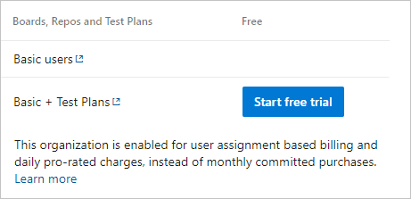
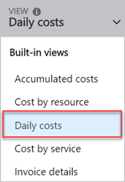
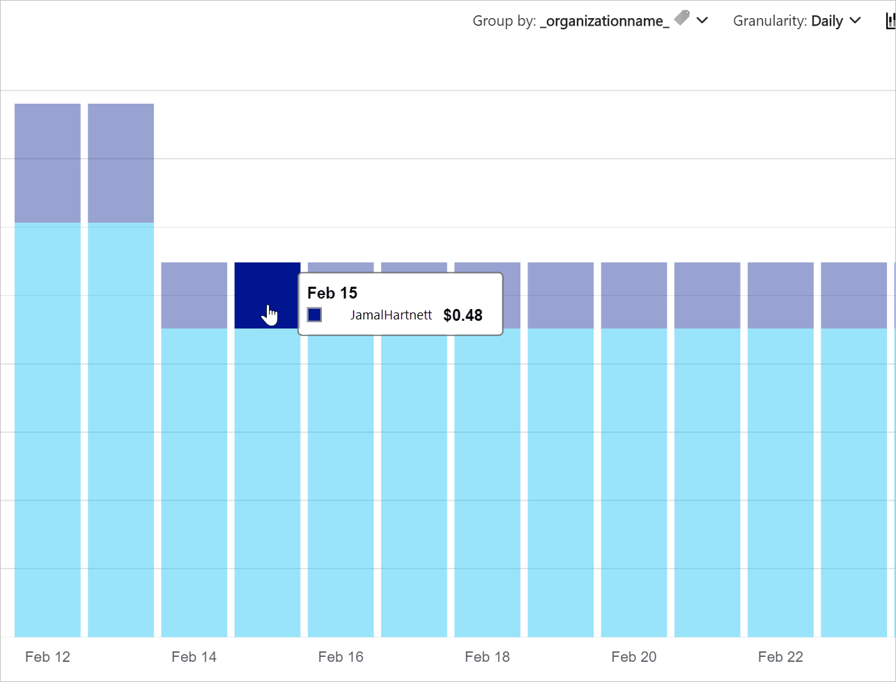

---
title: Frequent questions about billing management
titleSuffix: Azure DevOps
ms.custom: seodec18
description: Find answers to frequently asked questions (FAQs) about billing for your organization
ms.technology: devops-billing
ms.assetid: 62d94b8a-256a-4347-905a-3393f5d8a13f
ms.topic: conceptual
ms.author: chcomley
author: chcomley
ms.date: 02/27/2020
monikerRange: '>= tfs-2015'
---

# Billing FAQs

[!INCLUDE [temp](../../includes/version-vsts-tfs-all-versions.md)]

In this article, find answers to frequently asked questions about billing for your organization.

[!INCLUDE [pricing-calculator-tip](../../includes/pricing-calculator-tip.md)]

## User assignment-based billing

For more information about user assignment-based billing, see our [blog post](https://devblogs.microsoft.com/devops/a-simpler-way-to-buy-azure-devops/).

### Q: What is user assignment-based billing?

A: With user assignment-based billing, you only pay for the users you assign an access level. When you remove the users, charges stop. There's no longer an extra step of increase/decreasing the paid count.

In assignment-based billing, all organizations begin with new users added from projects with Stakeholder access. So, we don't charge for new users who only need free Stakeholder access. If you want all new users to get Basic, change the [default access level](#q-how-can-new-users-get-basic-instead-of-stakeholder-when-added-to-a-project) for your organization to Basic.

[Group rules](../accounts/assign-access-levels-and-extensions-by-group-membership.md) are a great way to automate access level assignment for your organization and under assignment-based billing, you’ll find that assignment errors are no longer common.

### Q: How can new users get Basic instead of Stakeholder when added to a Project?

A: When a user is new to the organization and is added to a project, previously they would get Basic access level. If you purchased Basic, but it wasn’t yet assigned to a user. With assignment-based billing, you pay only for the users you assign, so there aren’t any that are “unassigned”. 

If you want all new users added to a project to get Basic, change the default access level (**Organization Settings** > **Billing**) to Basic.

For more granular control over the access level that's assigned to new users, consider setting up group rules. [Group rules](../accounts/assign-access-levels-and-extensions-by-group-membership.md) take precedence over default access level. The default access level only applies when a user has zero group rules applied. Group rules assign access to users who aren't directly assigned an access level. To have these group rules apply to your existing users, you need to [remove direct assignments](../accounts/assign-access-levels-and-extensions-by-group-membership.md#remove-direct-assignments).

### Q: Am I charged for users even if they never sign in?

A: If you add a user with Basic or Basic + Test Plans access level, you pay at the time of assignment. When you create a [group rule](../accounts/assign-access-levels-and-extensions-by-group-membership.md) that applies to potential new users, that you haven’t added manually, you don’t start paying until they sign in and receive an access level.

### Q: How can I stop paying for users who aren't actively using Azure DevOps?

A: If you have inactive users, stop paying for them by removing them or assigning them a free Stakeholder access level. Sort by **Last Access** to find users who haven’t accessed the organization recently. For users who have never signed in, find out how recently they were added by exporting the list of users and checking the **Date Created** column.

### Q: How can I pay only once per user across multiple organizations?

A: Multi-org billing/licensing is available. For more information, see [multi-org billing](#multi-org-billing).

### Q: What's the difference between daily pro-rated charges instead of monthly committed purchases?

A: As part of the change to user assignment-based billing, we've also switched from monthly to daily billing. When you give a user paid access for a few weeks, or even a few days, you pay only for the time they're assigned the paid access, rather than a full month. As we switch your organization from monthly to daily billing, your next Azure bill will likely be lower than it has been previously. The next month will be back to normal, once a full month of daily charges has accumulated.

### Q: How did paid extensions change in the Azure DevOps Marketplace in July 2019?

A: Microsoft ended support for purchasing third party paid Azure DevOps extensions through your Azure bill on July 1, 2019. We're encouraging our publishers to offer paid access to their services directly.

### Q: Do I need to pay to add "Package Management" users in Team Foundation Server 2017 and 2018?

A: Since June 1, 2019, on-premises Azure Artifacts, for example, Package Management, is included with the Basic license. For Azure DevOps Server 2019, purchase a Basic license and assign it to the user. For TFS 2017 and 2018, no additional purchase is required, but you still need to [assign users the Package Management extension license](../../artifacts/start-using-azure-artifacts.md) to use the feature.

## Multi-org billing

Multi-org billing allows you to pay once per user, for organizations under the same Azure billing subscription.

### Q: Does multi-org billing make sense for all customers?

A: No. Each organization gets five free Basic users. Those users apply to the billing subscription, not the organization. When most users access only one organization, then five free users are most cost effective. If many users access multiple organizations, then multi-org billing is likely the best option. 
 
### Q: How can I turn on multi-org billing?

A: Multi-org billing is available. For more information, see the [Azure DevOps Roadmap item](https://dev.azure.com/mseng/AzureDevOpsRoadmap/_workitems/edit/1366420).  
 
### Q: Can I use different Azure subscriptions for billing, but still pay only once per user?

A: No. Multi-org billing groups the per user charges at an Azure subscription level, so only organizations that share a common Azure subscription will be billed together. 
 
### Q: Can I still see multiple line items for each of my organizations on my detailed Azure bill?

A: Yes. First, all organizations under the same billing Azure subscription are ordered. The ordering is consistent month to month, but it isn't configurable. Second, the five free Basic users apply to the first organization in the list, and any remaining value is carried over to subsequent organizations. Third, users are billed in the first organization they can access and not again in any subsequent organizations. Finally, based on these rules, if there are any charges for an organization, then there will be a separate line item for that organization on the detailed Azure bill. 
 
### Q: Can I tell what access level a user has assigned in a different organization?

A: No. User assignments are applied in each organization independently. An administrator in one organization can’t tell whether a user they're adding already has an access level that's assigned in another organization.  
 
### Q: What if a user is assigned Basic in one organization and Basic + Test Plans in another?

A: They're billed for both Basic and Basic + Test Plans, which is a current limitation of multi-org billing. We recommend assigning users with group rules and setting up the same group rules in each organization to ensure consistent access level assignment. 
 
### Q: How can I get a list of all the users I’m paying for under multi-org billing?

A: Export a list of users from **Organization settings > Users**. Then, remove duplicates based on email address. When multi-org billing goes into GA (general availability), we'll have a way to export the list of all users under an Azure subscription. 

### Q: Why are additional free user grants removed when multi-organization billing is enabled?

A: The most common reason customers have received extra free user license grants in the past is because Azure DevOps didn't yet support multi-org billing. For that reason, when you enable multi-organization billing, additional free grants are removed. If you have a free grant that was applied to one or more of your organizations for a different reason, for example the [Microsoft Enterprise DevOps Accelerator Offer](https://info.microsoft.com/microsoft-enterprise-devops-accelerator-offer.html), [contact us](mailto:azdevgrant@microsoft.com?subject=Multi-org%20billing%20-%20free%20user%20grant%20request) to request the grant be applied to your Azure subscription instead. 

## General billing

### Q: How do I pay for Azure DevOps support?
 
Keep in mind that if you’re already using Azure, chances are you already have an [Azure support plan](https://azure.microsoft.com/support/plans/), so you can [create a support request](https://docs.microsoft.com/azure/azure-portal/supportability/how-to-create-azure-support-request). Also, you don’t need to pay for [billing support](https://ms.portal.azure.com/#blade/Microsoft_Azure_Support/HelpAndSupportBlade/overview). You can report a service outage from our [service status page](https://status.dev.azure.com/). 
 
A: If you need technical support with Azure DevOps and don’t have an [Azure support plan](https://azure.microsoft.com/support/plans/) already, complete the following steps:
 
1. Create an Azure subscription.
  - Consider your [purchase options](https://azure.microsoft.com/pricing/purchase-options/) and decide whether you’ll set up payment direct with Azure, through a partner, or through a Microsoft representative.
  - The simplest option is to [pay for Azure directly](https://azure.microsoft.com/pricing/purchase-options/pay-as-you-go/). It's free to create an Azure subscription, you’ll only pay for what you use.
 
2. Pick a support plan.
  - As part of signing up for an Azure subscription, you can pick a [support plan](https://azure.microsoft.com/support/plans/).
  - All support plans let you create unlimited support requests for a fixed monthly price.
  - All paid plans, including the Developer plan, offer technical support for Azure DevOps.
3. Submit a support ticket.
  - Now you can [open a request via the Azure portal](https://ms.portal.azure.com/#blade/Microsoft_Azure_Support/HelpAndSupportBlade/overview) or [learn how to create a support request](https://docs.microsoft.com/azure/azure-portal/supportability/how-to-create-azure-support-request). 

### Q: Can I buy Azure DevOps by using a purchase order?

A: No. Azure DevOps must be purchased through an Azure subscription. (Think of it as your Azure billing account.)

### Q: Can I use Azure DevOps for free?

A: Yes. You can use Azure DevOps up to the free tier limits for your organization, listed as follows:

[!INCLUDE [free-tier](../../includes/free-tier.md)]

### Q: What types of Azure subscriptions can be used to buy Azure DevOps?

A: Almost all Azure subscriptions. We support Azure subscriptions connected to your
[Enterprise Agreement (EA)](https://azure.microsoft.com/pricing/enterprise-agreement/), Azure subscriptions set up by
Cloud Solution Providers (CSPs), through Microsoft Open License resellers, and Pay-As-You-Go. You can also buy using Azure subscriptions that Visual Studio subscribers set up as a subscriber benefit. (But no, your monthly credit can't be used pay for more Visual Studio subscriptions.)

The only notable exclusion is that you can't use the [Azure free trial](https://azure.microsoft.com/pricing/free-trial/), Government, or National clouds.

### Q: Can I use the monthly Azure credits from my Visual Studio subscription to buy Azure DevOps?

A: No, you can't use the monthly Azure credits from [Visual Studio subscriptions](https://visualstudio.microsoft.com/products/subscriber-benefits-vs)
to pay for Azure DevOps. Before you make purchases by using this type of Azure subscription, you must [remove your spending limit](https://azure.microsoft.com/pricing/spending-limits/).

> [!NOTE]
> Remove your spending limit indefinitely. This prevents disabling your Azure subscription when your recurring monthly charges are billed the next month.
> Otherwise, all resources billed to this subscription are suspended, including virtual machines and all other workloads.

### Q: Am I required to buy other Azure services?

A: Not at all. If you only want to buy Azure DevOps via Azure, you can do that.

### Q: Can tags be applied to organizations from the Azure portal?

A: No, but this feature is in our backlog to add in the future.

## Understanding your bill

Azure DevOps charges appear with other Azure charges on your [Azure bill](https://docs.microsoft.com/azure/cost-management-billing/understand/review-individual-bill). This section helps you with understanding how to drill into your Azure DevOps specific charges.

Complete the following step to view by cost analysis.

1. Go to [Azure Portal > Subscriptions](https://ms.portal.azure.com/#blade/Microsoft_Azure_Billing/SubscriptionsBlade), and then select **Cost analysis**.

    

### Q: How do I see only my Azure DevOps charges?

A: Follow these steps to see only your charges for Azure DevOps.

1. Go to **Azure Portal** > **Subscriptions** > **Cost analysis**.
2. Filter on **Service name** = **Azure DevOps**.

   

### Q: How much am I currently spending on Azure DevOps?

A: Azure DevOps charges daily, so the best way to see what you’re currently paying for Azure DevOps is to view by daily costs. 

1. Go to **Azure Portal** > **Subscriptions** > **Cost analysis**.
2. View by **Daily costs**.

   

### Q: What services do I pay for in Azure DevOps?

A: Azure DevOps services include Azure Repos, Azure Boards, Azure Pipelines, Azure Artifacts, and Azure Test Plans. See [Azure DevOps pricing](https://azure.microsoft.com/pricing/details/devops/azure-devops-services/) for more details. To see these services on your bill, follow these steps. 

1. Go to **Azure Portal** > **Subscriptions** > **Cost analysis**.
2.  Group by **Meter subcategory**.

   

### Q: How can I split Azure DevOps charges by organization?

A: If you have more than one Azure DevOps organization, for example: `dev.azure.com/<organization>`, that is billed to the same Azure subscription, you may want to separate the charges for each organization. 

To make this easier, we automatically add the tag “_organizationname_” and the name of your Azure DevOps organization associated with the charges. We started emitting this tag in Feb 2020, so you won’t see it before that date. See the following two ways you can use this tag to drill in to charges for a given organization.

1. Go to **Azure Portal** > **Subscriptions** > **Cost analysis**.

    

  - Filter based on tag, and see only charges for a given organization or

     

  - Group by tag, and see charges stacked by organization

     

## How charges are processed

### Q: How are user charges (Azure DevOps user/Basic, Basic + Test Plans, and Azure Artifacts) and CI/CD concurrent job charges (for both Microsoft-hosted and self-hosted CI/CD) processed?

A: Charges are metered daily to the Azure subscription you selected when you set up billing. Charges accumulate and are included on the next Azure bill you receive.

### Q: How do reductions or cancellations work?

A: Reductions and cancellations are effective immediately.

## Changes in Azure subscription status

### Q: What happens if I cancel my Azure subscription or my credit card expires?

A: When the Azure subscription used for billing on your organization isn't in active status - for example, because you cancel it or the credit card used for billing expires - your organization reverts to the free tier of service.

>[!NOTE]
>You must keep your Azure subscription in good standing to avoid interruptions in paid services.

### Q: Where can I check my bill or update billing details on my Azure subscription?

A: If you're the owner or contributor for the Azure subscription used for billing your organization, you can view your billing details in the Billing tab of your Organization settings in Azure DevOps.

## Enterprise Agreement customers

### Q: Can I use an Enterprise Agreement to buy Azure DevOps?

A: Yes, you can. You need to be an owner or contributor for an Azure subscription that was created for your EA.

### Q: How can I tell whether I have the necessary privileges to buy services through my organization's Enterprise Agreement?

A: The easiest approach to determine if you have the right privileges is to select the **Buy** button for a service. Select an Azure subscription, which is a billing account, from a presented list of Azure subscriptions that are currently linked to your sign-in. Since the name of your Azure subscription defaults to the type of billing account, for example, "Pay-As-You-Go" or "Enterprise Agreement", it's often clear if the Azure subscription is part of your Enterprise Agreement.

Another approach is to try to visit the [Azure Enterprise Portal](https://ea.azure.com). If you can reach it successfully, then you already have either the enterprise admin or the organization Owner role. Only organization Owners can set up new Azure billing in an Enterprise Agreement. 

If you can't access the Azure Enterprise Portal, find out who your Enterprise Admin is, and ask them to add you as an organization Owner within the Azure Enterprise Portal. If you can't find this person, [submit a support ticket](https://aka.ms/AzureEntSupport) and request the contact information. You need your organization's name and your Enterprise Agreement enrollment number for the support ticket.

### Q: Can I use the Azure Monetary Commitment funds from my Enterprise Agreement to buy Azure DevOps?

A: Yes, you can use these prepaid funds for all services that Azure DevOps offers. Make sure to choose an Azure subscription that was created for your EA when you [set up billing for your organization](set-up-billing-for-your-organization-vs.md).

The only exclusion is for extensions offered by partners. These charges appear on your next "overage" invoice. Typically, charges occur monthly, but because of historical rules for some EA customers, an overage invoice might not be issued for several months. Consult a licensing specialist for your EA if you need to know what number of additional purchases, that aren't eligible for Azure Monetary Commitment funds, trigger an overage invoice.

## Other questions

### Q: Why do I no longer see Team Projects in the Azure portal?

A: Starting September 28, 2018 you can no longer create Team Projects or view them in the Azure portal. You can continue to **access** any Team Projects you create via the Azure portal through your organization URL (`https://dev.azure.com/{yourorganization}`) and you can always [create new organizations and projects from visualstudio.com](https://app.vsaex.visualstudio.com/me?mkt=en-US&campaign=o~msft~vscom~vssignin). The best way for Azure users to get started using Azure DevOps is to [create a project](https://azure.microsoft.com/features/devops-projects/).

### Q: Why is my organization already linked to an Azure subscription?

A: Someone already [set up billing](set-up-billing-for-your-organization-vs.md) for your organization. Each organization can use only one Azure subscription for billing. Charges can't be split across multiple Azure subscriptions.

### Q: Can I use the same Azure subscription for billing across multiple organizations?

A: Yes, you can use the same Azure subscription for billing across multiple organizations. But you can't link a single organization to multiple Azure subscriptions.

### Q: Can I buy Azure DevOps from my software reseller?

A:  Yes you can, if your reseller participates in the Cloud Solution Provider program. Just ask them.

## Buy Azure DevOps now

* [Azure DevOps Users/Basic](buy-basic-access-add-users.md)
* [Microsoft-hosted CI/CD](buy-more-build-vs.md#microsoft-hosted-cicd) (formerly hosted pipelines)
* [Self-hosted CI/CD](buy-more-build-vs.md#self-hosted-cicd) (formerly private pipelines)
* [Azure Artifacts](../../artifacts/start-using-azure-artifacts.md)

## Related articles

* [Set up billing](set-up-billing-for-your-organization-vs.md)
* [Add backup billing managers](add-backup-billing-managers.md)
* [Change the Azure subscription for billing](change-azure-subscription.md)
* [Azure DevOps pricing](https://azure.microsoft.com/pricing/details/devops/azure-devops-services/)
* [Azure DevOps billing support](https://azure.microsoft.com/support/devops/)
