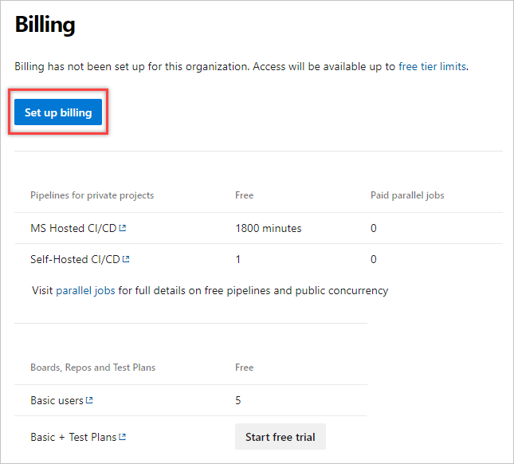

# Set up billing

[!INCLUDE [version-eq-azure-devops](../../includes/version-eq-azure-devops.md)]

Set up billing in Azure DevOps before you make purchases, so it's already in place once you're ready to buy. You only need to set up billing once for your organization. Once you select an Azure subscription for billing, you can purchase more user licenses by adding the user to the organization and assigning them a license.

*All services are billed via Azure*. You're not required to use any other Azure services.

[!INCLUDE [pricing-calculator-tip](../../includes/pricing-calculator-tip.md)]

## Prerequisites

* If you don't have an Azure subscription, [create one](https://azure.microsoft.com/pricing/purchase-options/).
* You must have the [Owner or Contributor role for the Azure subscription](add-backup-billing-managers.md) you want to use for billing.
* You must be a member of the [Project Collection Administrators group](../security/look-up-project-collection-administrators.md). Organization owners are automatically members of this group.

> [!NOTE]
> Azure DevOps doesn't support the [Azure Free Trial](https://azure.microsoft.com/offers/ms-azr-0044p/).

## Set up billing for your organization

1. Sign in to your organization (```https://dev.azure.com/{yourorganization}```).

1. Select  **Organization settings**.

   
   
1. Select **Billing**.

   
   
1. Select **Set up billing**.

   
   
1. Select your Azure subscription, and then select **Save**.

   
   
      > [!TIP]
   > If you can't see an Azure Subscription associated with a different tenant ID, it’s likely due to authentication issues. Here’s how you can address this situation:
      e to authentication issues. Here’s how you can address this situation:
   >**Tenant context:**
   > - Your organization might be connected to 'Tenant A,' where your user account is registered.
   > - But, the Azure subscription you’re trying to access is associated with 'Tenant B,' a different Microsoft Entra ID tenant.
   >**Authentication steps:**
   > - To access the subscription in 'Tenant B,' you must authenticate with that specific tenant.
   > 1. Go to aex.dev.azure.com directly.
   > 2. In the dropdown menu, select the desired Microsoft Entra ID tenant, 'Tenant B.'
   > 3. Retry the operation, and you should see the subscription.

Billing is set up for your Azure DevOps organization. You can [review your individual Azure subscription bill](/azure/cost-management-billing/understand/review-individual-bill) at any time.

## Next steps

> [!div class="nextstepaction"]
> [Pay for users](buy-basic-access-add-users.md)

## Related articles

* [Change your subscription for billing](change-azure-subscription.md)
* [Add a user who can set up or change billing for Azure DevOps](add-backup-billing-managers.md)
* [Buy Azure Test Plans](buy-basic-access-add-users.md)
* [Learn about cost management and billing](/azure/cost-management-billing/cost-management-billing-overview)
