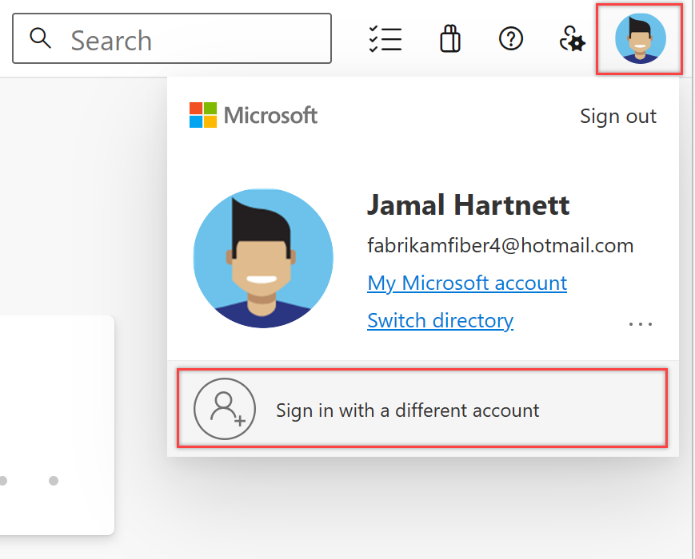
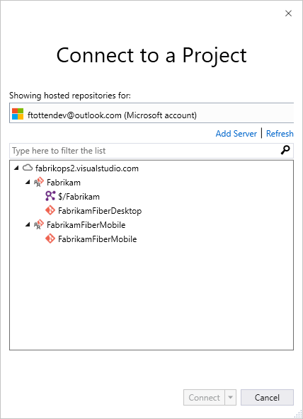
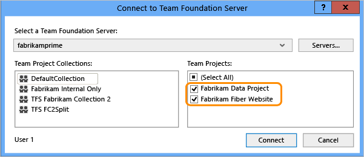
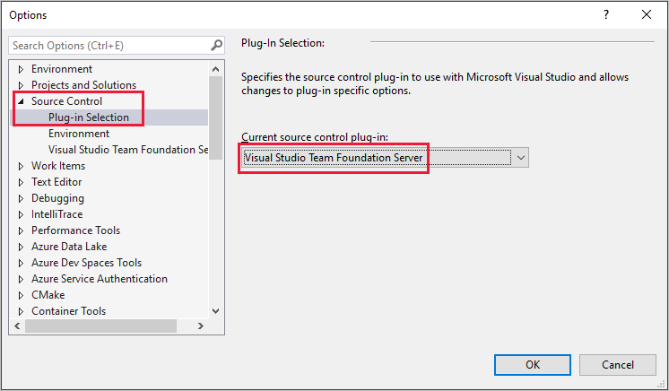
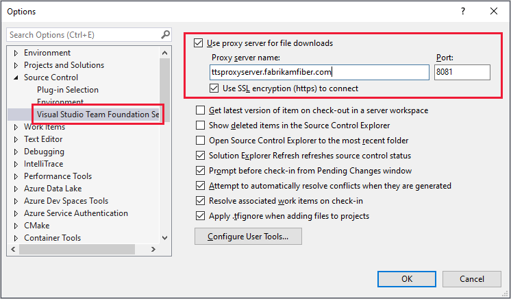

# Connect to a project

[!INCLUDE [version-gt-eq-2019](../../includes/version-gt-eq-2019.md)] 

Learn how to connect to a project, from a client, to share code, build apps, track work, and collaborate with team members. You can connect to a project from any of the following clients:
  
- [Web portal](#web-portal)  
- [Visual Studio or Team Explorer](#visual-studio)   
- [Android Studio with the Azure DevOps Services Plugin for Android Studio](/previous-versions/azure/devops/all/java/download-android-studio-plug-in)  
- [IntelliJ with the Azure DevOps Services Plugin for IntelliJ](/previous-versions/azure/devops/all/java/download-intellij-plug-in) 
- [Visual Studio Code](/previous-versions/azure/devops/all/java/vscode-extension)

A project defines a process and data storage in which you manage your software projects from planning to deployment. When you connect to a project, you connect to an organization or project collection. For more information, see [About projects and scaling your organization](about-projects.md).

## Prerequisites

- You must [have a project](create-project.md) in your organization. If you don't have access to the project, [get invited to the team](../security/add-users-team-project.md).
- From each client, you can switch context to a different project and connect as a different user. If you work remotely, configure your client to [connect to an Azure DevOps Proxy Server](#proxy).
- To get started with a code base, [set up Git](../../repos/git/gitquickstart.md) or [set up TFVC](../../repos/tfvc/index.yml).

<a id="web-portal">  </a>

## Connect from the web portal

::: moniker range="azure-devops"
- Sign in to your project (```https://dev.azure.com/{Your_Organization}/{Your_Project}```).
::: moniker-end

::: moniker range=" < azure-devops" 
- Sign in to your project (```http://ServerName/{DefaultCollection}/{Project_Name}```). 
::: moniker-end

For more information, see [Web portal navigation](../../project/navigation/index.md).

<a name="logindifferentcred"></a>

### Sign in with different credentials

1. Open your profile menu and select **Sign in with a different account**.

   > [!div class="mx-imgBorder"]  
	> 

1. Choose **Sign in** and enter your credentials.

### Open the web portal from Team Explorer

Open the web portal from the home page.


<a id="visual-studio">  </a>

## Connect from Visual Studio or Team Explorer

If you haven't already, [download and install a version of Visual Studio](https://visualstudio.microsoft.com/downloads/download-visual-studio-vs).

If you're not a member of an Azure DevOps security group, [get added to one](../security/add-users-team-project.md). Check with a team member. You need the names of the server, project collection, and project to connect to.

# [Visual Studio 2022](#tab/visual-studio-2022)

1. Select the **Manage Connections** icon in Team Explorer, and then **Connect to a Project**.

   :::image type="content" source="media/team-explorer-connect-to-project-visual-studio-2022.png" alt-text="Screenshot of Connect to projects highlighted for selection.":::  

   All the projects that you can connect to are displayed, along with the repos in those projects.

   

2. Select **Add Azure DevOps Server** to connect to a project in Azure DevOps Server. Enter the URL to your server and select **Add**.

   

3. Select a project from the list and then select **Connect**.

# [Visual Studio 2019](#tab/visual-studio-2019)

### Visual Studio 2019

1. Select the **Manage Connections** icon in Team Explorer, and then choose **Connect to a Project**.

     

   All the projects that you can connect to are displayed, along with the repos in those projects

   

2. Select **Add Azure DevOps Server** to connect to a project in Azure DevOps Services. Enter the URL to your server and select **Add**.

   

3. Select a project from the list and select **Connect**.

# [Visual Studio 2017](#tab/visual-studio-2017)

### Visual Studio 2017

<a id="vs-2017-connect-dialog"></a>

1. Select the **Manage Connections** button in Team Explorer to open the **Connect** page. Choose the **Connect to Team Project** link to select a project to connect to.

     

   All the projects that you can connect to are displayed, along with the repos in those projects

   

2. Select **Add Server** to connect to a project. Enter the URL to your server and select **Add**.

   

3. Select a project from the list and select **Connect**.

# [Visual Studio 2015](#tab/visual-studio-2015)

### Visual Studio 2015

<a id="connect-dialog"></a>

<a id="vs-2015-connect-dialog"></a> 

1. Select the **Manage Connections** button in Team Explorer to open the **Connect** page. Choose **Connect to Team Project** to select a different organization or project to connect to.

   

2. Select the projects to work on.

   

   If it's your first time connecting, add Azure DevOps to the list of recognized servers.

   

If you selected just one project, you see the **Home** page for that project. The pages differ based on the resources enabled and the source control system selected for your project.

Team Explorer displays the **Home** page for that project. The pages that appear differ based on the resources enabled and the source control system selected for your project.

> [!div class="mx-tdBreakAll"]  
> |Home page with Git  |Home page with TFVC  |
> |-------------|----------|
> |:::image type="content" source="media/te-home-page-git-repo.png" alt-text="Screenshot of Team Explorer Home page with Git as source control.":::|:::image type="content" source="media/te-home-page-tfvc-repo.png" alt-text="Screenshot of Team Explorer Home page w/ TFVC as source control.":::|

For more information, see [Navigate in Visual Studio Team Explorer](../../user-guide/work-team-explorer.md).

Your client remembers the set of connections you configure. You can switch from one project to another from the **Connect** page.

---

### Change sign-in credentials

# [Visual Studio 2022](#tab/visual-studio-2022)

### Visual Studio 2022

1. Select the **Manage Connections** icon in Team Explorer, and then **Connect to a Project**.

   :::image type="content" source="media/team-explorer-connect-to-project-visual-studio-2022.png" alt-text="Screenshot showing Connect to projects highlighted for selection.":::

2. Select a different user or select **Add an account** to access a project using different credentials.

    

3. Sign in with a Microsoft or GitHub account associated with an Azure DevOps project.

# [Visual Studio 2019](#tab/visual-studio-2019)

### Visual Studio 2019

1. Select the **Manage Connections** icon in Team Explorer, and then choose **Connect to a Project**.

     

2. Select a different user or select **Add an account** to access a project using different credentials.

    

3. Sign in using an account that is associated with an Azure DevOps project, either a valid Microsoft account or GitHub account.

# [Visual Studio 2017](#tab/visual-studio-2017)

### Visual Studio 2017


<a id="connect-account-dialog"></a>

<a id="vs-2015-connect-account-dialog"></a>

1. From **Connect**, choose **Connect to Team Project** to sign in with different credentials.

     

1. Select a different user from the drop-down or select **Add an account** to access a project using different credentials.

   

2. Sign in using a valid Microsoft account associated with an Azure DevOps project.

# [Visual Studio 2015](#tab/visual-studio-2015)

### Visual Studio 2015

1. From **Connect**, choose **Connect to Team Project** to sign in with different credentials.

     

   The **Switch User** link appears only when you're actively connected to a project on Azure DevOps.  

   

2. Sign in using a valid Microsoft account associated with Azure DevOps.

---

### Use different Visual Studio credentials

You can run Visual Studio with credentials different from your current Windows user account. Find *devenv.exe* under the *Program Files (86)* folder for your version of Visual Studio.

Select Shift and right-click *devenv.exe*, then select **Run as different user**.


### User accounts and licensing for Visual Studio

To connect to a project, you need your user account added to the project. The **Organization owner** for Azure DevOps or a member of the **Project Administrators** group usually adds user accounts. For more information, see [Add organization users and manage access](../accounts/add-organization-users.md) or [Add or remove users or groups, manage security groups](../security/add-remove-manage-user-group-security-group.md). 

::: moniker range="azure-devops"
Azure DevOps Services provides access to the first five account users free. After that, you need to [pay for more users](../billing/buy-basic-access-add-users.md). 
::: moniker-end

You can also provide access to Stakeholders in your organization with limited access to specific features as described in [Work as a Stakeholder](../security/get-started-stakeholder.md).

<a name="proxy"></a>

## Configure Visual Studio to connect to Azure DevOps Proxy Server 

If your remote team uses an [Azure DevOps Proxy Server](/azure/devops/server/install/install-proxy-setup-remote) to cache files, you can configure Visual Studio to connect through that proxy server and download files under Team Foundation version control.

1. Make sure you're connected to Azure DevOps, as described [in the previous section](#visual-studio).

2. From the Visual Studio **Tools** menu, select **Options**, and then select **Source Control** > **Plug-in Selection**. Select **Visual Studio Team Foundation Server**.

    

3. For **Visual Studio Team Foundation Server**, enter the name and port number for the Azure DevOps Proxy Server. Select **Use SSL encryption (https) to connect**.

    

    Make sure you specify the port number that your administrator assigned to Azure DevOps Proxy.

To associate a file type with a compare or merge tool, see [Associate a file type with a file-comparison tool](../../repos/tfvc/associate-file-type-file-comparison-tool.md) or [Associate a file type with a merge tool](../../repos/tfvc/associate-file-type-merge-tool.md).
 

### Requirements and client compatibility

Some tasks or features aren't available when you connect to a later version of Azure DevOps than your client supports. For more information, see [client compatibility](/azure/devops/server/compatibility).

### Determine your platform version

See [Look up your Azure DevOps platform and version](../../user-guide/lookup-platform-version.md).

## Next steps

> [!div class="nextstepaction"]
> [Get started with Agile tools to plan and track work](../../boards/get-started/what-is-azure-boards.md).

## Related articles

- [Work in web portal](../../project/navigation/index.md)  
- [Work in Team Explorer](../../user-guide/work-team-explorer.md) 
- [Work in Office Excel or Project](../../boards/backlogs/office/track-work.md)
- [Troubleshoot connection](../../user-guide/troubleshoot-connection.md)  
