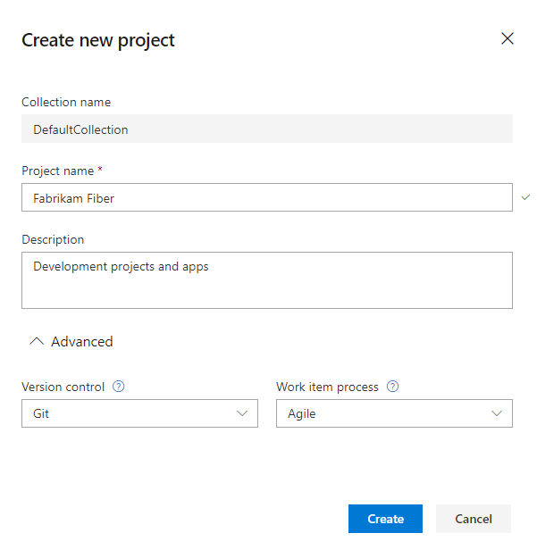
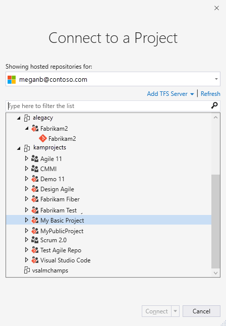
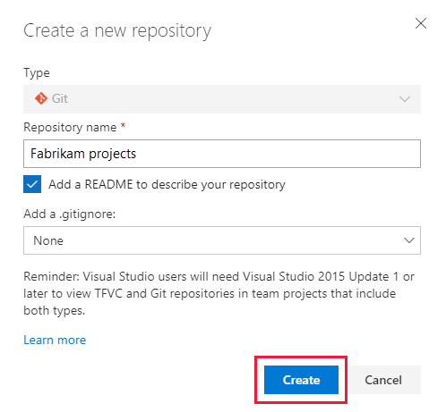
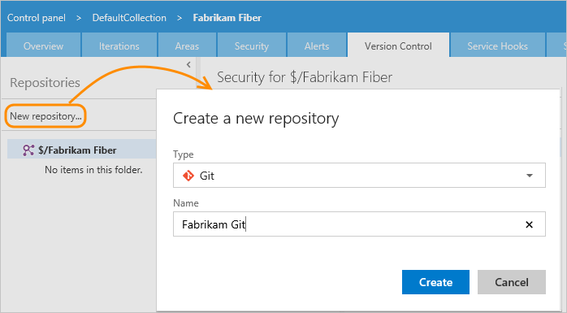

# Create a project in Azure DevOps

[!INCLUDE [version-all](../../includes/version-all.md)]

::: moniker range="tfs-2013"

> [!IMPORTANT]
> Creating a project from the web portal isn't supported for Team Foundation Server (TFS 2015) and earlier versions. Use [Team Explorer](#te) to create a project.  

::: moniker-end

This article describes how to use Azure DevOps to create a project and establish a repository for source code. You can manage and structure each project to support your business needs. Each project you create provides boundaries to isolate data from other projects. To learn more about projects and when to create one, see [About projects and scaling your organization](about-projects.md).

[!INCLUDE [version-selector](../../includes/version-selector-minimize.md)]

If you don't want to create a project in Azure DevOps or TFS, you can create [Azure DevOps Projects](/azure/devops-project/).

<!---Projects differ from [software application projects or solutions](https://msdn.microsoft.com/library/zfzh36t7.aspx). -->  

::: moniker range="< azure-devops"
> [!NOTE]
> If you don't want to manage an on-premises server, you can [sign up for Azure DevOps Services](../accounts/create-organization.md) and create a project.
::: moniker-end

## Prerequisites

::: moniker range="azure-devops" 

- You need an organization before you can create a project. If you haven't created an organization yet, create one by following the instructions in [Sign up, sign in to Azure DevOps](../../user-guide/sign-up-invite-teammates.md), which also creates a project. Or see [Create an organization or project collection](../accounts/create-organization.md).  
- You must be a member of the Project Collection Administrators group or have the **Create new projects** permission set to **Allow**. If you're the Organization Owner, you're automatically added to the Project Collection Administrators group. If you aren't a member, get added now. For more information, see [Set permissions at the project- or collection-level](../security/set-project-collection-level-permissions.md).

::: moniker-end

::: moniker range=">= tfs-2018 < azure-devops"  

- You create a project within a project collection. If you haven't created a project collection yet, do that now. For more information, see [Create a project collection](/azure/devops/server/admin/manage-project-collections?view=azure-devops#create-a-project-collection).
- You must be a member of the Project Collection Administrators group or have the **Create new projects** permission set to **Allow**. If you aren't a member, get added now. For more information, see [Set permissions at the project- or collection-level](../security/set-project-collection-level-permissions.md).

::: moniker-end  


::: moniker range="<= tfs-2017"  

- You create a project within a project collection. If you haven't created a project collection yet, do that now. For more information, see [Create a project collection](/azure/devops/server/admin/manage-project-collections?view=azure-devops#create-a-project-collection).
- You must be a member of the Project Collection Administrators group or have the **Create new projects** permission set to **Allow**. If you aren't a member, get added now. For more information, see [Set permissions at the project- or collection-level](/azure/devops/organizations/security/set-project-collection-level-permissions).
- Ask your TFS administrator about the following resources and get additional permissions as needed:

    - Which project collection should you connect to when you create your project? If you installed TFS using the Basic Server Configuration Wizard, you have only one project collection named **DefaultCollection**. Unless you support hundreds of projects, you should create all your projects within a single project collection. If you need to create additional collections, see [Manage project collections](/azure/devops/server/admin/manage-project-collections).

    - Have you configured SQL Server Analysis Services and SQL Server Reporting Services for the deployment? If so, ask your administrator to add you as a member of the Team Foundation Content Managers group. You must be a member of this group on the server that hosts SQL Server Reporting Services. Without these permissions, you can't create a project. For more information, see [Grant permissions to view or create SQL Server reports in TFS](../../report/admin/grant-permissions-to-reports.md).

    - Have you configured a SharePoint Web application for your deployment? You can configure a SharePoint portal when you create your project. To do so, contact your SharePoint administrator to give you Full Control permissions on the server that hosts SharePoint Products. Otherwise, you can skip this step and configure a portal at a later time.

::: moniker-end

::: moniker range="azure-devops"

> [!IMPORTANT]  
> To create a public project, or to make a private project public, see [Create a public project in your organization](../public/create-public-project.md) or [Change the project visibility, public or private](../public/make-project-public.md). Additional policy settings must be enabled to work with public projects.

::: moniker-end

## Create a project

::: moniker range=">= tfs-2018 < azure-devops"

> [!IMPORTANT]  
> When you create a project from the web portal, several process template files are ignored. Specifically, the files that would create a Report Manager site aren't supported. You can add reports later by following the instructions provided in [Add reports to a teams project](../../report/admin/add-reports-to-a-team-project.md). 

::: moniker-end

::: moniker range="azure-devops"

> [!NOTE]   
> To enable the new user interface for the Settings page, see [Manage or enable features](../../project/navigation/preview-features.md).

::: moniker-end

#### [Preview page](#tab/preview-page) 

::: moniker range=">= azure-devops-2020"

1. Select **Azure DevOps** to open the **Projects** page. 

2. Choose the organization, and then select **New project**.

   > [!div class="mx-imgBorder"]  
   >   

3. Enter information into the form provided. Provide a name for your project. Your project name can't contain special characters, such as `/ : \ ~ & % ; @ ' " ? < > | # $ * } { , + = [ ]`, can't begin with an underscore, can't begin or end with a period, and must be 64 or fewer characters. Enter an optional description. Choose the visibility, initial source control type, and work item process. For more information, see [Choosing the right version control for your project](../../repos/tfvc/comparison-git-tfvc.md) and [Choose a process](../../boards/work-items/guidance/choose-process.md).

   > [!div class="mx-imgBorder"]  
   >   

   Select visibility of either public or private. When you choose public visibility, anyone on the internet can view your project. With private visibility, only people who you give access to can view your project. For more information about public projects, see [Create a public project in your organization](../public/create-public-project.md). If the **Public** option isn't available, you need to change the policy.

4. Select **Create**. The welcome page appears.

   > [!div class="mx-imgBorder"]  
   > 

   Select one of the following options to continue:

   - **Invite**: add others to your project. See [Add users to a project or team](../security/add-users-team-project.md). You can only invite users who are already in your organization. For more information, see [Add users to a project](../security/add-users-team-project.md#add-users-to-a-project).
   - **Boards**: add work items. See [View and add work items using the Work Items page](../../boards/work-items/view-add-work-items.md).
   - **Repos**: clone or import a repository, or initialize a *README* file for your project summary page. See [Clone an existing Git repo](../../repos/git/clone.md).
   - **Pipelines**: define a pipeline. See [Azure Pipelines documentation](../../pipelines/index.yml).
   - **Test Plans**: define test plans and test suites. See [Create test plans and test suites](../../test/create-a-test-plan.md).
   - **Artifacts**: discover, install, and publish NuGet, npm, and Maven packages. See the [Azure Artifacts overview](../../artifacts/overview.md).
   - **manage your services**: disable the visibility of services. See [Turn a service on or off](../settings/set-services.md).

::: moniker-end

::: moniker range="< azure-devops-2020"
Choose Current page tab for information on creating a project. 
::: moniker-end

#### [Current page](#tab/current-page)

::: moniker range="azure-devops-2019 || azure-devops"

1. Select Azure DevOps to open the **Projects** page. 

2. Choose the organization, and then select **Create Project**.

   > [!div class="mx-imgBorder"]  
   >   

3. Enter information into the form provided. Provide a name for your project. Your project name can't contain special characters, such as `/ : \ ~ & % ; @ ' " ? < > | # $ * } { , + = [ ]`, can't begin with an underscore, can't begin or end with a period, and must be 64 or fewer characters. Enter an optional description. Choose the visibility, initial source control type, and work item process. For more information, see [Choosing the right version control for your project](../../repos/tfvc/comparison-git-tfvc.md) and [Choose a process](../../boards/work-items/guidance/choose-process.md).

   > [!div class="mx-imgBorder"]  
   >   

   Select your project visibility of either public or private. When you choose public visibility, anyone on the internet can view your project. With private visibility, only people who you give access to can view your project. For more information about public projects, see [Create a public project in your organization](../public/create-public-project.md). If the **Public** option isn't available, you need to change the policy.

4. Select **Create**. The welcome page appears.

   > [!div class="mx-imgBorder"]  
   > 

   Select one of the following options to continue:

   - **Invite**: add others to your project. See [Add users to a project or team](../security/add-users-team-project.md). You can only invite users who are already in your organization. For more information, see [Add users to a project](../security/add-users-team-project.md#add-users-to-a-project).
   - **Boards**: add work items. See [View and add work items using the Work Items page](../../boards/work-items/view-add-work-items.md).
   - **Repos**: clone or import a repository, or initialize a *README* file for your project summary page. See [Clone an existing Git repo](../../repos/git/clone.md).
   - **Pipelines**: define a pipeline. See [Azure Pipelines documentation](../../pipelines/index.yml).
   - **Test Plans**: define test plans and test suites. See [Create test plans and test suites](../../test/create-a-test-plan.md).
   - **Manage your services**: disable the visibility of services. See [Turn a service on or off](../settings/set-services.md).

::: moniker-end

::: moniker range="azure-devops-2020"
Choose the Preview page tab for instructions.
::: moniker-end
::: moniker range="azure-devops-2019"

1. Select Azure DevOps to open the **Projects** page.  Then, select **Create Project**.

   > [!div class="mx-imgBorder"]  
   >   

2. In **Create a new project**, provide a name for your project, and optionally a description. Expand **Advanced** to select the initial source control type and work item process.

   > [!div class="mx-imgBorder"]  
   >   

   For more information, see [Choosing the right version control for your project](../../repos/tfvc/comparison-git-tfvc.md) and [Choose a process](../../boards/work-items/guidance/choose-process.md).

3. Select **Create**. The welcome page appears.

   > [!div class="mx-imgBorder"]  
   > 

   Select one of the following options to continue:

   - **Boards** to add work items. See [View and add work items using the Work Items page](../../boards/work-items/view-add-work-items.md).
   - **Repos** to clone or import a repository, or initialize a *README* file for your project summary page. See [Clone an existing Git repo](../../repos/git/clone.md).
   - **Pipelines** to define a pipeline. See [Azure Pipelines documentation](../../pipelines/index.yml).
   - **Test Plans** to define test plans and test suites. See [Create test plans and test suites](../../test/create-a-test-plan.md).
   - **Manage your services** to disable the visibility of services. See [Turn a service on or off](../settings/set-services.md).

::: moniker-end

::: moniker range="tfs-2018"

1. Select Azure DevOps to open the **Projects** page.  Then select **New Project**.

   > [!div class="mx-imgBorder"]  
   >   

2. Complete the form provided. Provide a name for your new project, initial source control type, work item process.

   On completion, the project summary displays. For more information, see [Share your project, view project activity](project-vision-status.md).

   > [!div class="mx-imgBorder"]  
   > 

::: moniker-end

::: moniker range=">= tfs-2015 <= tfs-2017"

Creating a project from the web portal is supported for TFS 2015.2 and later versions. For earlier versions, use [Team Explorer to create a project](#te). 

> [!IMPORTANT]  
> When you create a project from the web portal, several process template files are ignored. Specifically, the files that would create a Report Manager site and a SharePoint project portal aren't supported. You can still set up [Reporting](../../report/admin/add-reports-to-a-team-project.md) and [SharePoint](/azure/devops/server/admin/add-sharepoint-to-tfs) manually after project creation.
>
> If you want these features to be to be available, then create your project from Visual Studio/Team Explorer. For more information, see [Process template and plug-in files, Client support for project creation](../../reference/process-templates/overview-process-template-files.md#client-support).

1. If you have TFS 2015.2 or a later version, select the gear button to open the **Projects** page.  Then choose **New Project**.

   > [!div class="mx-imgBorder"]  
   >   

	Otherwise, for TFS 2015 or TFS 2015.1, open the administration overview page by choosing the gear button.  Then select **Server settings** and choose **New project**.

   > [!div class="mx-imgBorder"]  
   > 

   Select the collection administration page for the collection you want to create the project in from the left pane. Select **Create a new project**.

2. Enter information into the form provided. Provide a name for your new project, a short description, and select its initial source control type and work item tracking process.

    > [!div class="mx-imgBorder"]  
    > 

::: moniker-end

#### [Azure DevOps CLI](#tab/azure-devops-cli)

<a id="create-project" /> 

::: moniker range=">= azure-devops-2020" 

You can create a project using the [az devops project create](/cli/azure/ext/azure-devops/devops/project#ext-azure-devops-az-devops-project-create) command. To get started, see [Get started with Azure DevOps CLI](../../cli/index.md).  

> [!div class="tabbedCodeSnippets"]
```CLI
az devops project create --name
                         [--description]
                         [--open]
                         [--org]
                         [--process]
                         [--source-control {git, tfvc}]
                         [--visibility {private, public}]
```

::: moniker-end
[!INCLUDE [temp](../../includes/note-cli-supported-server.md)]  
::: moniker range=">= azure-devops-2020"

#### Parameters

- **name**: Required. Name of the project to create.  
- **description**: Optional. Short description of the project. Enclose the description in quotes.  
- **open**: Optional. Once the command creates a project, it opens in the default web browser.
- **org**: Optional. Azure DevOps organization URL. Required if not configured as default or picked up by using `git config`. You can configure the default organization using `az devops configure -d organization=ORG_URL`. Example: `https://dev.azure.com/MyOrganizationName/`.
- **process**: Optional. The process model to use, such as *Agile*, *Basic*, *Scrum*, *CMMI*, or other custom process model. Agile is the default. To learn more, see [About process customization and inherited processes](../settings/work/inheritance-process-model.md).
- **source-control**: Optional. Type of source control repository to create for the project: *git* (default) or *tfvc*. If not, name or ID of the project. Example: `--project "Fabrikam Fiber"`.
- **visibility**: Optional. Project visibility. Accepted values: *private* (default), *public*.

#### Example

The following command creates a new project named *MyFirstProject* under the Fabrikam organization. The project has the *Agile* process, and *git* source control. For other output format options, see [Output formats for Azure CLI commands](/cli/azure/format-output-azure-cli).

> [!div class="tabbedCodeSnippets"]
```CLI
C:\WINDOWS\system32>az devops project create --name MyFirstProject --description "Test project 1" --org https://dev.azure.com/fabrikam/ --process Agile --source-control  git --output table
ID                                    Name             Visibility    Process    Source Control
------------------------------------  ---------------  ------------  ---------  ----------------
be87c31a-fbb3-4377-b207-57a8caf65e31  MyFirstProject1  Private       Agile      Git
```
::: moniker-end

[!INCLUDE [temp](../../includes/note-cli-not-supported.md)]

#### [Team Explorer](#tab/team-explorer)

::: moniker range="> tfs-2017"

You can't create a project from Team Explorer for TFS-2018 and later versions, including Azure DevOps Services.

::: moniker-end


<a id="te"> </a>

::: moniker range="<= tfs-2017"

You can create a project from Visual Studio/Team Explorer after you've connected to an on-premises Azure DevOps Server.

1. Open the same version of Visual Studio as the version of TFS that you're connecting to. If you don't see the **Team Explorer** pane, select **View** > **Team Explorer** from the menu.

    Download and install [Visual Studio Community](https://visualstudio.microsoft.com/products/visual-studio-community-vs.aspx) to get a free copy of the latest version.

2. Connect to the server and project collection where you want to create your project.

    

    Connect from a client that is at the same version level as TFS. That is, you must connect to TFS 2015 from a version of Visual Studio 2015.

    

    > [!TIP]
    > If you run Team Explorer from a server that hosts SharePoint Products and SQL Server Reporting Services, you might need to run Visual Studio as an administrator.

3. If it's your first time connecting to TFS, you need to add TFS to the list of recognized servers.

    

4. Open the **New Project Wizard**.

    

5. Name the project. Don't specify more than 64 characters.

    

6. Choose a process template. For a comparison of the default process templates, see [Choose a process](../../boards/work-items/guidance/choose-process.md).

    

7. Choose your version control, either Git distributed repositories or TFVC, one centralized repository.

    

    Not sure which system to use? To learn more, see [Git and Azure Repos](../../repos/git/index.yml) and [Use Team Foundation Version Control](../../repos/tfvc/index.yml).

    After you've created your project, you can add repositories. See [Add a repository to your project](#add-a-repository).

8. Unless your project collection supports a SharePoint project portal, you're done.

    

    If the **Next** button is active, you can configure your project portal.

    If you have a problem, you receive an error message and a link to the project creation log. See [Troubleshoot creating a project](faq-create-project.md) for specific errors and exceptions.

    When you're finished, you can see your project in Team Explorer. You can also choose the **Web Access** link to connect to your project from the web portal.

	<tbody valign="top">
	</tbody>
	
	<table>
	<tbody valign="top">
	<tr>
    <td></td>
    <td></td>
	</tr>
	</tbody>
	</table>

::: moniker-end


* * *


::: moniker range=">= tfs-2018 <= azure-devops-2019"

> [!NOTE]
> For TFS 2018 and later versions, use the web portal. Creating a project from Visual Studio/Team Explorer is not supported for TFS 2018 and later versions, including Azure DevOps Server 2019 and Azure DevOps Services.
>
> TFS 2018 and later versions no longer support native integration with SharePoint products. If you're planning to upgrade to TFS 2018, read [About SharePoint integration](../../report/sharepoint-dashboards/about-sharepoint-integration.md) to learn about the options available to you.

::: moniker-end


## List and connect to projects

::: moniker range="azure-devops"

> [!NOTE]   
> To enable the new user interface for the Settings page, see [Manage or enable features](../../project/navigation/preview-features.md).
::: moniker-end

#### [Preview page](#tab/preview-page) 

::: moniker range=">= azure-devops-2020" 

Connect to a project, collection, or server from your web browser.

1. To view the projects defined for an organization, select **Azure DevOps** to open the **Projects** page. 

2. Choose the organization to view the list of projects. The page lists the last two or three projects you connected to at the top. Select any project to connect to that project.

	> [!div class="mx-imgBorder"]  
	>   

3. Or, choose **Organization settings** and then select **Projects** to list all projects.

	> [!div class="mx-imgBorder"]  
	>   

	You can choose a project to open project settings for that project on this page. For more information, see [About settings at the user, team, project, or organization-level](../settings/about-settings.md). Or, you can [rename a project](rename-project.md) or [delete a project](delete-project.md).

::: moniker-end

::: moniker range="< azure-devops-2020"
Choose the Current tab for information.
::: moniker-end

#### [Current](#tab/current-page)

::: moniker range="azure-devops" 

Connect to a project, collection, or server from your web browser.

1. To view the projects defined for an organization, select **Azure DevOps** to open the **Projects** page. 

2. Choose the organization to view the list of projects. The page lists the last two or three projects you connected to at the top. Select any project to connect to that project.

	> [!div class="mx-imgBorder"]  
	>   

3. Or, choose **Organization settings** and then select **Projects** to list all projects.

	> [!div class="mx-imgBorder"]  
	>   

	You can choose a project to open project settings for that project on this page. For more information, see [About settings at the user, team, project, or organization-level](../settings/about-settings.md). Or, you can [rename a project](rename-project.md) or [delete a project](delete-project.md).

::: moniker-end

::: moniker range="azure-devops-2020"
Choose the Preview page tab for information.
::: moniker-end

::: moniker range=">= tfs-2018 <= azure-devops-2019"  

1. To view the projects defined for a collection, select Azure DevOps to open the **Projects** page. 

2. Choose the collection to view the list of projects. The page lists the last two or three projects you connected to at the top. Choose any project to connect to that project.

	> [!div class="mx-imgBorder"]  
	>   

1. Or, select **Admin settings** and then choose **Projects** to list all projects.

	> [!div class="mx-imgBorder"]  
	>   

	You can choose a project to open project settings for that project on this page. For more information, see [About settings at the user, team, project, or organization-level](../settings/about-settings.md). Or, you can [rename a project](rename-project.md) or [delete a project](delete-project.md).

::: moniker-end  

::: moniker range="<= tfs-2017"  

Open the administration overview page by choosing the gear button and choose **Collection settings**. 

> [!div class="mx-imgBorder"]  
> 

You can choose a project to open project settings for that project on this page. For more information, see [About settings at the user, team, project, or organization-level](../settings/about-settings.md). Or, you can [rename a project](rename-project.md) or [delete a project](delete-project.md).

::: moniker-end


#### [Azure DevOps CLI](#tab/azure-devops-cli)

<a id="list-projects" /> 

::: moniker range=">= azure-devops-2020" 

### List projects

You can list projects defined for an organization using the [az devops project list](/cli/azure/ext/azure-devops/devops/project#ext-azure-devops-az-devops-project-list) command. To get started using Azure DevOps CLI, see [Get started with Azure DevOps CLI](../../cli/index.md).  

> [!div class="tabbedCodeSnippets"]
```CLI
az devops project list [--org]
                       [--skip]
                       [--top]
```

#### Parameters 

- **org**: Optional. Azure DevOps organization URL. You can configure the default organization using `az devops configure -d organization=ORG_URL`. Required if not configured as default or picked up via `git config`. Example: `https://dev.azure.com/MyOrganizationName/`.
- **skip**: Optional. Number of results to skip.
- **top**: Optional. Maximum number of results to list.

::: moniker-end
[!INCLUDE [temp](../../includes/note-cli-supported-server.md)]  
::: moniker range=">= azure-devops-2020"


#### Example

The following command lists the projects defined under the Fabrikam organization. For other output format options, see [Output formats for Azure CLI commands](/cli/azure/format-output-azure-cli).

> [!div class="tabbedCodeSnippets"]
```CLI
C:\WINDOWS\system32>az devops project list --org https://dev.azure.com/fabrikam/ --output table
ID                                    Name                Visibility
------------------------------------  ------------------  ------------
647c53b6-01aa-462a-adb7-da81d5620167  Agile 11            Private
c5dd744a-574b-4308-925f-386415dc6efc  CMMI                Private
d4195a58-96a9-4753-bbf9-4c0a4ef178e0  Demo 11             Private
80bb92c7-49b2-43db-9843-3baf8f64b85d  Design Agile        Private
5444a5d2-6bd9-4ad1-a25d-eea59855c2a9  Fabrikam Fiber      Private
36946972-3a77-4bb4-875e-2f66a0f4652c  Fabrikam Test       Private
29bb9642-45f2-42bf-b391-f8701999c5fc  My Basic Project    Private
7aafdbeb-8de1-4e84-978f-d0ee4595b90e  MyFirstProject      Private
aba0ed07-3174-4793-9f2c-d2c5fa6b44d7  MyPublicProject     Public
36ca09d1-9de0-4e3e-8277-e10b5cb96f7c  Scrum 2.0           Private

```

### Show project information, and open in web portal

You can list project information and optionally open the project in the web portal using the [az devops project show](/cli/azure/ext/azure-devops/devops/project#ext-azure-devops-az-devops-project-show) command.  

> [!div class="tabbedCodeSnippets"]
```CLI
az devops project show --project
                       [--open]
                       [--org]
```

#### Parameters 

- **project**: Required. Name or ID of the project. Example: `--project "Fabrikam Fiber"`.
- **open**: Optional. Open the project in the default web browser.
- **org**: Optional. Azure DevOps organization URL. You can configure the default organization using `az devops configure -d organization=ORG_URL`. Required if not configured as default or picked up by using `git config`. Example: `https://dev.azure.com/MyOrganizationName/`.

::: moniker-end
[!INCLUDE [temp](../../includes/note-cli-supported-server.md)]  
::: moniker range=">= azure-devops-2020"


#### Example

The following command lists information for `MyFirstProject` under the Fabrikam organization and opens it in the web portal. For other output format options, see [Output formats for Azure CLI commands](/cli/azure/format-output-azure-cli).

> [!div class="tabbedCodeSnippets"]
```CLI
C:\WINDOWS\system32>az devops project show --project MyFirstProject --open --org https://dev.azure.com/fabrikam/ --output table
ID                                    Name            Visibility    Process            Source Control
------------------------------------  --------------  ------------  -----------------  ----------------
40751c1d-236b-418d-9df4-d5cc7c0e7bd6  MyFirstProject  Private       Scrum - Inherited  Git

```
::: moniker-end

[!INCLUDE [temp](../../includes/note-cli-not-supported.md)]

#### [Team Explorer](#tab/team-explorer)

From Team Explorer, you can view a list of projects by connecting to an organization or server. For more information, see [Connect to a project](connect-to-projects.md).

#### Visual Studio 2019
> [!div class="mx-imgBorder"]  
>   

#### Visual Studio 2017

> [!div class="mx-imgBorder"]  
>   

#### Visual Studio 2015

> [!div class="mx-imgBorder"]  
>   

* * *


<a id="add-a-repository" />

::: moniker range=">= tfs-2015"

## Add a repository to your project

From the admin context of the web portal, you can add additional repositories to a project. Add either Git (distributed) or TFVC (centralized) repositories. You can create many Git repositories, but only a single TFVC repository for a project.  Additional steps to address permissions may be required. For more information, see [Use Git and TFVC repos in the same project](../../repos/git/team-projects.md).

::: moniker-end

::: moniker range=">= tfs-2017"

1. Select **New repository**.

   > [!div class="mx-imgBorder"]  
   >   

2. Name the repository and select **Create**.

   > [!div class="mx-imgBorder"]  
   >   

::: moniker-end

::: moniker range="tfs-2015"


> [!NOTE]
> The ability to work from both Git and TFVC repositories from the same project is supported when you connect to TFS 2015.1 and later versions.

::: moniker-end

## Next steps

> [!div class="nextstepaction"]
> [Structure your project](about-projects.md#project-structure)

## Related articles

- [Get Started with Azure Repos and Visual Studio](../../repos/git/gitquickstart.md)
- [Git and Azure Repos](../../repos/git/index.yml)
- [Team Foundation version control](../../repos/tfvc/index.yml)
- [Get started as an administrator](../../user-guide/project-admin-tutorial.md)
