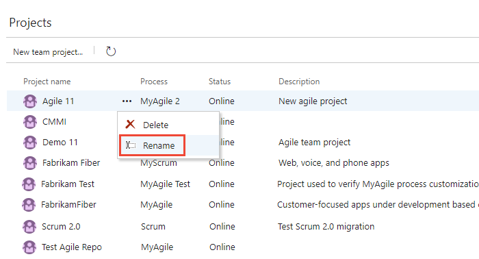
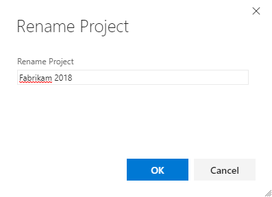

# Rename a project in Azure DevOps

[!INCLUDE [version-lt-eq-azure-devops](../../includes/version-lt-eq-azure-devops.md)]

Learn how to rename a project. When you rename a project, it updates the project name in the following areas:
- version control paths
- work items
- queries
- other project artifacts 

Projects can be renamed multiple times and older names can be reused. 
Post rename, there may be some [required team member actions](#required-user-actions-for-working-with-the-renamed-project).

> [!WARNING]
> Renaming a project sends email notifications to everyone in the project, if there are less than 1,000 users. If there are greater than 1,000 users in your project, only project collection administrators receive email notifications.

## Prerequisites

::: moniker range="azure-devops" 

- You must be a member of the **Project Administrators** group or have the project-level **Rename team project** permission set to **Allow**. For more information, see [Change project-level permissions](../security/change-project-level-permissions.md).

::: moniker-end

::: moniker range=">= tfs-2018 < azure-devops"  

- You must be a member of the **Project  Administrators** group or have the project-level **Rename team project** permission set to **Allow**. For more information, see [Change project-level permissions](../security/change-project-level-permissions.md).

::: moniker-end  

## Rename a project

::: moniker range=">= azure-devops-2019"

1. Sign in to your organization (```https://dev.azure.com/{yourorganization}```), and then open the project that you want to rename.

2. Select **Project settings** > **Overview**, and then enter a new name and select **Save**. 

   

3. To confirm the rename, enter the new project name, check the box next to, "I understand the consequences of renaming this project," and then select **Save**.

   

	Your project is renamed.

::: moniker-end  

::: moniker range="tfs-2018"

1. Sign in to your organization.
2. From the Projects page, choose :::image type="icon" source="../../media/icons/actions-icon.png" border="false"::: **actions** for the project that you want to rename, and then choose **Rename**.

	> [!div class="mx-imgBorder"]  
	> 

3. Edit the name. 

	> [!div class="mx-imgBorder"]  
	> 
	
	If the **Rename Project** dialog doesn't appear, then you're not a member of the **Project Administrators** group for that particular project. 

::: moniker-end  

<a id="more-work"></a>

## Required user actions for working with the renamed project

Each user within your team must restart their clients and do other actions based on the features they use. 

<a id="restarting-clients"></a>

### Restart your clients

Opened clients keep a cache of all project names in memory, but this cache isn't automatically cleared after a project is renamed. To clear the cache, restart your client so it populates the new project name. If you don't restart the client, then operations that use the cached project name fail with a project not found exception.

For the following clients, save your work in each and then restart:

- Visual Studio/Team Explorer

- Eclipse, if your team uses the Team Explorer Everywhere plugin

- Microsoft Excel, PowerPoint, or Project, if your team uses the Team Foundation Server Extension for these Office products
 
- Any more clients that use the .NET Team Foundation Server Client Object Model

<a id="git"></a>

### Update your Git remotes

If your project uses Git, then your remote references for each repository from the renamed project must be updated. These updates are necessary because the remote repository URL contains the project and the repository name. Git uses remote references to fetch and push changes between your local repository and the remote version that's stored on the server. Each member of your team must update their local Git repositories to continue connecting from their dev machines. 

For more information about updating your Git remotes, see [Update the Git remotes on your dev machines](../../repos/git/repo-rename.md#update-the-git-remotes-on-your-dev-machines).

<a id="tfvc-server"></a>

### Update your TFVC server workspaces

If your project uses TFVC with [server workspaces](../../repos/tfvc/decide-between-using-local-server-workspace.md), these workspaces must be updated with the new project name.
For the following clients, execute a get or check-in and then the workspace mapping gets corrected to use the new project name:

- Visual Studio 2015 (RC or newer)  
- Visual Studio 2013  
- Visual Studio 2012  
- Visual Studio 2010 (Only supports server workspaces)  
- Team Explorer Everywhere (2012 or later versions)  


<a id="tfvc-local"></a>

### Update your TFVC local workspaces

If your team uses TFVC with [local workspaces](../../repos/tfvc/decide-between-using-local-server-workspace.md), these workspaces need to be updated with the new project name.
For the following clients, execute a get or check-in and the workspace mapping is corrected to use the new project name:

- Visual Studio 2015 (RC or later versions)  
- Visual Studio 2012 with [Update 5](https://go.microsoft.com/fwlink/?LinkId=615776) (RC or later versions)  
- Team Foundation Server plugin [Team Explorer Everywhere 2015](https://go.microsoft.com/fwlink/?LinkID=617042)

We recommend you update your clients to the latest update or release, if possible. For all other supported Visual Studio versions, you must create a new local workspace mapped to the new project name. Two exceptions include Visual Studio 2010, which only supports server workspaces, and Team Foundation Server plugin for Eclipse. 

1.  [Shelve your changes](../../repos/tfvc/suspend-your-work-manage-your-shelvesets.md).

2.  [Create a new workspace](../../repos/tfvc/create-work-workspaces.md) mapped to the new project name.

3.  Unshelve your changes.

Local workspaces get managed locally and not on the server. Older clients without the updated rename logic can't update local workspaces to the new project name. 
 
::: moniker range="tfs-2018"

<a id="tfs-onprem"></a>

## Update your Team Foundation Server SharePoint and Reporting Integrations (on-premises)

Both SharePoint and Reporting Services integrations continue to work, but some reports don't work as expected until the new project name gets populated.
The old project name is still present until caches are updated with the new name. 
The reporting and SharePoint server administrator can manually run these jobs to immediately populate the new name.

- If your team uses reports, they reflect the new names after the next incremental analysis job runs for the data warehouse. By default the job runs every two hours. But, you can [manually run the warehouse jobs and incremental analysis job](/previous-versions/azure/devops/report/admin/manually-process-data-warehouse-and-cube). Then, the new name gets synced to warehouse and reports start using the new name. Reports don't work as expected until the jobs have run.

- If your team uses SharePoint Integration and has custom queries or web parts that directly reference the project name,
  update the name in each to the new project name. You don't need to update default queries and web parts, as they continue to work.
  Use of <em>@project</em> also continues to work after a project rename and also don't need updating.

- Excel reports and Excel web parts on MOSS don't show the right data until you execute the following.

  1. Warehouse job - [Run the warehouse jobs](/previous-versions/azure/devops/report/admin/manually-process-data-warehouse-and-cube)
     so that Excel reports contain the correct data.
     If the new project name isn't synced to the warehouse,
     Excel reports don't show the correct data.
     To avoid this outcome, manually run warehouse jobs.
  2. SharePoint timer job - Run the "Team Foundation Server Dashboard Update" job
     from the SharePoint central admin to update Excel web parts on the dashboard.
     By default, it runs every 30 minutes.
     Until this job runs, the Excel web parts on the dashboard
     and the reports coming directly from the reporting folder
     won't work. Those web parts use either the wrong project name or the wrong reporting folder.
  3. SharePoint cache - Manually clear the SharePoint cache to avoid stale data,
     such as report folder locations, appearing in the dashboards.
     By default, this cache clears about every hour.
     You can also clear some TFS-specific cache using the TFS redirect url
     and providing a "clearcache" parameter. For example:

     ```
     http://<SharePointServer>/sites/<TeamProjectCollectionName>/<TeamProjectName>/_layouts/TfsRedirect.aspx?tf:type=Report&tf:clearcache=1
     ```

::: moniker-end

## Results of the rename operation

* Work item IDs are unique in the organization. The URL continues to work for both the new team name and the old team name. This functionality is intended, to avoid breaking links.
* As long as the project in the URL is a valid project in the organization, we show the work item ID provided. The following example shows an organization with projects named "Example1" and "Example2". 
   
   `https://dev.azure.com/MyOrg/Example1/_workitems/edit/40/` - Displays work item 40
   `https://dev.azure.com/MyOrg/Example2/_workitems/edit/40/` - Displays work item 40
   `https://dev.azure.com/MyOrg/Potato/_workitems/edit/40/` - Displays a 404 error

* Work item links don't expire.
* The old project name can be used again.

## Related articles

- [FAQs for renaming a project](faq-rename-project.yml)
- [Git and Azure Repos](../../repos/git/index.yml)
- [Team Foundation version control](../../repos/tfvc/index.yml)
- [Go to Visual Studio Team Explorer](../../user-guide/work-team-explorer.md)
- [Git experience in Visual Studio](/visualstudio/ide/git-with-visual-studio)
