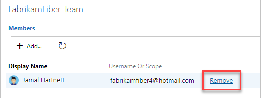
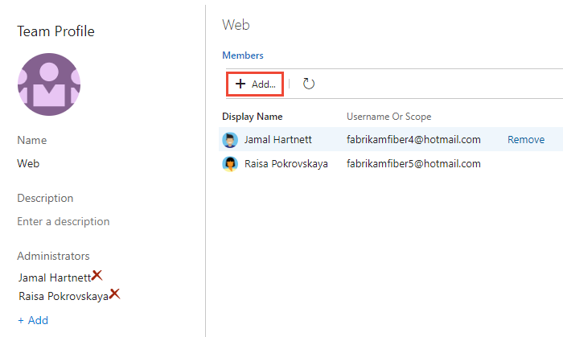
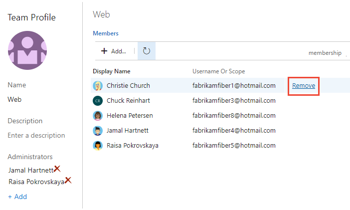
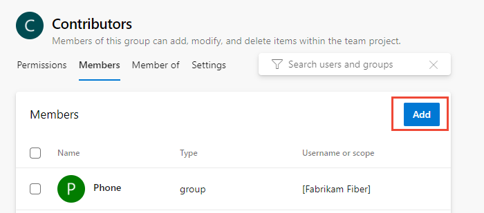
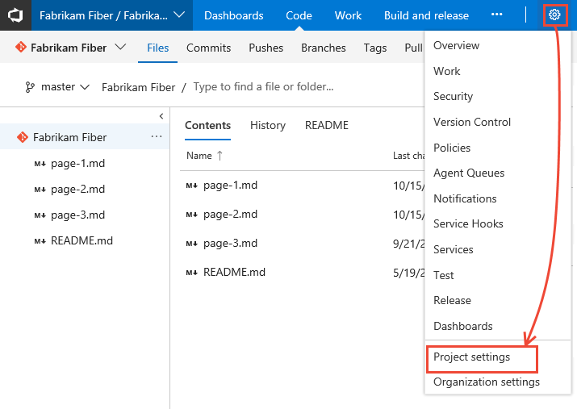

# Add users to a team or project

[!INCLUDE [version-all](../../includes/version-all.md)]

You add users to a team or project so they can contribute to the project or team. Adding them to a team or project automatically adds them to the Contributors group for the project. As a member of the Contributors group, they automatically are granted permissions to most features needed to contribute. By adding them to a team, you also add them to team-specific tools, such as the team security group, Team Members widget, and sprint capacity planning tools. 


If you're new to Azure DevOps, you may want to familiarize yourself with the information provided in these articles: 

- [Get started with permissions, access levels, and security groups](about-permissions.md)  
- [About projects and scaling your organization](../projects/about-projects.md)  
- [Default permissions and access quick reference](permissions-access.md)  
- [About teams and Azure Boards tools](../settings/about-teams-and-settings.md) 

You add projects to an organization or project collection and you add teams to projects. To learn more, see: 
- [Create a project](../projects/create-project.md) 
- [Add team, go from one default team to others](../settings/add-teams.md)

## Supported options for adding users 


 
Here are all the ways you can add to Azure DevOps and the options they support. 

> [!div class="mx-tdBreakAll"]  
> | Level | Required permissions | Interface | Notes and options |
> |-------|-----------|-----------|-------------------| 
> | Organization | Azure Active Directory Administrators |Azure Active Directory | Users you add to Azure Active Directory connected to Azure DevOps are added as members of the Project Collection Valid Users group. |  
> | Collection | Active Directory Administrators | Active Directory or Windows Group | Users you add to Azure Active Directory connected to Azure DevOps are added as members of the Project Collection Valid Users group. |  
> | Organization | Project Collection Administrators |**Organization Settings>Users page** | Add new users and optionally add them to select projects. Must specify the access level. Can use Group rules to further manage groups being added. |  
> | Organization | Project Collection Administrators | `az devops user` CLI | Add new users and send an invite.   |  
> | Project | Project Administrators | Project **Summary** page, **Invite** feature | Add new or existing users and send an invite. Optionally add to one or more teams.   |
> | Project | Project Administrators | **Project Settings>Permissions>Groups>Group** **Members** page | Add new or existing users to a security group. By adding to a Team group, you effectively add them to a team. No invitation is sent.   |  
> | Team | Team Administrators | Team Members dashboard widget | Add new or existing users to a team. Send new users an invite.    |  
> | Team | Team Administrators | **Project Settings>Teams>Team>Members** page | Add new or existing users to a team. Send new users an invite.    |  
 

You can add users in one of the following ways: 
- Invite new users or existing users to a team or project  
- Add new users or existing users to a project-level security group 
- Add new users to an organization and optionally specify the projects they belong to. To learn how, see [Add users and manage access in Azure DevOps](../accounts/add-organization-users.md). 

When you invite new users&mdash;ones not recognized by your organization or collection&mdash;using the first two methods, they automatically become members of the Contributors group for the project they were added to. They also automatically become members of the organization or collection that hosts the project. The system automatically assigns an access level to the user. To modify the access level, you can change it from the [**Organization Settings>Users** page](../accounts/add-organization-users.md).


::: moniker range="= azure-devops"

> [!NOTE]   
> When the organization policy, **Allow team and project administrators to invite new users**, is disabled, Team and Project Administrators can't add users who are not already in the organization to a team or project. Project Collection Administrators can add users whether this policy is on or off. For more information, see [Restrict invitations from Project and Team Administrators](restrict-invitations.md). For an overview of the methods supported for adding users to an organization, see [About organization management, Add and manage user access](../accounts/organization-management.md#add-users). 

::: moniker-end

Once users have been added to a project, you can browse for their display name or user name (email alias). 


## Prerequisites

[!INCLUDE [temp](../../includes/prerequisites-add-users-org.md)]

[!INCLUDE [temp](../../includes/prerequisites-add-users-server.md)]


::: moniker range=">= azure-devops-2020"
If you're adding a user to Azure DevOps for the first time, see [Add account users for Azure DevOps](../accounts/add-organization-users.md).
::: moniker-end


<a id="add-team-members"> </a>

## Add users to a team

Several Agile tools, like capacity planning, team alerts, and dashboard widgets are team-scoped. That is, they automatically reference the user accounts added as members of a team to support planning activities or sending alerts. Also, you can create a query to list work items based on assignment to a Team Group. To learn more, see [About teams and Agile tools](../settings/about-teams-and-settings.md). 

As a team administrator, you can add members from the **Team Members** dashboard widget or the **Project settings> Teams** page for the team.  

<a id="add-team-members-team-services" />

::: moniker range="= azure-devops"

> [!NOTE]   
> To enable the preview feature, **New Teams Page**, see [Enable preview features](../../project/navigation/preview-features.md).

::: moniker-end


#### [Summary or Widget](#tab/summary-widget)

Team administrators can add users to their team from the Team Members widget added to a dashboard. To add a widget to a dashboard, see [Add widgets to a dashboard](../../report/dashboards/add-widget-to-dashboard.md).  

1. To invite someone to your team, choose the plus button of the Team Members widget. 

	:::image type="content" source="media/add-users/team-member-widget.png" alt-text="Screenshot of Team Members widget added to a dashboard, plus icon.":::

2. Enter the user account name or address. You can add several email addresses by separating them with a semicolon (;).   
	:::row:::
	   :::column span="":::
	      If you're adding a new user not known by the organization or collection, enter the email addresses (Microsoft accounts) or GitHub IDs for the users. Choose the entry listed under **Add users** to complete the entry.   
	   :::column-end:::
	   :::column span="":::
	      If you're adding a user known by the organization or collection, simply type the name or email address and then choose the name that appears to complete the entry.   
	   :::column-end:::
	:::row-end:::
	:::row:::
	   :::column span="":::
	      :::image type="content" source="media/add-users/invite-members-dialog.png" alt-text="Invite members to a team dialog, enter an unknown user email address.":::
	   :::column-end:::
	   :::column span="":::
	      :::image type="content" source="media/add-users/invite-members-known-user.png" alt-text="Invite members to a team dialog, enter a known user account.":::
	   :::column-end:::
	:::row-end:::
2. Complete the invitation. 
	:::row:::
	   :::column span="":::
	      When the user is unknown, you'll get a notification that an access level must be assigned. To complete the invitation, choose **Add**.    
	   :::column-end:::
	   :::column span="":::
	      Choose **Add** to complete the invitation.     
	   :::column-end:::
	:::row-end:::
	:::row:::
	   :::column span="":::
	      :::image type="content" source="media/add-users/invite-members-dialog-add-info.png" alt-text="Invite members to a team dialog, Add new user account. ":::
	   :::column-end:::
	   :::column span="":::
	      :::image type="content" source="media/add-users/invite-members-dialog-complete-add.png" alt-text="Invite members to a team dialog, Add buttom.":::
	   :::column-end:::
	:::row-end:::

1. A message will briefly display on the screen to indicate success or failure. Choose **Details** to open the notification and review details. 
	:::row:::
	   :::column span="":::
	      :::image type="content" source="media/add-users/notification-success.png" alt-text="Screenshot of notification success message. ":::  
	   :::column-end:::
	   :::column span="":::
	      :::image type="content" source="media/add-users/notification-failure.png" alt-text="Screenshot of notification failure message. ":::  
	   :::column-end:::
	:::row-end:::
	:::row:::
	   :::column span="":::
	     A success message indicates the status of adding the user to the system. 
	   :::column-end:::
	   :::column span="":::
	      A failure message indicates why the addition of the user failed. 
	   :::column-end:::
	:::row-end:::

	:::row:::
	      :::image type="content" source="media/add-users/summary-invite-notifications-success.png" alt-text="Notification dialog of Success. "::: ":::  
	   :::column-end:::
	   :::column span="":::
	      :::image type="content" source="media/add-users/notification-failure-outside-directory.png" alt-text="Notification dialog of failure. ":::
	   :::column-end:::
	:::row-end:::
 
#### [Security group, Preview page](#tab/preview-page)

::: moniker range="azure-devops"

1. Open a backlog or board for a team and choose the :::image type="icon" source="../../media/icons/team.png" border="false"::: team profile icon. Then choose **Team Settings**. 

   Here we open the Board for the Web team and from there the team profile.  

   > [!div class="mx-imgBorder"]  
   >   

2. If you need to switch the team context, use the team selector within the breadcrumbs.  

	> [!div class="mx-imgBorder"]  
	>  

3. Choose **Add**. 

	> [!div class="mx-imgBorder"]  
	>    

4. Enter the sign-in addresses or display name for each account you want to add. Add them one at a time or all at the same time. You can enter several identities into the text box, separated by commas.

	

   > [!TIP]
   > You must enter user and group names one at a time. However, after entering a name, the account is added to the list, and you can enter another name in the Identities text box before choosing to save your changes.

	You may need to choose the :::image type="icon" source="../../media/icons/refresh.png" border="false"::: refresh icon to see your updates. 

5. To remove members, return to this page, highlight the user name and choose **Remove**.

	> [!div class="mx-imgBorder"]  
	>    

   > [!NOTE]
   > To remove a team administrator as a team member, you must first remove them as an administrator. 

6. To add an account as a team administrator, choose **Add** located in the Team Profile page. For details, see [Add a team administrator](../../organizations/settings/add-team-administrator.md)

::: moniker-end

::: moniker range="< azure-devops"
Choose the **Current page** tab for information on adding a user to a team. 
::: moniker-end

#### [Security group, Current page](#tab/current-page)

::: moniker range=">= azure-devops-2019"

You add team members from **Project Settings>Work>Team configuration**. You can quickly navigate to it from a team work tracking backlog, board, or dashboard. 

1. Open a backlog or board for a team and choose the **Show Team Profile** :::image type="icon" source="../../media/icons/team.png" border="false":::. Then choose **Team Settings**. 

   Here we open the Board for the Web team and from there the team profile.  

   > [!div class="mx-imgBorder"]  
   >   

2. If you need to switch the team context, use the team selector within the breadcrumbs.  

	> [!div class="mx-imgBorder"]  
	>  

3. Choose **Add**. 

	> [!div class="mx-imgBorder"]  
	>    

4. Enter the sign-in addresses or display name for each account you want to add. Add them one at a time or all at the same time. You can enter several identities into the text box, separated by commas.

	

   > [!TIP]
   > You must enter user and group names one at a time. However, after entering a name, the account is added to the list, and you can enter another name in the Identities text box before choosing to save your changes.

	You may need to choose the :::image type="icon" source="../../media/icons/refresh.png" border="false"::: refresh icon to see your updates. 

5. To remove members, return to this page, highlight the user name and choose **Remove**.

	> [!div class="mx-imgBorder"]  
	>    

   > [!NOTE]
   > To remove a team administrator as a team member, you must first remove them as an administrator. 

6. To add an account as a team administrator, choose **Add** located in the Team Profile page. For details, see [Add a team administrator](../../organizations/settings/add-team-administrator.md)

::: moniker-end


::: moniker range="<= tfs-2018"

1. From the project admin context, open the **Overview** page, and then choose the team you want to add team members to.   

	 

2. Choose the **Add** to add a user or a user group.

3. Enter the sign-in addresses or display name for each user you want to add. Add them one at a time or all at the same time. You can enter several identities into the text box, separated by commas.

	

   > [!TIP]
   > You must enter user and group names one at a time. However, after entering a name, it is added to the list, and you can enter another name in the Identities text box before choosing to save your changes.

	You may need to choose the :::image type="icon" source="../../media/icons/refresh.png" border="false"::: refresh icon to see your updates. 

4. To remove members, return to this page, highlight the user name, and then choose **Remove**.

	

   > [!NOTE]
   > To remove a team administrator as a team member, you must first remove them as an administrator. 

5. To add an account as a team administrator, choose **Add** located in the Team Profile page. For details, see [Add a team administrator](../../organizations/settings/add-team-administrator.md).

::: moniker-end

---

<a name="add-users-team-project"></a>

## Add users to a project

As a member of the Project Administrators group, you can add members to a project from the **Summary** page or the **Project settings> Permissions** page by adding them to a security group. From the project **Summary** page, you can choose to add the user account to one or more teams. 

::: moniker range="azure-devops"

> [!NOTE]   
> To enable the new user interface for the **Project Permissions Settings Page**, see [Enable preview features](../../project/navigation/preview-features.md).

::: moniker-end


#### [Summary or Widget](#tab/summary-widget)

1. Open the **Project>Summary** page, and choose **Invite**.  

	:::image type="content" source="media/add-users/summary-invite-users.png" alt-text="Screenshot of Summary page, Invite button.":::

1. To invite someone to your team, choose the plus button of the Team Members widget. 

	:::image type="content" source="media/add-users/team-member-widget.png" alt-text="Screenshot of Team Members widget added to a dashboard, plus icon.":::

2. Enter the user account name or address. You can add several email addresses by separating them with a semicolon (;).   
	:::row:::
	   :::column span="":::
	      If you're adding a new user not known by the organization or collection, enter the email addresses (Microsoft accounts) or GitHub IDs for the users. Choose the entry listed under **Add users** to complete the entry. Optionally, you can select one or more teams to add the user to. To complete the invitation, choose **Add**.       
	   :::column-end:::
	   :::column span="":::
	      If you're adding a user known by the organization or collection, simply type the name or email address and then choose the name that appears to complete the entry. Optionally, you can select one or more teams to add the user to.  To complete the invitation, choose **Add**.    
	   :::column-end:::
	:::row-end:::
	:::row:::
	   :::column span="":::
	      :::image type="content" source="media/add-users/summary-invite-dialog-new-user-selected-team.png" alt-text="Invite members to a project dialog, unknown user, select teams to add.":::
	   :::column-end:::
	   :::column span="":::
	      :::image type="content" source="media/add-users/summary-page-invite-project-members.png" alt-text="Invite members to a project dialog, known user, select teams to add.":::
	   :::column-end:::
	:::row-end:::

1. A message will briefly display on the screen to indicate success or failure. Choose **Details** to open the notification and review details. 
	:::row:::
	   :::column span="":::
	      :::image type="content" source="media/add-users/notification-success.png" alt-text="Screenshot of notification success message. ":::  
	   :::column-end:::
	   :::column span="":::
	      :::image type="content" source="media/add-users/notification-failure.png" alt-text="Screenshot of notification failure message. ":::  
	   :::column-end:::
	:::row-end:::
	:::row:::
	   :::column span="":::
	     A success message indicates the status of adding the user to the system. 
	   :::column-end:::
	   :::column span="":::
	      A failure message indicates why the addition of the user failed. 
	   :::column-end:::
	:::row-end:::

	:::row:::
	      :::image type="content" source="media/add-users/summary-invite-notifications-success.png" alt-text="Notification dialog of Success. "::: ":::  
	   :::column-end:::
	   :::column span="":::
	      :::image type="content" source="media/add-users/notification-failure-outside-directory.png" alt-text="Notification dialog of failure. ":::
	   :::column-end:::
	:::row-end:::
 
 


#### [Security group, Preview page](#tab/preview-page)

::: moniker range="azure-devops"

1. Open the web portal and choose the project where you want to add users or groups. To choose another project, see [Switch project, repository, team](../../project/navigation/go-to-project-repo.md).

2. Choose **Project settings**, and then **Permissions**. 

	

3. Under **Groups**, choose one of the following options:
   - **Readers**: To add users who require read-only access to the project, choose.
   - **Contributors**: To add users who contribute fully to this project or who have been granted Stakeholder access.
   - **Project Administrators**: To add users who need to administrate the project. To learn more, see [Set permissions at the project-level or project collection-level](set-project-collection-level-permissions.md).

   Here we choose the **Contributors** group.

	> [!div class="mx-imgBorder"]  
	>  

4. Next, choose the **Members** tab.

   The default team group, and any other teams you add to the project, get included as members of the **Contributors** group. Add a new user as a member of a team instead, and the user automatically inherits Contributor permissions. 

    > [!TIP]
    > Managing users is much easier [using groups](../../organizations/security/about-permissions.md), not individual users.

5. Choose **Add** to add a user or a user group.

	> [!div class="mx-imgBorder"]  
	>  

6. Enter the name of the user account into the text box. You can enter several identities into the text box, separated by commas. The system automatically searches for matches. Choose the match(es) that meets your requirements.

	  

   > [!NOTE]
   > The first time you add a user or group to Azure DevOps,
   > you can't browse to it or check the friendly name.
   > After the identity has been added, you can just enter the friendly name.

	Choose **Save** when done. 

7. You may customize user permissions for other functionality in the project. For example, in [areas and iterations](set-permissions-access-work-tracking.md) or [shared queries](../../boards/queries/set-query-permissions.md).

   > [!NOTE]
   > Users that have limited access, such as Stakeholders, won't be able to access select features even if granted permissions to those features. To learn more, see [Permissions and access](permissions-access.md).

::: moniker-end

::: moniker range="< azure-devops"

Choose the **Current page** tab for information on adding a user to a project. 

::: moniker-end

#### [Security group, Current page](#tab/current-page) 

::: moniker range=">= azure-devops-2019"

1. Open the web portal and choose the project where you want to add users or groups. To choose another project, see [Switch project, repository, team](../../project/navigation/go-to-project-repo.md).

2. Choose **Project Settings** and then **Security**.

	*To see the full image, select to expand*.

	[](media/view-permissions/open-security-project-level-vert-expanded.png#lightbox) 

3. Under **Groups**, choose one of the following options:
   - **Readers**: To add users who require read-only access to the project, choose.
   - **Contributors**: To add users who contribute fully to this project or who have been granted Stakeholder access.
   - **Project Administrators**: To add users who need to administrate the project. To learn more, see [Set permissions at the project-level or project collection-level](set-project-collection-level-permissions.md).

4. Next, choose the **Members** tab.

   Here we choose the **Contributors** group.

	> [!div class="mx-imgBorder"]  
	>   

   The default team group, and any other teams you add to the project, get included as members of the **Contributors** group. Add a new user as a member of a team instead, and the user automatically inherits Contributor permissions. 

    > [!TIP]
    > Managing users is much easier [using groups](../../organizations/security/about-permissions.md), not individual users.

5. Choose **Add** to add a user or a user group.

6. Enter the name of the user account into the text box. You can enter several identities into the text box, separated by commas. The system automatically searches for matches. choose the match(es) that meets your requirements.

	  

   > [!NOTE]
   > The first time you add a user or group to Azure DevOps,
   > you can't browse to it or check the friendly name.
   > After the identity has been added, you can just enter the friendly name.

	Choose **Save changes** when complete. 

7. (Optional) You can customize a user's permission for other functionality in the project. For example, in [areas and iterations](set-permissions-access-work-tracking.md) or [shared queries](../../boards/queries/set-query-permissions.md).

   > [!NOTE]
   > Users that have limited access, such as Stakeholders, won't be able to access select features even if granted permissions to those features. To learn more, see [Permissions and access](permissions-access.md).

::: moniker-end

::: moniker range="<= tfs-2018"

1. Open the web portal and choose the project where you want to add users or groups. To choose another project, see [Switch project, repository, team](../../project/navigation/go-to-project-repo.md).  

2. Choose the :::image type="icon" source="../../media/icons/gear-icon.png" border="false"::: gear icon to open the administrative context.

     

3. Choose **Security** and under **Groups**, choose one of the following options:
   - **Readers**: To add users who require read-only access to the project, choose.
   - **Contributors**: To add users who contribute fully to this project or who have been granted Stakeholder access.
   - **Project Administrators**: To add users who need to administrate the project. To learn more, see [Set permissions at the project-level or project collection-level](set-project-collection-level-permissions.md).

4. Next, choose the **Members** tab.

   Here we choose the Contributors group.

	> [!div class="mx-imgBorder"]  
	>   

    > [!TIP]
    > Managing users is much easier [using groups](../../organizations/security/about-permissions.md), not individual users.

   By default, the default team group and any other teams you add to the project, are included as members of the **Contributors** group. Add a new user as a member of a team instead, and the user automatically inherits Contributor permissions. 

5. Choose **Add** to add a user or a user group.

6. Enter the name of the user account into the text box. You can enter several identities into the text box, separated by commas. The system automatically searches for matches.

	

   > [!NOTE]
   > The first time you add a user or group to Azure DevOps,
   > you can't browse to it or check the friendly name.
   > After the identity has been added, you can just enter the friendly name.

7. (Optional) You can customize user permissions for other functionality within the project, such as [areas and iterations](set-permissions-access-work-tracking.md) or [shared queries](../../boards/queries/set-query-permissions.md).

   > [!NOTE]
   > Users that have limited access, such as Stakeholders, won't be able to access select features even if granted permissions to those features. To learn more, see [Permissions and access](permissions-access.md).

::: moniker-end

::: moniker range=">= azure-devops-2020"

## List team members or team details  

From the Azure DevOps CLI command, you can see details about a team or list the individual members of that team. To first see a list of all teams in your organization, use the [az devops team list](/cli/azure/devops/team#ext-azure-devops-az-devops-team-list) command.

| [List team members](#list-members) | [Show team details](#show-details)

<a id="list-members" /> 

### List team members

You can list the individual members of a team in your organization with the [az devops team list-member](/cli/azure/devops/team#ext-azure-devops-az-devops-team-list-member) command. To get started, see [Get started with Azure DevOps CLI](../../cli/index.md). 

```azurecli
az devops team list-member --team
                           [--org]
                           [--project]
                           [--skip]
                           [--top]
```

#### Parameters

- **team**: Required. Name or ID of the team to show.
- **org**: Azure DevOps organization URL. You can configure the default organization using `az devops configure -d organization=ORG_URL`. Required if not configured as default or picked up using `git config`. Example: `--org https://dev.azure.com/MyOrganizationName/`.
- **project**: Name or ID of the project. You can configure the default project using `az devops configure -d project=NAME_OR_ID`. Required if not configured as default or picked up using `git config`.
- **skip**: Optional. Number of members to skip.
- **top**: Optional. Maximum number of members to return.

#### Example

The following command lists the first five members of the team named **Fabrikam Team** and returns the details in table format.  

```azurecli 
az devops team list-member --team "Fabrikam Team" --top 5 --output table

ID                                    Name               Email
------------------------------------  -----------------  --------------------------
3b5f0c34-4aec-4bf4-8708-1d36f0dbc468  Christie Church    fabrikamfiber1@hotmail.com
19d9411e-9a34-45bb-b985-d24d9d87c0c9  Johnnie McLeod     fabrikamfiber2@hotmail.com
8c8c7d32-6b1b-47f4-b2e9-30b477b5ab3d  Chuck Reinhart     fabrikamfiber3@hotmail.com
d291b0c4-a05c-4ea6-8df1-4b41d5f39eff  Jamal Hartnett     fabrikamfiber4@hotmail.com
bd30c189-db0f-4dd6-9418-5d8b41dc1754  Raisa Pokrovskaya  fabrikamfiber5@hotmail.com
``` 

<a id="show-details" /> 

### Show team details

You can view details about a team in your organization with the [az devops team show](/cli/azure/devops/team#ext-azure-devops-az-devops-team-show) command. To get started, see [Get started with Azure DevOps CLI](../../cli/index.md).

```azurecli
az devops team show --team
                    [--org]
                    [--project]
```

#### Parameters

- **team**: Required. Name or ID of the team to show.
- **org**: Azure DevOps organization URL. You can configure the default organization using `az devops configure -d organization=ORG_URL`. Required if not configured as default or picked up using `git config`. Example: `--org https://dev.azure.com/MyOrganizationName/`.
- **project**: Name or ID of the project. You can configure the default project using `az devops configure -d project=NAME_OR_ID`. Required if not configured as default or picked up using `git config`.

#### Example

The following command shows information about the team in your organization named **Fabrikam Team** and returns the details in table format.  

```azurecli
az devops team show --team "Fabrikam Team" --output table

ID                                    Name          Description
------------------------------------  ------------  -------------------------------------------------
a48cb46f-7366-4f4b-baf5-b3632398ed1e  Fabrikam Team  The default project team. Was Fabrikam Fiber Team
``` 

::: moniker-end 
 
 


::: moniker range="< azure-devops"

## Add users or groups to an access level

For on-premises deployments, you may need to set the access level for a user or group, particularly if those groups don't belong to the default access level. To learn more, see [Change access levels](change-access-levels.md).

::: moniker-end

::: moniker range=">= tfs-2018 < azure-devops"

## Add users or groups to SQL Server Reports

If your on-premises deployment is integrated with SQL Server Reports, you need to manage membership for those products separately from their websites. See [Grant permissions to view or create SQL Server reports in Azure DevOps](../../report/admin/grant-permissions-to-reports.md).

::: moniker-end

::: moniker range="<= tfs-2017"

## Add users or groups to SharePoint or SQL Server Reports 

If your on-premises deployment is integrated with a SharePoint product or SQL Server Reports, you need to manage membership for those products separately from their websites.

* [Set SharePoint site permissions](../../organizations/security/set-sharepoint-permissions.md)
* [Grant permissions to view or create SQL Server reports in Azure DevOps Server](../../report/admin/grant-permissions-to-reports.md)

::: moniker-end

## Next steps

> [!div class="nextstepaction"]
> [Add administrators or set permissions at the project or collection level](set-project-collection-level-permissions.md) 

## Related articles

* To view permissions for yourself or another user, see [View permissions](view-permissions.md).
* [Set Git repository permissions](../../repos/git/set-git-repository-permissions.md)
* [Set TFVC repository permissions](../../repos/tfvc/set-tfvc-repository-permissions.md)
* [Set Git branch permissions](../../repos/git/branch-permissions.md)
* [Set build and release permissions](../../pipelines/policies/set-permissions.md)
* [Set permissions and access for work tracking](set-permissions-access-work-tracking.md)


By default, users added to an organization or collection can view all organization and project information and settings. 

Learn how to add users to a project or specific team. For anyone to access a project, they must be added to one of the default security groups or a custom group. Usually you add them to the Contributors group. For a quick look at what permissions are assigned to the default groups, see [Permissions and access](permissions-access.md).

The easiest way to add a number of users to a project is to add groups defined in [Azure Active Directory (Azure AD) or Active Directory (AD)](about-permissions.md#aad).

::: moniker range="azure-devops"  

> [!IMPORTANT]
> If you're adding users to an organization in Azure DevOps Services and you don't use Azure AD, then you need to first [add their "personal" Microsoft accounts to your organization or project](../../user-guide/sign-up-invite-teammates.md#invite-others).  
> 
> Once you've added a user to an organization or project, their user identity becomes searchable from an identity field, such as the Assigned To field, or from the security and permission dialogs. After you've added them to one project or team, you can add them to additional projects or teams using the procedures provided in this article. For more information about managing users and organization access, see [About permissions, access, and security groups, Active Directory and Azure Active Directory security groups](about-permissions.md#aad). 

::: moniker-end  

::: moniker range="< azure-devops"  

> [!IMPORTANT]
> On-premises Azure DevOps instances automatically reference user identities defined in the Active Directory or Windows workgroup of the local network. You can add security groups defined in Active Directory or a workgroup to a collection. For more information, [About permissions, access, and security groups, Active Directory and Azure Active Directory security groups](about-permissions.md#aad). 
> 
> Once you've added security groups to a collection or project, user identities defined with that group become searchable from an identity field, such as the Assigned To field, or from the security and permission dialogs. After you've added them to one project, you can add them to additional projects and teams using the procedures provided in this article.

::: moniker-end  
