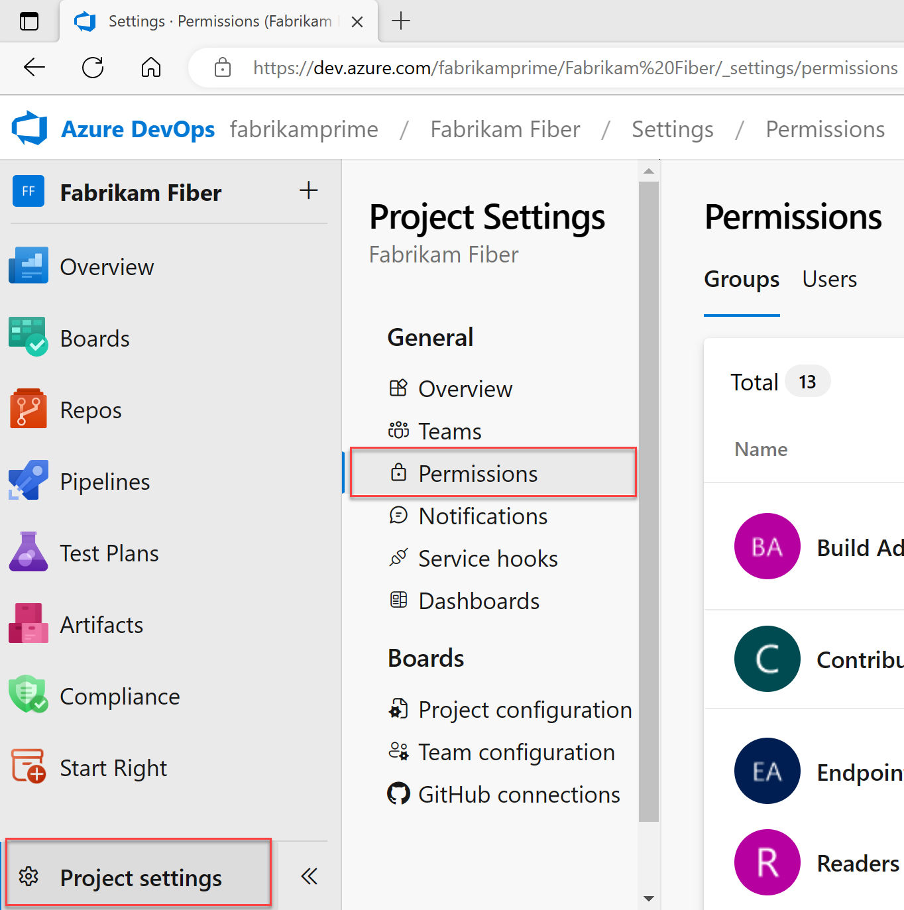
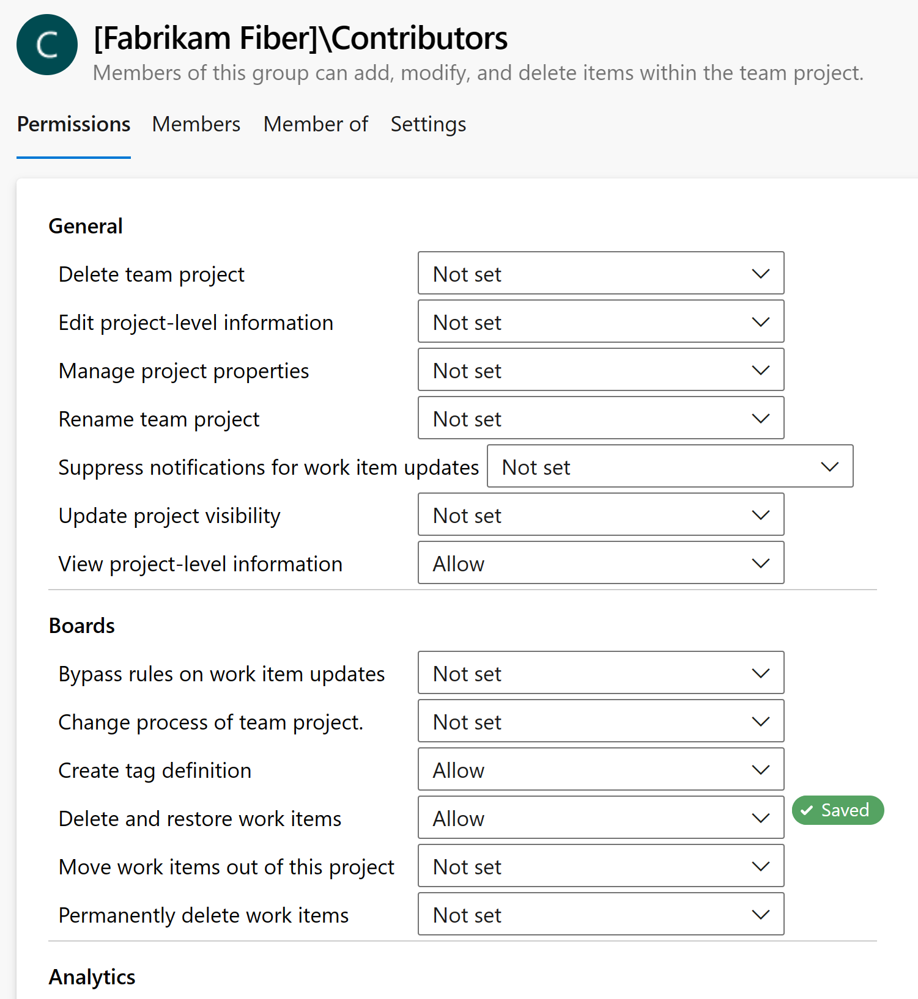

---
title: Change project-level permissions or group membership
titleSuffix: Azure DevOps
description: Quickstart guide to change project-level permissions or group membership in Azure DevOps
ms.subservice: azure-devops-security
ms.custom: security-refresh
ms.author: chcomley
author: chcomley
ms.topic: quickstart
monikerRange: '<= azure-devops'
ms.date: 04/04/2022
--- 

# Change project-level permissions 

[!INCLUDE [version-lt-eq-azure-devops](../../includes/version-lt-eq-azure-devops.md)]

Several permissions are set at the project level. You can grant these permissions by adding a user or group to the **Project Administrators** group. Or, you can grant select project-level permissions to a custom security group or to a user. 

Consider adding users to the **Project Administrators** group when they are tasked with adding or managing teams, area and 
iteration paths, repositories, service hooks, and service end points. 
 

See the following articles for related information: 

- [Request an increase in permission levels](request-changes-permissions.md)
- [Add or remove users or groups, manage security groups](add-remove-manage-user-group-security-group.md)
- [Look up a project administrator ](look-up-project-administrators.md)
- [Set object-level permissions](set-object-level-permissions.md)
- [Change permissions at the organization or collection-level](change-organization-collection-level-permissions.md)

## Project-level permissions 

[!INCLUDE [project-level-permissions](./includes/project-level-permissions.md)]

> [!NOTE]
> The permission to add or remove project-level security groups and add and manage project-level group membership is assigned to all members of the **Project Administrator**s group. It isn't controlled by a permissions surfaced within the user interface. 

### Create tag definition permission

By default, members of the **Contributors** group are assigned the **Create tag definition** permission. Although the **Create tag definition** permission appears in the security settings at the project-level, tagging permissions are actually collection-level permissions that are scoped at the project level when they appear in the user interface. To scope tagging permissions to a single project when using a command-line tool, you must provide the GUID for the project as part of the command syntax. Otherwise, your change will apply to the entire collection. To learn more about work item tagging permissions, see [Security groups, service accounts, and permissions, Work item tags](permissions.md#work-item-tags). 

## Prerequisites

- To manage permissions or groups at the project level, you must be a member of the **Project Administrators** security group. If you created the project, you are automatically added as a member of this group. To get added to this group, you need to request permissions from a member of the **Project Administrators** group. See [Look up a project administrator](look-up-project-administrators.md).
- If want to add security groups defined in Microsoft Entra ID or Active Directory, make sure those are first defined. To learn more, see [Add Active Directory / Microsoft Entra users or groups to a built-in security group](add-ad-aad-built-in-security-groups.md).

> [!NOTE]   
> Users granted **Stakeholder** access, aren't able to access select features even if granted permissions to those features. To learn more, see [Stakeholder access quick reference](stakeholder-access.md).
 

## Add members to the Project Administrators group 

You can add users who've been added to a project, organization, or collection to the Project Administrators group. To add a custom security group, first create the group as described in [Add or remove users or groups, manage security groups](add-remove-manage-user-group-security-group.md).

Here we show how to add a user to the built-in **Project Administrators** group. The method is similar to adding a Microsoft Entra ID or Active Directory group. 

::: moniker range="azure-devops"

> [!NOTE]   
> To enable the **Project Permissions Settings Page** preview page, see [Enable preview features](../../project/navigation/preview-features.md).

#### [Preview page](#tab/preview-page) 

1. Open the web portal and choose the project where you want to add users or groups. To choose another project, see [Switch project, repository, team](../../project/navigation/go-to-project-repo.md).

2. Choose **Project settings** and then **Permissions**.

    

3. Choose **Project Administrators** group, **Members**, and then **Add**.  

    > [!div class="mx-imgBorder"]  
    >  

4. Enter the name of the user account or custom security group into the text box and then select from the match that appears. You can enter several identities recognized by the system into the **Add users and/or groups** box. The system automatically searches for matches. Choose the matches that meet your choices. 

    > [!div class="mx-imgBorder"]  
    >   

5. Choose **Save**. 

#### [Current page](#tab/current-page) 

1. Open the web portal and choose the project where you want to add users or groups. To choose another project, see [Switch project, repository, team](../../project/navigation/go-to-project-repo.md).

2. Choose **Project Settings** and then **Security**.

    *To see the full image, click to expand*.

     

3. Choose **Project Administrators** group, **Members**, and then **Add**.  

    > [!div class="mx-imgBorder"]  
    >  

4. Enter the name of the user account into the text box. You can enter several identities into the text box, separated by commas. The system automatically searches for matches. Choose the match(es) that meets your choice. 

    > [!div class="mx-imgBorder"]  
    >   

5. Choose **Save changes**. Choose the :::image type="icon" source="../../media/icons/refresh.png" border="false"::: refresh icon to see the additions.  

* * *

::: moniker-end 

::: moniker range=">= azure-devops-2019 < azure-devops"

1. Open the web portal and choose the project where you want to add users or groups. To choose another project, see [Switch project, repository, team](../../project/navigation/go-to-project-repo.md).

2. Choose **Project Settings** and then **Security**.

    *To see the full image, click to expand*.

     

1. Choose **Project Administrators** group, **Members**, and then **Add**.  

    > [!div class="mx-imgBorder"]  
    >  

1. Enter the name of the user account into the text box. You can enter several identities into the text box, separated by commas. The system automatically searches for matches. Choose the match(es) that meets your choice. 

    > [!div class="mx-imgBorder"]  
    >   

    > [!NOTE]   
    > Users that have limited access, such as Stakeholders, won't be able to access select features even if granted permissions to those features. To learn more, see [Permissions and access](permissions-access.md).

1. Choose **Save changes**. Choose the :::image type="icon" source="../../media/icons/refresh.png" border="false"::: refresh icon to see the additions.  

::: moniker-end 

::: moniker range="tfs-2018"

1. Open the web portal and choose the project where you want to add users or groups. To choose another project, see [Switch project, repository, team](../../project/navigation/go-to-project-repo.md).  

1. Choose the :::image type="icon" source="../../media/icons/gear-icon.png" border="false"::: gear icon to open the administrative context.

    > [!div class="mx-imgBorder"]  
    >   

2. Choose **Security**, **Project Administrators** group, **Members**, and then **Add**.  

    > [!div class="mx-imgBorder"]  
    >  

3. Enter the name of the user account into the text box. You can enter several identities into the text box, separated by commas. The system automatically searches for matches. Choose the match(es) that meets your choice. 

    > [!div class="mx-imgBorder"]  
    >   

    > [!NOTE]   
    > Users that have limited access, such as Stakeholders, won't be able to access select features even if granted permissions to those features. To learn more, see [Permissions and access](permissions-access.md).

4. Choose **Save changes**. Choose the :::image type="icon" source="../../media/icons/refresh.png" border="false"::: refresh icon to see the additions.  

::: moniker-end

## Change permissions for a group 

You can change the project-level permissions for any project-level group, except the **Project Administrators** group. Each team added to a project is automatically added as a project-level group. To add security groups to a project, see [Add or remove users or groups, manage security groups](add-remove-manage-user-group-security-group.md). To understand permission assignments and inheritance, see [About permissions, Permission states](about-permissions.md#permission-states).
    
::: moniker range="azure-devops"

> [!NOTE]   
> To enable the **Project Permissions Settings Page** preview page, see [Enable preview features](../../project/navigation/preview-features.md).

#### [Preview page](#tab/preview-page) 

1. Open the **Permissions** page as described in the previous section, [Add a user or group to the Project Administrators group](#add-user-group). 

	> [!NOTE]   
	> You can't change the permission settings for the Project Administrators group. This is by design.  

2. From the **Permissions** page, choose the group whose permissions you want to change. 

    For example, here we choose the **Contributors** group, change their permissions for **Delete and restore work items** to **Allow**.  

    > [!div class="mx-imgBorder"]  
    >   

    Your changes are automatically saved. 

    > [!TIP]   
    > In general, if you add a user to the **Contributors** group, they can add and modify work items. You can restrict permissions of users or user groups to add and modify work items based on the **Area Path**. For details, see [Set permissions and access for work tracking, Modify work items under an area path](set-permissions-access-work-tracking.md#set-permissions-area-path).

 
#### [Current page](#tab/current-page) 

1. Open the **Security** page as described in the previous section, [Add a user or group to the Project Administrators group](#add-user-group). 

1. From the **Security** page, choose the group whose permissions you want to change. 

    For example, here we grant permission to the **Contributors** group to **Delete and restore work items**.  

    > [!div class="mx-imgBorder"]  
    >   

1. Choose **Save changes**.   

* * *

::: moniker-end

::: moniker range="< azure-devops"

1. From the **Security** page, choose the group whose permissions you want to change. 

    For example, here we grant permission to the Contributors group to delete and restore work items.  

    > [!div class="mx-imgBorder"]  
    >   

    > [!TIP]   
    > In general, if you add a user to the Contributors group, they can add and modify work items. You can restrict permissions of users or user groups to add and modify work items based on the area path. For details, see [Set permissions and access for work tracking, Modify work items under an area path](set-permissions-access-work-tracking.md#set-permissions-area-path).

    For a description of each permission, see [Permissions and groups reference, project-level permissions](permissions.md#project-level-permissions).

    > [!NOTE]   
    > You can't change the permission settings for the Project Administrators group. This is by design.  

2. Choose **Save changes**.   

::: moniker-end

## Change permissions for a user 
 

You can change the project-level permissions for a specific user. To understand permission assignments and inheritance, see [About permissions, Permission states](about-permissions.md#permission-states).
   
::: moniker range="azure-devops"

> [!NOTE]   
> To enable the **Project Permissions Settings Page** preview page, see [Enable preview features](../../project/navigation/preview-features.md).

#### [Preview page](#tab/preview-page) 

1. Open the **Permissions** page as described in the previous section, [Add a user or group to the Project Administrators group](#add-user-group). 

1. From the **Permissions** page, choose **Users**, and then choose the user whose permissions you want to change.

	:::image type="content" source="media/change-project-level/choose-users-select-user.png" alt-text="Screenshot of Users tab, choose a user.":::   

1.	From the **Permissions** page, change the assignment for one or more permissions. 

	For example, here we change the **Edit project-level information** for Christie Church. 

	:::image type="content" source="media/change-project-level/change-project-level-permission-for-user.png" alt-text="Screenshot of selected users, Permissions.":::   

	Dismiss the dialog when done. Your changes are automatically saved. 

#### [Current page](#tab/current-page) 

1. Open the **Security** page as described in the previous section, [Add a user or group to the Project Administrators group](#add-user-group). 

1. From the **Security** page, in the **Filter users and groups** text box, enter the name of the user whose permissions you want to change. 

1. Change change the assignment for one or more permissions. 

	For example, here we change the **Edit project-level information** for Christie Church. 

	:::image type="content" source="media/change-project-level/change-project-level-permission-for-user-current-page.png" alt-text="Screenshot of selected user , change Edit project-level information permission level.":::   

1. Choose **Save changes**.   

* * *

::: moniker-end

::: moniker range="< azure-devops"

1. Open the **Security** page as described in the previous section, [Add a user or group to the Project Administrators group](#add-user-group). 

1. From the **Security** page, in the **Filter users and groups** text box, enter the name of the user whose permissions you want to change. 

1. Change change the assignment for one or more permissions. 

	For example, here we change the **Edit project-level information** for Christie Church. 

	:::image type="content" source="media/change-project-level/change-project-level-permission-for-user-current-page.png" alt-text="Screenshot of selected user , change Edit project-level information permission level.":::   

1. Choose **Save changes**.   

::: moniker-end

## Next steps

> [!div class="nextstepaction"]
> [Manage projects](../projects/about-projects.md)

## Related articles

- [Set object-level permissions](set-object-level-permissions.md)
- [Get started with permissions, access, and security groups](about-permissions.md)
- [Permissions lookup reference](permissions-lookup-guide.md)
- [Permissions and groups reference](permissions.md)
- [Manage teams and configure team tools](../../organizations/settings/manage-teams.md)
