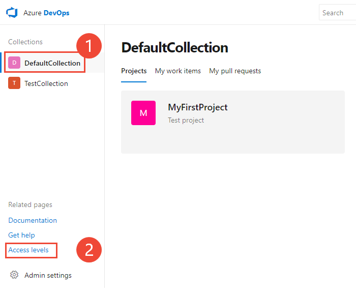
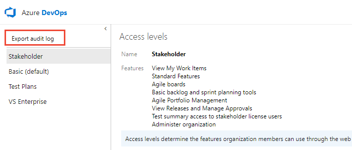
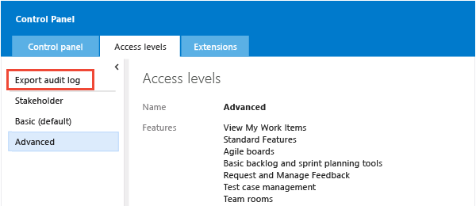

# Export a list of users and their access levels

[!INCLUDE [version-all](../../includes/version-all.md)]

<a id="export-audit-log" >  </a>

::: moniker range="azure-devops"
You can get a list of users and groups that have access to your organization in Azure DevOps by exporting users. The downloaded list also indicates which access level has been granted.
::: moniker-end

::: moniker range="azure-devops-2019 || azure-devops-2020"
You can get a list of users and groups that have access to your Azure DevOps Server instance by exporting the audit log. The audit log also indicates which access level has been granted.
::: moniker-end

::: moniker range="<= tfs-2018"
You can get a list of users and groups that have access to your Team Foundation Server (TFS) instance by exporting the audit log. The audit log also indicates which access level has been granted.
::: moniker-end

## Prerequisites

::: moniker range="azure-devops"

* You must be the organization Owner or a member of the Project Collection Administrators group. If you aren't a member, get added now. See [Set permissions at the project- or collection-level](/azure/devops/organizations/security/set-project-collection-level-permissions).
  ::: moniker-end

  ::: moniker range="< azure-devops"
* You must be a member of the Team Foundation Administrators group. If you aren't a member, get added now. See [Add administrators to TFS](/azure/devops/server/admin/add-administrator).
  ::: moniker-end

## Export a list of users

::: moniker range="azure-devops"

From your web browser or the Azure DevOps CLI command, you can get a list of the users in your organization and view their access level information.

#### [Browser](#tab/browser)

1. Choose the :::image type="icon" source="/azure/devops/media/icons/project-icon.png" border="false"::: Azure DevOps logo to open **Projects**. Then choose **Admin settings**. 

	> [!div class="mx-imgBorder"]  
	>   

2. Choose **Users**, and then **Export users**.

	> [!div class="mx-imgBorder"]  
	>  

#### [Azure DevOps CLI](#tab/azure-devops-cli)

[Add a user](../accounts/add-organization-users.md#add-user) | [List users](#list-users) | [Remove a user](../accounts/delete-organization-users.md#remove-user) | [Update a user](../accounts/add-organization-users.md#update-user) | [Show users](../accounts/add-organization-users.md#show-users)

<a id="list-users" /> 

### List users

You can list the users in an organization with the [az devops user list](/cli/azure/ext/azure-devops/devops/user#ext-azure-devops-az-devops-user-list) command. This does not apply to users that are added via Azure Active Directory groups. To get started, see [Azure DevOps CLI](../../cli/index.md).

```CLI
az devops user list [--org] [--skip] [--top]
```

#### Parameters

- **org**: Azure DevOps organization URL. You can configure the default organization using az devops configure -d organization=ORG_URL. Required if not configured as default or picked up using `git config`. Example: `--org https://dev.azure.com/MyOrganizationName/`. 
- - **skip**: Optional. Number of users to skip.  
- **top**: Optional. Maximum number of users to return. The maximum value is 10000; the default value is 100.  


#### Example

The following command returns five users in your organization without skipping any and shows the result in table format.

```CLI
az devops user list --skip 0 --top 5  --output table

ID                                    Display Name            Email                          License Type    Access Level    Status
------------------------------------  ----------------------  -----------------------------  --------------  --------------  --------
3b5f0c34-4aec-4bf4-8708-1d36f0dbc468  Christie Church         fabrikamfiber1@contoso.com     stakeholder     Stakeholder     active
8c8c7d32-6b1b-47f4-b2e9-30b477b5ab3d  Chuck Reinhart          fabrikamfiber3@contoso.com     stakeholder     Stakeholder     active
3b5f0c34-4aec-4bf4-8708-1d36f0dbc468  contoso@contoso.com     contoso@contoso.com            stakeholder     Stakeholder     active
f14a4f19-9910-6116-9836-cccd6dd1b7b7  contoso2@contoso.com    contoso2@contoso.com           express         Basic           active
74be024c-ebf5-4993-81eb-81ae1551e45f  Helena Petersen         fabrikamfiber8@contoso.com     stakeholder     Stakeholder     active
```

::: moniker-end

[!INCLUDE [temp](../../includes/note-cli-not-supported.md)]

* * *

::: moniker range="azure-devops-2019 || azure-devops-2020"

You can get a list of users and groups that have accessed your Azure DevOps Server instance by exporting the audit log. The audit log also indicates which access level has been granted.  

1. From the web portal home page for a project, choose the :::image type="icon" source="/azure/devops/media/icons/project-icon.png" border="false"::: Azure DevOps logo, (1) the project collection, and (2) **Access levels**. 

	> [!div class="mx-imgBorder"]  
	>  

	> [!NOTE]   
	> If you're not a member of the Team Foundation Server Administrators group, the **Access levels** page won't appear. 
	
2. Choose **Export audit log**. 

	> [!div class="mx-imgBorder"]  
	>   

3. The user log file is saved as a .csv file to your Download folder.  

	To determine the access level assigned to each user or group, open the file in Excel.

::: moniker-end

::: moniker range=">= tfs-2017 <= tfs-2018"

You can get a list of users and groups that have access to your TFS instance by exporting the audit log. The audit log also indicates which access level has been granted.  

1. From the web portal home page for a project, choose the :::image type="icon" source="/azure/devops/media/icons/gear_icon.png" border="false"::: gear icon and select **Server settings**. 

	  

2. Choose **Access levels**, and then **Export audit log**. 

	  

	> [!NOTE]
	> If you're not a member of the Team Foundation Server Administrators group, the link to the **Access levels** page won't appear. 

3. The user log file is saved as a .csv file to your Download folder.  
	To determine the access level assigned to each user or group, open the file in Excel.

::: moniker-end

::: moniker range="<= tfs-2015"

You can get a list of users and groups that have access to your TFS instance by exporting the audit log. The audit log also indicates which access level has been granted.  

1. From the web portal home page for a project, choose the :::image type="icon" source="/azure/devops/media/icons/gear_icon.png" border="false"::: gear icon. The URL is similar to `http://myserver:8080/tfs`.

	

2. Choose **Access levels**, and then **Export audit log**. 

	

	> [!NOTE]
	> If you're not a member of the Team Foundation Server Administrators group, the **Access levels** page won't appear.

3. The user log file is saved as a .csv file to your Download folder.  
	To determine the access level assigned to each user or group, open the file in Excel.

::: moniker-end

## Related articles

::: moniker range="azure-devops"

- [About access levels](access-levels.md)
- [Manage users and access in Azure DevOps](../accounts/add-organization-users.md) 
- [Azure DevOps Feature Matrix](https://visualstudio.microsoft.com/pricing/visual-studio-online-feature-matrix-vs)
- [Default permissions and access](permissions-access.md). 

::: moniker-end

::: moniker range="< azure-devops"

- [About access levels](access-levels.md)
- [Change access levels](change-access-levels.md)
- [Azure DevOps Feature Matrix](https://visualstudio.microsoft.com/pricing/visual-studio-online-feature-matrix-vs)
- [Default permissions and access](permissions-access.md). 

::: moniker-end
