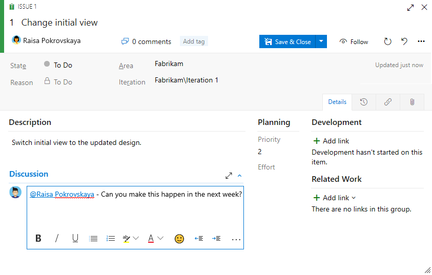
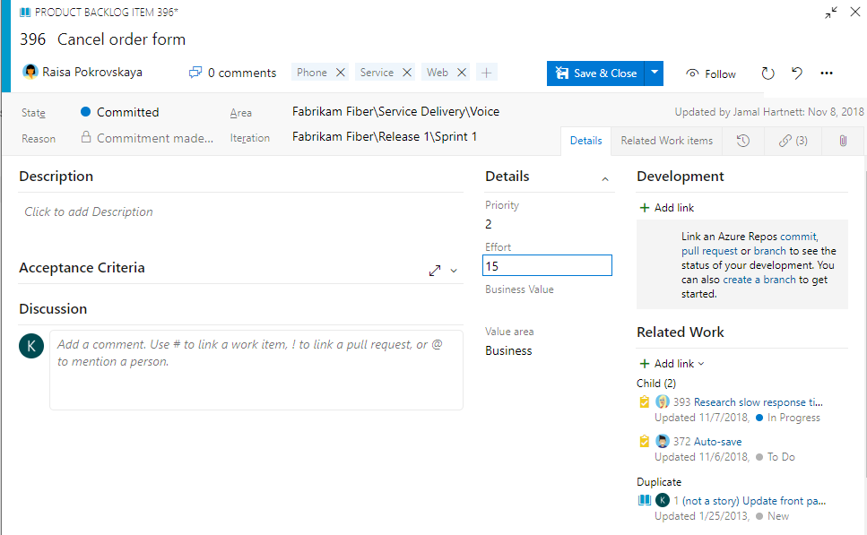

# Get started as a Stakeholder

[!INCLUDE [version-lt-eq-azure-devops](../../includes/version-lt-eq-azure-devops.md)]

::: moniker range="azure-devops" 
Stakeholders are users with free but limited access to Azure DevOps features and functions. With Stakeholder access, you can add and modify work items, manage build and release pipelines, and view dashboards. You can check project status and provide direction, feedback, feature ideas, and business alignment to a team. For information about working with pipelines, see [Build your GitHub repository](../../pipelines/create-first-pipeline.md) and [Build OSS repositories](../../pipelines/repos/index.md).
::: moniker-end  

::: moniker range="< azure-devops"
Stakeholders are users with free but limited access to Azure DevOps features and functions. With Stakeholder access, you can add and modify work items, view and approve pipelines, and view dashboards. You can check project status and provide direction, feedback, feature ideas, and business alignment to a team. 
::: moniker-end  

For more information, see the [Stakeholder access quick reference](stakeholder-access.md). To compare Stakeholder versus Basic access, see the [feature matrix](https://azure.microsoft.com/services/devops/compare-features/).

In this tutorial, learn how to:

> [!div class="checklist"]
> * Understand Stakeholder access and available features 
> * [Sign in to a project](#sign-in-to-a-project)
> * [Understand work items and types](#understand-work-items-and-types)
> * [Open your Kanban board](#open-your-kanban-board)
> * [Add work items](#add-work-items)
> * [Update work items](#update-work-items)
> * [View the backlog](#view-as-backlog)
> * [Find work items](#find-work-items)

## Prerequisites

- You must have Stakeholder access for a *private project* and be a member of the Contributors or Project Administrators group. You can view boards, open and modify work items, and add child tasks to a checklist. But, you can't reorder or reparent a backlog item using drag-and-drop, nor update a field on a card.
- You must have Stakeholder access for a *public project* and be a member of the Contributors or Project Administrators group to have full access to all Boards features. For more information, see [Default roles and access for public projects](../security/permissions-access.md)

::: moniker range="azure-devops"
To get access as a Stakeholder, ask your organization owner or Project Collection Administrator to [add you to a project with Stakeholder access](../accounts/add-organization-users.md). 
::: moniker-end  
::: moniker range="< azure-devops"
To get access as a Stakeholder, ask your server administrator to [add you to a security group that has Stakeholder access](change-access-levels.md).
::: moniker-end  

## Sign in to a project

1. Select the link provided in your email invitation or open a browser window and enter the URL for the web portal.
	::: moniker range="azure-devops"  
	`https://dev.azure.com/OrganizationName/ProjectName`
	::: moniker-end
	::: moniker range="< azure-devops"
  	`http://ServerName:8080/tfs/DefaultCollection/ProjectName`  	
  	For example, to connect to the server named *FabrikamPrime* and project named *Contoso*, enter ```http://FabrikamPrime:8080/tfs/DefaultCollection/Contoso```.
	::: moniker-end

2. Enter your credentials. If you can't sign in, ask the organization owner or Project Administrator to add you as a member of the project with Stakeholder access. 

## Understand work items and types

Work items support planning and tracking work. Each work item is based on a work item type and is assigned an identifier, which is unique within an organization or project collection.  

Different work items are used to track different types of work, as described in [About work items](../../boards/work-items/about-work-items.md). The work item types available are based on the [process used when your project was created](../../boards/work-items/guidance/choose-process.md)&mdash;Agile, Basic, Scrum, or CMMI&mdash;as illustrated in the following images.  

[!INCLUDE [temp](../../boards/includes/work-item-types.md)]

## Open your Kanban board

You can view work items once you connect to a project.

::: moniker range="azure-devops"
1. In your project, and select **Boards** > **Boards**, and then select a **team board** from the dropdown menu. 

	> [!div class="mx-imgBorder"]  
	>   

	You can also enter a keyword in the search box or select **View Board directory** to see a list of available team boards.

	> [!div class="mx-imgBorder"]  
	>  

	> [!TIP]    
	> Select the :::image type="icon" source="../../media/icons/icon-favorite-star.png" border="false"::: star icon to make a team board a favorite. Favorite artifacts (:::image type="icon" source="../../media/icons/icon-favorited.png" border="false"::: favorite icon) appear at the top of the team selector list.

2. Check that you selected **Stories** for Agile, **Issues** for Basic, **Backlog items** for Scrum, or **Requirements** for CMMI as the backlog level. 

	> [!div class="mx-imgBorder"]  
	>  

::: moniker-end
::: moniker range=">= azure-devops-2019 < azure-devops"

1. In your project select **Boards** > **Boards**, and then select the **team board** from the dropdown menu. 

	  

	To select another team's board, open the selector. Then select a different team, or select the  **Browse all team boards** option. Or, you can enter a keyword in the search box to filter the list of team backlogs for the project.

	> [!div class="mx-imgBorder"]  
	>  

	> [!TIP]    
	> Select the :::image type="icon" source="../../media/icons/icon-favorite-star.png" border="false"::: star icon to make a team board a favorite. Favorite artifacts (:::image type="icon" source="../../media/icons/icon-favorited.png" border="false"::: favorite icon) appear at the top of the team selector list.

2. Check that you selected **Stories** for Agile, **Issues** for Basic, **Backlog items** for Scrum, or **Requirements** for CMMI as the backlog level. 
	We selected **Backlog Items** for the Scrum process.

	> [!div class="mx-imgBorder"]  
	>  

::: moniker-end
::: moniker range="tfs-2018"
1. In your project select **Work** > **Backlogs** > **Stories**, and then select **Board**. 

	

	If you don't see **Work**, your screen size might be reduced. Select the three dots (:::image type="icon" source="../../media/ellipses-reduced-screen-size.png" border="false":::) icon. Then select **Work** > **Backlogs** > **Board**.   

	   

2. To select another team, open the project and team selector. Select a different team, or select the **Browse** option.  

   > [!div class="mx-imgBorder"]  
   >   

   Your Kanban board appears. 
      
::: moniker-end   

## Add work items 

::: moniker range="azure-devops"
From your board, select the :::image type="icon" source="../../media/icons/add-icon.png" border="false"::: plus sign, enter a title, and then select **Enter**.  

> [!div class="mx-imgBorder"]  
>  
::: moniker-end  

::: moniker range="< azure-devops"
From the Kanban board, you can't add work items, but you can open them and annotate them. To add work items, open the backlog by choosing the **Backlog** link. Also, you can't update the status of a work item by drag-and-drop to a different column or reorder cards within a column. 
::: moniker-end  

For more information, see [View and add work items from the Work Items page](../../boards/work-items/view-add-work-items.md).

::: moniker range=">= azure-devops-2020"

## Update work items
The work item forms you see may differ from the following images. The basic functionality is the same, however, changes have been made with different versions of Azure DevOps. 

### Change status

Drag and drop a work item to move it downstream as you complete work. 

  

::: moniker-end  
::: moniker range="azure-devops-2020"
> [!NOTE]   
> Stakeholders can only drag-and-drop cards to different columns with the Azure DevOps Server 2020.1 update. For more information, see [Azure DevOps Server 2020 Update 1 RC1 Release Notes, Boards](/azure/devops/server/release-notes/azuredevops2020u1#stakeholders-can-move-work-items-across-board-columns).  
::: moniker-end

### Add details
To open a work item, double-click the title or highlight it, and then select  **Enter**. 
Here we show how to assign work. You can only assign work to a user who is added to the project.
 
#### [Agile process](#tab/agile-process) 

For example, here we assign the story to Raisa Pokrovskaya and we add a discussion note, at-mentioning Raisa. When you're done, select **Save & Close**. 

> [!div class="mx-imgBorder"]
> 

#### [Basic process](#tab/basic-process) 

For example, here we assign the issue to Raisa Pokrovskaya and we add a discussion note, at-mentioning Raisa. When you're done, select **Save & Close**. 

> [!div class="mx-imgBorder"]
> 

#### [Scrum process](#tab/scrum-process) 

For example, here we assign the Product Backlog Item to Jamal Hartnett and add a description and tags. When you're done, select **Save & Close**. 

> [!div class="mx-imgBorder"]
> 

#### [CMMI process](#tab/cmmi-process) 

For example, here we assign the Requirement to Jamal Hartnett. When you're done, select **Save & Close**. 

> [!div class="mx-imgBorder"]  
>  

#### CMMI-specific field descriptions

[!INCLUDE [temp](../../boards/includes/section-cmmi-field-descriptions.md)] 

***

Add more details by changing field values, adding a description or tags, and adding comments. For more information, see the following articles:

- [Update fields: Descriptions and usage](../../boards/get-started/plan-track-work.md)
- [Add tags to work items](../../boards/queries/add-tags-to-work-items.md). As a Stakeholder, you can add existing tags to a work item, but you can't add new tags.
- [Capture comments in the Discussion section](../../boards/get-started/plan-track-work.md#capture-comments-in-the-discussion-section)

## View as Backlog 

Check the product backlog to see how the team prioritized their work. Backlog items appear in priority order. Work item types may include bugs depending on the [process used when your project was created](../../boards/work-items/guidance/choose-process.md). 

::: moniker range="azure-devops"
From the Kanban board, choose **View as Backlog**.  
> [!div class="mx-imgBorder"]  
>  
::: moniker-end

::: moniker range=">= azure-devops-2019 < azure-devops"
From the Kanban board, choose **View as backlog**.  
> [!div class="mx-imgBorder"]  
>  
::: moniker-end

::: moniker range="tfs-2018"
From the Kanban board, choose **Backlog**.  
> [!div class="mx-imgBorder"]  
>  
::: moniker-end

You should see the list of backlog items listed in priority order. You can add a backlog item, which goes to the bottom of the list. With Stakeholder access, you can't reprioritize work. 

<a id="query">  </a>

## Find work items

::: moniker range=">= azure-devops-2019"
Choose **Boards** > **Work Items** > and then select an option from the dropdown menu. Here we chose **Assigned to me**. 

> [!div class="mx-imgBorder"]
> 

For more information, see the following articles: 
- [View, run, or email a work item query](../../boards/queries/view-run-query.md)
- [View and add work items using the Work Items page](../../boards/work-items/view-add-work-items.md)
   ::: moniker-end    

::: moniker range="tfs-2018"
1. Open **Work** > **Queries** and select **Assigned to me** to see the list of work items assigned to you.  
	  

   Or, open any of the queries defined in the Shared Queries folder.  
	   

2. [Create new queries or edit existing queries](../../boards/queries/using-queries.md) and save them under My Queries folder.  
	  
::: moniker-end

## Next steps

> [!div class="nextstepaction"]
> [Create your product backlog](../../boards/backlogs/create-your-backlog.md)

## Related articles

- [Add work items](../../boards/backlogs/add-work-items.md)  
- [Kanban quickstart](../../boards/boards/kanban-quickstart.md) 
- [Access levels](access-levels.md)
- [Change access levels](change-access-levels.md)